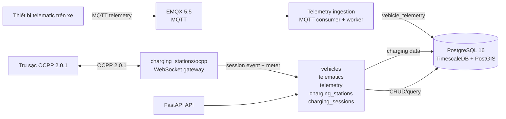

# Kiến trúc G3Network — MVP hiện tại

Repo hiện tại là một backend monorepo MVP. Sơ đồ dưới đây mô tả các thành phần
đang có trong source và hạ tầng local; Kafka, Redis, API Gateway, portal và
vehicle app chỉ là hướng mở rộng, chưa phải thành phần active.



## Thành phần đang có

### Backend API

FastAPI đăng ký các domain:

- `vehicles`: CRUD xe và soft delete.
- `telematics`: CRUD thiết bị và mapping thiết bị với xe.
- `telemetry`: nhận dữ liệu qua service ingestion và đọc telemetry mới nhất của
  một xe.
- `charging_stations`: CRUD topology Station → EVSE → Connector và OCPP
  2.0.1 gateway.
- `charging_sessions`: lưu aggregate session, lifecycle event và meter value.

API process chạy riêng bằng Uvicorn. Telemetry ingestion và OCPP gateway có
entrypoint riêng, cùng dùng shared database/session configuration.

### Database

Development dùng một PostgreSQL 16 container với các extension:

- TimescaleDB cho `vehicle_telemetry`, `charging_session_events` và
  `charging_session_meter_values`.
- PostGIS được bật sẵn cho các chức năng địa lý trong tương lai; baseline hiện
  chưa có API bản đồ hoặc geofence.
- `uuid-ossp` cho database local.

Alembic baseline hiện tại gồm:

```text
0001_reset_application_schema
0002_vehicles_telematics
0003_create_vehicle_telemetry
0004_create_charging_mvp_schema
```

Charging MVP chỉ hỗ trợ topology đã pre-provision và happy path:

```text
Started → Updated/MeterValues → Ended
```

### Hạ tầng local

`infra/docker-compose.yml` chỉ khởi động hai service:

- `db`: PostgreSQL/TimescaleDB/PostGIS trên port `5432`.
- `broker`: EMQX trên port `1883`, dashboard `18083`.

Backend chạy trực tiếp trên host bằng `uv`; không có API Gateway hoặc reverse
proxy trong môi trường development.

## Các phần chưa có trong MVP

- User, authentication, RBAC và driver.
- API toàn bộ lịch sử telemetry, bản đồ xe/trạm và aggregate dashboard.
- Trạng thái connector tổng hợp và technical status history.
- Cảnh báo pin, bất thường pin, chống lặp cảnh báo và push ngưỡng cảnh báo.
- Geofence, device health, policy sạc, payment, billing và notification.
- Web portal, vehicle app, observability tập trung và production reliability.

Các hạng mục chắc chắn cần trong tương lai phải được ghi tại
[`docs/01-requirements/future.md`](docs/01-requirements/future.md), không tạo
placeholder trong source active.
