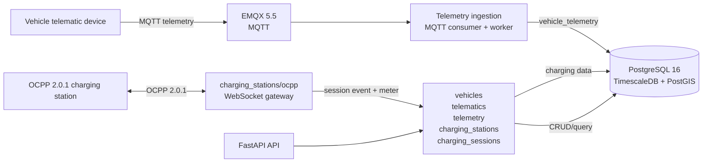

# G3Network Architecture — Current MVP

The current repo is a backend MVP monorepo. The diagram below describes the
components present in the source and local infrastructure; Kafka, Redis, API
Gateway, the portal and the vehicle app are only future directions, not
active components yet.



## Current components

### Backend API

FastAPI registers the following domains:

- `vehicles`: vehicle CRUD and soft delete.
- `telematics`: device CRUD and mapping devices to vehicles.
- `telemetry`: receiving data via the ingestion service and reading a
  vehicle's latest telemetry.
- `charging_stations`: Station → EVSE → Connector topology CRUD, station
  directory metadata (location, power rating, connector standard, operating
  hours, maintenance status), and the OCPP 2.0.1 gateway.
- `charging_sessions`: storing the session aggregate, lifecycle events and
  meter values.

The API process runs separately via Uvicorn. Telemetry ingestion and the OCPP
gateway have their own entrypoints, sharing the same database/session
configuration.

### Database

Development uses a single PostgreSQL 16 container with the following
extensions:

- TimescaleDB for `vehicle_telemetry`, `charging_session_events` and
  `charging_session_meter_values`.
- PostGIS: used for `charging_stations.location` (a `geography(Point, 4326)`
  column, F-C1); the rest is still in preparation for future geospatial
  features — there's no map/geofence *search* API (radius query, filtering)
  yet, only storage and CRUD.
- `uuid-ossp` for the local database.

The current Alembic baseline consists of:

```text
0001_reset_application_schema
0002_vehicles_telematics
0003_create_vehicle_telemetry
0004_create_charging_mvp_schema
0005_station_directory_fields
```

The charging MVP only supports pre-provisioned topology and the happy path:

```text
Started → Updated/MeterValues → Ended
```

### Local infrastructure

`infra/docker-compose.yml` only starts two services:

- `db`: PostgreSQL/TimescaleDB/PostGIS on port `5432`.
- `broker`: EMQX on port `1883`, dashboard on `18083`.

The backend runs directly on the host via `uv`; there is no API Gateway or
reverse proxy in the development environment.

## Not yet in the MVP

- User, authentication, RBAC and driver.
- Full telemetry history API, vehicle/station map and aggregate dashboard.
- Aggregate connector status and technical status history.
- Battery alerts, battery anomalies, alert de-duplication and threshold alert
  pushes.
- Geofence, device health, charging policy, payment, billing and
  notification.
- Web portal, vehicle app, centralized observability and production
  reliability.

Items confirmed as needed in the future must be recorded in
[`docs/01-requirements/future.md`](docs/01-requirements/future.md); do not
create placeholders in active source.
