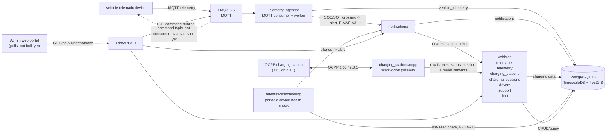

# G3Network Architecture — Current MVP

The current repo is a backend MVP monorepo. The diagram below describes the
components present in the source and local infrastructure; Kafka, Redis, API
Gateway, the portal and the vehicle app are only future directions, not
active components yet.

## Current components

### Backend API

FastAPI registers the following domains:

- `vehicles`: vehicle CRUD and soft delete, plus an F-F2 device-activation
  state machine and its fleet-wide success-rate summary. Also carries a
  nullable `battery_capacity_kwh` (F-A6/F-C6's kWh-conversion input).
- `telematics`: device CRUD and mapping devices to vehicles, a periodic
  device-health monitor (F-J1/F-J3, partial) - this backend's first
  non-event-driven background process - and a backend-to-device MQTT
  command publisher (`telematics/commands/`, F-J2 partial) - this
  backend's first-ever MQTT *publish* path, pushing a telemetry
  publish-interval change to `g3network/telematics/{serial}/command`.
- `telemetry`: receiving data via the ingestion service, reading a
  vehicle's latest/history telemetry (including F-A3's `soh_percent`/
  `cycle_count`), and two SOC-based aggregate reports (F-A6 operating
  performance, F-C6 energy usage) computed from the same telemetry
  history via a single window-function query.
- `charging_stations`: Station → EVSE → Connector topology CRUD, station
  directory metadata (location, power rating, connector standard, operating
  hours, maintenance status), a nearby-station radius search (F-D1), and the
  OCPP gateway. The gateway serves **OCPP 2.0.1 and OCPP 1.6J**: it
  negotiates the WebSocket subprotocol (`ocpp2.0.1` preferred, `ocpp1.6`
  accepted) and uses one adapter class per protocol
  (`ocpp_server.py::OCPP201ChargePoint`, `ocpp16_charge_point.py::OCPP16ChargePoint`).
  A `RecordingConnection` wrapper stores every frame, both directions,
  verbatim in `charging_ocpp_messages` before it is parsed. For 1.6J the
  adapter handles `BootNotification` (device info, firmware-change warning),
  `Heartbeat`, `StatusNotification` (F-C2, incl. connector `0` = the whole
  charger, stored on the station), `Authorize`, `StartTransaction`,
  `StopTransaction` and `MeterValues`; every inbound frame refreshes
  `last_seen_at` (the station's `is_online` is derived from it); and after
  each boot the gateway asks the charger for `GetConfiguration` in a separate
  task and stores the answer (`GET /charging-stations/{id}/configuration`).
  1.6J is verified against a simulator; a real charger has not been connected.
- `charging_sessions`: storing the session aggregate, lifecycle events and
  the session's measurements, plus a station-level energy aggregation query
  (F-C5). All measurements (the energy register that drives the session
  total, and SoC/power/voltage/current/temperature/`Power.Offered` and
  vendor-specific measurands) live in one `charging_session_measurements`
  table; `/meter-values` is the energy-only view and `/measurements` shows
  everything. The 1.6J backend assigns the integer `transactionId` from a
  database sequence and stores the `idTag`, stop reason and the charger's
  own `meterStop`. F-B2's four correctness fixes on the happy path still hold:
  persisted OCPP `seqNo`, a guard refusing any event on an already-`COMPLETED`
  session, a time-ordering watermark stopping a stale `MeterValues` from
  overwriting a newer reading, and unit-aware energy normalization in each
  OCPP adapter (still no retry/out-of-order recovery/DLQ/dedup).
- `notifications`: a generic, backend-storage notification table (F-A2)
  polled via `GET /api/v1/notifications?after_id=`; telemetry ingestion
  raises one when a vehicle's SOC crosses the 30/20/10% tiers (carrying the
  nearest operational charging station, resolved via `charging_stations`,
  the first PostGIS spatial query in the codebase) or SOH drops below its
  threshold (F-A3); the device-health monitor raises one when a vehicle
  goes silent (F-J1/F-J3). No push and no recipient scoping yet — there is
  no mobile app and no `identity` domain.
- `drivers`: this backend's first brand-new domain since the initial
  baseline (F-E4). Driver profile CRUD plus a `driver_vehicle_assignments`
  assignment-history table (`assigned_at`/`unassigned_at`) enforcing "one
  active vehicle per driver, one active driver per vehicle" via this
  backend's first partial unique indexes, with smooth reassignment
  (auto-closes the driver's previous active assignment) and full
  per-driver assignment history. Depends one-directionally on `vehicles`'
  public service to resolve/validate a VIN on assign — the same shape as
  `telematics → vehicles`. F-A9 (empty-trip detection) is suspended, not
  built here — see `future.md` item 67.
- `support`: support case tickets (F-I1) and SOS intake (F-I2). One
  `support_cases` table discriminated by `case_type` rather than two
  tables. Depends one-directionally on `vehicles` (resolve/validate a VIN)
  and `drivers` (validate a driver ID, enrich `driver_name`) - deliberately
  not wired to `telemetry`, since vehicle context is client-supplied at
  case-creation time rather than fetched live. A response-SLA deadline is
  copied onto each row at creation so a later config change never rewrites
  a past case's SLA; a CLOSED/CANCELLED case refuses further updates.
  F-I4 (partner directory/dispatch) and F-I3 (booking) are deferred.
- `fleet`: this backend's second brand-new domain (F-E1). Fleet CRUD plus
  a `fleet_vehicle_memberships` assignment-history table mirroring
  `driver_vehicle_assignments`'s shape, with one difference: no partial
  unique index on `fleet_id` (a fleet holds many vehicles at once).
  Depends one-directionally on `vehicles` to resolve/validate a VIN on
  membership add and to enrich F-E1's vehicle list (`vin`/`license_plate`/
  `status`, via a new `VehicleSummary` DTO). Replaces the dead
  `vehicles.fleet_id` column, dropped in the same migration. F-E2 (KPI
  dashboard) is deferred.

The API process runs separately via Uvicorn. Telemetry ingestion, the OCPP
gateway, and the telematics device-health monitor each have their own
entrypoint, sharing the same database/session configuration.

### Database

Development uses a single PostgreSQL 16 container with the following
extensions:

- TimescaleDB for four hypertables: `vehicle_telemetry`,
  `charging_session_events`, `charging_session_measurements` and
  `charging_ocpp_messages` (the append-only raw OCPP message log).
- PostGIS: used for `charging_stations.location` (F-C1) and
  `vehicle_telemetry.location` (both `geography(Point, 4326)` columns) —
  `charging_stations.location` has a GIST index, `vehicle_telemetry.location`
  deliberately doesn't (high-frequency write path, no spatial query need
  yet). F-A2's nearest-operational-station lookup is the first query to use
  that index (`ST_Distance` + the `<->` KNN operator). F-D1's nearby-station
  search (`GET /charging-stations/nearby`) is the first query to use
  `ST_DWithin` for a radius filter, alongside the same KNN ordering.
  There's still no geofence *search* API (radius query, filtering) on
  `vehicle_telemetry`/vehicle geofencing.
- `uuid-ossp` for the local database.

The schema is a single Alembic migration, `0001_baseline_schema`. During the
bootstrap phase (no data worth keeping) a schema change edits that migration
instead of adding a revision, and `make db-reset` clears the database and
rebuilds it; see `.claude/rules/database.md`.

The charging MVP only supports pre-provisioned topology and the happy path
(2.0.1: `Started → Updated/MeterValues → Ended`; 1.6J: `StartTransaction →
MeterValues → StopTransaction`). The OCPP 1.6J work added an append-only raw
OCPP message log, the charger's device/liveness fields, the widened connector
status, session `idTag`/stop reason/`meterStop`, the unified measurements
table and configuration snapshots, but **not** reconnect/offline recovery,
fault alerting, remote commands or TLS/authentication (`future.md` items 27,
73-76).

### Local infrastructure

`infra/docker-compose.yml` only starts two services:

- `db`: PostgreSQL/TimescaleDB/PostGIS on port `5432`.
- `broker`: EMQX on port `1883`, dashboard on `18083`.

The backend runs directly on the host via `uv`; there is no API Gateway or
reverse proxy in the development environment.

## Not yet in the MVP

- User, authentication and RBAC (the `identity` domain has no active
  source yet). `drivers` now has a profile-CRUD/assignment slice (F-E4),
  but no login/auth of its own and no empty-trip detection (F-A9,
  suspended — no trip concept exists in this backend).
- Vehicle/station map and aggregate dashboard. A bounded time-range
  telemetry history query exists (F-A5,
  `GET /telemetry/vehicles/{id}/history`), but true trip segmentation
  (start/end detection, idle-gap grouping) does not.
- Aggregate/fleet-wide connector status dashboard and technical status
  history. Per-connector live status exists (F-C2, `StatusNotification`),
  but nothing aggregates it across a station or fleet yet.
- Live station occupancy/online signal for a true "nearest *available*"
  and "nearby *available*" (F-A2's and F-D1's lookups only reflect
  `deleted_at`/`maintenance_status` today, not F-C2's new per-connector
  status).
- Push/multi-channel notification delivery (F-F3), recipient scoping, and
  the online/offline vehicle flag (F-A1) — `notifications` today is
  backend-storage-plus-portal-polling only.
- A device error-code catalog (cell/module vs. motor fault classification),
  vendor-validated F-A4 anomaly thresholds, re-alert/escalation for a
  persisting anomaly, and a motor-temperature anomaly detector.
- Geofence (boundary config on `vehicles`, in/out-of-zone events/alerts on
  `telemetry` — F-A5's deferred half), the F-J1 device-health dashboard
  (SIM/power status) and F-J3's power-loss-vs-signal-loss distinction,
  charging policy, payment and billing.
- F-J2's confirmation-of-applied-config and rollback (no MQTT ack topic
  exists, so a successful publish only proves the broker accepted the
  message), fleet/vehicle-group-scoped config push (one device per call
  today), and local alert thresholds (only the telemetry publish interval
  is implemented).
- F-A6/F-C6's fleet-level multi-vehicle rollup and CSV export, a
  configurable electricity tariff (both use a hardcoded engineering-default
  VND/kWh constant), and vendor-confirmed battery capacity (falls back to
  a documented default when a vehicle has none recorded). F-C6 specifically
  cannot satisfy NF-10's 3-way reconciliation with its current SOC-based
  method - that needs the vehicle-linkage `charging_sessions` still lacks.
- F-E2's fleet KPI dashboard (needs a DTO refactor in `telemetry` plus a
  new `notifications` count-by-vehicle function - `future.md` item 72),
  F-E3's charging & warranty report, and F-A8's per-driver
  charging-efficiency report - the latter two are hard-blocked on
  `charging_sessions` having no vehicle/driver linkage at all (same
  blocker as F-C6/NF-10 above), plus F-E3 also needs the `policy` domain.
  A live online/offline vehicle signal for F-E1's "status" column doesn't
  exist either (same gap as F-A1 above).
- F-I4's repair/rescue partner directory and dispatch routing, and F-I3's
  maintenance-scheduling booking - both considered alongside F-I1/F-I2 when
  `support` was built but deferred (`future.md` items 68-69). An
  SLA-breach monitor/escalation for support cases and support-case
  ownership scoped to an authenticated driver also don't exist yet
  (`future.md` items 70-71).
- Web portal, vehicle app, centralized observability and production
  reliability.

Items confirmed as needed in the future must be recorded in
[`docs/01-requirements/future.md`](../01-requirements/future.md); do not
create placeholders in active source.
