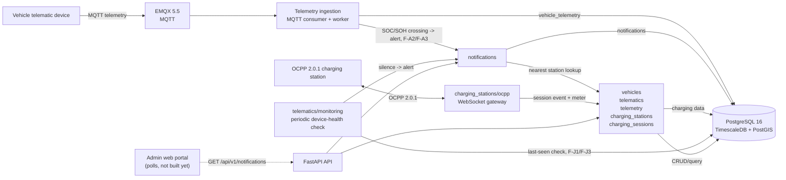

# G3Network Architecture — Current MVP

The current repo is a backend MVP monorepo. The diagram below describes the
components present in the source and local infrastructure; Kafka, Redis, API
Gateway, the portal and the vehicle app are only future directions, not
active components yet.



## Current components

### Backend API

FastAPI registers the following domains:

- `vehicles`: vehicle CRUD and soft delete, plus an F-F2 device-activation
  state machine and its fleet-wide success-rate summary.
- `telematics`: device CRUD and mapping devices to vehicles, plus a
  periodic device-health monitor (F-J1/F-J3, partial) - this backend's
  first non-event-driven background process.
- `telemetry`: receiving data via the ingestion service and reading a
  vehicle's latest/history telemetry (including F-A3's `soh_percent`/
  `cycle_count`).
- `charging_stations`: Station → EVSE → Connector topology CRUD, station
  directory metadata (location, power rating, connector standard, operating
  hours, maintenance status), a nearby-station radius search (F-D1), and the
  OCPP 2.0.1 gateway (now also handling `StatusNotification`, F-C2).
- `charging_sessions`: storing the session aggregate, lifecycle events and
  meter values, plus a station-level energy aggregation query (F-C5).
- `notifications`: a generic, backend-storage notification table (F-A2)
  polled via `GET /api/v1/notifications?after_id=`; telemetry ingestion
  raises one when a vehicle's SOC crosses the 30/20/10% tiers (carrying the
  nearest operational charging station, resolved via `charging_stations`,
  the first PostGIS spatial query in the codebase) or SOH drops below its
  threshold (F-A3); the device-health monitor raises one when a vehicle
  goes silent (F-J1/F-J3). No push and no recipient scoping yet — there is
  no mobile app and no `identity` domain.

The API process runs separately via Uvicorn. Telemetry ingestion, the OCPP
gateway, and the telematics device-health monitor each have their own
entrypoint, sharing the same database/session configuration.

### Database

Development uses a single PostgreSQL 16 container with the following
extensions:

- TimescaleDB for `vehicle_telemetry`, `charging_session_events` and
  `charging_session_meter_values`.
- PostGIS: used for `charging_stations.location` (F-C1) and
  `vehicle_telemetry.location` (both `geography(Point, 4326)` columns) —
  `charging_stations.location` has a GIST index, `vehicle_telemetry.location`
  deliberately doesn't (high-frequency write path, no spatial query need
  yet). F-A2's nearest-operational-station lookup is the first query to use
  that index (`ST_Distance` + the `<->` KNN operator). F-D1's nearby-station
  search (`GET /charging-stations/nearby`) is the first query to use
  `ST_DWithin` for a radius filter, alongside the same KNN ordering.
  There's still no geofence *search* API (radius query, filtering) on
  `vehicle_telemetry`/vehicle geofencing.
- `uuid-ossp` for the local database.

The current Alembic baseline consists of:

```text
0001_reset_application_schema
0002_vehicles_telematics
0003_create_vehicle_telemetry
0004_create_charging_mvp_schema
0005_station_directory_fields
0006_telemetry_location_geo
0007_telemetry_schema_version
0008_notifications
0009_anomaly_notification_type
0010_charging_connector_status
0011_vehicle_activation_status
0012_telemetry_battery_health
0013_soh_alert_notification_type
0014_device_offline_alert
```

The charging MVP only supports pre-provisioned topology and the happy path:

```text
Started → Updated/MeterValues → Ended
```

### Local infrastructure

`infra/docker-compose.yml` only starts two services:

- `db`: PostgreSQL/TimescaleDB/PostGIS on port `5432`.
- `broker`: EMQX on port `1883`, dashboard on `18083`.

The backend runs directly on the host via `uv`; there is no API Gateway or
reverse proxy in the development environment.

## Not yet in the MVP

- User, authentication, RBAC and driver.
- Vehicle/station map and aggregate dashboard. A bounded time-range
  telemetry history query exists (F-A5,
  `GET /telemetry/vehicles/{id}/history`), but true trip segmentation
  (start/end detection, idle-gap grouping) does not.
- Aggregate/fleet-wide connector status dashboard and technical status
  history. Per-connector live status exists (F-C2, `StatusNotification`),
  but nothing aggregates it across a station or fleet yet.
- Live station occupancy/online signal for a true "nearest *available*"
  and "nearby *available*" (F-A2's and F-D1's lookups only reflect
  `deleted_at`/`maintenance_status` today, not F-C2's new per-connector
  status).
- Push/multi-channel notification delivery (F-F3), recipient scoping, and
  the online/offline vehicle flag (F-A1) — `notifications` today is
  backend-storage-plus-portal-polling only.
- A device error-code catalog (cell/module vs. motor fault classification),
  vendor-validated F-A4 anomaly thresholds, re-alert/escalation for a
  persisting anomaly, and a motor-temperature anomaly detector.
- Geofence (boundary config on `vehicles`, in/out-of-zone events/alerts on
  `telemetry` — F-A5's deferred half), the F-J1 device-health dashboard
  (SIM/power status) and F-J3's power-loss-vs-signal-loss distinction,
  charging policy, payment and billing.
- Web portal, vehicle app, centralized observability and production
  reliability.

Items confirmed as needed in the future must be recorded in
[`docs/01-requirements/future.md`](docs/01-requirements/future.md); do not
create placeholders in active source.
