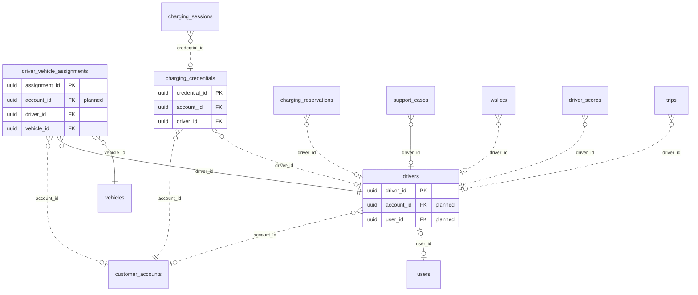

<!-- GENERATED from domain-model.dbml by .claude/skills/domain-model/scripts/domain_model.py - do not edit by hand; edit the .dbml and regenerate. -->

# Drivers

[← Overview](../overview.md)

✅ built: 2 · 🆕 proposed: 1

The people who drive the trucks, and how they identify themselves at a charger.

- A **driver** belongs to one customer account (D1).
- A driver drives at most one vehicle at a time; **assignments** keep the full history.
- A **charging credential** (RFID card, app QR, VIN autocharge) belongs to an account and optionally to one driver (D4).

## Diagram

Only key columns are shown. Solid line = built link, dashed = planned. Tables from other domains (no columns): [charging_reservations](charging_stations.md#charging_reservations), [charging_sessions](charging_sessions.md#charging_sessions), [customer_accounts](identity.md#customer_accounts), [driver_scores](scoring.md#driver_scores), [support_cases](support.md#support_cases), [trips](unassigned.md#trips), [users](identity.md#users), [vehicles](vehicles.md#vehicles), [wallets](billing.md#wallets).

## Tables

### drivers

✅ built · owner: **customer** · features: F-E4

A driver employed by (or being) a customer.

| Column | Type | Null | Key | References | Meaning | Example |
|---|---|---|---|---|---|---|
| `driver_id` | uuid | no | PK |  | Internal ID of the driver. | `6e3b9d2a-4c1f-4e8b-9a7d-0c2e5f1b8d66` |
| `account_id` | uuid | yes | FK | [customer_accounts](identity.md#customer_accounts).account_id (on delete restrict) | **📋 planned (D1)**: Customer account that employs the driver. | `3f6c2a1e-8b4d-4e2a-9c1f-0a7d5b2e4c11` |
| `user_id` | uuid | yes | FK UQ | [users](identity.md#users).user_id (on delete restrict) | **📋 planned**: The driver's login, if they have the app; NULL otherwise. | `9b2e7d4a-1c3f-4a8e-b6d2-5e0f1a9c3d22` |
| `full_name` | varchar(100) | no |  |  | Driver's full name. | `Nguyễn Văn An` |
| `phone_number` | varchar(20) | no | UQ |  | Contact phone number, unique. | `+84912345678` |
| `license_number` | varchar(50) | no | UQ |  | Driving licence number, unique; the driver's business key. | `790123456789` |
| `status` | driverstatus | no |  |  | Driver lifecycle status. | `ACTIVE` |
| `created_at` | timestamptz | no |  |  | When the row was created (UTC). | `2026-09-01T02:00:00Z` |
| `updated_at` | timestamptz | no |  |  | When the row was last changed (UTC). | `2026-09-10T07:15:00Z` |
| `deleted_at` | timestamptz | yes |  |  | Soft-delete time; NULL while the row is live. Rows are never hard-deleted. | `NULL` |

**Enum values**

- `driverstatus`: ACTIVE, INACTIVE

**Indexes**

- `ix_drivers_status` (status)
- `ix_drivers_license_number` (license_number) unique
- `ix_drivers_phone_number` (phone_number) unique

**Referenced by**

- [driver_vehicle_assignments](#driver_vehicle_assignments).driver_id
- [charging_credentials](#charging_credentials).driver_id (planned)
- [charging_reservations](charging_stations.md#charging_reservations).driver_id (planned)
- [support_cases](support.md#support_cases).driver_id
- [wallets](billing.md#wallets).driver_id (planned)
- [driver_scores](scoring.md#driver_scores).driver_id (planned)
- [trips](unassigned.md#trips).driver_id (planned)

### driver_vehicle_assignments

✅ built · owner: **customer** · features: F-E4

Which driver drove which vehicle, and when (open/close history).

| Column | Type | Null | Key | References | Meaning | Example |
|---|---|---|---|---|---|---|
| `assignment_id` | uuid | no | PK |  | Internal ID of the assignment. | `00000004-5a6b-4c7d-8e9f-0a1b2c3d4e5f` |
| `account_id` | uuid | yes | FK | [customer_accounts](identity.md#customer_accounts).account_id (on delete restrict) | **📋 planned (D1)**: Customer account the assignment belongs to. | `3f6c2a1e-8b4d-4e2a-9c1f-0a7d5b2e4c11` |
| `driver_id` | uuid | no | FK | [drivers](#drivers).driver_id (on delete restrict) | Driver assigned. | `6e3b9d2a-4c1f-4e8b-9a7d-0c2e5f1b8d66` |
| `vehicle_id` | uuid | no | FK | [vehicles](vehicles.md#vehicles).vehicle_id (on delete restrict) | Vehicle assigned. | `7a4c1e9b-3d2f-4b8a-a6c5-1e0d9f8b7a44` |
| `assigned_at` | timestamptz | no |  |  | When the assignment began. | `2026-09-01T00:00:00Z` |
| `unassigned_at` | timestamptz | yes |  |  | When it ended; NULL while the driver still has the vehicle. | `NULL` |
| `created_at` | timestamptz | no |  |  | When the row was created (UTC). | `2026-09-01T02:00:00Z` |
| `updated_at` | timestamptz | no |  |  | When the row was last changed (moves when the assignment is closed). | `2026-09-10T07:15:00Z` |

**Indexes**

- `uq_driver_vehicle_assignments_active_vehicle` (vehicle_id) unique - WHERE unassigned_at IS NULL
- `uq_driver_vehicle_assignments_active_driver` (driver_id) unique - WHERE unassigned_at IS NULL
- `ix_driver_vehicle_assignments_driver_time` (driver_id, assigned_at)
- `ix_driver_vehicle_assignments_driver_id` (driver_id)
- `ix_driver_vehicle_assignments_vehicle_id` (vehicle_id)

### charging_credentials

🆕 proposed · owner: **customer** · features: F-B2, F-C6, F-H1

How a charger identifies who is charging. Links a session's raw idTag to a
driver and account. Placement in `drivers` is provisional.

| Column | Type | Null | Key | References | Meaning | Example |
|---|---|---|---|---|---|---|
| `credential_id` | uuid | no | PK |  | Internal ID of the credential. | `d4f1b7e2-8c5a-4d3f-9e1b-6a0c7d2f5ecc` |
| `account_id` | uuid | no | FK | [customer_accounts](identity.md#customer_accounts).account_id (on delete restrict) | Customer account billed when this credential charges. | `3f6c2a1e-8b4d-4e2a-9c1f-0a7d5b2e4c11` |
| `driver_id` | uuid | yes | FK | [drivers](#drivers).driver_id (on delete restrict) | Driver it belongs to; NULL for a shared fleet card. | `6e3b9d2a-4c1f-4e8b-9a7d-0c2e5f1b8d66` |
| `credential_type` | varchar(20) | no |  |  | How the charger identifies the customer. Values: RFID \| APP_QR \| VIN_AUTOCHARGE (decision D4). | `RFID` |
| `id_tag` | varchar(20) | yes | UQ |  | Identifier the charger reports (OCPP idTag), unique. | `04A1B2C3D4E5F6` |
| `status` | varchar(20) | no |  |  | Whether the credential may start a charge. Values: ACTIVE \| BLOCKED \| EXPIRED. | `ACTIVE` |
| `issued_at` | timestamptz | no |  |  | When the credential was issued. | `2026-09-01T02:00:00Z` |
| `revoked_at` | timestamptz | yes |  |  | When it was revoked; NULL while valid. | `NULL` |

**Referenced by**

- [charging_sessions](charging_sessions.md#charging_sessions).credential_id (planned)
