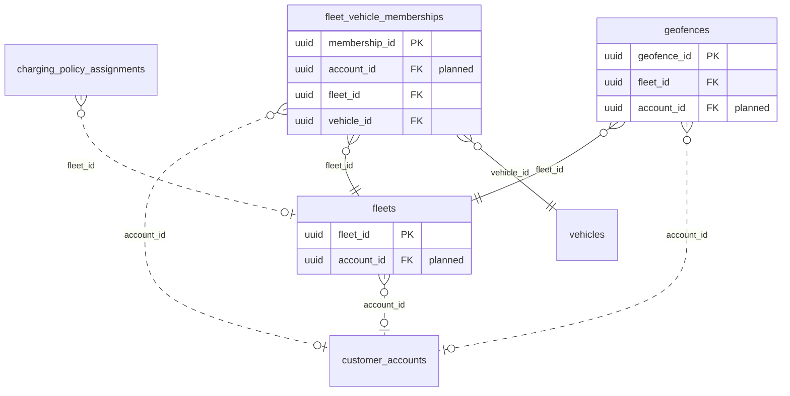

<!-- GENERATED from domain-model.dbml by .claude/skills/domain-model/scripts/domain_model.py - do not edit by hand; edit the .dbml and regenerate. -->

# Fleet

[← Overview](../overview.md)

✅ built: 3

Groups of vehicles managed together by a fleet manager.

- A **fleet** belongs to one customer account (D1, D2).
- A vehicle is in at most one fleet at a time; a fleet holds many vehicles. **Memberships** keep the history.
- A fleet's **geofences** raise an alert when a member vehicle enters or leaves them (F-A5).

## Diagram

Only key columns are shown. Solid line = built link, dashed = planned. Tables from other domains (no columns): [charging_policy_assignments](policy.md#charging_policy_assignments), [customer_accounts](identity.md#customer_accounts), [vehicles](vehicles.md#vehicles).

## Tables

### fleets

✅ built · owner: **customer** · features: F-E1

A named group of vehicles. Whether a fleet IS a customer or a sub-group of
one is decision D2.

| Column | Type | Null | Key | References | Meaning | Example |
|---|---|---|---|---|---|---|
| `fleet_id` | uuid | no | PK |  | Internal ID of the fleet. | `8d5f2b7e-1a9c-4f3d-b8e2-6c0a4d9f1e77` |
| `account_id` | uuid | yes | FK | [customer_accounts](identity.md#customer_accounts).account_id (on delete restrict) | **📋 planned (D1 D2)**: Customer account the fleet belongs to. | `3f6c2a1e-8b4d-4e2a-9c1f-0a7d5b2e4c11` |
| `fleet_code` | varchar(50) | no | UQ |  | Short unique code; the fleet's business key. | `MP-HCM-01` |
| `name` | varchar(100) | no |  |  | Fleet name shown in the portal. | `Đội xe Hồ Chí Minh` |
| `status` | fleetstatus | no |  |  | Fleet lifecycle status. | `ACTIVE` |
| `created_at` | timestamptz | no |  |  | When the row was created (UTC). | `2026-09-01T02:00:00Z` |
| `updated_at` | timestamptz | no |  |  | When the row was last changed (UTC). | `2026-09-10T07:15:00Z` |
| `deleted_at` | timestamptz | yes |  |  | Soft-delete time; NULL while the row is live. Rows are never hard-deleted. | `NULL` |

**Enum values**

- `fleetstatus`: ACTIVE, INACTIVE

**Indexes**

- `ix_fleets_status` (status)
- `ix_fleets_fleet_code` (fleet_code) unique

**Referenced by**

- [fleet_vehicle_memberships](#fleet_vehicle_memberships).fleet_id
- [geofences](#geofences).fleet_id
- [charging_policy_assignments](policy.md#charging_policy_assignments).fleet_id (planned)

### fleet_vehicle_memberships

✅ built · owner: **customer** · features: F-E1

Which vehicle was in which fleet, and when (open/close history).

| Column | Type | Null | Key | References | Meaning | Example |
|---|---|---|---|---|---|---|
| `membership_id` | uuid | no | PK |  | Internal ID of the membership period. | `00000005-5a6b-4c7d-8e9f-0a1b2c3d4e5f` |
| `account_id` | uuid | yes | FK | [customer_accounts](identity.md#customer_accounts).account_id (on delete restrict) | **📋 planned (D1)**: Customer account the membership belongs to. | `3f6c2a1e-8b4d-4e2a-9c1f-0a7d5b2e4c11` |
| `fleet_id` | uuid | no | FK | [fleets](#fleets).fleet_id (on delete restrict) | Fleet the vehicle is in. | `8d5f2b7e-1a9c-4f3d-b8e2-6c0a4d9f1e77` |
| `vehicle_id` | uuid | no | FK | [vehicles](vehicles.md#vehicles).vehicle_id (on delete restrict) | Vehicle in the fleet. | `7a4c1e9b-3d2f-4b8a-a6c5-1e0d9f8b7a44` |
| `joined_at` | timestamptz | no |  |  | When the vehicle joined the fleet. | `2026-09-01T00:00:00Z` |
| `left_at` | timestamptz | yes |  |  | When it left; NULL while still a member. | `NULL` |
| `created_at` | timestamptz | no |  |  | When the row was created (UTC). | `2026-09-01T02:00:00Z` |
| `updated_at` | timestamptz | no |  |  | When the row was last changed (moves when the membership is closed). | `2026-09-10T07:15:00Z` |

**Indexes**

- `ix_fleet_vehicle_memberships_fleet_id` (fleet_id)
- `ix_fleet_vehicle_memberships_fleet_time` (fleet_id, joined_at)
- `ix_fleet_vehicle_memberships_vehicle_id` (vehicle_id)
- `uq_fleet_vehicle_memberships_active_vehicle` (vehicle_id) unique - WHERE left_at IS NULL

### geofences

✅ built · owner: **customer** · features: F-A5

An area whose entry or exit by a member vehicle of its fleet raises an alert.
Scoped to a fleet until customer accounts exist (then it moves to the account).

| Column | Type | Null | Key | References | Meaning | Example |
|---|---|---|---|---|---|---|
| `geofence_id` | uuid | no | PK |  | Internal ID of the geofence. | `00000003-5a6b-4c7d-8e9f-0a1b2c3d4e5f` |
| `fleet_id` | uuid | no | FK | [fleets](#fleets).fleet_id (on delete restrict) | Fleet whose current member vehicles the area applies to. | `8d5f2b7e-1a9c-4f3d-b8e2-6c0a4d9f1e77` |
| `account_id` | uuid | yes | FK | [customer_accounts](identity.md#customer_accounts).account_id (on delete restrict) | **📋 planned (D1)**: Customer account that defined it, once accounts exist; until then a geofence is scoped to a fleet. | `3f6c2a1e-8b4d-4e2a-9c1f-0a7d5b2e4c11` |
| `name` | varchar(100) | no |  |  | Name shown in alerts. | `Kho Tân Uyên` |
| `boundary` | geography(POLYGON,4326) | no |  |  | Area as a WGS84 polygon (longitude first). No spatial index: checks always filter by fleet first. | `POLYGON((106.70 11.05, 106.72 11.05, 106.72 11.07, 106.70 11.07, 106.70 11.05))` |
| `created_at` | timestamptz | no |  |  | When the row was created (UTC). | `2026-09-01T02:00:00Z` |
| `updated_at` | timestamptz | no |  |  | When the row was last changed (UTC). | `2026-09-10T07:15:00Z` |
| `deleted_at` | timestamptz | yes |  |  | Soft-delete time; NULL while the row is live. Rows are never hard-deleted. | `NULL` |

**Indexes**

- `ix_geofences_fleet_id` (fleet_id)
