<!-- GENERATED from domain-model.dbml by .claude/skills/domain-model/scripts/domain_model.py - do not edit by hand; edit the .dbml and regenerate. -->

# Identity

[← Overview](../overview.md)

📋 planned: 4 · 🆕 proposed: 1

Who the customers are, who can log in, and what each person may see. This
is the foundational domain: every other domain may depend on it, and it
depends on none of them. Not built yet.

- A **customer account** is one tenant: a company or an individual truck owner (D1).
- A **user** belongs to at most one account; G3 staff belong to none (D7). A driver profile points to its user, never the other way, so identity depends on no other domain.
- A user holds **roles** per account, kept as history.
- Every access to personal or location data writes an **audit log** entry.

## Diagram

```mermaid
erDiagram
  customer_accounts {
    uuid account_id PK
  }
  users {
    uuid user_id PK
    uuid account_id FK
  }
  roles {
    uuid role_id PK
  }
  user_role_assignments {
    uuid assignment_id PK
    uuid account_id FK
    uuid user_id FK
    uuid role_id FK
  }
  access_audit_logs {
    bigint audit_id PK
    timestamptz occurred_at PK
    uuid user_id FK
    uuid account_id FK
  }
  users }o..o| customer_accounts : "account_id"
  user_role_assignments }o..o| customer_accounts : "account_id"
  user_role_assignments }o..|| users : "user_id"
  user_role_assignments }o..|| roles : "role_id"
  access_audit_logs }o..|| users : "user_id"
  access_audit_logs }o..o| customer_accounts : "account_id"
  vehicles }o..o| customer_accounts : "account_id"
  vehicle_ownerships }o..|| customer_accounts : "account_id"
  vehicle_telemetry }o..o| customer_accounts : "account_id"
  drivers }o..o| customer_accounts : "account_id"
  drivers |o..o| users : "user_id"
  driver_vehicle_assignments }o..o| customer_accounts : "account_id"
  charging_credentials }o..|| customer_accounts : "account_id"
  fleets }o..o| customer_accounts : "account_id"
  fleet_vehicle_memberships }o..o| customer_accounts : "account_id"
  geofences }o..o| customer_accounts : "account_id"
  charging_reservations }o..|| customer_accounts : "account_id"
  charging_sessions }o..o| customer_accounts : "account_id"
  notifications }o..o| customer_accounts : "account_id"
  support_cases }o..o| customer_accounts : "account_id"
  maintenance_bookings }o..|| customer_accounts : "account_id"
  charging_policy_versions }o..|| users : "created_by"
  charging_policy_assignments }o..|| customer_accounts : "account_id"
  policy_violations }o..|| customer_accounts : "account_id"
  payments }o..|| customer_accounts : "account_id"
  wallets }o..|| customer_accounts : "account_id"
  wallet_transactions }o..|| customer_accounts : "account_id"
  invoices }o..|| customer_accounts : "account_id"
  invoice_lines }o..|| customer_accounts : "account_id"
  subscriptions }o..|| customer_accounts : "account_id"
  driver_scores }o..|| customer_accounts : "account_id"
  trips }o..|| customer_accounts : "account_id"
```

Only key columns are shown. Solid line = built link, dashed = planned. Tables from other domains (no columns): [charging_credentials](drivers.md#charging_credentials), [charging_policy_assignments](policy.md#charging_policy_assignments), [charging_policy_versions](policy.md#charging_policy_versions), [charging_reservations](charging_stations.md#charging_reservations), [charging_sessions](charging_sessions.md#charging_sessions), [driver_scores](scoring.md#driver_scores), [driver_vehicle_assignments](drivers.md#driver_vehicle_assignments), [drivers](drivers.md#drivers), [fleet_vehicle_memberships](fleet.md#fleet_vehicle_memberships), [fleets](fleet.md#fleets), [geofences](fleet.md#geofences), [invoice_lines](billing.md#invoice_lines), [invoices](billing.md#invoices), [maintenance_bookings](support.md#maintenance_bookings), [notifications](notifications.md#notifications), [payments](billing.md#payments), [policy_violations](policy.md#policy_violations), [subscriptions](billing.md#subscriptions), [support_cases](support.md#support_cases), [trips](unassigned.md#trips), [vehicle_ownerships](vehicles.md#vehicle_ownerships), [vehicle_telemetry](telemetry.md#vehicle_telemetry), [vehicles](vehicles.md#vehicles), [wallet_transactions](billing.md#wallet_transactions), [wallets](billing.md#wallets).

## Tables

### customer_accounts

🆕 proposed · owner: **g3** · features: F-F1, F-H3

The tenant: one customer of G3, either a transport company or an individual
truck owner. Every customer-owned row points here through `account_id`.

| Column | Type | Null | Key | References | Meaning | Example |
|---|---|---|---|---|---|---|
| `account_id` | uuid | no | PK |  | Internal ID of the customer account (the tenant). | `3f6c2a1e-8b4d-4e2a-9c1f-0a7d5b2e4c11` |
| `account_type` | varchar(20) | no |  |  | Whether the customer is a company or an individual truck owner. Values: ORGANIZATION \| INDIVIDUAL (decision D1). | `ORGANIZATION` |
| `display_name` | varchar(200) | no |  |  | Customer name shown in the portal and on invoices. | `Công ty CP Vận tải Minh Phát` |
| `tax_code` | varchar(20) | yes |  |  | Vietnamese tax code, required for e-invoices. | `0312345678` |
| `status` | varchar(20) | no |  |  | Account lifecycle; SUSPENDED blocks logins without losing data. Values: ACTIVE \| SUSPENDED \| CLOSED. | `ACTIVE` |
| `created_at` | timestamptz | no |  |  | When the row was created (UTC). | `2026-09-01T02:00:00Z` |
| `updated_at` | timestamptz | no |  |  | When the row was last changed (UTC). | `2026-09-10T07:15:00Z` |
| `deleted_at` | timestamptz | yes |  |  | Soft-delete time; NULL while the row is live. Rows are never hard-deleted. | `NULL` |

**Referenced by**

- [users](#users).account_id (planned)
- [user_role_assignments](#user_role_assignments).account_id (planned)
- [access_audit_logs](#access_audit_logs).account_id (planned)
- [vehicles](vehicles.md#vehicles).account_id (planned)
- [vehicle_ownerships](vehicles.md#vehicle_ownerships).account_id (planned)
- [vehicle_telemetry](telemetry.md#vehicle_telemetry).account_id (planned)
- [drivers](drivers.md#drivers).account_id (planned)
- [driver_vehicle_assignments](drivers.md#driver_vehicle_assignments).account_id (planned)
- [charging_credentials](drivers.md#charging_credentials).account_id (planned)
- [fleets](fleet.md#fleets).account_id (planned)
- [fleet_vehicle_memberships](fleet.md#fleet_vehicle_memberships).account_id (planned)
- [geofences](fleet.md#geofences).account_id (planned)
- [charging_reservations](charging_stations.md#charging_reservations).account_id (planned)
- [charging_sessions](charging_sessions.md#charging_sessions).account_id (planned)
- [notifications](notifications.md#notifications).account_id (planned)
- [support_cases](support.md#support_cases).account_id (planned)
- [maintenance_bookings](support.md#maintenance_bookings).account_id (planned)
- [charging_policy_assignments](policy.md#charging_policy_assignments).account_id (planned)
- [policy_violations](policy.md#policy_violations).account_id (planned)
- [payments](billing.md#payments).account_id (planned)
- [wallets](billing.md#wallets).account_id (planned)
- [wallet_transactions](billing.md#wallet_transactions).account_id (planned)
- [invoices](billing.md#invoices).account_id (planned)
- [invoice_lines](billing.md#invoice_lines).account_id (planned)
- [subscriptions](billing.md#subscriptions).account_id (planned)
- [driver_scores](scoring.md#driver_scores).account_id (planned)
- [trips](unassigned.md#trips).account_id (planned)

### users

📋 planned · owner: **customer** · features: F-F1

A person who can log in: fleet manager, driver, or G3 staff.

| Column | Type | Null | Key | References | Meaning | Example |
|---|---|---|---|---|---|---|
| `user_id` | uuid | no | PK |  | Internal ID of the login. | `9b2e7d4a-1c3f-4a8e-b6d2-5e0f1a9c3d22` |
| `account_id` | uuid | yes | FK | [customer_accounts](#customer_accounts).account_id (on delete restrict) | Customer account the user belongs to; NULL for G3 staff. (decision D7) | `3f6c2a1e-8b4d-4e2a-9c1f-0a7d5b2e4c11` |
| `email` | varchar(255) | yes | UQ |  | Login e-mail, unique; optional for drivers who log in by phone. | `dieuvan@minhphat.vn` |
| `phone_number` | varchar(20) | yes | UQ |  | Login phone number in E.164 format, unique; used for OTP. | `+84901234567` |
| `display_name` | varchar(100) | no |  |  | Name shown in the app and in audit logs. | `Trần Thị Bình` |
| `status` | varchar(20) | no |  |  | Login lifecycle: invited, active, or locked by an admin. Values: INVITED \| ACTIVE \| LOCKED. | `ACTIVE` |
| `last_login_at` | timestamptz | yes |  |  | Time of the latest successful login; NULL if never logged in. | `2026-09-14T23:10:00Z` |
| `created_at` | timestamptz | no |  |  | When the row was created (UTC). | `2026-09-01T02:00:00Z` |
| `deleted_at` | timestamptz | yes |  |  | Soft-delete time; NULL while the row is live. Rows are never hard-deleted. | `NULL` |

**Referenced by**

- [user_role_assignments](#user_role_assignments).user_id (planned)
- [access_audit_logs](#access_audit_logs).user_id (planned)
- [drivers](drivers.md#drivers).user_id (planned)
- [charging_policy_versions](policy.md#charging_policy_versions).created_by (planned)

### roles

📋 planned · owner: **g3** · features: F-F1

A named set of permissions from the RBAC matrix.

| Column | Type | Null | Key | References | Meaning | Example |
|---|---|---|---|---|---|---|
| `role_id` | uuid | no | PK |  | Internal ID of the role. | `5d1a9e3c-7b2f-4c6d-8e0a-2f4b6c8d0e33` |
| `role_code` | varchar(50) | no | UQ |  | Stable code used by permission checks. e.g. ADMIN, CSKH, FLEET_MANAGER, DRIVER. | `FLEET_MANAGER` |
| `is_cross_tenant` | boolean | no |  |  | TRUE if holders see every customer account (G3 staff roles). (decision D7) | `false` |
| `description` | varchar(200) | yes |  |  | What the role may do, for admins. | `Quản lý đội xe: xem xe, tài xế, báo cáo của công ty mình` |

**Referenced by**

- [user_role_assignments](#user_role_assignments).role_id (planned)

### user_role_assignments

📋 planned · owner: **customer** · features: F-F1

Which role a user holds, and in which account. Kept as history (granted/revoked).

| Column | Type | Null | Key | References | Meaning | Example |
|---|---|---|---|---|---|---|
| `assignment_id` | uuid | no | PK |  | Internal ID of the assignment. | `00000001-5a6b-4c7d-8e9f-0a1b2c3d4e5f` |
| `account_id` | uuid | yes | FK | [customer_accounts](#customer_accounts).account_id (on delete restrict) | Account in which the role applies; NULL for G3-wide roles. | `3f6c2a1e-8b4d-4e2a-9c1f-0a7d5b2e4c11` |
| `user_id` | uuid | no | FK | [users](#users).user_id (on delete restrict) | User who holds the role. | `9b2e7d4a-1c3f-4a8e-b6d2-5e0f1a9c3d22` |
| `role_id` | uuid | no | FK | [roles](#roles).role_id (on delete restrict) | Role granted. | `5d1a9e3c-7b2f-4c6d-8e0a-2f4b6c8d0e33` |
| `granted_at` | timestamptz | no |  |  | When the role was granted. | `2026-09-01T02:00:00Z` |
| `revoked_at` | timestamptz | yes |  |  | When the role was revoked; NULL while still held. | `NULL` |

### access_audit_logs

📋 planned · owner: **g3** · features: F-F1 · hypertable on `occurred_at`

Append-only record of every access to personal/location data (NF-08).

| Column | Type | Null | Key | References | Meaning | Example |
|---|---|---|---|---|---|---|
| `audit_id` | bigint | no | PK |  | Auto-increasing ID of the audit entry. | `1048576` |
| `occurred_at` | timestamptz | no | PK |  | When the access happened; hypertable time column. | `2026-09-15T08:30:00Z` |
| `user_id` | uuid | no | FK | [users](#users).user_id (on delete restrict) | Who accessed the data. | `9b2e7d4a-1c3f-4a8e-b6d2-5e0f1a9c3d22` |
| `account_id` | uuid | yes | FK | [customer_accounts](#customer_accounts).account_id (on delete restrict) | Whose data was accessed. | `3f6c2a1e-8b4d-4e2a-9c1f-0a7d5b2e4c11` |
| `action` | varchar(30) | no |  |  | What was done with the data. Values: VIEW \| EXPORT \| UPDATE ... | `VIEW` |
| `resource_type` | varchar(50) | no |  |  | Kind of data accessed. | `VEHICLE_LOCATION_HISTORY` |
| `resource_id` | varchar(100) | yes |  |  | ID of the record accessed, as text. | `7a4c1e9b-3d2f-4b8a-a6c5-1e0d9f8b7a44` |
