<!-- GENERATED from domain-model.dbml by .claude/skills/domain-model/scripts/domain_model.py - do not edit by hand; edit the .dbml and regenerate. -->

# Identity

[← Overview](../overview.md)

📋 planned: 6 · 🆕 proposed: 7

Who takes part in the platform, who can log in, and what each person may do.
This is the foundational domain: every other domain may depend on it, and it
depends on none of them. Not built yet.

- An **organization** is a customer (a transport company or an individual owner-driver), our own internal organization (`is_internal`), or a repair/rescue partner (has a `repair_partners` profile). Any of them can own vehicles and drivers; only `is_internal` changes access: internal users see across organizations, everyone else only their own.
- A **user** is one person with one account. Through **memberships** a person can belong to several organizations at once (e.g. their personal organization and the company that hired them); after login they pick the organization to act for. Our own staff are members of an internal organization. Job profiles (e.g. the driver profile) point to a membership, never the other way, so identity depends on no other domain.
- A user holds one or more **roles** (job titles) from a fixed list, kept as history. Roles are permissions only; facts about a job live in a **profile** (e.g. the driver profile), and a role that needs one (DRIVER) requires it to be active.
- **Everyone who uses or receives anything from the system is a user.** A message type belongs to a service (a feature): a user receives it when the service is in one of their roles and in their organization's plan (e.g. e-invoices for ACCOUNTANT, operational alerts for FLEET_MANAGER/DISPATCHER). It then goes to every channel - the app, the fleet portal and e-mail (when an address is on file); otherwise nothing is sent. Marketing messages come later and need the MARKETING consent.
- Every access to personal or location data writes an **audit log** entry.

## Diagram

```mermaid
erDiagram
  organizations {
    uuid organization_id PK
    uuid account_manager_id FK
  }
  organization_history {
    bigint history_id PK
    uuid organization_id FK
    uuid changed_by FK
  }
  users {
    uuid user_id PK
    uuid created_by FK
  }
  user_history {
    bigint history_id PK
    uuid user_id FK
    uuid changed_by FK
  }
  user_state {
    uuid user_id PK, FK
    uuid last_organization_id FK
  }
  memberships {
    uuid membership_id PK
    uuid organization_id FK
    uuid user_id FK
    uuid created_by FK
  }
  membership_history {
    bigint history_id PK
    uuid membership_id FK
    uuid changed_by FK
  }
  user_credentials {
    uuid credential_id PK
    uuid user_id FK
  }
  user_devices {
    uuid device_id PK
    uuid user_id FK
  }
  one_time_codes {
    uuid code_id PK
    uuid user_id FK
    uuid issued_by FK
  }
  user_consents {
    uuid consent_id PK
    uuid user_id FK
  }
  user_role_assignments {
    uuid assignment_id PK
    uuid organization_id FK
    uuid membership_id FK
  }
  access_audit_logs {
    bigint audit_id PK
    timestamptz occurred_at PK
    uuid user_id FK
    uuid organization_id FK
  }
  user_state |o..|| users : "user_id"
  user_credentials }o..|| users : "user_id"
  user_devices }o..|| users : "user_id"
  organizations }o..o| users : "account_manager_id"
  users }o..o| users : "created_by"
  memberships }o..|| organizations : "organization_id"
  memberships }o..|| users : "user_id"
  memberships }o..o| users : "created_by"
  user_state }o..o| organizations : "last_organization_id"
  one_time_codes }o..o| users : "user_id"
  one_time_codes }o..o| users : "issued_by"
  user_consents }o..|| users : "user_id"
  user_role_assignments }o..|| organizations : "organization_id"
  user_role_assignments }o..|| memberships : "membership_id"
  access_audit_logs }o..|| users : "user_id"
  access_audit_logs }o..o| organizations : "organization_id"
  vehicles }o..o| organizations : "organization_id"
  vehicle_ownerships }o..|| organizations : "organization_id"
  vehicle_telemetry }o..o| organizations : "organization_id"
  drivers }o..o| organizations : "organization_id"
  drivers |o..o| memberships : "membership_id"
  driver_vehicle_assignments }o..o| organizations : "organization_id"
  charging_credentials }o..|| organizations : "organization_id"
  fleets }o..o| organizations : "organization_id"
  fleet_vehicle_memberships }o..o| organizations : "organization_id"
  fleet_user_assignments }o..|| organizations : "organization_id"
  fleet_user_assignments }o..|| memberships : "membership_id"
  geofences }o..o| organizations : "organization_id"
  charging_reservations }o..|| organizations : "organization_id"
  charging_sessions }o..o| organizations : "organization_id"
  notifications }o..o| organizations : "organization_id"
  support_cases }o..o| organizations : "organization_id"
  repair_partners |o..|| organizations : "organization_id"
  maintenance_bookings }o..|| organizations : "organization_id"
  charging_policy_versions }o..|| users : "created_by"
  charging_policy_assignments }o..|| organizations : "organization_id"
  policy_violations }o..|| organizations : "organization_id"
  payments }o..|| organizations : "organization_id"
  wallets }o..|| organizations : "organization_id"
  wallet_transactions }o..|| organizations : "organization_id"
  invoices }o..|| organizations : "organization_id"
  invoice_lines }o..|| organizations : "organization_id"
  subscriptions }o..|| organizations : "organization_id"
  driver_scores }o..|| organizations : "organization_id"
  trips }o..|| organizations : "organization_id"
  organization_history }o..o| organizations : "organization_id"
  organization_history }o..o| users : "changed_by"
  user_history }o..o| users : "user_id"
  user_history }o..o| users : "changed_by"
  membership_history }o..o| memberships : "membership_id"
  membership_history }o..o| users : "changed_by"
```

Only key columns are shown. Solid line = built link, dashed = planned. Tables from other domains (no columns): [charging_credentials](drivers.md#charging_credentials), [charging_policy_assignments](policy.md#charging_policy_assignments), [charging_policy_versions](policy.md#charging_policy_versions), [charging_reservations](charging_stations.md#charging_reservations), [charging_sessions](charging_sessions.md#charging_sessions), [driver_scores](scoring.md#driver_scores), [driver_vehicle_assignments](drivers.md#driver_vehicle_assignments), [drivers](drivers.md#drivers), [fleet_user_assignments](fleet.md#fleet_user_assignments), [fleet_vehicle_memberships](fleet.md#fleet_vehicle_memberships), [fleets](fleet.md#fleets), [geofences](fleet.md#geofences), [invoice_lines](billing.md#invoice_lines), [invoices](billing.md#invoices), [maintenance_bookings](support.md#maintenance_bookings), [notifications](notifications.md#notifications), [payments](billing.md#payments), [policy_violations](policy.md#policy_violations), [repair_partners](support.md#repair_partners), [subscriptions](billing.md#subscriptions), [support_cases](support.md#support_cases), [trips](unassigned.md#trips), [vehicle_ownerships](vehicles.md#vehicle_ownerships), [vehicle_telemetry](telemetry.md#vehicle_telemetry), [vehicles](vehicles.md#vehicles), [wallet_transactions](billing.md#wallet_transactions), [wallets](billing.md#wallets).

## Tables

### organizations

**No. 1** · 🆕 proposed · owner: **internal** · features: F-F1, F-H3

Every party that people act for: customers (transport companies and
individual owner-drivers), our own internal organization(s), and
repair/rescue partners - all stored the same way. Every organization-owned
row points here through `organization_id`; our own trucks are owned exactly
like a customer's. Only `is_internal` sets organizations apart, for access:
internal users see across organizations, everyone else only their own.
There is no separate contact list: whoever must receive something (invoices,
reminders, alerts) is a user holding the matching role. Contracts and
service packages live in their own tables.

🔍 = tracked column: a change to it copies the whole old row into [organization_history](#organization_history).

| Column | Type | Null | Key | References | Meaning | Example |
|---|---|---|---|---|---|---|
| `organization_id` | uuid | no | PK |  | Internal ID of the organization. | `3f6c2a1e-8b4d-4e2a-9c1f-0a7d5b2e4c11` |
| `is_internal` | boolean | no | 🔍 |  | TRUE for our own organization(s), the ones running this platform (outsourced staff acting for us, e.g. a hired sales company, are members of it too). Its users see data across every organization and get every feature (no plan limit), still limited to their role (decision D7); only an internal organization may hold HEAD_ADMIN and CO_ADMIN. FALSE for every other organization (customers, partners), whose users only see data related to their own organization, with features limited by its plan. A partner is recognised by having a repair_partners profile, not by this flag. The most security-sensitive column of the table: setting it grants cross-organization access. | `false` |
| `legal_form` | varchar(20) | no | 🔍 |  | What kind of legal person the organization is, because the law treats them differently. COMPANY: a registered company (tax code of 10 digits, or 13 for a branch; invoices to the company). INDIVIDUAL: a private person, e.g. an owner-driver with one truck (the 12-digit citizen ID serves as tax code and is personal data: masked, consent required, every view audit-logged). Used to validate tax_code, apply the privacy rules and fill e-invoices. Internal organizations and partners are always COMPANY. Values: COMPANY \| INDIVIDUAL. | `COMPANY` |
| `display_name` | varchar(200) | no | 🔍 |  | Short name shown in the app and the portal. | `Minh Phát Logistics` |
| `legal_name` | varchar(255) | no | 🔍 |  | Full registered name of the company, or the full name of the person for an INDIVIDUAL; printed on invoices. | `Công ty Cổ phần Vận tải Minh Phát` |
| `tax_code` | varchar(20) | yes | 🔍 |  | Tax code required for e-invoices. COMPANY: the company tax code (10 digits, or 13 for a branch). INDIVIDUAL: for now (since 1 Jul 2025, Circular 86/2024), the 12-digit citizen ID (CCCD) number serves as the personal tax code; it is personal data under Decree 13/2023. Unique among organizations not deleted. | `0312345678` |
| `address` | varchar(500) | yes | 🔍 |  | Registered address, printed on invoices. | `12 Nguyễn Văn Linh, Phường Tân Thuận Tây, Quận 7, TP.HCM` |
| `status` | varchar(20) | no | 🔍 |  | Organization lifecycle. ACTIVE: in service. SUSPENDED: temporarily stopped (e.g. unpaid debt), logins blocked, vehicle data still collected, reversible. CLOSED: no active contract, logins blocked, no new data, data kept for the legal retention period; reopened only when a new contract is signed. Values: ACTIVE \| SUSPENDED \| CLOSED. | `ACTIVE` |
| `status_reason` | varchar(200) | yes | 🔍 |  | Why the organization is in its current status; NULL when ACTIVE. | `NULL` |
| `account_manager_id` | uuid | yes | FK 🔍 | [users](#users).user_id (on delete restrict) | Our SALES user responsible for this customer (one at a time); NULL when none is assigned. Reassignments are kept in organization_history. | `0000001f-5a6b-4c7d-8e9f-0a1b2c3d4e5f` |
| `created_at` | timestamptz | no | 🔍 |  | When the row was created (UTC). | `2026-09-01T02:00:00Z` |
| `updated_at` | timestamptz | no | 🔍 |  | When the row was last changed (UTC). | `2026-09-10T07:15:00Z` |
| `deleted_at` | timestamptz | yes | 🔍 |  | Soft-delete time, only for an organization created by mistake; a real customer or partner is CLOSED, never deleted. NULL while the row is live. | `NULL` |

**Indexes**

- `uq_organizations_active_tax_code` (tax_code) unique - WHERE deleted_at IS NULL

**Referenced by**

- [memberships](#memberships).organization_id (planned)
- [user_state](#user_state).last_organization_id (planned)
- [user_role_assignments](#user_role_assignments).organization_id (planned)
- [access_audit_logs](#access_audit_logs).organization_id (planned)
- [vehicles](vehicles.md#vehicles).organization_id (planned)
- [vehicle_ownerships](vehicles.md#vehicle_ownerships).organization_id (planned)
- [vehicle_telemetry](telemetry.md#vehicle_telemetry).organization_id (planned)
- [drivers](drivers.md#drivers).organization_id (planned)
- [driver_vehicle_assignments](drivers.md#driver_vehicle_assignments).organization_id (planned)
- [charging_credentials](drivers.md#charging_credentials).organization_id (planned)
- [fleets](fleet.md#fleets).organization_id (planned)
- [fleet_vehicle_memberships](fleet.md#fleet_vehicle_memberships).organization_id (planned)
- [fleet_user_assignments](fleet.md#fleet_user_assignments).organization_id (planned)
- [geofences](fleet.md#geofences).organization_id (planned)
- [charging_reservations](charging_stations.md#charging_reservations).organization_id (planned)
- [charging_sessions](charging_sessions.md#charging_sessions).organization_id (planned)
- [notifications](notifications.md#notifications).organization_id (planned)
- [support_cases](support.md#support_cases).organization_id (planned)
- [repair_partners](support.md#repair_partners).organization_id (planned)
- [maintenance_bookings](support.md#maintenance_bookings).organization_id (planned)
- [charging_policy_assignments](policy.md#charging_policy_assignments).organization_id (planned)
- [policy_violations](policy.md#policy_violations).organization_id (planned)
- [payments](billing.md#payments).organization_id (planned)
- [wallets](billing.md#wallets).organization_id (planned)
- [wallet_transactions](billing.md#wallet_transactions).organization_id (planned)
- [invoices](billing.md#invoices).organization_id (planned)
- [invoice_lines](billing.md#invoice_lines).organization_id (planned)
- [subscriptions](billing.md#subscriptions).organization_id (planned)
- [driver_scores](scoring.md#driver_scores).organization_id (planned)
- [trips](unassigned.md#trips).organization_id (planned)
- [organization_history](#organization_history).organization_id (planned)

### organization_history

**No. 1.h** · 🆕 proposed · owner: **internal** · features: F-F1, F-H3 · change history of [organizations](#organizations)

Every earlier version of a row of `organizations`: a copy of the whole row, taken just before a change and written by a database trigger in the same transaction. Generated by the domain-model tool from `@tracked *`; never written by hand.

| Column | Type | Null | Key | References | Meaning | Example |
|---|---|---|---|---|---|---|
| `history_id` | bigint | no | PK |  | Auto-increasing ID of the history row. | `1024` |
| `organization_id` | uuid | yes | FK | [organizations](#organizations).organization_id (on delete restrict) | Value before the change (organizations.organization_id). | `3f6c2a1e-8b4d-4e2a-9c1f-0a7d5b2e4c11` |
| `is_internal` | boolean | yes |  |  | Value before the change (organizations.is_internal). | `false` |
| `legal_form` | varchar(20) | yes |  |  | Value before the change (organizations.legal_form). | `COMPANY` |
| `display_name` | varchar(200) | yes |  |  | Value before the change (organizations.display_name). | `Minh Phát Logistics` |
| `legal_name` | varchar(255) | yes |  |  | Value before the change (organizations.legal_name). | `Công ty Cổ phần Vận tải Minh Phát` |
| `tax_code` | varchar(20) | yes |  |  | Value before the change (organizations.tax_code). | `0312345678` |
| `address` | varchar(500) | yes |  |  | Value before the change (organizations.address). | `12 Nguyễn Văn Linh, Phường Tân Thuận Tây, Quận 7, TP.HCM` |
| `status` | varchar(20) | yes |  |  | Value before the change (organizations.status). | `ACTIVE` |
| `status_reason` | varchar(200) | yes |  |  | Value before the change (organizations.status_reason). | `NULL` |
| `account_manager_id` | uuid | yes |  |  | Value before the change (organizations.account_manager_id). | `0000001f-5a6b-4c7d-8e9f-0a1b2c3d4e5f` |
| `created_at` | timestamptz | yes |  |  | Value before the change (organizations.created_at). | `2026-09-01T02:00:00Z` |
| `updated_at` | timestamptz | yes |  |  | Value before the change (organizations.updated_at). | `2026-09-10T07:15:00Z` |
| `deleted_at` | timestamptz | yes |  |  | Value before the change (organizations.deleted_at). | `NULL` |
| `changed_at` | timestamptz | no |  |  | When this version of the row was replaced. | `2026-09-10T07:15:00Z` |
| `changed_by` | uuid | yes | FK | [users](#users).user_id (on delete restrict) | User who made the change; NULL when the system made it. | `9b2e7d4a-1c3f-4a8e-b6d2-5e0f1a9c3d22` |

**Indexes**

- `ix_organization_history_organization_id_time` (organization_id, changed_at)

### users

**No. 2** · 📋 planned · owner: **internal** · features: F-F1 · live state in [user_state](#user_state)

A person - one account per human, across every organization they work for
(a person may belong to several, through memberships): customer staff, a
driver, our own staff or a partner technician. What they may do comes from their roles (job titles);
facts about a job (e.g. a driver's licence) live in a profile, and a DRIVER
role requires an active driver profile.

🔍 = tracked column: a change to it copies the whole old row into [user_history](#user_history).

| Column | Type | Null | Key | References | Meaning | Example |
|---|---|---|---|---|---|---|
| `user_id` | uuid | no | PK |  | Internal ID of the login. | `9b2e7d4a-1c3f-4a8e-b6d2-5e0f1a9c3d22` |
| `email` | varchar(255) | yes | UQ 🔍 |  | E-mail, optional and unique when present. A message the user is entitled to (its service is in one of their roles and in their organization's plan) goes to the app, the fleet portal and, when an address is on file, this e-mail; with no address, nothing is e-mailed. There is no per-user channel choice. | `dieuvan@minhphat.vn` |
| `phone_number` | varchar(20) | no | UQ 🔍 |  | Phone number in E.164 format, required and unique: the login ID (login is phone + password; other methods come later). | `+84901234567` |
| `full_name` | varchar(100) | no | 🔍 |  | The person's full name, shown in the app, the portal and audit logs. | `Trần Thị Bình` |
| `status` | varchar(20) | no | 🔍 |  | State of the whole account, across every organization: INVITED (no password set yet), ACTIVE, or LOCKED (only our HEAD_ADMIN/CO_ADMIN lock a whole account; an organization locks a person only in its own membership). Values: INVITED \| ACTIVE \| LOCKED. | `ACTIVE` |
| `created_by` | uuid | yes | FK 🔍 | [users](#users).user_id (on delete restrict) | User who created this account (our sales/admin, an ORG_ADMIN, a fleet manager registering a driver); NULL when the person signed up themselves. | `0000001f-5a6b-4c7d-8e9f-0a1b2c3d4e5f` |
| `created_at` | timestamptz | no | 🔍 |  | When the row was created (UTC). | `2026-09-01T02:00:00Z` |
| `updated_at` | timestamptz | no | 🔍 |  | When the row was last changed (UTC). | `2026-09-10T07:15:00Z` |
| `deleted_at` | timestamptz | yes | 🔍 |  | Soft-delete time; NULL while the row is live. Rows are never hard-deleted. | `NULL` |

**Referenced by**

- [user_state](#user_state).user_id (planned)
- [user_credentials](#user_credentials).user_id (planned)
- [user_devices](#user_devices).user_id (planned)
- [organizations](#organizations).account_manager_id (planned)
- [users](#users).created_by (planned)
- [memberships](#memberships).user_id (planned)
- [memberships](#memberships).created_by (planned)
- [one_time_codes](#one_time_codes).user_id (planned)
- [one_time_codes](#one_time_codes).issued_by (planned)
- [user_consents](#user_consents).user_id (planned)
- [access_audit_logs](#access_audit_logs).user_id (planned)
- [charging_policy_versions](policy.md#charging_policy_versions).created_by (planned)
- [organization_history](#organization_history).changed_by (planned)
- [user_history](#user_history).user_id (planned)
- [user_history](#user_history).changed_by (planned)
- [membership_history](#membership_history).changed_by (planned)

### user_history

**No. 2.h** · 📋 planned · owner: **internal** · features: F-F1 · change history of [users](#users)

Every earlier version of a row of `users`: a copy of the whole row, taken just before a change and written by a database trigger in the same transaction. Generated by the domain-model tool from `@tracked *`; never written by hand.

| Column | Type | Null | Key | References | Meaning | Example |
|---|---|---|---|---|---|---|
| `history_id` | bigint | no | PK |  | Auto-increasing ID of the history row. | `1024` |
| `user_id` | uuid | yes | FK | [users](#users).user_id (on delete restrict) | Value before the change (users.user_id). | `9b2e7d4a-1c3f-4a8e-b6d2-5e0f1a9c3d22` |
| `email` | varchar(255) | yes |  |  | Value before the change (users.email). | `dieuvan@minhphat.vn` |
| `phone_number` | varchar(20) | yes |  |  | Value before the change (users.phone_number). | `+84901234567` |
| `full_name` | varchar(100) | yes |  |  | Value before the change (users.full_name). | `Trần Thị Bình` |
| `status` | varchar(20) | yes |  |  | Value before the change (users.status). | `ACTIVE` |
| `created_by` | uuid | yes |  |  | Value before the change (users.created_by). | `0000001f-5a6b-4c7d-8e9f-0a1b2c3d4e5f` |
| `created_at` | timestamptz | yes |  |  | Value before the change (users.created_at). | `2026-09-01T02:00:00Z` |
| `updated_at` | timestamptz | yes |  |  | Value before the change (users.updated_at). | `2026-09-10T07:15:00Z` |
| `deleted_at` | timestamptz | yes |  |  | Value before the change (users.deleted_at). | `NULL` |
| `changed_at` | timestamptz | no |  |  | When this version of the row was replaced. | `2026-09-10T07:15:00Z` |
| `changed_by` | uuid | yes | FK | [users](#users).user_id (on delete restrict) | User who made the change; NULL when the system made it. | `9b2e7d4a-1c3f-4a8e-b6d2-5e0f1a9c3d22` |

**Indexes**

- `ix_user_history_user_id_time` (user_id, changed_at)

### user_state

**No. 3** · 📋 planned · owner: **internal** · features: F-F1 · live state of [users](#users)

Live activity of a user, recorded by the system (observations, not decisions):
updated on every login and request, so kept apart from the users profile and
never history-tracked. Created with default values together with the user, so
every user always has exactly one state row.

| Column | Type | Null | Key | References | Meaning | Example |
|---|---|---|---|---|---|---|
| `user_id` | uuid | no | PK FK | [users](#users).user_id (on delete restrict) | The user this live state belongs to (1:1 with users). | `9b2e7d4a-1c3f-4a8e-b6d2-5e0f1a9c3d22` |
| `last_login_at` | timestamptz | yes |  |  | Latest successful login; NULL if never logged in. | `2026-09-14T23:10:00Z` |
| `last_organization_id` | uuid | yes | FK | [organizations](#organizations).organization_id (on delete restrict) | Organization the user last acted for, opened directly at the next login (for a person who belongs to several organizations). | `3f6c2a1e-8b4d-4e2a-9c1f-0a7d5b2e4c11` |
| `failed_login_count` | integer | no |  |  | Consecutive failed password attempts since the last successful login; reset to 0 on success. Protects against password guessing. | `0` |
| `login_locked_until` | timestamptz | yes |  |  | Logins are refused until this time after too many failures (e.g. 15 minutes after 5 failed attempts); NULL when not locked. Different from a LOCKED account, which an admin decides. | `NULL` |
| `last_active_at` | timestamptz | yes |  |  | Latest request or action in the app or portal; NULL if never active. Used e.g. for an inactive-users report. | `2026-09-15T08:42:10Z` |

### memberships

**No. 4** · 🆕 proposed · owner: **customer** · features: F-F1

One person in one organization (owner decision, 2026-10-03: a person may belong to several,
e.g. their personal organization and the company that hired them as a
driver). Roles, fleet limits and job profiles hang off the membership. After
login, a person with several organizations picks one (the last one is
remembered in user_state); every query then filters by that organization.

🔍 = tracked column: a change to it copies the whole old row into [membership_history](#membership_history).

| Column | Type | Null | Key | References | Meaning | Example |
|---|---|---|---|---|---|---|
| `membership_id` | uuid | no | PK |  | Internal ID of the membership: one person in one organization. | `00000022-5a6b-4c7d-8e9f-0a1b2c3d4e5f` |
| `organization_id` | uuid | no | FK 🔍 | [organizations](#organizations).organization_id (on delete restrict) | Organization the person works for or acts for. | `3f6c2a1e-8b4d-4e2a-9c1f-0a7d5b2e4c11` |
| `user_id` | uuid | no | FK 🔍 | [users](#users).user_id (on delete restrict) | The person. | `9b2e7d4a-1c3f-4a8e-b6d2-5e0f1a9c3d22` |
| `status` | varchar(20) | no | 🔍 |  | Standing of the person in this organization only. INVITED: added but not yet accepted (a person already registered elsewhere accepts the invitation in the app). ACTIVE. LOCKED: blocked here by the organization, without affecting their other organizations. Values: INVITED \| ACTIVE \| LOCKED. | `ACTIVE` |
| `joined_at` | timestamptz | no | 🔍 |  | When the person was added to the organization. | `2026-09-01T02:00:00Z` |
| `left_at` | timestamptz | yes | 🔍 |  | When the person left (or was removed); NULL while a member. Their roles end with it, but their history stays. | `NULL` |
| `created_by` | uuid | yes | FK 🔍 | [users](#users).user_id (on delete restrict) | User who added the person (an ORG_ADMIN, our sales/admin, a fleet manager registering a driver); NULL when the person created their own personal organization. | `9b2e7d4a-1c3f-4a8e-b6d2-5e0f1a9c3d22` |
| `created_at` | timestamptz | no | 🔍 |  | When the row was created (UTC). | `2026-09-01T02:00:00Z` |
| `updated_at` | timestamptz | no | 🔍 |  | When the row was last changed (UTC). | `2026-09-10T07:15:00Z` |

**Indexes**

- `uq_memberships_active` (organization_id, user_id) unique - WHERE left_at IS NULL
- `ix_memberships_user_id` (user_id)

**Referenced by**

- [user_role_assignments](#user_role_assignments).membership_id (planned)
- [drivers](drivers.md#drivers).membership_id (planned)
- [fleet_user_assignments](fleet.md#fleet_user_assignments).membership_id (planned)
- [membership_history](#membership_history).membership_id (planned)

### membership_history

**No. 4.h** · 🆕 proposed · owner: **customer** · features: F-F1 · change history of [memberships](#memberships)

Every earlier version of a row of `memberships`: a copy of the whole row, taken just before a change and written by a database trigger in the same transaction. Generated by the domain-model tool from `@tracked *`; never written by hand.

| Column | Type | Null | Key | References | Meaning | Example |
|---|---|---|---|---|---|---|
| `history_id` | bigint | no | PK |  | Auto-increasing ID of the history row. | `1024` |
| `membership_id` | uuid | yes | FK | [memberships](#memberships).membership_id (on delete restrict) | Value before the change (memberships.membership_id). | `00000022-5a6b-4c7d-8e9f-0a1b2c3d4e5f` |
| `organization_id` | uuid | yes |  |  | Value before the change (memberships.organization_id). | `3f6c2a1e-8b4d-4e2a-9c1f-0a7d5b2e4c11` |
| `user_id` | uuid | yes |  |  | Value before the change (memberships.user_id). | `9b2e7d4a-1c3f-4a8e-b6d2-5e0f1a9c3d22` |
| `status` | varchar(20) | yes |  |  | Value before the change (memberships.status). | `ACTIVE` |
| `joined_at` | timestamptz | yes |  |  | Value before the change (memberships.joined_at). | `2026-09-01T02:00:00Z` |
| `left_at` | timestamptz | yes |  |  | Value before the change (memberships.left_at). | `NULL` |
| `created_by` | uuid | yes |  |  | Value before the change (memberships.created_by). | `9b2e7d4a-1c3f-4a8e-b6d2-5e0f1a9c3d22` |
| `created_at` | timestamptz | yes |  |  | Value before the change (memberships.created_at). | `2026-09-01T02:00:00Z` |
| `updated_at` | timestamptz | yes |  |  | Value before the change (memberships.updated_at). | `2026-09-10T07:15:00Z` |
| `changed_at` | timestamptz | no |  |  | When this version of the row was replaced. | `2026-09-10T07:15:00Z` |
| `changed_by` | uuid | yes | FK | [users](#users).user_id (on delete restrict) | User who made the change; NULL when the system made it. | `9b2e7d4a-1c3f-4a8e-b6d2-5e0f1a9c3d22` |

**Indexes**

- `ix_membership_history_membership_id_time` (membership_id, changed_at)

### user_credentials

**No. 5** · 📋 planned · owner: **internal** · features: F-F1

How each user logs in. Kept out of the users table so a password hash is
never copied into user history, and so new login methods are new rows, not
new columns. A password change revokes the old row and adds a new one.

| Column | Type | Null | Key | References | Meaning | Example |
|---|---|---|---|---|---|---|
| `credential_id` | uuid | no | PK |  | Internal ID of the credential. | `0000001e-5a6b-4c7d-8e9f-0a1b2c3d4e5f` |
| `user_id` | uuid | no | FK | [users](#users).user_id (on delete restrict) | User the credential belongs to. | `9b2e7d4a-1c3f-4a8e-b6d2-5e0f1a9c3d22` |
| `credential_type` | varchar(20) | no |  |  | How the user proves who they are. Only PASSWORD today (with phone_number as the login ID); other methods (OTP, single sign-on) are added later as new values. Values: PASSWORD. | `PASSWORD` |
| `secret_hash` | varchar(255) | no |  |  | One-way hash of the secret (e.g. Argon2id of the password), never the secret itself. Never copied to any history table or log. | `$argon2id$v=19$m=65536,t=3,p=4$...` |
| `created_at` | timestamptz | no |  |  | When the credential was set (e.g. the password chosen). | `2026-09-01T02:00:00Z` |
| `revoked_at` | timestamptz | yes |  |  | When it stopped being valid (replaced by a new password, or revoked); NULL while valid. | `NULL` |

**Indexes**

- `uq_user_credentials_active_type` (user_id, credential_type) unique - WHERE revoked_at IS NULL

### user_devices

**No. 6** · 🆕 proposed · owner: **internal** · features: F-F1, F-F3

The devices a person uses the app on, with the push token needed to send
them push notifications (Firebase Cloud Messaging). Rows are removed on
logout, when Firebase reports the token as unregistered (app uninstalled),
and when stale, so a shared phone never receives the previous user's messages.

| Column | Type | Null | Key | References | Meaning | Example |
|---|---|---|---|---|---|---|
| `device_id` | uuid | no | PK |  | Internal ID of the registered device (one app install). | `00000023-5a6b-4c7d-8e9f-0a1b2c3d4e5f` |
| `user_id` | uuid | no | FK | [users](#users).user_id (on delete restrict) | User currently logged in on the device; a person can have several devices. | `9b2e7d4a-1c3f-4a8e-b6d2-5e0f1a9c3d22` |
| `platform` | varchar(10) | no |  |  | Where the app runs. Values: ANDROID \| IOS \| WEB (browser push, later). | `ANDROID` |
| `push_token` | varchar(512) | no | UQ |  | Push registration token issued by Firebase Cloud Messaging (APNs behind it on iOS); re-sent by the app at every login and when it changes. | `fcm:dX3k...Q9` |
| `app_version` | varchar(20) | yes |  |  | App version on the device, for support and forced upgrades. | `1.4.0` |
| `created_at` | timestamptz | no |  |  | When the device was first registered. | `2026-09-01T02:00:00Z` |
| `last_seen_at` | timestamptz | no |  |  | When the app last reported this token; tokens unused for about a month are treated as stale and deleted. | `2026-09-15T08:42:10Z` |

**Indexes**

- `ix_user_devices_user_id` (user_id)

### one_time_codes

**No. 7** · 🆕 proposed · owner: **internal** · features: F-F1

One-time codes sent by SMS (and e-mail when available): invites, guest
sign-up, password reset and phone changes. Codes are stored only as hashes,
expire quickly, work once, and their sending is rate-limited per phone (the
cooldown and limits are application rules) to stop SMS-pumping fraud.

| Column | Type | Null | Key | References | Meaning | Example |
|---|---|---|---|---|---|---|
| `code_id` | uuid | no | PK |  | Internal ID of the code. | `00000020-5a6b-4c7d-8e9f-0a1b2c3d4e5f` |
| `purpose` | varchar(20) | no |  |  | What the code is for. INVITE: an invited user sets their password. SIGN_UP: a guest proves their phone before the account is created. PASSWORD_RESET: a forgotten password. PHONE_CHANGE: proving a new phone number. Values: INVITE \| SIGN_UP \| PASSWORD_RESET \| PHONE_CHANGE. | `INVITE` |
| `user_id` | uuid | yes | FK | [users](#users).user_id (on delete restrict) | User the code is for; NULL for SIGN_UP, when the account does not exist yet. | `9b2e7d4a-1c3f-4a8e-b6d2-5e0f1a9c3d22` |
| `phone_number` | varchar(20) | no |  |  | Phone number the code was sent to by SMS (E.164). | `+84901234567` |
| `code_hash` | varchar(255) | no |  |  | One-way hash of the code or link token, never the code itself. | `$argon2id$v=19$...` |
| `issued_by` | uuid | yes | FK | [users](#users).user_id (on delete restrict) | User who triggered the code (the admin who sent an invite); NULL when the person asked for it themselves. | `9b2e7d4a-1c3f-4a8e-b6d2-5e0f1a9c3d22` |
| `created_at` | timestamptz | no |  |  | When the code was sent; used for the resend cooldown and per-phone limits. | `2026-09-01T02:00:00Z` |
| `expires_at` | timestamptz | no |  |  | When the code stops working (e.g. 10 minutes for an OTP, 72 hours for an invite link). | `2026-09-04T02:00:00Z` |
| `used_at` | timestamptz | yes |  |  | When the code was used; NULL while unused. A code works only once. | `NULL` |

**Indexes**

- `ix_one_time_codes_phone_time` (phone_number, created_at) - Resend cooldown and per-phone rate limit

### user_consents

**No. 8** · 🆕 proposed · owner: **internal** · features: F-F1

Proof of consent to personal-data processing (Decree 13/2023 and the
Personal Data Protection Law 91/2025/QH15): who agreed to which purpose and
version, when, where, and when they withdrew. Append-only: a new version or a
withdrawal never overwrites an earlier record.

| Column | Type | Null | Key | References | Meaning | Example |
|---|---|---|---|---|---|---|
| `consent_id` | uuid | no | PK |  | Internal ID of the consent record. | `00000021-5a6b-4c7d-8e9f-0a1b2c3d4e5f` |
| `user_id` | uuid | no | FK | [users](#users).user_id (on delete restrict) | Person who gave (or withdrew) the consent. | `9b2e7d4a-1c3f-4a8e-b6d2-5e0f1a9c3d22` |
| `purpose` | varchar(30) | no |  |  | What the consent covers; the law requires specific consent per purpose. TERMS_OF_SERVICE and PRIVACY_POLICY are required to use the system; LOCATION_TRACKING is required for a driver; MARKETING is optional. Values: TERMS_OF_SERVICE \| PRIVACY_POLICY \| LOCATION_TRACKING \| MARKETING. | `PRIVACY_POLICY` |
| `document_version` | varchar(20) | no |  |  | Version of the text the person accepted; a new version requires a new acceptance (a new row). | `2026.10` |
| `channel` | varchar(20) | no |  |  | Where it was given. Values: APP \| PORTAL. | `APP` |
| `accepted_at` | timestamptz | no |  |  | When the person accepted. | `2026-09-01T02:00:00Z` |
| `withdrawn_at` | timestamptz | yes |  |  | When the person withdrew this consent; NULL while it stands. | `NULL` |

**Indexes**

- `ix_user_consents_user_purpose_time` (user_id, purpose, accepted_at)

### user_role_assignments

**No. 9** · 📋 planned · owner: **customer** · features: F-F1

Which roles a person holds in one organization (through their membership); they can hold several at once (e.g. a director
who is also the fleet manager). Kept as history: a revoked role keeps its
row with revoked_at set.

| Column | Type | Null | Key | References | Meaning | Example |
|---|---|---|---|---|---|---|
| `assignment_id` | uuid | no | PK |  | Internal ID of the assignment. | `00000001-5a6b-4c7d-8e9f-0a1b2c3d4e5f` |
| `organization_id` | uuid | no | FK | [organizations](#organizations).organization_id (on delete restrict) | Organization of the membership, copied so every query can filter by organization. | `3f6c2a1e-8b4d-4e2a-9c1f-0a7d5b2e4c11` |
| `membership_id` | uuid | no | FK | [memberships](#memberships).membership_id (on delete restrict) | The membership (person in this organization) that holds the role. | `00000022-5a6b-4c7d-8e9f-0a1b2c3d4e5f` |
| `role` | varchar(30) | no |  |  | The job title the role grants: a bundle of features, the same list for every organization. Data reach comes from the organization (is_internal), not from the role; for a customer the features are the role bundle limited by its plan, for an internal user the whole role bundle (internal-only features such as issuing invoices are never put in any plan). Titles: HEAD_ADMIN (full permissions on everything, internal only), CO_ADMIN (daily administration, internal only, cannot manage admins or is_internal), ORG_ADMIN (manages its own organization users and roles), SALES, ACCOUNTANT, CUSTOMER_CARE, OPERATIONS, MAINTENANCE, WARRANTY, FLEET_MANAGER, DISPATCHER, DRIVER (requires an active driver profile in the organization), TECHNICIAN. A fixed list in code (an enum), not a table. | `FLEET_MANAGER` |
| `granted_at` | timestamptz | no |  |  | When the role was granted. | `2026-09-01T02:00:00Z` |
| `revoked_at` | timestamptz | yes |  |  | When the role was revoked; NULL while still held. | `NULL` |

**Indexes**

- `uq_user_role_assignments_active_role` (membership_id, role) unique - WHERE revoked_at IS NULL

### access_audit_logs

**No. 10** · 📋 planned · owner: **internal** · features: F-F1 · hypertable on `occurred_at`

Append-only record of every access to personal/location data (NF-08).

| Column | Type | Null | Key | References | Meaning | Example |
|---|---|---|---|---|---|---|
| `audit_id` | bigint | no | PK |  | Auto-increasing ID of the audit entry. | `1048576` |
| `occurred_at` | timestamptz | no | PK |  | When the access happened; hypertable time column. | `2026-09-15T08:30:00Z` |
| `user_id` | uuid | no | FK | [users](#users).user_id (on delete restrict) | Who accessed the data. | `9b2e7d4a-1c3f-4a8e-b6d2-5e0f1a9c3d22` |
| `organization_id` | uuid | yes | FK | [organizations](#organizations).organization_id (on delete restrict) | Organization whose data was accessed. | `3f6c2a1e-8b4d-4e2a-9c1f-0a7d5b2e4c11` |
| `action` | varchar(30) | no |  |  | What was done with the data. Values: VIEW \| EXPORT \| UPDATE ... | `VIEW` |
| `resource_type` | varchar(50) | no |  |  | Kind of data accessed. | `VEHICLE_LOCATION_HISTORY` |
| `resource_id` | varchar(100) | yes |  |  | ID of the record accessed, as text. | `7a4c1e9b-3d2f-4b8a-a6c5-1e0d9f8b7a44` |
