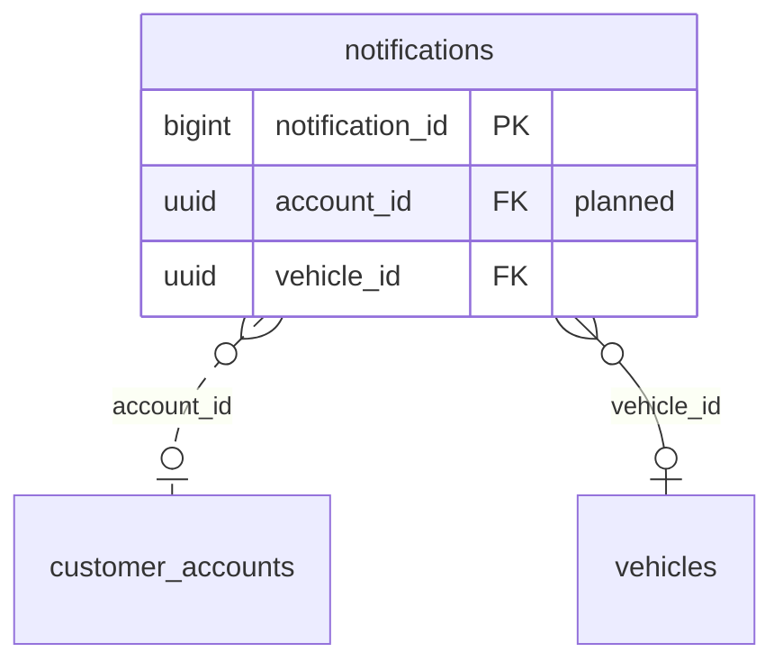

<!-- GENERATED from domain-model.dbml by .claude/skills/domain-model/scripts/domain_model.py - do not edit by hand; edit the .dbml and regenerate. -->

# Notifications

[← Overview](../overview.md)

✅ built: 1

Alerts raised by other domains, stored for operators to poll.

- A **notification** is usually about one vehicle.
- It is not yet scoped to a recipient; under D1 it would belong to the vehicle's account.

## Diagram

Only key columns are shown. Solid line = built link, dashed = planned. Tables from other domains (no columns): [customer_accounts](identity.md#customer_accounts), [vehicles](vehicles.md#vehicles).

## Tables

### notifications

✅ built · owner: **customer** · features: F-A2, F-A3, F-A4, F-J1, F-J3

One alert (battery, anomaly, SOH, device offline ...). One generic table;
each alert type is an enum value plus a payload shape.

| Column | Type | Null | Key | References | Meaning | Example |
|---|---|---|---|---|---|---|
| `notification_id` | bigint | no | PK |  | Auto-increasing ID; also the polling cursor (after_id). | `5821` |
| `account_id` | uuid | yes | FK | [customer_accounts](identity.md#customer_accounts).account_id (on delete restrict) | **📋 planned (D1)**: Customer account that should see the notification. | `3f6c2a1e-8b4d-4e2a-9c1f-0a7d5b2e4c11` |
| `notification_type` | notificationtype | no |  |  | Kind of event that raised it. | `BATTERY_ALERT` |
| `severity` | notificationseverity | no |  |  | How urgent it is, independent of type. | `WARNING` |
| `vehicle_id` | uuid | yes | FK | [vehicles](vehicles.md#vehicles).vehicle_id (on delete cascade) | Vehicle it is about; NULL for non-vehicle notifications. | `7a4c1e9b-3d2f-4b8a-a6c5-1e0d9f8b7a44` |
| `title` | varchar(200) | no |  |  | Short summary. | `Pin còn 20%` |
| `body` | varchar(500) | no |  |  | Longer description. | `Xe 51D-123.45 còn 20% pin. Trạm gần nhất: Trạm sạc G3 Bình Dương (8.4 km).` |
| `payload` | jsonb | no |  |  | Type-specific details as JSON. | `{"threshold": 20, "soc": 19.8, "nearest_station_id": "4b9d6f3a-2e8c-4a1b-9d5e-7f0c3a8b2d88", "distance_m": 8400}` |
| `created_at` | timestamptz | no |  |  | When the notification was raised. | `2026-09-15T08:30:00Z` |
| `read_at` | timestamptz | yes |  |  | When an operator marked it read; NULL if unread. | `NULL` |

**Enum values**

- `notificationtype`: BATTERY_ALERT, ANOMALY_ALERT, SOH_ALERT, DEVICE_OFFLINE_ALERT
- `notificationseverity`: INFO, WARNING, CRITICAL

**Indexes**

- `ix_notifications_vehicle_id` (vehicle_id)
