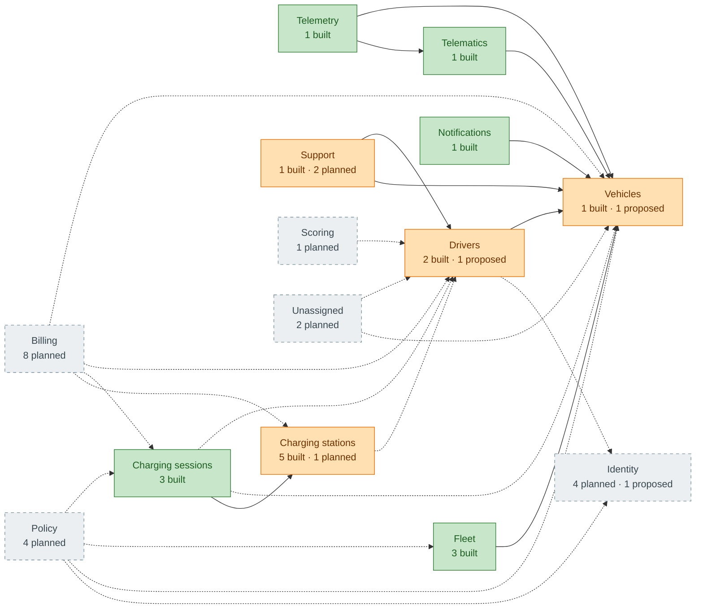

<!-- GENERATED from domain-model.dbml by .claude/skills/domain-model/scripts/domain_model.py - do not edit by hand; edit the .dbml and regenerate. -->

# Domain model: overview

This is the domain model of the G3 Network backend: every table, which
domain owns it, who owns its data, and how it links to the rest.

**Status:** ✅ built (in the code today) · 📋 planned (a feature needs it)
· 🆕 proposed (not in the feature list, but the model needs it).

**Data owner:** *customer* = belongs to one customer account (a tenant) and
carries `account_id`; *g3* = G3's own data, shared across customers;
*two-party* = a G3 asset used by a customer (e.g. a charging session);
*undecided* = waiting on an open decision.

**How to use:** edit `domain-model.dbml` only, then run
`uv run --project backend --with pydbml --with openpyxl python .claude/skills/domain-model/scripts/domain_model.py generate`
from the repository root. `... check` verifies that built tables still match
the backend models and that these views are up to date.

## At a glance

**43 tables in 14 domains:** 18 built, 22 planned, 3 proposed.

## Domain map

Green = fully built · orange = partly built · grey dashed = not built yet. An arrow **A → B** means A's data points to B's; solid = at least one such link is built, dashed = all planned.

Not drawn, to keep the map readable: 12 domains also point to **identity** through `account_id` (customer_accounts): vehicles, telemetry, drivers, fleet, charging_stations, charging_sessions, notifications, support, policy, billing, scoring, unassigned.

## Domains

| Domain | Status | ✅ | 📋 | 🆕 | Tables |
|---|---|---|---|---|---|
| [Identity](domains/identity.md) | planned | 0 | 4 | 1 | customer_accounts, users, roles, user_role_assignments, access_audit_logs |
| [Vehicles](domains/vehicles.md) | partial | 1 | 0 | 1 | vehicles, vehicle_ownerships |
| [Telematics](domains/telematics.md) | built | 1 | 0 | 0 | telematics |
| [Telemetry](domains/telemetry.md) | built | 1 | 0 | 0 | vehicle_telemetry |
| [Drivers](domains/drivers.md) | partial | 2 | 0 | 1 | drivers, driver_vehicle_assignments, charging_credentials |
| [Fleet](domains/fleet.md) | built | 3 | 0 | 0 | fleets, fleet_vehicle_memberships, geofences |
| [Charging stations](domains/charging_stations.md) | partial | 5 | 1 | 0 | charging_stations, charging_evses, charging_connectors, charging_ocpp_messages, charging_station_configuration_entries, charging_reservations |
| [Charging sessions](domains/charging_sessions.md) | built | 3 | 0 | 0 | charging_sessions, charging_session_events, charging_session_measurements |
| [Notifications](domains/notifications.md) | built | 1 | 0 | 0 | notifications |
| [Support](domains/support.md) | partial | 1 | 2 | 0 | support_cases, repair_partners, maintenance_bookings |
| [Policy](domains/policy.md) | planned | 0 | 4 | 0 | charging_policies, charging_policy_versions, charging_policy_assignments, policy_violations |
| [Billing](domains/billing.md) | planned | 0 | 8 | 0 | tariffs, payments, wallets, wallet_transactions, invoices, invoice_lines, subscription_plans, subscriptions |
| [Scoring](domains/scoring.md) | planned | 0 | 1 | 0 | driver_scores |
| [Unassigned](domains/unassigned.md) | planned | 0 | 2 | 0 | promotion_campaigns, trips |

## Data ownership

| Owner | Meaning | Tables |
|---|---|---|
| **customer** | Belongs to one customer account (tenant); carries `account_id`. | [users](domains/identity.md#users), [user_role_assignments](domains/identity.md#user_role_assignments), [vehicles](domains/vehicles.md#vehicles), [vehicle_ownerships](domains/vehicles.md#vehicle_ownerships), [vehicle_telemetry](domains/telemetry.md#vehicle_telemetry), [drivers](domains/drivers.md#drivers), [driver_vehicle_assignments](domains/drivers.md#driver_vehicle_assignments), [charging_credentials](domains/drivers.md#charging_credentials), [fleets](domains/fleet.md#fleets), [fleet_vehicle_memberships](domains/fleet.md#fleet_vehicle_memberships), [geofences](domains/fleet.md#geofences), [notifications](domains/notifications.md#notifications), [support_cases](domains/support.md#support_cases), [maintenance_bookings](domains/support.md#maintenance_bookings), [charging_policy_assignments](domains/policy.md#charging_policy_assignments), [policy_violations](domains/policy.md#policy_violations), [payments](domains/billing.md#payments), [wallets](domains/billing.md#wallets), [wallet_transactions](domains/billing.md#wallet_transactions), [invoices](domains/billing.md#invoices), [invoice_lines](domains/billing.md#invoice_lines), [subscriptions](domains/billing.md#subscriptions), [driver_scores](domains/scoring.md#driver_scores), [trips](domains/unassigned.md#trips) |
| **g3** | G3's own data, shared across all customers. | [customer_accounts](domains/identity.md#customer_accounts), [roles](domains/identity.md#roles), [access_audit_logs](domains/identity.md#access_audit_logs), [charging_stations](domains/charging_stations.md#charging_stations), [charging_evses](domains/charging_stations.md#charging_evses), [charging_connectors](domains/charging_stations.md#charging_connectors), [charging_ocpp_messages](domains/charging_stations.md#charging_ocpp_messages), [charging_station_configuration_entries](domains/charging_stations.md#charging_station_configuration_entries), [repair_partners](domains/support.md#repair_partners), [charging_policies](domains/policy.md#charging_policies), [charging_policy_versions](domains/policy.md#charging_policy_versions), [tariffs](domains/billing.md#tariffs), [subscription_plans](domains/billing.md#subscription_plans), [promotion_campaigns](domains/unassigned.md#promotion_campaigns) |
| **two-party** | A G3 asset used by a customer (both have a stake). | [charging_reservations](domains/charging_stations.md#charging_reservations), [charging_sessions](domains/charging_sessions.md#charging_sessions), [charging_session_events](domains/charging_sessions.md#charging_session_events), [charging_session_measurements](domains/charging_sessions.md#charging_session_measurements) |
| **undecided** | Waiting on an open decision. | [telematics](domains/telematics.md#telematics) |

## Open decisions

| ID | Question | Affects |
|---|---|---|
| D1 | Is the tenant a **customer account** that is either an organization or an individual truck owner? | `account_id` on every customer-owned table |
| D2 | Is a **fleet** the same thing as a customer account, or a sub-group inside one? | `fleets`, `customer_accounts` |
| D3 | When a vehicle **changes owner**, does its old data stay with the previous owner? | `vehicle_ownerships`, `account_id` on telemetry |
| D4 | How is a charging session tied to a customer: **RFID card, app QR scan, VIN autocharge**, or all three? | `charging_credentials`, `charging_sessions`, billing, policy violations |
| D5 | Who pays for a fleet driver's charge: the **driver's wallet, the fleet's wallet**, or it depends? | `wallets`, `payments` |
| D6 | Who owns the **telematic device**: the customer, or G3 as part of the subscription? | `telematics` owner |
| D7 | Which **G3 staff roles** (CSKH, warranty, energy operations) see across all accounts? | `users`, `roles` |
