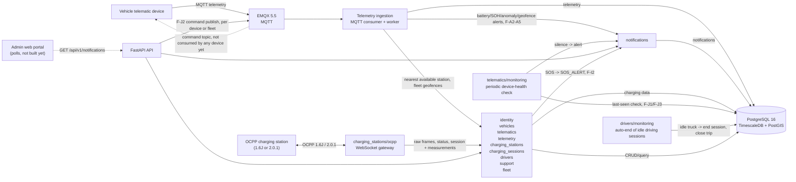

# Architecture — what exists today

What is actually built in this repository right now: the running components,
the technology stack, each backend domain, the database, local infrastructure
and the directory layout, then what is not built yet. Progress per product
feature lives in the [feature catalog](../product/features/README.md); why a
choice was made lives in the [decision log](../decisions/decision-log.md).

Contents: [Components](#current-components) ·
[Technology stack](#technology-stack) · [Database](#database) ·
[Local infrastructure](#local-infrastructure) ·
[Directory structure](#directory-structure) · [Not built yet](#not-yet-in-the-mvp)

The repo is a backend MVP monorepo. The diagram below describes the
components present in the source and local infrastructure; Kafka, Redis, API
Gateway, the portal and the vehicle app are only future directions, not
active components yet.



## Current components

### Backend API

FastAPI registers the following domains:

- `vehicles`: vehicle CRUD and soft delete (list filterable by `status`, a
  plate/VIN fragment `q`, model and owner; a vehicle has an owning
  organization, a model from the `vehicle_models` catalog, change history and
  the `vehicle_ownership_periods` view, read by
  `GET /vehicles/{id}/ownership-periods`) and the catalog endpoints
  `/vehicle-models` (create, list, get, update, soft delete; staff write). The
  ownership transfer `POST /vehicles/{id}/transfer-ownership` is orchestrated
  in `app/api/vehicle_transfer.py` (VH-21). The pack capacity other domains
  read (F-A6/F-C6) is the model's nominal capacity; `telemetry` replaces it
  with the installed battery's design capacity (VH-16, VH-21). The
  device-activation state machine is gone (computed later, VH-06).
- `batteries`: battery model catalog (`/battery-models`) and batteries as
  assets (`/batteries`: register, edit, soft delete, fit to / remove from a
  truck, transfer the pack's owner, installation periods from the
  `battery_installation_periods` view). One pack per truck; reads inside the
  data scope, writes for our own staff (BAT-01 is an internal feature).
  Depends one-directionally on `vehicles`.
- `warranties`: warranties of one truck, battery, T-Box or charger
  (`/warranties`: enter, list with object / owner / status / expiring-soon
  filters, edit, void with a reason, soft delete); `limits` keys are checked
  against the covered object; a warranty follows its object, so its data scope
  is the object's owner (a SQL predicate over the four owner columns). Depends
  on `vehicles`, `batteries`, `telematics`, `charging_stations`; nothing
  depends on it.
- `telematics`: device CRUD (a device has an owning organization, change
  history and soft-delete rules DM-25) and mapping devices to vehicles (an unknown
  VIN is a 404; at most one *live* device per vehicle, so a soft-deleted
  device no longer blocks its replacement; a device on a soft-deleted
  vehicle maps nothing), a periodic device-health monitor (F-J1/F-J3,
  partial) - this backend's first non-event-driven background process,
  which judges silence from the newest backend `received_at`
  (`telemetry.service.resolve_last_telemetry_at`), so a skewed device
  clock can't fake silence - and a backend-to-device MQTT command
  publisher (`telematics/commands/`, F-J2 partial) - this backend's only
  MQTT *publish* path, pushing a telemetry publish-interval change to
  `g3network/telematics/{serial}/command`, for one device or for every
  current member of a fleet (sequential, one result per vehicle; the push
  writes nothing, the device confirms the interval in its status report).
  What a device reports about itself goes to `telematic_status_reports`: its
  own ingestion process (`telematics/ingestion/`, `make telematics-status-dev`,
  its own MQTT client id) reads `g3network/telematics/{serial}/status`, one
  message per transaction, tolerant of the vendor-unconfirmed fields
  (mqtt-spec.md 2.2). Device responses carry read-time health (`last_seen_at`,
  `is_online`, `is_silent`, `last_signal_strength_dbm`) through
  `telemetry.service.resolve_vehicle_live_status`; `is_silent` and the
  monitor share one rule (`monitoring/silence_rule.py`). The health dashboard
  (DEV-04: `/telematics/health/devices`, `/telematics/health/summary`,
  `/telematics/{id}/health`, `/telematics/{id}/status-reports`) classifies each
  device with one pure rule (`health_rule.py`) over the silence flag and the
  newest status report. The silence alert is written for the truck's owning
  organization and delivered to its ORG_ADMIN and FLEET_MANAGER members
  (`identity.service.list_organization_role_holder_user_ids`). Only a mounted,
  ACTIVE device receives configuration (TX-08). The `telematic_installation_periods`
  and `telematic_ownership_periods` views are not built (DM-27: no feature
  reads them; the history is in `telematic_history`).
- `telemetry`: receiving data via the ingestion service, reading a
  vehicle's latest telemetry (with `received_at` and a read-time
  `is_online`, `TELEMETRY_ONLINE_THRESHOLD_SECONDS`) and history
  (including F-A3's `soh_percent`/`cycle_count`), a daily F-A3
  battery-health trend, and two SOC-based aggregate reports (F-A6
  operating performance with an optional day/week/month breakdown and CSV,
  F-C6 energy usage) computed from the same telemetry history via a
  window-function query. Fleet-wide views are served here through a
  one-directional `telemetry → fleet` edge (`fleet` never calls
  `telemetry`): member positions/online flags
  (`/telemetry/fleets/{fleet_id}/vehicles/latest`) and the fleet operating
  rollup (`/telemetry/fleets/{fleet_id}/operating-report`, rates
  recomputed from summed distance/energy). `service.py` is the public,
  I/O-orchestrating API; the pure work lives in internal modules
  (`time_windows.py` window validation, `mappers.py` responses,
  `reports.py` F-A3/F-A6/F-C6 calculations and CSV, `detection.py` alert
  detectors), `alerting.py` writes the battery/SOH/anomaly notifications
  (it owns the `notifications`/`charging_stations` edges) and
  `geofencing.py` raises `GEOFENCE_ALERT`s (it owns the `fleet` edge used
  by ingestion). Report days/weeks/months are cut in
  `APP_REPORT_TIMEZONE`; timestamps stay UTC. Ingestion
  (`telemetry/ingestion/`: MQTT consumer -> in-memory queue -> message
  worker) stores one message per transaction - the alerts and geofence
  checks run in the same transaction, after the insert; a payload that
  isn't UTF-8, JSON or the schema is logged and dropped, and the process
  exits non-zero when the consumer or worker stops on its own (only a
  shutdown signal is a clean exit).
- `charging_stations`: Location → charging station (charger) → EVSE →
  Connector topology CRUD (a location is owned by an organization, public or
  private, with access grants for other organizations; a charger reads its
  owner through its location; change history on all four), the profile/state
  split (`charging_station_state`, `charging_connector_state`: what the
  charger reports, written by the gateway; read-time `is_online` and
  `available_connector_count`), a nearby-station radius search (public
  locations, the caller's own and those granted to the caller's organization;
  internal staff see all, CS-28) with an `is_available_only` filter
  (F-D1),
  a per-station status view (`GET /charging-stations/{id}/status`: the whole
  charger plus every gun, derived counts and a stale flag when the charger is
  offline; `GET /charging-stations/status` is the network board), the
  connection facts (`.../connection`), a staff-only message-log read
  (`.../ocpp-messages`, frame text on request and audited), list filters with a
  manage / view scope (`scope=MANAGED|VISIBLE`, CS-29), per-type command
  checks and a cancel for a queued command (CS-29), the all-stations energy ranking
  (`GET /charging-sessions/stations/energy`, F-C5, served here because this
  domain owns the station directory), and the OCPP gateway. "Available"
  (F-A2/F-D1) = charger and location `ACTIVE` and not deleted, a public
  location, and at least one connector whose last status is `Available`;
  `is_online` is reported but not required.
  The gateway serves **OCPP 2.0.1 and OCPP 1.6J**: it
  negotiates the WebSocket subprotocol (`ocpp2.0.1` preferred, `ocpp1.6`
  accepted) and uses one adapter class per protocol
  (`ocpp201_charge_point.py::OCPP201ChargePoint`, `ocpp16_charge_point.py::OCPP16ChargePoint`);
  `ocpp_server.py` only does the handshake, negotiation and connection
  handling. The adapters write through the internal `ocpp_state_service.py`
  / `ocpp_state_repository.py` (identity/topology resolution, frame log,
  boot info, charger/connector status, configuration captures); the public
  `service.py`/`repository.py` keep topology CRUD, the directory and geo
  searches, the configuration read and the command channel (`charging_station_commands`
  queued by the API or another domain; the gateway's `command_loop.py` claims the
  queued rows of the chargers connected to its process, sends the OCPP call per
  protocol and writes the answer back; CS-24, PR-16).
  A `RecordingConnection` wrapper stores every frame, both directions,
  verbatim in `charging_ocpp_messages` before it is parsed, and every
  inbound frame of either protocol refreshes `last_seen_at` (the station's
  `is_online` is derived from it). For 1.6J the adapter handles
  `BootNotification` (device info, firmware-change warning), `Heartbeat`,
  `StatusNotification` (F-C2, incl. connector `0` = the whole charger,
  stored on the station), `Authorize`, `StartTransaction`,
  `StopTransaction` and `MeterValues`; and after each boot the gateway asks
  the charger for `GetConfiguration` in a separate task and stores the
  answer (`GET /charging-stations/{id}/configuration`). The 2.0.1 adapter
  handles `BootNotification` (device info and `last_boot_at`, the same
  heartbeat interval), `Heartbeat`, `TransactionEvent`, `MeterValues`
  and `StatusNotification`.
  1.6J is verified against a simulator; a real charger has not been connected.
- `charging_sessions`: a session is created `PENDING` at the QR scan and turned
  `ACTIVE` by the charger's start message only when it carries that token on
  the same charger (CE-10, CE-11; any other token is answered `Invalid` and
  creates no row; `Authorize` follows the same rule in both adapters); the stop
  message completes it and stores the charger's declared `meter_stop_wh`, the
  billing figure (CE-12). The start by QR (`POST /charging-sessions/scan`), the
  stop (`POST /charging-sessions/{id}/stop`) and the receipt
  (`GET /charging-sessions/{id}/receipt`) need the charger, the wallet and the
  driving session, so they live in `app/api/charging_session_flow.py`, above
  the domains (CE-20): the scan resolves the charger and checks its location's
  visibility, that it is in service and connected
  (`charging_stations.resolve_scan_target`), that the gun and the person have no
  charge open, the wallet (`billing.has_minimum_balance`), that a tariff prices
  the charger (`billing.resolve_tariff_for_station`, else `409 NO_TARIFF`),
  takes the truck from the person's open driving session (`drivers`), creates
  the PENDING row and a QUOTED bill that freezes the price
  (`billing.create_quoted_bill`, BL-10), and queues a `REMOTE_START` command for
  the gateway. The end of a session (the charger's stop message, or an
  abandoned scan) reaches billing through a hook list in
  `charging_sessions.service` (`register_session_ended_hook`), filled by
  `app/api/billing_hooks.py` in the API **and** in the OCPP gateway process
  (`app/api/startup.py`, BL-19): a completed session is billed and the wallet
  debited in the stop message's transaction, an abandoned one voids its bill. A PENDING row ends
  `ABANDONED` when its remote start is refused / times out / is not sent (the
  gateway's command loop, in the same step as the command's outcome) or when
  the scan is older than `CHARGING_PENDING_SESSION_TIMEOUT_SECONDS` (swept by
  the same loop every `CHARGING_SESSION_SWEEP_INTERVAL_SECONDS`). Every
  measurement (energy register, SoC, power, voltage, current, temperature and
  vendor measurands) lives in `charging_session_measurements`, written by the
  OCPP gateway in one fixed unit per known measurand with the OCPP defaults for
  context and location (CE-14); there is no events table (CE-15). The module
  also serves F-C5's station energy total and hourly/daily series
  (energy-register deltas between consecutive outlet readings, each booked in
  the bucket of its later reading, buckets cut in `APP_REPORT_TIMEZONE`), the
  session detail's read-time summary (energy, duration, first/last SoC, newest
  and maximum power), the list filters (truck, scanning user, dates) and the
  caller's own history (`GET /charging-sessions/mine`);
  `resolve_station_energy_total` is the DTO `charging_stations` uses for the
  all-stations ranking. The 1.6J backend assigns the integer `transactionId`
  from a database sequence. Still no retry/out-of-order recovery/DLQ/dedup.
- `billing` (WP9, PAY-06, 07, 09, 10): tariffs, immutable tariff versions with
  time-of-use periods in Vietnam time (`tariff_service`, `pricing`), the bill of
  each session (QUOTED at the scan, BILLED / ON_HOLD / VOID at the end:
  `bill_service`), wallets with their append-only ledger (`ledger_service`) and
  the VietQR top-up with its bank-notification webhook (`topup_service`,
  `vietqr` = pure-Python EMVCo encoder with CRC-16, `providers` = the
  bank-notification interface with a logging fake chosen by
  `BILLING_BANK_PROVIDER`). Money is whole dong (`numeric(14,2)` columns that
  only hold integers, integers on the wire). `service.py` is the public
  surface: `resolve_tariff_for_station`, `create_quoted_bill`,
  `settle_session_bill`, `void_session_bill`, `has_minimum_balance`,
  `resolve_wallet_standing`, `find_session_bill_reference`. Endpoints:
  `/tariffs`, `/tariffs/{id}/versions`, `/tariffs/in-force`,
  `/charging-session-bills`, `/wallets/me`, `/wallets/{user_id}`,
  `/payments/{id}`, `/payments/vietqr/notifications` (public, shared-secret
  header), and `GET /charging-sessions/{id}/bill` in the session flow.
- `notifications`: a generic, backend-storage notification table (F-A2)
  polled via `GET /api/v1/notifications?after_id=` (ascending cursor;
  `order=desc` returns the newest page instead), filterable by vehicle,
  type and severity, with a single read, an unread count and
  mark-all-read. Telemetry ingestion raises one when a vehicle's SOC
  crosses the 30/20/10% tiers (carrying the nearest available charging
  station and its coordinates, resolved via `charging_stations`, the first
  PostGIS spatial query in the codebase), SOH drops below its threshold
  (F-A3), an anomaly is detected (F-A4) or a vehicle enters/leaves a fleet
  geofence (F-A5); the device-health monitor raises one when a vehicle goes
  silent (F-J1/F-J3); `support` raises a `CRITICAL` `SOS_ALERT` for every
  new SOS (F-I2). No push and no recipient scoping yet — nothing derives
  recipients from `identity`'s roles (WP10).
- `identity` (F-F1, WP2a): organizations (create by our staff with the first
  ORG_ADMIN, status SUSPENDED/CLOSED with DM-25 soft delete, account manager,
  per-organization settings), users and credentials (self sign-up, invitation
  acceptance, phone + password login with a temporary lockout, refresh,
  logout, password reset/change and phone change by SMS one-time code, "my
  devices" and push token), memberships and roles (invite, lock, remove,
  leave, grant/revoke, ORG_ADMIN handover), legal documents and consent, and
  the access audit log. Sessions are rows of `user_sessions` with an opaque
  hashed refresh token; the access token is an HMAC-signed short-lived string
  checked against the session row (no JWT, standard library only). Other
  domains authenticate a request with `identity.dependencies`
  (`get_current_principal`, `require_roles`) and apply the data rule with
  `principal.can_access_organization`. SMS and e-mail go behind
  `providers.py`, whose only implementation logs the message. The first
  administrator is created by `make identity-bootstrap`. Since WP2b every
  other router requires a login (ID-50): each endpoint family names its roles
  through `roles_for(<feature codes>)` (the table `FEATURE_ROLES` in
  `identity/types.py`, copied from `features.yaml`), services take the
  `Principal`, repositories filter by `principal.data_scope` (the
  organization, `None` for internal staff) and an out-of-reach record answers
  404. Only health, the sign-in family and the public legal texts are open;
  MQTT ingestion, the OCPP gateway and the monitors are not HTTP and stay
  unauthenticated.
- `drivers` (F-E4, F-A9): the driver profile (one per membership, DR-09; name and
  phone live on the user and are read through `identity`'s public service),
  `driving_sessions` (check-in by VIN or plate / check-out; one open session per
  truck and per driver via partial unique indexes, DR-07) and `trips` (planned by
  a manager, started and finished by the driver, DR-12). Check-in compares the
  phone with the truck's last T-Box position (`DRIVERS_CHECKIN_MAX_DISTANCE_M`)
  and returns warnings; every way a session ends also closes the trip running in
  it; `GET /driving-sessions/current` and `/mine/summary` serve the app (DR-11).
  The driver list searches the licence number, name and phone (`q`), finds the
  driver at the wheel of a VIN (`vehicle_vin`) and the licences expiring soon.
  `monitoring/` is the auto-end worker (`make driving-sessions-autoend-dev`).
  The old `driver_vehicle_assignments` table and its routes are gone. Depends on
  `vehicles`', `identity`'s and `telemetry`'s public services (`telemetry` calls
  `drivers` back for the "checked in to this truck" test); ending or locking a
  membership reaches it through a hook wired in `app/api/membership_end_hooks.py`
  (DR-15).
   — the same shape as `telematics → vehicles`. F-A9 (empty-trip detection) is suspended, not
  built here — see `deferred.md` item 67.
- `support`: support case tickets (F-I1) and SOS intake (F-I2). One
  `support_cases` table discriminated by `case_type` rather than two
  tables. Depends one-directionally on `vehicles` (resolve/validate a VIN)
  and `drivers` (validate a driver ID, enrich `driver_name`) - deliberately
  not wired to `telemetry`, since vehicle context is client-supplied at
  case-creation time rather than fetched live. A response-SLA deadline is
  copied onto each row at creation so a later config change never rewrites
  a past case's SLA; `first_responded_at`/`resolved_at` are stamped only
  the first time a status implies them, and a case cancelled before any
  response is judged at `closed_at`. A CLOSED/CANCELLED case refuses
  further updates. An SOS records its `channel` (hotline fallback allowed,
  coordinates required only in-app) and raises an `SOS_ALERT` through
  `notifications` in the same transaction (`support → notifications`
  edge). The case list filters by category, channel, driver,
  `awaiting_response` and `sla_breached` (the SQL form of the breach rule).
  F-I4 (partner directory/dispatch) and F-I3 (booking) are deferred.
- `fleet`: this backend's second brand-new domain (F-E1; FLT-01/FLT-02 in
  the feature catalog). Fleet CRUD plus a `fleet_vehicle_memberships`
  open/close table (`added_at`/`removed_at`) with no partial
  unique index on `fleet_id` (a fleet holds many vehicles at once). A fleet
  has no status (it exists or is soft-deleted) and needs a `name`, a
  `fleet_code` or both (`ck_fleets_name_or_code`; the code is unique per
  organization among fleets not deleted, FL-08). A fleet is owned by an
  organization (`organization_id`, taken from the caller, or named by internal
  staff); a parent must belong to the same one. Fleets
  keep a change history (`fleet_history`).
  Fleets nest through `parent_fleet_id` (FL-02): a parent must be a live
  fleet, a move under the fleet itself or one of its sub-fleets is refused
  (400), and so is deleting a fleet that still has live sub-fleets (409).
  The tree is read through `GET /fleets/tree` (nested, with an own and a
  roll-up vehicle count) and the `parent_fleet_id` / `include_descendants`
  parameters of the list; `include_descendants` also rolls `vehicle_count`
  and the telemetry fleet map and report up over the sub-fleets
  (`list_descendant_fleet_ids`). Geofences and the fleet-wide config push
  still cover only a fleet's own members.
  **Fleet limits (FL-10, FLT-03, WP6):** `fleet_user_assignments` gives a
  membership's `FLEET_MANAGER` / `DISPATCHER` roles some fleets and
  everything below them (`POST/GET /memberships/{id}/fleets`,
  `DELETE /memberships/{id}/fleets/{fleet_id}`, `GET
  /fleets/{id}/user-assignments`, organization administrator and internal
  staff only; rules in `fleet/assignment_service.py`). No open row means the
  whole organization. `fleet.service.resolve_visible_fleet_ids` /
  `resolve_visible_vehicle_ids` compute the visible set (assigned fleets plus
  all descendants, and the trucks in them); the fleet service, the telemetry
  and telematics fleet views, and per-vehicle telemetry apply it directly,
  while the vehicle, driving-session and trip lists get it through the
  `identity.dependencies.get_visible_vehicle_ids` request dependency, filled
  by `app/api/fleet_visibility.py` (FL-13). The organization administrator and
  internal staff are never limited; deleting a fleet ends the assignments
  pointing at it (`unassigned_by` NULL).
  Depends one-directionally on `vehicles` to resolve/validate a VIN on
  membership add/remove (both by VIN) and to enrich F-E1's vehicle list
  (`vin`/`license_plate`/`status`, via a `VehicleSummary` DTO; null for a
  member whose vehicle was soft-deleted; such a membership is closed by its
  ID). Replaces the dead `vehicles.fleet_id` column. Also owns
  **geofences** (F-A5): polygons per fleet (`/fleets/{id}/geofences`
  CRUD), applied to the fleet's current members. Its public service gives
  other domains the current member vehicle IDs, a vehicle's current fleet
  and the geofences covering a point (`ST_Covers` on geography); `telemetry`
  (fleet views, geofence alerts) and `telematics` (fleet-wide config push)
  call them, never the reverse. It depends on `identity` for the caller and
  for the membership of a fleet limit. F-E2 (KPI dashboard) is deferred.

The API process runs separately via Uvicorn. Telemetry ingestion, the T-Box
status-report ingestion, the OCPP gateway, and the telematics device-health
monitor each have their own entrypoint, sharing the same database/session configuration.

Domain exceptions are mapped to HTTP once: each inherits one base in
`app/libs/common/errors.py` (`NotFoundError` 404, `ConflictError` 409,
`InvalidInputError` 400, `UpstreamUnavailableError` 502) and
`app/api/main.py` registers one handler per base, answering
`{"detail": ...}`. Shared, business-free helpers live in `app/libs/`:
`common/clock.utc_now`, `common/pagination.normalize_page_window` (used by
every paginated list), `common/geo`, and `db/enums.enum_values`. Between
domains, import-linter (`backend/pyproject.toml`) allows importing only
another domain's `service`, `types` and `exceptions` modules, and
`tests/test_import_contracts_smoke.py` fails when a new internal module is
missing from its domain's contract. The current cross-domain edges are
listed in `.claude/rules/domain-boundaries.md`.

## Technology stack

Facts only; the reasoning and alternatives are in the
[decision log](../decisions/decision-log.md) under the IDs shown.

| Part | Choice | Decision |
|---|---|---|
| Backend | Python 3.12, FastAPI, async SQLAlchemy, Pydantic v2 | TT-01 |
| Environment and dependencies | `uv` (`pyproject.toml` + `uv.lock`) | TT-02 |
| Database | PostgreSQL 16 + TimescaleDB (time series) + PostGIS (geo) | DM-01 |
| Schema migrations | Alembic, one baseline migration edited in place until real data must be kept | DM-03 |
| Vehicle data broker | EMQX 5.5 (MQTT); ACLs are set through its Dashboard/REST API, not `acl.conf` | IS-06 |
| Charger protocol | OCPP 1.6J and 2.0.1 through the `ocpp` library, one adapter per protocol, inside `charging_stations` | CO-01 |
| Formatting and lint | Ruff only (line length 88) | TT-03 |
| Types | mypy strict on `app` and `tests` (Pyright advisory) | TT-04 |
| Domain boundaries | import-linter, one contract per domain | CV-01 |
| Quality gate | local pre-commit hook running `make check`; no CI yet | TT-05 |
| Reverse proxy / API gateway | none in development | IS-02 |
| Web portal, vehicle app | proposed only (React + Vite, Flutter); decided when their first task starts | TT-20 |

## Database

Development uses a single PostgreSQL 16 container with the following
extensions:

- TimescaleDB for four hypertables: `telemetry`,
  `charging_session_measurements`,
  `charging_ocpp_messages` (the append-only raw OCPP message log) and
  `access_audit_logs` (identity).
  `telemetry` is indexed on `(vehicle_id, recorded_at DESC)` for the
  latest/history reads and on `(vehicle_id, received_at DESC)` for the
  device-health monitor's last-seen lookup.
- PostGIS: used for `charging_locations.coordinates` (F-C1),
  `telemetry.location` and `support_cases.location` (all
  `geography(Point, 4326)` columns) and `geofences.boundary`
  (`geography(POLYGON, 4326)`, F-A5). Only `charging_locations.coordinates`
  has a GIST index: `telemetry.location` is a high-frequency write
  path that is never searched spatially, and a geofence check always
  filters by fleet first (`ix_geofences_fleet_id`) before `ST_Covers`.
  F-A2's nearest-available-station lookup uses that index (`ST_Distance` +
  the `<->` KNN operator, filtered on connector status); F-D1's nearby-station
  search (`GET /charging-stations/nearby`) uses `ST_DWithin` for the radius
  filter with the same KNN ordering.
- "One live row" constraints are partial unique indexes: one open driving
  session per driver and per vehicle (`WHERE ended_at IS NULL`),
  one open fleet membership per vehicle (`WHERE removed_at IS NULL`), and one
  live telematic device per vehicle (`uq_telematics_active_vehicle`,
  `WHERE vehicle_id IS NOT NULL AND deleted_at IS NULL`); a device's serial and
  IMEI are unique among devices not deleted.
- `uuid-ossp` for the local database.

The schema is a single Alembic migration, `0001_baseline_schema`. During the
bootstrap phase (no data worth keeping) a schema change edits that migration
instead of adding a revision, and `make db-reset` clears the database and
rebuilds it; see `.claude/rules/database.md`.

The charging MVP only supports pre-provisioned topology and the happy path
(2.0.1: `Started → Updated/MeterValues → Ended`; 1.6J: `StartTransaction →
MeterValues → StopTransaction`). The OCPP 1.6J work added an append-only raw
OCPP message log, the charger's device/liveness fields, the widened connector
status, session `idTag`/stop reason/`meterStop`, the unified measurements
table and configuration snapshots, but **not** reconnect/offline recovery,
fault alerting, remote commands or TLS/authentication (`deferred.md` items 27,
73-76).

## Local infrastructure

`infra/docker-compose.yml` only starts two services:

- `db`: PostgreSQL/TimescaleDB/PostGIS on port `5432`.
- `broker`: EMQX on port `1883`, dashboard on `18083`.

The backend runs directly on the host via `uv`; there is no API Gateway or
reverse proxy in the development environment.

## Directory structure

The layout of active source (`backend/`, `infra/`, `simulator/`) and of the
project tooling. Where a new file belongs is decided here; how domains may
call each other is in
[domain-boundaries.md](../../.claude/rules/domain-boundaries.md).

```
.
├── backend/
│   ├── app/                        # Main source code (uv package layout)
│   │   ├── domains/
│   │   │   ├── vehicles/              # Vehicle profile, owner, model catalog (F-F2)
│   │   │   │   ├── router.py  service.py  repository.py  schemas.py  models.py  types.py  exceptions.py
│   │   │   │
│   │   │   ├── telematics/            # Telematic device profile and mapping to vehicles (F-G1)
│   │   │   │   ├── router.py  service.py  repository.py  schemas.py  models.py  types.py  exceptions.py
│   │   │   │   ├── commands/          # mqtt_publisher.py: F-J2 config-push publisher (the only MQTT publish path)
│   │   │   │   ├── health_rule.py     # internal, pure: DEV-04 device health state
│   │   │   │   ├── ingestion/         # mqtt_consumer.py  message_worker.py  entrypoint.py for "make telematics-status-dev" (DEV-03: T-Box status reports -> telematic_status_reports)
│   │   │   │   └── monitoring/        # device_health_monitor.py + entrypoint.py for "make telematics-monitor-dev" (F-J1/F-J3);
│   │   │   │                          # silence_rule.py: pure silence rule shared by the monitor and the API's is_silent
│   │   │   │
│   │   │   ├── telemetry/             # Real-time & historical vehicle data (F-A1)
│   │   │   │   ├── router.py  service.py  repository.py  schemas.py  models.py  types.py  exceptions.py
│   │   │   │   ├── activation.py      # internal, I/O: VEH-05 vehicle activation computed at read time (owns the handover / mounted-device lookups)
│   │   │   │   ├── time_windows.py    # internal, pure: history/report time-window validation
│   │   │   │   ├── mappers.py         # internal, pure: ORM row/MQTT message -> responses, F-A4 snapshot
│   │   │   │   ├── reports.py         # internal, pure: F-A3/F-A6/F-C6 report calculations, fleet rollup, CSV
│   │   │   │   ├── detection.py       # internal, pure: F-A2/F-A3/F-A4 alert detectors
│   │   │   │   ├── alerting.py        # internal, I/O: writes the alert notifications (owns the notifications/charging_stations edges)
│   │   │   │   ├── geofencing.py      # internal, I/O: F-A5 geofence entry/exit per reading -> GEOFENCE_ALERT (owns the ingestion's fleet edge)
│   │   │   │   └── ingestion/         # Receives telematics data via MQTT (EMQX)
│   │   │   │       ├── mqtt_consumer.py  message_worker.py
│   │   │   │       └── entrypoint.py  # entrypoint for "make telemetry-dev" (runs on the host, not a container — see dev-environment.md)
│   │   │   │
│   │   │   ├── charging_stations/     # Station/EVSE/connector topology and OCPP (F-C1, F-G2)
│   │   │   │   ├── router.py  service.py  repository.py  schemas.py  models.py  types.py  exceptions.py
│   │   │   │   │   # service.py/repository.py: topology CRUD, directory and geo searches, configuration read
│   │   │   │   ├── ocpp_state_service.py     # internal (ocpp/ only): identity/topology resolution, frame log, boot info, charger/connector status, GetConfiguration captures
│   │   │   │   ├── ocpp_state_repository.py  # the matching queries
│   │   │   │   └── ocpp/              # WebSocket server for charging station communication (OCPP 2.0.1 and 1.6J)
│   │   │   │       ├── ocpp_server.py       # handshake, subprotocol negotiation, connection handling, connected-charger registry (no protocol handler)
│   │   │   │       ├── command_loop.py      # sends queued charging_station_commands to connected chargers and writes the answers back
│   │   │   │       ├── command_types.py     # OutboundCommand / CommandResult passed between the loop and the adapters
│   │   │   │       ├── ocpp201_charge_point.py # OCPP 2.0.1 adapter (OCPP201ChargePoint): Boot/Heartbeat/TransactionEvent/MeterValues/StatusNotification + payload helpers
│   │   │   │       ├── ocpp16_charge_point.py  # OCPP 1.6J adapter (OCPP16ChargePoint): Boot/Heartbeat/Status/Authorize/Start/Stop/MeterValues + post-boot GetConfiguration
│   │   │   │       ├── ocpp16_measurements.py  # pure 1.6J MeterValues -> energy samples + measurements (never shares code with the 2.0.1 normalizer)
│   │   │   │       ├── parsing.py           # protocol-neutral helpers shared by both adapters (OcppPayload, timestamp parsing/formatting)
│   │   │   │       ├── raw_log.py           # RecordingConnection: verbatim, append-only log of every OCPP frame
│   │   │   │       └── entrypoint.py  # entrypoint for "make charging-ocpp-dev" (runs on the host, not a container)
│   │   │   │
│   │   │   ├── charging_sessions/     # QR-scan sessions, token-matched start/stop, measurements (F-B2)
│   │   │   │   └── router.py  service.py  repository.py  schemas.py  models.py  types.py  exceptions.py
│   │   │   │
│   │   │   ├── billing/               # Tariffs + versions, session bills, wallets + ledger, VietQR top-up (WP9)
│   │   │   │   └── router.py  service.py  repository.py  schemas.py  models.py  types.py  exceptions.py
│   │   │   │       # tariff_service.py, bill_service.py, ledger_service.py, topup_service.py = the logic; pricing.py = periods and rounding; vietqr.py = EMVCo encoder; providers.py = bank-notification interface + logging fake
│   │   │   │
│   │   │   ├── notifications/         # Alerts per organization, per-person inbox state, channel switches (F-A2)
│   │   │   │   └── router.py  service.py  repository.py  schemas.py  models.py  types.py  exceptions.py
│   │   │   │
│   │   │   ├── drivers/               # Driver profile, driving sessions, trips (F-E4, F-A9)
│   │   │   │   └── router.py  service.py  repository.py  schemas.py  models.py  types.py  exceptions.py
│   │   │   │       trip_router.py  trip_service.py     # trips (MON-11, DR-12)
│   │   │   │       monitoring/                          # auto_end_worker.py + entrypoint.py for "make driving-sessions-autoend-dev" (DR-07)
│   │   │   │       # models.py has 3 tables: DriverModel, DrivingSessionModel, TripModel
│   │   │   │
│   │   │   ├── support/               # Support case tickets and SOS intake (F-I1, F-I2)
│   │   │   │   └── router.py  service.py  repository.py  schemas.py  models.py  types.py  exceptions.py
│   │   │   │
│   │   │   ├── fleet/                 # Fleet CRUD and tree, vehicle membership, geofences, fleet limits of a member (F-E1, F-A5, FLT-03); assignment_service.py = the limits
│   │   │   │   └── router.py  service.py  repository.py  schemas.py  models.py  types.py  exceptions.py
│   │   │   │       # models.py has 3 tables: FleetModel, FleetVehicleMembershipModel, GeofenceModel
│   │   │   │
│   │   │   ├── batteries/             # Battery models and batteries (BAT-01)
│   │   │   │   └── router.py  service.py  repository.py  schemas.py  models.py  types.py  exceptions.py
│   │   │   ├── warranties/            # Warranties of trucks, batteries, T-Boxes, chargers (WAR-01)
│   │   │   │   └── router.py  service.py  repository.py  schemas.py  models.py  types.py  exceptions.py
│   │   │   └── identity/              # Organizations, users, memberships, roles, credentials, sessions, consent, audit log (F-F1)
│   │   │       ├── service.py  types.py  exceptions.py  dependencies.py   # public surface (dependencies = FastAPI authentication)
│   │   │       ├── account_service.py  organization_service.py  member_service.py  legal_service.py  audit_service.py  # internal business rules
│   │   │       ├── repository.py  schemas.py  models.py  security.py  providers.py  bootstrap.py
│   │   │       └── router.py  organization_router.py  membership_router.py  compliance_router.py   # 7 routers: /auth, /users, /organizations, /memberships, /legal-documents, /consents, /access-audit-logs
│   │   │           # models.py has 12 tables (OrganizationModel ... AccessAuditLogModel, OrganizationSettingModel); security.py = scrypt/HMAC/random primitives, providers.py = SMS/e-mail interface + logging fake
│   │   │
│   │   ├── api/
│   │   │   ├── main.py                # FastAPI app that merges routers from every domains/*/router.py; run via "make backend-dev" (host, not a container)
│   │   │   ├── fleet_visibility.py    # Wires the fleet limit (FL-10) of a fleet manager to the vehicle, driving-session and trip lists (FL-13)
│   │   │   ├── membership_end_hooks.py # Wires identity's membership end/lock to the drivers service (DR-10, DR-15)
│   │   │   ├── billing_hooks.py       # Wires the end of a charging session to billing (BL-19)
│   │   │   ├── startup.py             # register_api_hooks / register_session_hooks: shared by the API and the OCPP gateway
│   │   │   ├── charging_session_flow.py # QR charge: scan, stop, receipt, bill across charging_stations, billing, drivers, charging_sessions (CE-20)
│   │   │   └── vehicle_transfer.py    # Truck ownership transfer: one transaction across vehicles, fleet, drivers, batteries (VH-12, VH-21)
│   │   │
│   │   └── libs/
│   │       ├── common/                 # shared, NO business logic: config, logging, errors (domain-exception bases),
│   │       │                           # clock (utc_now), pagination (normalize_page_window), geo
│   │       └── db/                     # SQLAlchemy base, session, enums (enum_values), Alembic migrations
│   │
│   ├── tests/                      # one package per domain (tests/<domain>/test_*_smoke.py) plus tests/libs/;
│   │                               # shared builders.py/fakes.py; cross-cutting tests at the top level
│   │                               # (API, migration smoke, PostgreSQL integration)
│   ├── alembic.ini
│   ├── pyproject.toml              # dependencies + dev group, ruff, mypy, import-linter contracts
│   ├── uv.lock
│   ├── README.md
│   └── .env.example                # every setting with its default; no production Dockerfile at this stage yet
│
├── infra/
│   ├── docker-compose.yml          # defines exactly 2 services: db, broker (see dev-environment.md)
│   ├── .env.example
│   └── db/
│       └── init/                   # 01-extensions.sql: enables timescaledb, postgis, uuid-ossp on DB init
│
├── simulator/                      # Vehicle telemetry + OCPP charging session simulators (manual smoke testing only)
│   ├── seed_simulator_devices.py     telematic_simulator.py           # vehicle telemetry over MQTT
│   ├── seed_charging_topology.py     charging_session_simulator.py    # OCPP 2.0.1 (seed also does the 1.6J layout)
│   └── ocpp16_charge_point_simulator.py                               # OCPP 1.6J charger (--scenario boot|status|session)
│
├── docs/                           # see docs/README.md for what each folder is
│   ├── product/                      # WHAT we build: features/ (catalog), inputs/ (business files)
│   ├── design/                       # HOW it is built: this file, domain-model/, specifications/
│   ├── decisions/                    # WHY: decision-log.md, deferred.md (+ deferred-resolved.md)
│   ├── planners/                     # build logs (active; done/)
│   ├── reports/                      # point-in-time analyses and progress reports
│   └── archive/                      # superseded documents
├── .githooks/pre-commit            # runs `make check`; enabled per clone with `make install-hooks`
├── .claude/                        # Claude Code: rules/, skills/, agents/, hooks/, settings.json (settings.local.json is untracked)
├── .mcp.json                       # project MCP servers (read-only PostgreSQL, Context7)
├── .vscode/                        # shared VS Code settings (settings.json) + recommended extensions (extensions.json)
├── Makefile                        # command source of truth (`make help`; first run: `make setup`)
├── README.md
└── CLAUDE.md
```

Not present yet: `backend/Dockerfile`, `infra/docker-compose.prod.yml`, a
`scripts/` directory, and a single shared `.env.example` at the repo root —
each part (`backend/`, `infra/`) currently keeps its own `.env.example`.
Don't create these files/directories before a concrete task needs them.

Domains that have feature codes in `docs/product/feature-list.md`
but **no source yet**: `policy`, `scoring`. Don't
create empty directories/files for them before a concrete task exists; when
creating one, apply [domain-boundaries.md](../../.claude/rules/domain-boundaries.md) and
reference the correct feature code.

Some built domains are intentionally partial — `notifications` (no push, no
automatic recipients: callers add them), `support` (no partner directory/dispatch), `fleet` (no KPI
dashboard; its live-position and operating-rollup views live in `telemetry`,
which depends on `fleet`, not the reverse). Their planners in
`docs/planners/done/` record what was left out.

`web-portal/` (React/TS) and `vehicle-app/` (Flutter) are planned monorepo
components with no source yet; their directory structure and coding
convention will be written once the first task for that part starts.

## Not yet in the MVP

- Per-manager fleet limits (`fleet_user_assignments`, FL-10) and the
  permission-granting step (ID-44) are not applied: every role sees every
  record of its organization within its feature list. `drivers` has a
  profile-CRUD and check-in/check-out slice (F-E4), but no empty-trip
  detection (F-A9, suspended — no trip concept exists in this backend).
- True trip segmentation (start/end detection, idle-gap grouping): F-A5's
  trip replay is a bounded time-range history query
  (`GET /telemetry/vehicles/{id}/history`). Geofences are owned by a fleet,
  not yet by a customer account or a single vehicle (`deferred.md` item 86).
- `PATCH /fleets/{fleet_id}` cannot clear a name or code, nor move a fleet
  back to the top level (`deferred.md` item 98).
- Technical status history and stale-status handling for chargers: an
  offline charger keeps its last connector statuses, and "available" does
  not require `is_online` (`deferred.md` item 76).
- Push/multi-channel notification delivery (F-F3) and recipient scoping —
  `notifications` today is backend-storage-plus-portal-polling only.
- A device error-code catalog (cell/module vs. motor fault classification),
  vendor-validated F-A4 anomaly thresholds, re-alert/escalation for a
  persisting anomaly, and a motor-temperature anomaly detector.
- F-J1's SIM/power status fields and F-J3's power-loss-vs-signal-loss
  distinction (no such data in the MQTT contract), charging policy,
  payment and billing.
- F-J2's confirmation-of-applied-config and rollback (no MQTT ack topic
  exists, so a successful publish only proves the broker accepted the
  message) and local alert thresholds (only the telemetry publish interval
  is implemented).
- Time-of-use or per-tenant electricity pricing for F-A6 (one flat
  `TELEMETRY_ENERGY_COST_PER_KWH_VND` setting today), and vendor-confirmed
  battery capacity (falls back to a documented default when a vehicle has
  none recorded). F-C6 specifically cannot satisfy NF-10's 3-way
  reconciliation with its current SOC-based method - that needs the
  vehicle-linkage `charging_sessions` still lacks.
- F-E2's fleet KPI dashboard (the km/kWh/cost half exists as the fleet
  operating report; SOH, alert counts and utilization are missing -
  `deferred.md` item 72), F-E3's charging & warranty report, and F-A8's
  per-driver charging-efficiency report - the latter two are hard-blocked
  on `charging_sessions` having no vehicle/driver linkage at all (same
  blocker as F-C6/NF-10 above), plus F-E3 also needs the `policy` domain.
- F-I4's repair/rescue partner directory and dispatch routing, and F-I3's
  maintenance-scheduling booking - both considered alongside F-I1/F-I2 when
  `support` was built but deferred (`deferred.md` items 68-69). An
  SLA-breach monitor/escalation for support cases and support-case
  ownership scoped to an authenticated driver also don't exist yet
  (`deferred.md` items 70-71).
- Web portal, vehicle app, centralized observability and production
  reliability.

Items confirmed as needed in the future must be recorded in
[`docs/decisions/deferred.md`](../decisions/deferred.md); do not
create placeholders in active source.
