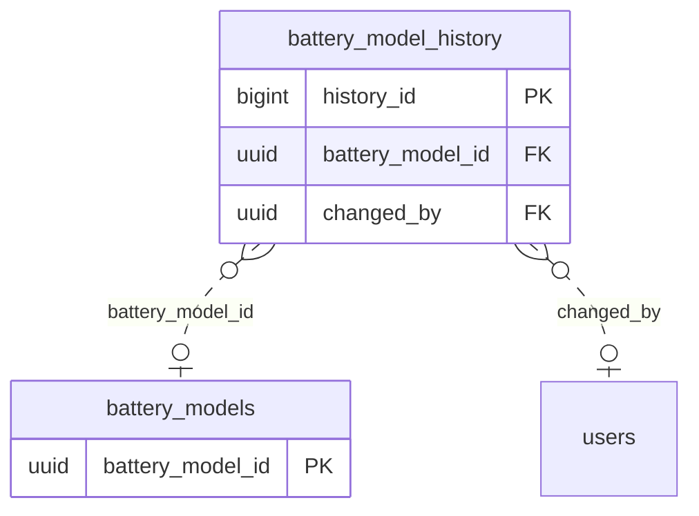

<!-- GENERATED from domain-model.dbml by .claude/skills/domain-model/scripts/domain_model.py - do not edit by hand; edit the .dbml and regenerate. -->

# Batteries

[← Overview](../overview.md)

🆕 proposed: 2

Each truck battery managed as an asset of its own: it can move between
trucks and may belong to another organization than the truck. Depends on
vehicles and identity; nothing in vehicles depends on it. Not built yet.

- A **battery model** is a battery type with its specifications.

## Diagram

Only key columns are shown. Solid line = built link, dashed = planned. Tables from other domains (no columns): [users](identity.md#users).

## Tables

### battery_models

**No. 15** · 🆕 proposed · owner: **internal** · features: F-F2

Catalog of battery types (BAT-01, VH-13), the battery counterpart of
vehicle_models: shared by every organization, maintained by our operations
team, figures entered only once confirmed and updated later when needed. The
cell/module layout is deferred (deferred.md 87); warranty terms live in
warranties.

🔍 = tracked column: a change to it copies the whole old row into [battery_model_history](#battery_model_history).

| Column | Type | Null | Key | References | Meaning | Example |
|---|---|---|---|---|---|---|
| `battery_model_id` | uuid | no | PK |  | Internal ID of the battery model. | `2c7f4e1a-9b3d-4a5e-8c6f-0d1e2f3a4b55` |
| `manufacturer` | varchar(50) | no | 🔍 |  | Battery maker. | `CATL` |
| `model_name` | varchar(50) | no | 🔍 |  | Model name, unique per manufacturer. | `LFP-282` |
| `chemistry` | varchar(10) | no | 🔍 |  | Cell chemistry. Values: LFP \| NMC. | `LFP` |
| `design_capacity_kwh` | numeric(7,1) | yes | 🔍 |  | Energy the pack holds when new, in kWh; NULL until known. | `282.0` |
| `nominal_voltage_v` | numeric(6,1) | yes | 🔍 |  | Nominal pack voltage in volts; NULL until known. | `576.0` |
| `created_at` | timestamptz | no | 🔍 |  | When the row was created (UTC). | `2026-09-01T02:00:00Z` |
| `updated_at` | timestamptz | no | 🔍 |  | When the row was last changed (UTC). | `2026-09-10T07:15:00Z` |
| `deleted_at` | timestamptz | yes | 🔍 |  | Soft-delete time, only for a model entered by mistake; NULL while the row is live. | `NULL` |

**Indexes**

- `uq_battery_models_live_manufacturer_model` (manufacturer, model_name) unique - WHERE deleted_at IS NULL

**Referenced by**

- [battery_model_history](#battery_model_history).battery_model_id (planned)

### battery_model_history

**No. 15.h** · 🆕 proposed · owner: **internal** · features: F-F2 · change history of [battery_models](#battery_models)

Every earlier version of a row of `battery_models`: a copy of the whole row, taken just before a change and written by a database trigger in the same transaction. Generated by the domain-model tool from `@tracked *`; never written by hand.

| Column | Type | Null | Key | References | Meaning | Example |
|---|---|---|---|---|---|---|
| `history_id` | bigint | no | PK |  | Auto-increasing ID of the history row. | `1024` |
| `battery_model_id` | uuid | yes | FK | [battery_models](#battery_models).battery_model_id (on delete restrict) | Value before the change (battery_models.battery_model_id). | `2c7f4e1a-9b3d-4a5e-8c6f-0d1e2f3a4b55` |
| `manufacturer` | varchar(50) | yes |  |  | Value before the change (battery_models.manufacturer). | `CATL` |
| `model_name` | varchar(50) | yes |  |  | Value before the change (battery_models.model_name). | `LFP-282` |
| `chemistry` | varchar(10) | yes |  |  | Value before the change (battery_models.chemistry). | `LFP` |
| `design_capacity_kwh` | numeric(7,1) | yes |  |  | Value before the change (battery_models.design_capacity_kwh). | `282.0` |
| `nominal_voltage_v` | numeric(6,1) | yes |  |  | Value before the change (battery_models.nominal_voltage_v). | `576.0` |
| `created_at` | timestamptz | yes |  |  | Value before the change (battery_models.created_at). | `2026-09-01T02:00:00Z` |
| `updated_at` | timestamptz | yes |  |  | Value before the change (battery_models.updated_at). | `2026-09-10T07:15:00Z` |
| `deleted_at` | timestamptz | yes |  |  | Value before the change (battery_models.deleted_at). | `NULL` |
| `changed_at` | timestamptz | no |  |  | When this version of the row was replaced. | `2026-09-10T07:15:00Z` |
| `changed_by` | uuid | yes | FK | [users](identity.md#users).user_id (on delete restrict) | User who made the change; NULL when the system made it. | `9b2e7d4a-1c3f-4a8e-b6d2-5e0f1a9c3d22` |
| `change_reason` | varchar(200) | no |  |  | Why the row was changed, set by the application for the transaction: typed by the person for an administrative decision, a fixed text for a routine action. A change without a reason fails. | `Customer moved to a new office` |

**Indexes**

- `ix_battery_model_history_battery_model_id_time` (battery_model_id, changed_at)
