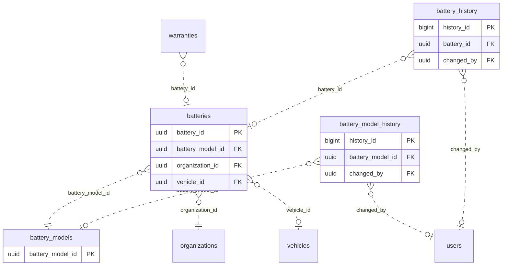

<!-- GENERATED from domain-model.dbml by .claude/skills/domain-model/scripts/domain_model.py - do not edit by hand; edit the .dbml and regenerate. -->

# Batteries

[← Overview](../overview.md)

🆕 proposed: 4

Each truck battery managed as an asset of its own: it can move between
trucks and may belong to another organization than the truck. Depends on
vehicles and identity; nothing in vehicles depends on it. Not built yet.

- A **battery model** is a battery type with its specifications.
- A **battery** is one physical pack: its owner and the truck it is installed in are columns with their history (one battery per truck).

## Diagram

Only key columns are shown. Solid line = built link, dashed = planned. Tables from other domains (no columns): [organizations](identity.md#organizations), [users](identity.md#users), [vehicles](vehicles.md#vehicles), [warranties](warranties.md#warranties).

## Tables

### battery_models

**No. 15** · 🆕 proposed · owner: **internal** · features: F-F2

Catalog of battery types (BAT-01, VH-13), the battery counterpart of
vehicle_models: shared by every organization, maintained by our operations
team, figures entered only once confirmed and updated later when needed. The
cell/module layout is deferred (deferred.md 87); warranty terms live in
warranties.

🔍 = tracked column: a change to it copies the whole old row into [battery_model_history](#battery_model_history).

| Column | Type | Null | Key | References | Meaning | Example |
|---|---|---|---|---|---|---|
| `battery_model_id` | uuid | no | PK |  | Internal ID of the battery model. | `2c7f4e1a-9b3d-4a5e-8c6f-0d1e2f3a4b55` |
| `manufacturer` | varchar(50) | no | 🔍 |  | Battery maker. | `CATL` |
| `model_name` | varchar(50) | no | 🔍 |  | Model name, unique per manufacturer. | `LFP-282` |
| `chemistry` | varchar(10) | no | 🔍 |  | Cell chemistry. Values: LFP \| NMC. | `LFP` |
| `design_capacity_kwh` | numeric(7,1) | yes | 🔍 |  | Energy the pack holds when new, in kWh; NULL until known. | `282.0` |
| `nominal_voltage_v` | numeric(6,1) | yes | 🔍 |  | Nominal pack voltage in volts; NULL until known. | `576.0` |
| `created_at` | timestamptz | no | 🔍 |  | When the row was created (UTC). | `2026-09-01T02:00:00Z` |
| `updated_at` | timestamptz | no | 🔍 |  | When the row was last changed (UTC). | `2026-09-10T07:15:00Z` |
| `deleted_at` | timestamptz | yes | 🔍 |  | Soft-delete time: the model is no longer offered, or was entered by mistake (DM-25); rows already pointing to it keep it. NULL while offered. | `NULL` |

**Indexes**

- `uq_battery_models_live_manufacturer_model` (manufacturer, model_name) unique - WHERE deleted_at IS NULL

**Referenced by**

- [batteries](#batteries).battery_model_id (planned)
- [battery_model_history](#battery_model_history).battery_model_id (planned)

### battery_model_history

**No. 15.h** · 🆕 proposed · owner: **internal** · features: F-F2 · change history of [battery_models](#battery_models)

Every earlier version of a row of `battery_models`: a copy of the whole row, taken just before a change and written by a database trigger in the same transaction. Generated by the domain-model tool from `@tracked *`; never written by hand.

| Column | Type | Null | Key | References | Meaning | Example |
|---|---|---|---|---|---|---|
| `history_id` | bigint | no | PK |  | Auto-increasing ID of the history row. | `1024` |
| `battery_model_id` | uuid | yes | FK | [battery_models](#battery_models).battery_model_id (on delete restrict) | Value before the change (battery_models.battery_model_id). | `2c7f4e1a-9b3d-4a5e-8c6f-0d1e2f3a4b55` |
| `manufacturer` | varchar(50) | yes |  |  | Value before the change (battery_models.manufacturer). | `CATL` |
| `model_name` | varchar(50) | yes |  |  | Value before the change (battery_models.model_name). | `LFP-282` |
| `chemistry` | varchar(10) | yes |  |  | Value before the change (battery_models.chemistry). | `LFP` |
| `design_capacity_kwh` | numeric(7,1) | yes |  |  | Value before the change (battery_models.design_capacity_kwh). | `282.0` |
| `nominal_voltage_v` | numeric(6,1) | yes |  |  | Value before the change (battery_models.nominal_voltage_v). | `576.0` |
| `created_at` | timestamptz | yes |  |  | Value before the change (battery_models.created_at). | `2026-09-01T02:00:00Z` |
| `updated_at` | timestamptz | yes |  |  | Value before the change (battery_models.updated_at). | `2026-09-10T07:15:00Z` |
| `deleted_at` | timestamptz | yes |  |  | Value before the change (battery_models.deleted_at). | `NULL` |
| `changed_at` | timestamptz | no |  |  | When this version of the row was replaced. | `2026-09-10T07:15:00Z` |
| `changed_by` | uuid | yes | FK | [users](identity.md#users).user_id (on delete restrict) | User who made the change; NULL when the system made it. | `9b2e7d4a-1c3f-4a8e-b6d2-5e0f1a9c3d22` |
| `change_reason` | varchar(200) | no |  |  | Why the row was changed, set by the application for the transaction: typed by the person for an administrative decision, a fixed text for a routine action. A change without a reason fails. | `Customer moved to a new office` |

**Indexes**

- `ix_battery_model_history_battery_model_id_time` (battery_model_id, changed_at)

### batteries

**No. 16** · 🆕 proposed · owner: **customer** · features: F-F2

One physical battery, managed as an asset (BAT-01, VH-16). The truck it is
installed in and its owner are columns with a since time (DM-22); their
periods come from the views battery_installation_periods and
battery_ownership_periods over battery_history, which code never reads
directly. A battery's health history across trucks joins telemetry with the
installation periods. When a truck is sold and the seller owns its battery,
the battery moves to the buyer in the same transfer action (VH-12); a battery
owned by someone else (e.g. leased from G3) stays with its owner.
Check constraint: deleted_at IS NULL OR status = 'INACTIVE' (DM-25).

🔍 = tracked column: a change to it copies the whole old row into [battery_history](#battery_history).

| Column | Type | Null | Key | References | Meaning | Example |
|---|---|---|---|---|---|---|
| `battery_id` | uuid | no | PK |  | Internal ID of the battery. | `8e2a6c4f-1d3b-4f7a-9c5e-2b4d6f8a0c11` |
| `serial_number` | varchar(50) | no | 🔍 |  | The pack's serial number from the manufacturer; unique among batteries not deleted. | `CATL-LFP282-2025-004512` |
| `battery_model_id` | uuid | no | FK 🔍 | [battery_models](#battery_models).battery_model_id (on delete restrict) | The battery's model, with its specifications. | `2c7f4e1a-9b3d-4a5e-8c6f-0d1e2f3a4b55` |
| `organization_id` | uuid | no | FK 🔍 | [organizations](identity.md#organizations).organization_id (on delete restrict) | Organization that owns the battery now; may differ from the truck's owner (e.g. G3 leasing it, deferred.md 88). Earlier owners come from the view battery_ownership_periods. | `3f6c2a1e-8b4d-4e2a-9c1f-0a7d5b2e4c11` |
| `acquired_at` | timestamptz | no | 🔍 |  | When the current owner took the battery. | `2026-06-01T00:00:00Z` |
| `vehicle_id` | uuid | yes | FK 🔍 | [vehicles](vehicles.md#vehicles).vehicle_id (on delete restrict) | Truck the battery is installed in now; NULL when in stock or removed. A truck holds at most one battery. Earlier installations come from the view battery_installation_periods. | `7a4c1e9b-3d2f-4b8a-a6c5-1e0d9f8b7a44` |
| `installed_at` | timestamptz | yes | 🔍 |  | When the battery was installed in its current truck; NULL when not installed. | `2026-06-01T00:00:00Z` |
| `manufactured_on` | date | yes | 🔍 |  | Manufacturing date, for age and warranty; NULL until known. | `2025-11-20` |
| `status` | varchar(20) | no | 🔍 |  | Status set by a person (DM-25). ACTIVE: usable. INACTIVE: not usable now, e.g. being repaired or checked; the reason says why. A battery that leaves the system (recycled, sold for second-life use) is INACTIVE and soft-deleted. Installed or in stock is not a status: it is read from vehicle_id. Values: ACTIVE \| INACTIVE. | `ACTIVE` |
| `status_reason` | varchar(200) | yes | 🔍 |  | Why the battery is in its current status; NULL when ACTIVE. | `Cell imbalance check at the Binh Duong workshop` |
| `created_at` | timestamptz | no | 🔍 |  | When the row was created (UTC). | `2026-09-01T02:00:00Z` |
| `updated_at` | timestamptz | no | 🔍 |  | When the row was last changed (UTC). | `2026-09-10T07:15:00Z` |
| `deleted_at` | timestamptz | yes | 🔍 |  | Soft-delete time: the row is no longer part of the system, because it left or was entered by mistake (DM-25); all its data is kept, and the reason is in status_reason. NULL while it is part of the system. | `NULL` |

**Indexes**

- `uq_batteries_live_serial_number` (serial_number) unique - WHERE deleted_at IS NULL
- `uq_batteries_installed_vehicle` (vehicle_id) unique - WHERE vehicle_id IS NOT NULL AND deleted_at IS NULL: one battery per truck

**Referenced by**

- [warranties](warranties.md#warranties).battery_id (planned)
- [battery_history](#battery_history).battery_id (planned)

### battery_history

**No. 16.h** · 🆕 proposed · owner: **customer** · features: F-F2 · change history of [batteries](#batteries)

Every earlier version of a row of `batteries`: a copy of the whole row, taken just before a change and written by a database trigger in the same transaction. Generated by the domain-model tool from `@tracked *`; never written by hand.

| Column | Type | Null | Key | References | Meaning | Example |
|---|---|---|---|---|---|---|
| `history_id` | bigint | no | PK |  | Auto-increasing ID of the history row. | `1024` |
| `battery_id` | uuid | yes | FK | [batteries](#batteries).battery_id (on delete restrict) | Value before the change (batteries.battery_id). | `8e2a6c4f-1d3b-4f7a-9c5e-2b4d6f8a0c11` |
| `serial_number` | varchar(50) | yes |  |  | Value before the change (batteries.serial_number). | `CATL-LFP282-2025-004512` |
| `battery_model_id` | uuid | yes |  |  | Value before the change (batteries.battery_model_id). | `2c7f4e1a-9b3d-4a5e-8c6f-0d1e2f3a4b55` |
| `organization_id` | uuid | yes |  |  | Value before the change (batteries.organization_id). | `3f6c2a1e-8b4d-4e2a-9c1f-0a7d5b2e4c11` |
| `acquired_at` | timestamptz | yes |  |  | Value before the change (batteries.acquired_at). | `2026-06-01T00:00:00Z` |
| `vehicle_id` | uuid | yes |  |  | Value before the change (batteries.vehicle_id). | `7a4c1e9b-3d2f-4b8a-a6c5-1e0d9f8b7a44` |
| `installed_at` | timestamptz | yes |  |  | Value before the change (batteries.installed_at). | `2026-06-01T00:00:00Z` |
| `manufactured_on` | date | yes |  |  | Value before the change (batteries.manufactured_on). | `2025-11-20` |
| `status` | varchar(20) | yes |  |  | Value before the change (batteries.status). | `ACTIVE` |
| `status_reason` | varchar(200) | yes |  |  | Value before the change (batteries.status_reason). | `Cell imbalance check at the Binh Duong workshop` |
| `created_at` | timestamptz | yes |  |  | Value before the change (batteries.created_at). | `2026-09-01T02:00:00Z` |
| `updated_at` | timestamptz | yes |  |  | Value before the change (batteries.updated_at). | `2026-09-10T07:15:00Z` |
| `deleted_at` | timestamptz | yes |  |  | Value before the change (batteries.deleted_at). | `NULL` |
| `changed_at` | timestamptz | no |  |  | When this version of the row was replaced. | `2026-09-10T07:15:00Z` |
| `changed_by` | uuid | yes | FK | [users](identity.md#users).user_id (on delete restrict) | User who made the change; NULL when the system made it. | `9b2e7d4a-1c3f-4a8e-b6d2-5e0f1a9c3d22` |
| `change_reason` | varchar(200) | no |  |  | Why the row was changed, set by the application for the transaction: typed by the person for an administrative decision, a fixed text for a routine action. A change without a reason fails. | `Customer moved to a new office` |

**Indexes**

- `ix_battery_history_battery_id_time` (battery_id, changed_at)
