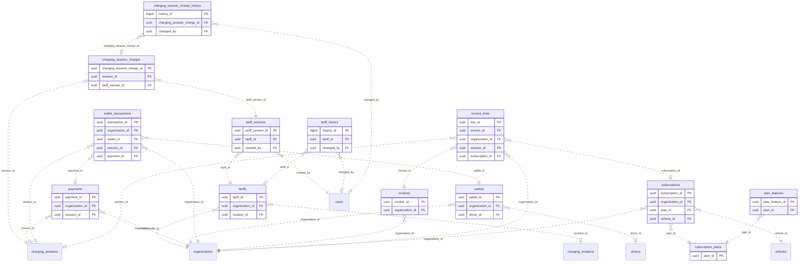

<!-- GENERATED from domain-model.dbml by .claude/skills/domain-model/scripts/domain_model.py - do not edit by hand; edit the .dbml and regenerate. -->

# Billing

[← Overview](../overview.md)

📋 planned: 12 · 🆕 proposed: 1

Money: energy prices, payments, prepaid wallets, e-invoices, and SaaS subscriptions.

- A **tariff** belongs to the organization owning the locations it prices (the owner's default, or one location); its prices are immutable **versions** (BL-08).
- A **payment** usually settles one charging session; a **wallet** belongs to an organization or one driver (D5).
- An **invoice** belongs to one organization and has **lines** for sessions or subscription periods.
- A **subscription** puts one vehicle on one **plan**.
- Billing a session requires knowing whose session it was.
- **Pricing direction (owner decision, 2026-10-03), tables designed in the billing review:** a catalog of a few dozen features, each with its own list price and pricing unit (per vehicle/month, per organization/month, per user, per message - e.g. SMS). Plans are bundles of features; public plans (GUEST as the free default, STANDARD, ADVANCED, PRO, ...) serve most customers, and a private custom plan can be built for one customer. A customer may also add single features on top of a plan (add-ons). Agreed prices are copied onto the subscription/add-on rows. What an organization can use = its plan's features + active add-ons, intersected with each person's role. Companies buy through our sales team; an individual (a guest's personal organization) buys self-service in the app. Each organization decides, per message service, whether push, SMS and e-mail are used (SMS only if its plan includes it); the fleet portal list is always on.

## Diagram

Only key columns are shown. Solid line = built link, dashed = planned. Tables from other domains (no columns): [charging_locations](charging_stations.md#charging_locations), [charging_sessions](charging_sessions.md#charging_sessions), [drivers](drivers.md#drivers), [organizations](identity.md#organizations), [users](identity.md#users), [vehicles](vehicles.md#vehicles).

## Tables

### tariffs

**No. 50** · 📋 planned · owner: **customer** · features: F-C8, F-H1

Whose price it is and where it applies (BL-08); the prices themselves are
immutable versions in tariff_versions, so a receipt always shows the price
actually charged. The price at a location is its own ACTIVE tariff,
otherwise the owner's default. Change history on (retiring or renaming is a
decision); no soft delete (sessions point to its versions forever). Later:
a special price for one customer's contract, and a different price per
charger at the same location.

🔍 = tracked column: a change to it copies the whole old row into [tariff_history](#tariff_history).

| Column | Type | Null | Key | References | Meaning | Example |
|---|---|---|---|---|---|---|
| `tariff_id` | uuid | no | PK |  | Internal ID of the tariff. | `f2b9e6c3-1d8a-4f5b-a3c7-9e0d4b1f8a10` |
| `organization_id` | uuid | no | FK 🔍 | [organizations](identity.md#organizations).organization_id (on delete restrict) | Owner: the organization whose locations this prices (BL-08): our internal organization for the public network, or a customer for its own private chargers (CS-10). Which internal organization owns the public network (G3 Energy or G3 Network, PAY-09) is data, not design. | `3f6c2a1e-8b4d-4e2a-9c1f-0a7d5b2e4c11` |
| `location_id` | uuid | yes | FK 🔍 | [charging_locations](charging_stations.md#charging_locations).location_id (on delete restrict) | The location it prices; NULL for the owner's default for all its locations. Must belong to the owner. Drivers see one price per place. | `NULL` |
| `name` | varchar(100) | no | 🔍 |  | Name shown in the app and on receipts. | `Giá chuẩn 2026` |
| `currency` | char(3) | no | 🔍 |  | ISO 4217 currency code. | `VND` |
| `status` | varchar(20) | no | 🔍 |  | Decided by the owner. ACTIVE: in use. INACTIVE: retired. Values: ACTIVE \| INACTIVE. | `ACTIVE` |
| `status_reason` | varchar(200) | yes | 🔍 |  | Why the tariff has its status, e.g. why it was retired (DM-19); NULL when there is nothing to explain. | `NULL` |
| `created_at` | timestamptz | no | 🔍 |  | When the row was created (UTC). | `2026-09-01T02:00:00Z` |
| `updated_at` | timestamptz | no | 🔍 |  | When the row was last changed (UTC). | `2026-09-10T07:15:00Z` |

**Indexes**

- `uq_tariffs_active_owner_location` (organization_id, location_id) unique - WHERE status = ACTIVE, NULLS NOT DISTINCT: one active tariff per location and one default per owner
- `ix_tariffs_location_id` (location_id)

**Referenced by**

- [tariff_versions](#tariff_versions).tariff_id (planned)
- [tariff_history](#tariff_history).tariff_id (planned)

### tariff_history

**No. 50.h** · 📋 planned · owner: **customer** · features: F-C8, F-H1 · change history of [tariffs](#tariffs)

Every earlier version of a row of `tariffs`: a copy of the whole row, taken just before a change and written by a database trigger in the same transaction. Generated by the domain-model tool from `@tracked *`; never written by hand.

| Column | Type | Null | Key | References | Meaning | Example |
|---|---|---|---|---|---|---|
| `history_id` | bigint | no | PK |  | Auto-increasing ID of the history row. | `1024` |
| `tariff_id` | uuid | yes | FK | [tariffs](#tariffs).tariff_id (on delete restrict) | Value before the change (tariffs.tariff_id). | `f2b9e6c3-1d8a-4f5b-a3c7-9e0d4b1f8a10` |
| `organization_id` | uuid | yes |  |  | Value before the change (tariffs.organization_id). | `3f6c2a1e-8b4d-4e2a-9c1f-0a7d5b2e4c11` |
| `location_id` | uuid | yes |  |  | Value before the change (tariffs.location_id). | `NULL` |
| `name` | varchar(100) | yes |  |  | Value before the change (tariffs.name). | `Giá chuẩn 2026` |
| `currency` | char(3) | yes |  |  | Value before the change (tariffs.currency). | `VND` |
| `status` | varchar(20) | yes |  |  | Value before the change (tariffs.status). | `ACTIVE` |
| `status_reason` | varchar(200) | yes |  |  | Value before the change (tariffs.status_reason). | `NULL` |
| `created_at` | timestamptz | yes |  |  | Value before the change (tariffs.created_at). | `2026-09-01T02:00:00Z` |
| `updated_at` | timestamptz | yes |  |  | Value before the change (tariffs.updated_at). | `2026-09-10T07:15:00Z` |
| `changed_at` | timestamptz | no |  |  | When this version of the row was replaced. | `2026-09-10T07:15:00Z` |
| `changed_by` | uuid | yes | FK | [users](identity.md#users).user_id (on delete restrict) | User who made the change; NULL when the system made it. | `9b2e7d4a-1c3f-4a8e-b6d2-5e0f1a9c3d22` |
| `change_reason` | varchar(200) | no |  |  | Why the row was changed, set by the application for the transaction: typed by the person for an administrative decision, a fixed text for a routine action. A change without a reason fails. | `Customer moved to a new office` |

**Indexes**

- `ix_tariff_history_tariff_id_time` (tariff_id, changed_at)

### tariff_versions

**No. 51** · 📋 planned · owner: **customer** · features: F-C8, F-H1

One immutable set of prices of a tariff (BL-09); a price change is a new
version. The current version is the newest whose effective_from has passed.
At the scan the app shows the price for that hour, and that price is frozen
for the whole session (PAY-09) on the session's billing record, never on
charging_sessions (billing points to sessions, not the reverse). No change
history: a version is never edited.
Check constraints (BL-09): price_per_kwh >= 0; vat_rate_percent BETWEEN 0 AND 100.

| Column | Type | Null | Key | References | Meaning | Example |
|---|---|---|---|---|---|---|
| `tariff_version_id` | uuid | no | PK |  | Internal ID of the version. | `1a7c3e9f-5b2d-4f8a-9c6e-0d3b8f1a7c55` |
| `tariff_id` | uuid | no | FK | [tariffs](#tariffs).tariff_id (on delete restrict) | The tariff this version belongs to. | `f2b9e6c3-1d8a-4f5b-a3c7-9e0d4b1f8a10` |
| `version_no` | integer | no |  |  | Version number within the tariff, starting at 1. | `2` |
| `effective_from` | timestamptz | no |  |  | When this version takes over from the previous one: the publish time or later, never earlier. | `2026-10-15T00:00:00Z` |
| `price_per_kwh` | numeric(12,2) | no |  |  | Normal price per kWh, before VAT, in the tariff currency. | `4500.00` |
| `time_periods` | jsonb | yes |  |  | Time-of-use prices that replace the normal price in some hours, in Vietnam time: a list of {days, from, to, price_per_kwh}; NULL for one price all day. Written once and read whole, so JSON rather than rows. | `[{"days": ["MON", "TUE", "WED", "THU", "FRI", "SAT"], "from": "22:00", "to": "04:00", "price_per_kwh": 3200}]` |
| `vat_rate_percent` | numeric(4,2) | no |  |  | VAT rate in force for this version; prices are stored before VAT and shown with it; the e-invoice needs the two apart (PAY-11). | `10.00` |
| `change_reason` | varchar(200) | no |  |  | Why this version was published. | `Theo khung giờ cao điểm mới của EVN` |
| `created_by` | uuid | no | FK | [users](identity.md#users).user_id (on delete restrict) | User who published it. | `9b2e7d4a-1c3f-4a8e-b6d2-5e0f1a9c3d22` |
| `created_at` | timestamptz | no |  |  | When it was published (UTC). | `2026-10-10T03:00:00Z` |

**Indexes**

- `uq_tariff_versions_tariff_version_no` (tariff_id, version_no) unique
- `ix_tariff_versions_tariff_effective` (tariff_id, effective_from) - The current version: the newest whose effective_from has passed

**Referenced by**

- [charging_session_charges](#charging_session_charges).tariff_version_id (planned)

### charging_session_charges

**No. 52** · 📋 planned · owner: **two-party** · features: F-H1, F-H3

What one charge costs (BL-10, CE-12, PAY-10): the price frozen at the scan,
the kWh billed and the amount. In billing, pointing to the session, never the
reverse. The amounts are what was charged after rounding, so they are stored
facts, the same on the receipt, the payment and the e-invoice. Change history
on: releasing a held charge is a person's decision. Never edited after
BILLED; a mistake is corrected by a refund or a credit note.
Check constraints (BL-10): status <> 'BILLED' OR (energy_wh, energy_source,
amount_before_vat, vat_amount, billed_at all NOT NULL); status NOT IN
('QUOTED', 'VOID') OR (energy_wh, energy_source, amount_before_vat,
vat_amount, billed_at all NULL).

🔍 = tracked column: a change to it copies the whole old row into [charging_session_charge_history](#charging_session_charge_history).

| Column | Type | Null | Key | References | Meaning | Example |
|---|---|---|---|---|---|---|
| `charging_session_charge_id` | uuid | no | PK |  | Internal ID of the charge. | `2b8d4f0a-6c3e-4a9b-8d7f-1e4c9a2b8d66` |
| `session_id` | uuid | no | FK UQ 🔍 | [charging_sessions](charging_sessions.md#charging_sessions).session_id (on delete restrict) | The charging session; one charge per session. The payer is read from the session (charging_sessions.organization_id, DM-24). | `e5a2d8f1-4b7c-4e9a-b3d6-2c1f0e9a8dbb` |
| `tariff_version_id` | uuid | no | FK 🔍 | [tariff_versions](#tariff_versions).tariff_version_id (on delete restrict) | Tariff version whose price was shown at the scan. | `1a7c3e9f-5b2d-4f8a-9c6e-0d3b8f1a7c55` |
| `price_per_kwh` | numeric(12,2) | no | 🔍 |  | Price for the scan's hour, before VAT, frozen for the whole session (PAY-09). | `4500.00` |
| `vat_rate_percent` | numeric(4,2) | no | 🔍 |  | VAT rate frozen with the price. | `10.00` |
| `status` | varchar(20) | no | 🔍 |  | QUOTED: price frozen at the scan, session not finished. BILLED: amount computed. ON_HOLD: not billed automatically, waiting for review (e.g. stop reading and last measurement disagree, CE-12). VOID: no charge (the session was ABANDONED). Values: QUOTED \| BILLED \| ON_HOLD \| VOID. | `BILLED` |
| `status_reason` | varchar(200) | yes | 🔍 |  | Why the charge has its status: why it is on hold, or what a reviewer checked before releasing it (DM-19); NULL when there is nothing to explain. | `NULL` |
| `energy_wh` | numeric(24,3) | yes | 🔍 |  | Energy billed, in Wh: normally meter_stop_wh minus meter_start_wh; NULL until billed. | `192520.000` |
| `energy_source` | varchar(20) | yes | 🔍 |  | Where energy_wh came from. METER_STOP: the charger's closing reading. LAST_MEASUREMENT: the newest measurement, when the stop reading was missing (CE-12). Values: METER_STOP \| LAST_MEASUREMENT. | `METER_STOP` |
| `amount_before_vat` | numeric(14,2) | yes | 🔍 |  | energy_wh / 1000 x price_per_kwh, rounded to whole dong; what was charged, so stored, never recomputed. NULL until billed. | `866340.00` |
| `vat_amount` | numeric(14,2) | yes | 🔍 |  | VAT on amount_before_vat, rounded; the total is the sum of the two. NULL until billed. | `86634.00` |
| `billed_at` | timestamptz | yes | 🔍 |  | When the amount was fixed. | `2026-09-15T09:45:05Z` |
| `created_at` | timestamptz | no | 🔍 |  | When the row was created (UTC): the scan time. | `2026-09-15T08:29:10Z` |
| `updated_at` | timestamptz | no | 🔍 |  | When the row was last changed (UTC). | `2026-09-15T09:45:05Z` |

**Indexes**

- `ix_charging_session_charges_tariff_version_id` (tariff_version_id)
- `ix_charging_session_charges_status_created` (status, created_at) - Held charges waiting for review

**Referenced by**

- [charging_session_charge_history](#charging_session_charge_history).charging_session_charge_id (planned)

### charging_session_charge_history

**No. 52.h** · 📋 planned · owner: **two-party** · features: F-H1, F-H3 · change history of [charging_session_charges](#charging_session_charges)

Every earlier version of a row of `charging_session_charges`: a copy of the whole row, taken just before a change and written by a database trigger in the same transaction. Generated by the domain-model tool from `@tracked *`; never written by hand.

| Column | Type | Null | Key | References | Meaning | Example |
|---|---|---|---|---|---|---|
| `history_id` | bigint | no | PK |  | Auto-increasing ID of the history row. | `1024` |
| `charging_session_charge_id` | uuid | yes | FK | [charging_session_charges](#charging_session_charges).charging_session_charge_id (on delete restrict) | Value before the change (charging_session_charges.charging_session_charge_id). | `2b8d4f0a-6c3e-4a9b-8d7f-1e4c9a2b8d66` |
| `session_id` | uuid | yes |  |  | Value before the change (charging_session_charges.session_id). | `e5a2d8f1-4b7c-4e9a-b3d6-2c1f0e9a8dbb` |
| `tariff_version_id` | uuid | yes |  |  | Value before the change (charging_session_charges.tariff_version_id). | `1a7c3e9f-5b2d-4f8a-9c6e-0d3b8f1a7c55` |
| `price_per_kwh` | numeric(12,2) | yes |  |  | Value before the change (charging_session_charges.price_per_kwh). | `4500.00` |
| `vat_rate_percent` | numeric(4,2) | yes |  |  | Value before the change (charging_session_charges.vat_rate_percent). | `10.00` |
| `status` | varchar(20) | yes |  |  | Value before the change (charging_session_charges.status). | `BILLED` |
| `status_reason` | varchar(200) | yes |  |  | Value before the change (charging_session_charges.status_reason). | `NULL` |
| `energy_wh` | numeric(24,3) | yes |  |  | Value before the change (charging_session_charges.energy_wh). | `192520.000` |
| `energy_source` | varchar(20) | yes |  |  | Value before the change (charging_session_charges.energy_source). | `METER_STOP` |
| `amount_before_vat` | numeric(14,2) | yes |  |  | Value before the change (charging_session_charges.amount_before_vat). | `866340.00` |
| `vat_amount` | numeric(14,2) | yes |  |  | Value before the change (charging_session_charges.vat_amount). | `86634.00` |
| `billed_at` | timestamptz | yes |  |  | Value before the change (charging_session_charges.billed_at). | `2026-09-15T09:45:05Z` |
| `created_at` | timestamptz | yes |  |  | Value before the change (charging_session_charges.created_at). | `2026-09-15T08:29:10Z` |
| `updated_at` | timestamptz | yes |  |  | Value before the change (charging_session_charges.updated_at). | `2026-09-15T09:45:05Z` |
| `changed_at` | timestamptz | no |  |  | When this version of the row was replaced. | `2026-09-10T07:15:00Z` |
| `changed_by` | uuid | yes | FK | [users](identity.md#users).user_id (on delete restrict) | User who made the change; NULL when the system made it. | `9b2e7d4a-1c3f-4a8e-b6d2-5e0f1a9c3d22` |
| `change_reason` | varchar(200) | no |  |  | Why the row was changed, set by the application for the transaction: typed by the person for an administrative decision, a fixed text for a routine action. A change without a reason fails. | `Customer moved to a new office` |

**Indexes**

- `ix_charging_session_charge_history_charging_session_charge_id_time` (charging_session_charge_id, changed_at)

### payments

**No. 53** · 📋 planned · owner: **customer** · features: F-H1

One payment through a gateway or wallet, usually for one session.

| Column | Type | Null | Key | References | Meaning | Example |
|---|---|---|---|---|---|---|
| `payment_id` | uuid | no | PK |  | Internal ID of the payment. | `3e1c8b5f-9a2d-4e7b-b4f1-6c0a9e3d2b21` |
| `organization_id` | uuid | no | FK | [organizations](identity.md#organizations).organization_id (on delete restrict) | Customer organization that paid. | `3f6c2a1e-8b4d-4e2a-9c1f-0a7d5b2e4c11` |
| `session_id` | uuid | yes | FK | [charging_sessions](charging_sessions.md#charging_sessions).session_id (on delete restrict) | Charging session paid for; NULL for other payments. | `e5a2d8f1-4b7c-4e9a-b3d6-2c1f0e9a8dbb` |
| `amount` | numeric(14,2) | no |  |  | Amount paid. | `866250.00` |
| `currency` | char(3) | no |  |  | ISO 4217 currency code. | `VND` |
| `method` | varchar(20) | no |  |  | Payment method. Values: VNPAY \| MOMO \| WALLET. | `VNPAY` |
| `gateway_reference` | varchar(100) | yes |  |  | Reference/token from the payment gateway (never card data). (NF-05) | `VNP14592873` |
| `status` | varchar(20) | no |  |  | Payment status. | `SUCCEEDED` |
| `paid_at` | timestamptz | yes |  |  | When the gateway confirmed the payment; NULL until then. | `2026-09-15T09:46:12Z` |
| `created_at` | timestamptz | no |  |  | When the row was created (UTC). | `2026-09-15T09:45:00Z` |

**Referenced by**

- [wallet_transactions](#wallet_transactions).payment_id (planned)

### wallets

**No. 54** · 📋 planned · owner: **customer** · features: F-H2

A prepaid balance for a driver or for a whole organization.

| Column | Type | Null | Key | References | Meaning | Example |
|---|---|---|---|---|---|---|
| `wallet_id` | uuid | no | PK |  | Internal ID of the wallet. | `5c3a0e7d-2f9b-4c1e-a8d3-7b6f0c2e9a32` |
| `organization_id` | uuid | no | FK | [organizations](identity.md#organizations).organization_id (on delete restrict) | Customer organization the wallet belongs to. | `3f6c2a1e-8b4d-4e2a-9c1f-0a7d5b2e4c11` |
| `driver_id` | uuid | yes | FK | [drivers](drivers.md#drivers).driver_id (on delete restrict) | Driver it belongs to; NULL for the organization-level wallet. (decision D5) | `NULL` |
| `balance` | numeric(14,2) | no |  |  | Current balance; must equal the sum of its transactions. | `12500000.00` |
| `currency` | char(3) | no |  |  | ISO 4217 currency code. | `VND` |
| `status` | varchar(20) | no |  |  | Whether the wallet can be used. | `ACTIVE` |

**Referenced by**

- [wallet_transactions](#wallet_transactions).wallet_id (planned)

### wallet_transactions

**No. 55** · 📋 planned · owner: **customer** · features: F-H2

Append-only movement of money in or out of a wallet.

| Column | Type | Null | Key | References | Meaning | Example |
|---|---|---|---|---|---|---|
| `transaction_id` | uuid | no | PK |  | Internal ID of the transaction. | `00000010-5a6b-4c7d-8e9f-0a1b2c3d4e5f` |
| `organization_id` | uuid | no | FK | [organizations](identity.md#organizations).organization_id (on delete restrict) | Customer organization of the wallet. | `3f6c2a1e-8b4d-4e2a-9c1f-0a7d5b2e4c11` |
| `wallet_id` | uuid | no | FK | [wallets](#wallets).wallet_id (on delete restrict) | Wallet affected. | `5c3a0e7d-2f9b-4c1e-a8d3-7b6f0c2e9a32` |
| `transaction_type` | varchar(20) | no |  |  | Kind of money movement. Values: TOP_UP \| CHARGE \| WITHDRAW \| REFUND. | `CHARGE` |
| `amount` | numeric(14,2) | no |  |  | Signed amount: positive adds money, negative removes it. | `-866250.00` |
| `balance_after` | numeric(14,2) | no |  |  | Wallet balance right after this transaction. | `11633750.00` |
| `session_id` | uuid | yes | FK | [charging_sessions](charging_sessions.md#charging_sessions).session_id (on delete restrict) | Charging session paid, for CHARGE transactions. | `e5a2d8f1-4b7c-4e9a-b3d6-2c1f0e9a8dbb` |
| `payment_id` | uuid | yes | FK | [payments](#payments).payment_id (on delete restrict) | Gateway payment behind a top-up, if any. | `NULL` |
| `occurred_at` | timestamptz | no |  |  | When the transaction happened. | `2026-09-15T09:46:12Z` |

### invoices

**No. 56** · 📋 planned · owner: **customer** · features: F-H3, F-H4

A legal e-invoice. Once ISSUED it is never edited, only adjusted or cancelled
by a new invoice.

| Column | Type | Null | Key | References | Meaning | Example |
|---|---|---|---|---|---|---|
| `invoice_id` | uuid | no | PK |  | Internal ID of the invoice. | `7e5c2a9f-4b1d-4e3a-9c8f-0d6b1e4a7c43` |
| `organization_id` | uuid | no | FK | [organizations](identity.md#organizations).organization_id (on delete restrict) | Customer organization invoiced. | `3f6c2a1e-8b4d-4e2a-9c1f-0a7d5b2e4c11` |
| `invoice_type` | varchar(20) | no |  |  | Per-session retail invoice or monthly fleet invoice. Values: RETAIL \| FLEET_MONTHLY. | `FLEET_MONTHLY` |
| `period_start` | date | yes |  |  | First day covered; NULL for a single-session invoice. | `2026-09-01` |
| `period_end` | date | yes |  |  | Last day covered; NULL for a single-session invoice. | `2026-09-30` |
| `total_amount` | numeric(14,2) | no |  |  | Invoice total including tax. | `256800000.00` |
| `currency` | char(3) | no |  |  | ISO 4217 currency code. | `VND` |
| `einvoice_number` | varchar(50) | yes |  |  | Number issued by the e-invoice provider; NULL until issued. | `C26TMP0001234` |
| `status` | varchar(20) | no |  |  | Invoice status; ISSUED invoices are never edited. Values: DRAFT \| ISSUED \| ADJUSTED \| CANCELLED. | `ISSUED` |
| `issued_at` | timestamptz | yes |  |  | When the e-invoice was issued; NULL until then. | `2026-10-01T03:00:00Z` |

**Referenced by**

- [invoice_lines](#invoice_lines).invoice_id (planned)

### invoice_lines

**No. 57** · 📋 planned · owner: **customer** · features: F-H3, F-H4

One line of an invoice: a charging session or a subscription period.

| Column | Type | Null | Key | References | Meaning | Example |
|---|---|---|---|---|---|---|
| `line_id` | uuid | no | PK |  | Internal ID of the line. | `00000011-5a6b-4c7d-8e9f-0a1b2c3d4e5f` |
| `invoice_id` | uuid | no | FK | [invoices](#invoices).invoice_id (on delete restrict) | Invoice the line belongs to. | `7e5c2a9f-4b1d-4e3a-9c8f-0d6b1e4a7c43` |
| `organization_id` | uuid | no | FK | [organizations](identity.md#organizations).organization_id (on delete restrict) | Customer organization invoiced. | `3f6c2a1e-8b4d-4e2a-9c1f-0a7d5b2e4c11` |
| `session_id` | uuid | yes | FK | [charging_sessions](charging_sessions.md#charging_sessions).session_id (on delete restrict) | Charging session billed on this line, if any. | `e5a2d8f1-4b7c-4e9a-b3d6-2c1f0e9a8dbb` |
| `subscription_id` | uuid | yes | FK | [subscriptions](#subscriptions).subscription_id (on delete restrict) | Subscription period billed on this line, if any. | `NULL` |
| `description` | varchar(200) | no |  |  | Line text printed on the invoice. | `Sạc điện 192.5 kWh - Trạm sạc G3 Bình Dương - 15/09/2026` |
| `quantity` | numeric(14,3) | no |  |  | Quantity billed (kWh or months). | `192.500` |
| `unit_price` | numeric(12,2) | no |  |  | Price per unit. | `4500.00` |
| `amount` | numeric(14,2) | no |  |  | Line amount: quantity × unit price. | `866250.00` |

### subscription_plans

**No. 58** · 📋 planned · owner: **internal** · features: F-H4

A plan: one row per offer (GUEST as the free default, STANDARD, ADVANCED,
PRO, ..., or a private plan for one customer); its features are in
plan_features. Pricing is per feature (see the billing domain note).

| Column | Type | Null | Key | References | Meaning | Example |
|---|---|---|---|---|---|---|
| `plan_id` | uuid | no | PK |  | Internal ID of the plan. | `0c9a6e3d-8f5b-4c7e-a2d1-4b3f9e6c0a65` |
| `plan_code` | varchar(50) | no | UQ |  | Stable plan code, unique. | `STANDARD` |
| `name` | varchar(100) | no |  |  | Plan name. | `Gói Cơ bản` |
| `price_per_vehicle_month` | numeric(12,2) | no |  |  | Monthly price per vehicle. The price itself is still open (feature-list item 7). | `500000.00` |
| `currency` | char(3) | no |  |  | ISO 4217 currency code. | `VND` |
| `is_default` | boolean | no |  |  | TRUE for the one plan that applies when an organization has no active subscription (the GUEST plan: charging, wallet, receipts, history). Exactly one plan is the default. | `false` |
| `status` | varchar(20) | no |  |  | Whether the plan can be sold. | `ACTIVE` |

**Referenced by**

- [subscriptions](#subscriptions).plan_id (planned)
- [plan_features](#plan_features).plan_id (planned)

### plan_features

**No. 59** · 🆕 proposed · owner: **internal** · features: F-H4

Which features each plan includes. Plans are data, so G3 can create a new
plan (Pro, Max, a private plan for one customer) in the portal without a
developer; only a brand-new feature needs code.

| Column | Type | Null | Key | References | Meaning | Example |
|---|---|---|---|---|---|---|
| `plan_feature_id` | uuid | no | PK |  | Internal ID of the row. | `0000001d-5a6b-4c7d-8e9f-0a1b2c3d4e5f` |
| `plan_id` | uuid | no | FK | [subscription_plans](#subscription_plans).plan_id (on delete restrict) | Plan that includes the feature. | `0c9a6e3d-8f5b-4c7e-a2d1-4b3f9e6c0a65` |
| `feature_code` | varchar(60) | no |  |  | Feature included, from the feature list defined in code (the same list roles are built from). A user can use a feature only if one of their roles AND their plan include it. | `view_adas_events` |
| `created_at` | timestamptz | no |  |  | When the feature was added to the plan. | `2026-09-01T02:00:00Z` |

**Indexes**

- `uq_plan_features_plan_feature` (plan_id, feature_code) unique

### subscriptions

**No. 60** · 📋 planned · owner: **customer** · features: F-H4

One vehicle subscribed to a plan; overdue locks features.

| Column | Type | Null | Key | References | Meaning | Example |
|---|---|---|---|---|---|---|
| `subscription_id` | uuid | no | PK |  | Internal ID of the subscription. | `9a7e4c1b-6d3f-4a5c-b0e8-2f1d7c9b3e54` |
| `organization_id` | uuid | no | FK | [organizations](identity.md#organizations).organization_id (on delete restrict) | Customer organization subscribed. | `3f6c2a1e-8b4d-4e2a-9c1f-0a7d5b2e4c11` |
| `plan_id` | uuid | no | FK | [subscription_plans](#subscription_plans).plan_id (on delete restrict) | Plan subscribed to. | `0c9a6e3d-8f5b-4c7e-a2d1-4b3f9e6c0a65` |
| `vehicle_id` | uuid | no | FK | [vehicles](vehicles.md#vehicles).vehicle_id (on delete restrict) | Vehicle covered. | `7a4c1e9b-3d2f-4b8a-a6c5-1e0d9f8b7a44` |
| `started_at` | timestamptz | no |  |  | When the subscription started. | `2026-09-01T00:00:00Z` |
| `ends_at` | timestamptz | yes |  |  | When it ends; NULL if it renews until cancelled. | `NULL` |
| `status` | varchar(20) | no |  |  | Subscription status; OVERDUE locks paid features. Values: ACTIVE \| OVERDUE \| EXPIRED \| CANCELLED. | `ACTIVE` |

**Referenced by**

- [invoice_lines](#invoice_lines).subscription_id (planned)
