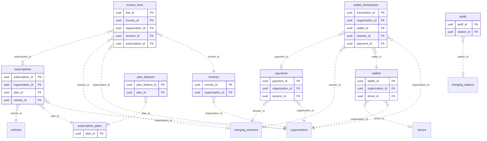

<!-- GENERATED from domain-model.dbml by .claude/skills/domain-model/scripts/domain_model.py - do not edit by hand; edit the .dbml and regenerate. -->

# Billing

[← Overview](../overview.md)

📋 planned: 8 · 🆕 proposed: 1

Money: energy prices, payments, prepaid wallets, e-invoices, and SaaS subscriptions.

- A **tariff** prices energy network-wide or per station, by time of day.
- A **payment** usually settles one charging session; a **wallet** belongs to an organization or one driver (D5).
- An **invoice** belongs to one organization and has **lines** for sessions or subscription periods.
- A **subscription** puts one vehicle on one **plan**.
- Billing a session requires knowing whose session it was.
- **Pricing direction (owner decision, 2026-10-03), tables designed in the billing review:** a catalog of a few dozen features, each with its own list price and pricing unit (per vehicle/month, per organization/month, per user, per message - e.g. SMS). Plans are bundles of features; public plans (GUEST as the free default, STANDARD, ADVANCED, PRO, ...) serve most customers, and a private custom plan can be built for one customer. A customer may also add single features on top of a plan (add-ons). Agreed prices are copied onto the subscription/add-on rows. What an organization can use = its plan's features + active add-ons, intersected with each person's role. Companies buy through our sales team; an individual (a guest's personal organization) buys self-service in the app. Each organization decides, per message service, whether push, SMS and e-mail are used (SMS only if its plan includes it); the fleet portal list is always on.

## Diagram

Only key columns are shown. Solid line = built link, dashed = planned. Tables from other domains (no columns): [charging_sessions](charging_sessions.md#charging_sessions), [charging_stations](charging_stations.md#charging_stations), [drivers](drivers.md#drivers), [organizations](identity.md#organizations), [vehicles](vehicles.md#vehicles).

## Tables

### tariffs

**No. 43** · 📋 planned · owner: **internal** · features: F-C8, F-H1

The price of energy. Who owns tariffs (G3 Energy or G3 Network) is
feature-list item 5.

| Column | Type | Null | Key | References | Meaning | Example |
|---|---|---|---|---|---|---|
| `tariff_id` | uuid | no | PK |  | Internal ID of the tariff. | `f2b9e6c3-1d8a-4f5b-a3c7-9e0d4b1f8a10` |
| `tariff_code` | varchar(50) | no |  |  | Tariff code shown on receipts. | `TOU-2026-Q4` |
| `station_id` | uuid | yes | FK | [charging_stations](charging_stations.md#charging_stations).station_id (on delete restrict) | Station it applies to; NULL for the whole network. | `NULL` |
| `price_per_kwh` | numeric(12,2) | no |  |  | Base energy price per kWh, in the tariff currency. | `4500.00` |
| `currency` | char(3) | no |  |  | ISO 4217 currency code. | `VND` |
| `schedule` | jsonb | yes |  |  | Time-of-day price periods as JSON. | `[{"from": "22:00", "to": "04:00", "price_per_kwh": 3200}]` |
| `valid_from` | timestamptz | no |  |  | When the tariff takes effect. | `2026-10-01T00:00:00Z` |
| `valid_to` | timestamptz | yes |  |  | When it stops applying; NULL if open-ended. | `NULL` |

### payments

**No. 44** · 📋 planned · owner: **customer** · features: F-H1

One payment through a gateway or wallet, usually for one session.

| Column | Type | Null | Key | References | Meaning | Example |
|---|---|---|---|---|---|---|
| `payment_id` | uuid | no | PK |  | Internal ID of the payment. | `3e1c8b5f-9a2d-4e7b-b4f1-6c0a9e3d2b21` |
| `organization_id` | uuid | no | FK | [organizations](identity.md#organizations).organization_id (on delete restrict) | Customer organization that paid. | `3f6c2a1e-8b4d-4e2a-9c1f-0a7d5b2e4c11` |
| `session_id` | uuid | yes | FK | [charging_sessions](charging_sessions.md#charging_sessions).session_id (on delete restrict) | Charging session paid for; NULL for other payments. | `e5a2d8f1-4b7c-4e9a-b3d6-2c1f0e9a8dbb` |
| `amount` | numeric(14,2) | no |  |  | Amount paid. | `866250.00` |
| `currency` | char(3) | no |  |  | ISO 4217 currency code. | `VND` |
| `method` | varchar(20) | no |  |  | Payment method. Values: VNPAY \| MOMO \| WALLET. | `VNPAY` |
| `gateway_reference` | varchar(100) | yes |  |  | Reference/token from the payment gateway (never card data). (NF-05) | `VNP14592873` |
| `status` | varchar(20) | no |  |  | Payment status. | `SUCCEEDED` |
| `paid_at` | timestamptz | yes |  |  | When the gateway confirmed the payment; NULL until then. | `2026-09-15T09:46:12Z` |
| `created_at` | timestamptz | no |  |  | When the row was created (UTC). | `2026-09-15T09:45:00Z` |

**Referenced by**

- [wallet_transactions](#wallet_transactions).payment_id (planned)

### wallets

**No. 45** · 📋 planned · owner: **customer** · features: F-H2

A prepaid balance for a driver or for a whole organization.

| Column | Type | Null | Key | References | Meaning | Example |
|---|---|---|---|---|---|---|
| `wallet_id` | uuid | no | PK |  | Internal ID of the wallet. | `5c3a0e7d-2f9b-4c1e-a8d3-7b6f0c2e9a32` |
| `organization_id` | uuid | no | FK | [organizations](identity.md#organizations).organization_id (on delete restrict) | Customer organization the wallet belongs to. | `3f6c2a1e-8b4d-4e2a-9c1f-0a7d5b2e4c11` |
| `driver_id` | uuid | yes | FK | [drivers](drivers.md#drivers).driver_id (on delete restrict) | Driver it belongs to; NULL for the organization-level wallet. (decision D5) | `NULL` |
| `balance` | numeric(14,2) | no |  |  | Current balance; must equal the sum of its transactions. | `12500000.00` |
| `currency` | char(3) | no |  |  | ISO 4217 currency code. | `VND` |
| `status` | varchar(20) | no |  |  | Whether the wallet can be used. | `ACTIVE` |

**Referenced by**

- [wallet_transactions](#wallet_transactions).wallet_id (planned)

### wallet_transactions

**No. 46** · 📋 planned · owner: **customer** · features: F-H2

Append-only movement of money in or out of a wallet.

| Column | Type | Null | Key | References | Meaning | Example |
|---|---|---|---|---|---|---|
| `transaction_id` | uuid | no | PK |  | Internal ID of the transaction. | `00000010-5a6b-4c7d-8e9f-0a1b2c3d4e5f` |
| `organization_id` | uuid | no | FK | [organizations](identity.md#organizations).organization_id (on delete restrict) | Customer organization of the wallet. | `3f6c2a1e-8b4d-4e2a-9c1f-0a7d5b2e4c11` |
| `wallet_id` | uuid | no | FK | [wallets](#wallets).wallet_id (on delete restrict) | Wallet affected. | `5c3a0e7d-2f9b-4c1e-a8d3-7b6f0c2e9a32` |
| `transaction_type` | varchar(20) | no |  |  | Kind of money movement. Values: TOP_UP \| CHARGE \| WITHDRAW \| REFUND. | `CHARGE` |
| `amount` | numeric(14,2) | no |  |  | Signed amount: positive adds money, negative removes it. | `-866250.00` |
| `balance_after` | numeric(14,2) | no |  |  | Wallet balance right after this transaction. | `11633750.00` |
| `session_id` | uuid | yes | FK | [charging_sessions](charging_sessions.md#charging_sessions).session_id (on delete restrict) | Charging session paid, for CHARGE transactions. | `e5a2d8f1-4b7c-4e9a-b3d6-2c1f0e9a8dbb` |
| `payment_id` | uuid | yes | FK | [payments](#payments).payment_id (on delete restrict) | Gateway payment behind a top-up, if any. | `NULL` |
| `occurred_at` | timestamptz | no |  |  | When the transaction happened. | `2026-09-15T09:46:12Z` |

### invoices

**No. 47** · 📋 planned · owner: **customer** · features: F-H3, F-H4

A legal e-invoice. Once ISSUED it is never edited, only adjusted or cancelled
by a new invoice.

| Column | Type | Null | Key | References | Meaning | Example |
|---|---|---|---|---|---|---|
| `invoice_id` | uuid | no | PK |  | Internal ID of the invoice. | `7e5c2a9f-4b1d-4e3a-9c8f-0d6b1e4a7c43` |
| `organization_id` | uuid | no | FK | [organizations](identity.md#organizations).organization_id (on delete restrict) | Customer organization invoiced. | `3f6c2a1e-8b4d-4e2a-9c1f-0a7d5b2e4c11` |
| `invoice_type` | varchar(20) | no |  |  | Per-session retail invoice or monthly fleet invoice. Values: RETAIL \| FLEET_MONTHLY. | `FLEET_MONTHLY` |
| `period_start` | date | yes |  |  | First day covered; NULL for a single-session invoice. | `2026-09-01` |
| `period_end` | date | yes |  |  | Last day covered; NULL for a single-session invoice. | `2026-09-30` |
| `total_amount` | numeric(14,2) | no |  |  | Invoice total including tax. | `256800000.00` |
| `currency` | char(3) | no |  |  | ISO 4217 currency code. | `VND` |
| `einvoice_number` | varchar(50) | yes |  |  | Number issued by the e-invoice provider; NULL until issued. | `C26TMP0001234` |
| `status` | varchar(20) | no |  |  | Invoice status; ISSUED invoices are never edited. Values: DRAFT \| ISSUED \| ADJUSTED \| CANCELLED. | `ISSUED` |
| `issued_at` | timestamptz | yes |  |  | When the e-invoice was issued; NULL until then. | `2026-10-01T03:00:00Z` |

**Referenced by**

- [invoice_lines](#invoice_lines).invoice_id (planned)

### invoice_lines

**No. 48** · 📋 planned · owner: **customer** · features: F-H3, F-H4

One line of an invoice: a charging session or a subscription period.

| Column | Type | Null | Key | References | Meaning | Example |
|---|---|---|---|---|---|---|
| `line_id` | uuid | no | PK |  | Internal ID of the line. | `00000011-5a6b-4c7d-8e9f-0a1b2c3d4e5f` |
| `invoice_id` | uuid | no | FK | [invoices](#invoices).invoice_id (on delete restrict) | Invoice the line belongs to. | `7e5c2a9f-4b1d-4e3a-9c8f-0d6b1e4a7c43` |
| `organization_id` | uuid | no | FK | [organizations](identity.md#organizations).organization_id (on delete restrict) | Customer organization invoiced. | `3f6c2a1e-8b4d-4e2a-9c1f-0a7d5b2e4c11` |
| `session_id` | uuid | yes | FK | [charging_sessions](charging_sessions.md#charging_sessions).session_id (on delete restrict) | Charging session billed on this line, if any. | `e5a2d8f1-4b7c-4e9a-b3d6-2c1f0e9a8dbb` |
| `subscription_id` | uuid | yes | FK | [subscriptions](#subscriptions).subscription_id (on delete restrict) | Subscription period billed on this line, if any. | `NULL` |
| `description` | varchar(200) | no |  |  | Line text printed on the invoice. | `Sạc điện 192.5 kWh - Trạm sạc G3 Bình Dương - 15/09/2026` |
| `quantity` | numeric(14,3) | no |  |  | Quantity billed (kWh or months). | `192.500` |
| `unit_price` | numeric(12,2) | no |  |  | Price per unit. | `4500.00` |
| `amount` | numeric(14,2) | no |  |  | Line amount: quantity × unit price. | `866250.00` |

### subscription_plans

**No. 49** · 📋 planned · owner: **internal** · features: F-H4

A plan: one row per offer (GUEST as the free default, STANDARD, ADVANCED,
PRO, ..., or a private plan for one customer); its features are in
plan_features. Pricing is per feature (see the billing domain note).

| Column | Type | Null | Key | References | Meaning | Example |
|---|---|---|---|---|---|---|
| `plan_id` | uuid | no | PK |  | Internal ID of the plan. | `0c9a6e3d-8f5b-4c7e-a2d1-4b3f9e6c0a65` |
| `plan_code` | varchar(50) | no | UQ |  | Stable plan code, unique. | `STANDARD` |
| `name` | varchar(100) | no |  |  | Plan name. | `Gói Cơ bản` |
| `price_per_vehicle_month` | numeric(12,2) | no |  |  | Monthly price per vehicle. The price itself is still open (feature-list item 7). | `500000.00` |
| `currency` | char(3) | no |  |  | ISO 4217 currency code. | `VND` |
| `is_default` | boolean | no |  |  | TRUE for the one plan that applies when an organization has no active subscription (the GUEST plan: charging, wallet, receipts, history). Exactly one plan is the default. | `false` |
| `status` | varchar(20) | no |  |  | Whether the plan can be sold. | `ACTIVE` |

**Referenced by**

- [subscriptions](#subscriptions).plan_id (planned)
- [plan_features](#plan_features).plan_id (planned)

### plan_features

**No. 50** · 🆕 proposed · owner: **internal** · features: F-H4

Which features each plan includes. Plans are data, so G3 can create a new
plan (Pro, Max, a private plan for one customer) in the portal without a
developer; only a brand-new feature needs code.

| Column | Type | Null | Key | References | Meaning | Example |
|---|---|---|---|---|---|---|
| `plan_feature_id` | uuid | no | PK |  | Internal ID of the row. | `0000001d-5a6b-4c7d-8e9f-0a1b2c3d4e5f` |
| `plan_id` | uuid | no | FK | [subscription_plans](#subscription_plans).plan_id (on delete restrict) | Plan that includes the feature. | `0c9a6e3d-8f5b-4c7e-a2d1-4b3f9e6c0a65` |
| `feature_code` | varchar(60) | no |  |  | Feature included, from the feature list defined in code (the same list roles are built from). A user can use a feature only if one of their roles AND their plan include it. | `view_adas_events` |
| `created_at` | timestamptz | no |  |  | When the feature was added to the plan. | `2026-09-01T02:00:00Z` |

**Indexes**

- `uq_plan_features_plan_feature` (plan_id, feature_code) unique

### subscriptions

**No. 51** · 📋 planned · owner: **customer** · features: F-H4

One vehicle subscribed to a plan; overdue locks features.

| Column | Type | Null | Key | References | Meaning | Example |
|---|---|---|---|---|---|---|
| `subscription_id` | uuid | no | PK |  | Internal ID of the subscription. | `9a7e4c1b-6d3f-4a5c-b0e8-2f1d7c9b3e54` |
| `organization_id` | uuid | no | FK | [organizations](identity.md#organizations).organization_id (on delete restrict) | Customer organization subscribed. | `3f6c2a1e-8b4d-4e2a-9c1f-0a7d5b2e4c11` |
| `plan_id` | uuid | no | FK | [subscription_plans](#subscription_plans).plan_id (on delete restrict) | Plan subscribed to. | `0c9a6e3d-8f5b-4c7e-a2d1-4b3f9e6c0a65` |
| `vehicle_id` | uuid | no | FK | [vehicles](vehicles.md#vehicles).vehicle_id (on delete restrict) | Vehicle covered. | `7a4c1e9b-3d2f-4b8a-a6c5-1e0d9f8b7a44` |
| `started_at` | timestamptz | no |  |  | When the subscription started. | `2026-09-01T00:00:00Z` |
| `ends_at` | timestamptz | yes |  |  | When it ends; NULL if it renews until cancelled. | `NULL` |
| `status` | varchar(20) | no |  |  | Subscription status; OVERDUE locks paid features. Values: ACTIVE \| OVERDUE \| EXPIRED \| CANCELLED. | `ACTIVE` |

**Referenced by**

- [invoice_lines](#invoice_lines).subscription_id (planned)
