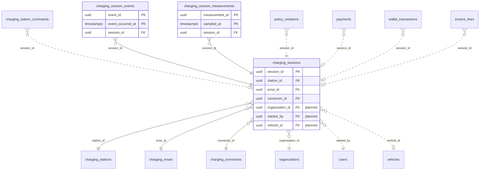

<!-- GENERATED from domain-model.dbml by .claude/skills/domain-model/scripts/domain_model.py - do not edit by hand; edit the .dbml and regenerate. -->

# Charging sessions

[← Overview](../overview.md)

✅ built: 3

What happened during each charge: events, meter readings, energy delivered.

- A **session** takes place on one connector of one charger. It is created when a driver scans the QR code on the charger in our app (CE-10) and records who scanned, which organization pays and, when the driver is checked in to a truck, that truck; the charger's start message then fills in the gun and the transaction (CE-11).
- Built today without that link (only a raw `id_tag`); it arrives with the refactor.
- A session has many **measurements**. Its **events** table is built but dropped by the target design (CE-15).

## Diagram

Only key columns are shown. Solid line = built link, dashed = planned. Tables from other domains (no columns): [charging_connectors](charging_stations.md#charging_connectors), [charging_evses](charging_stations.md#charging_evses), [charging_station_commands](charging_stations.md#charging_station_commands), [charging_stations](charging_stations.md#charging_stations), [invoice_lines](billing.md#invoice_lines), [organizations](identity.md#organizations), [payments](billing.md#payments), [policy_violations](policy.md#policy_violations), [users](identity.md#users), [vehicles](vehicles.md#vehicles), [wallet_transactions](billing.md#wallet_transactions).

## Tables

### charging_sessions

**No. 39** · ✅ built · owner: **two-party** · features: F-B2, F-C5

One charge on one connector of one charger, from the QR scan to the stop
(CE-10). The row is created PENDING when the driver scans the QR code in our
app, with the paying organization, the user and the single-use token we send
in the remote start; the charger's start message carrying that token on the
same charger turns it ACTIVE (CE-11), its stop message COMPLETED; ABANDONED
when the start never came. Live figures (kWh so far, battery %, peak power)
are read from charging_session_measurements; the price and the billed amount
belong to the billing record (PAY-10). No change history and no soft delete:
nobody edits a session.
Check constraints (CE-10): status NOT IN ('ACTIVE', 'COMPLETED') OR
(ocpp_transaction_id IS NOT NULL AND evse_id IS NOT NULL AND connector_id IS
NOT NULL AND started_at IS NOT NULL AND meter_start_wh IS NOT NULL);
status <> 'COMPLETED' OR ended_at IS NOT NULL; status NOT IN ('PENDING',
'ABANDONED') OR ocpp_transaction_id IS NULL.

| Column | Type | Null | Key | References | Meaning | Example |
|---|---|---|---|---|---|---|
| `session_id` | uuid | no | PK |  | Internal ID of the charging session. | `e5a2d8f1-4b7c-4e9a-b3d6-2c1f0e9a8dbb` |
| `station_id` | uuid | no | FK | [charging_stations](charging_stations.md#charging_stations).station_id (on delete restrict) | The charger (charging station) where the session happens, known from the QR code at the scan. | `4b9d6f3a-2e8c-4a1b-9d5e-7f0c3a8b2d88` |
| `evse_id` | uuid | no | FK | [charging_evses](charging_stations.md#charging_evses).evse_id (on delete restrict) | EVSE used, set from the charger's start message. Planned (CE-10): nullable, NULL while PENDING and for an ABANDONED session, because the driver picks the gun on the charger's screen after the scan (CO-14). | `1e7a4c9f-6b3d-4e2a-8c5f-9d0b2e7a4c99` |
| `connector_id` | uuid | no | FK | [charging_connectors](charging_stations.md#charging_connectors).connector_id (on delete restrict) | Connector (gun) used, set from the charger's start message. Planned (CE-10): nullable, NULL while PENDING and for an ABANDONED session. | `0f3c8e5b-7d1a-4b9c-a2e6-4f8d1c0b3eaa` |
| `organization_id` | uuid | no | FK | [organizations](identity.md#organizations).organization_id (on delete restrict) | **📋 planned (CE-10)**: Organization that pays: the one the scanning user acted for, written once at the scan and never changed (DM-24 case C). Which wallet inside it pays is open decision D5. | `3f6c2a1e-8b4d-4e2a-9c1f-0a7d5b2e4c11` |
| `started_by` | uuid | no | FK | [users](identity.md#users).user_id (on delete restrict) | **📋 planned (CE-10)**: User who scanned the QR code in our app; every charge starts this way (CO-13). A start with a token we did not issue is refused and gets no row (CE-11). | `9b2e7d4a-1c3f-4a8e-b6d2-5e0f1a9c3d22` |
| `vehicle_id` | uuid | yes | FK | [vehicles](vehicles.md#vehicles).vehicle_id (on delete restrict) | **📋 planned (CE-13)**: Truck being charged, taken at the scan from the scanning driver's open driving session (CHG-07); NULL when there is none (a guest truck we have no record of, or a driver who has not checked in). A VIN or MAC address reported by the charger may fill it later (deferred.md 90). | `7a4c1e9b-3d2f-4b8a-a6c5-1e0d9f8b7a44` |
| `ocpp_transaction_id` | varchar(255) | no |  |  | The charger's transaction ID, unique per charger: an OCPP 2.0.1 charger chooses its own (a string of up to 36 characters); for 1.6J it is our sequence number as text (CE-03). Planned (CE-10): varchar(36) and nullable, NULL while PENDING and for an ABANDONED session. | `1042` |
| `status` | chargingsessionstatus | no |  |  | Lifecycle of the session; observed, so no status_reason (DM-19). PENDING: the scan was accepted, waiting for the charger. ACTIVE: transaction running. COMPLETED: stopped by the charger. ABANDONED: the remote start was refused or timed out, or no transaction followed within the configured window. Planned (CE-10): upper-case values; PENDING and ABANDONED are new. | `COMPLETED` |
| `started_at` | timestamptz | no |  |  | The charger's time of the start. Planned (CE-10): nullable, NULL while PENDING and for an ABANDONED session; the scan time is created_at. | `2026-09-15T08:30:00Z` |
| `ended_at` | timestamptz | yes |  |  | The charger's time of the stop; NULL until COMPLETED. | `2026-09-15T09:45:00Z` |
| `meter_start_wh` | numeric(24,3) | yes |  |  | Meter reading the charger declares at the start, in Wh; NULL while PENDING. | `1520340.000` |
| `meter_end_wh` | numeric(24,3) | yes |  |  | **🗑️ to be removed (CE-12)**: Latest accepted meter reading, in Wh; a copy of the newest energy row in charging_session_measurements, read there instead. | `1712840.000` |
| `meter_end_sampled_at` | timestamptz | yes |  |  | **🗑️ to be removed (CE-12)**: When meter_end_wh was measured; the newest measurement's sampled_at. | `2026-09-15T09:44:30Z` |
| `energy_delivered_wh` | numeric(24,3) | yes |  |  | **🗑️ to be removed (CE-12)**: Derived: meter_stop_wh minus meter_start_wh, computed at read time; the billed kWh is frozen on the billing record (PAY-10). | `192500.000` |
| `id_token` | varchar(20) | yes |  |  | **✏️ built today as `id_tag`, to be renamed**: Identifier the charger reports for the transaction. For a QR start, the single-use token we generate at the scan and send in the remote start (at most 20 characters, the OCPP 1.6J idTag limit); the charger echoes it in its start message, which is how that message finds this row (CE-11). Later also a card number or an Autocharge ID (CHG-08); never copy it into application logs (IS-07). Planned (CE-10): varchar(255) (the OCPP 2.1 width) and required. | `G3K7Q2M9X4T1` |
| `stop_reason` | varchar(30) | yes |  |  | The charger's stop reason, as sent (1.6J reason, 2.0.1 stoppedReason); NULL unless COMPLETED. Why a session was ABANDONED is not stored here: it belongs to the record of the remote-start command we sent (CS-18). | `EVDisconnected` |
| `meter_stop_wh` | numeric(24,3) | yes |  |  | Meter reading the charger declares in its stop message, in Wh: the billing figure (CE-12), always stored as sent (CE-03). NULL until COMPLETED, or when the stop message carries none; billing then falls back to the newest measurement. | `1712860.000` |
| `created_at` | timestamptz | no |  |  | When the row was created (UTC): the scan time for a QR start. | `2026-09-15T08:29:10Z` |
| `updated_at` | timestamptz | no |  |  | When the row was last changed (UTC); moves at each step of the session. | `2026-09-15T09:45:00Z` |

**Enum values**

- `chargingsessionstatus`: ~~active~~ (to be removed), ~~completed~~ (to be removed), PENDING (📋 planned), ACTIVE (📋 planned), COMPLETED (📋 planned), ABANDONED (📋 planned)

**Indexes**

- `ix_charging_sessions_ended_at` (ended_at)
- `ix_charging_sessions_status_updated` (status, updated_at)
- `ix_charging_sessions_station_status` (station_id, status)
- `ix_charging_sessions_evse_status` (evse_id, status)
- `ix_charging_sessions_connector_status` (connector_id, status)
- `ix_charging_sessions_started_at` (started_at)
- `uq_charging_sessions_station_transaction` (station_id, ocpp_transaction_id) unique - Planned (CE-10): partial, WHERE ocpp_transaction_id IS NOT NULL
- `ix_charging_sessions_pending_token` (station_id, id_token) - Planned (CE-11): WHERE status = 'PENDING'; matches a start message to its scan
- `ix_charging_sessions_organization_started` (organization_id, started_at) - Planned (CE-10): a customer's charging history (CHG-04)
- `ix_charging_sessions_vehicle_id` (vehicle_id) - Planned (CE-13)

**Referenced by**

- [charging_station_commands](charging_stations.md#charging_station_commands).session_id (planned)
- [charging_session_events](#charging_session_events).session_id
- [charging_session_measurements](#charging_session_measurements).session_id
- [policy_violations](policy.md#policy_violations).session_id (planned)
- [payments](billing.md#payments).session_id (planned)
- [wallet_transactions](billing.md#wallet_transactions).session_id (planned)
- [invoice_lines](billing.md#invoice_lines).session_id (planned)

### charging_session_events

**No. 40** · ✅ built · owner: **two-party** · features: F-B2 · hypertable on `event_occurred_at` · **🗑️ to be removed (CE-15)**

Each Started / Updated / Ended event of a session. Dropped by the target
design (CE-15): for OCPP 1.6J it copies the session's start and end, the raw
OCPP log keeps every frame for audit, and no feature reads a session
timeline. OCPP 2.0.1 duplicate handling (seqNo) and charging-state periods
are designed when 2.0.1 support is built (deferred.md 78).

| Column | Type | Null | Key | References | Meaning | Example |
|---|---|---|---|---|---|---|
| `event_id` | uuid | no | PK |  | Internal ID of the event. | `0000000a-5a6b-4c7d-8e9f-0a1b2c3d4e5f` |
| `event_occurred_at` | timestamptz | no | PK |  | When the event happened; hypertable time column. | `2026-09-15T08:30:00Z` |
| `session_id` | uuid | no | FK | [charging_sessions](#charging_sessions).session_id (on delete restrict) | Session the event belongs to. | `e5a2d8f1-4b7c-4e9a-b3d6-2c1f0e9a8dbb` |
| `event_type` | chargingsessioneventtype | no |  |  | Lifecycle step the event represents. | `Started` |
| `seq_no` | integer | yes |  |  | OCPP 2.0.1 only (CO-15): the per-transaction sequence number of TransactionEvent; NULL for 1.6J, which has none. | `0` |

**Enum values**

- `chargingsessioneventtype`: Started, Updated, Ended

**Indexes**

- `ix_charging_session_events_session_time` (session_id, event_occurred_at, event_id)

### charging_session_measurements

**No. 41** · ✅ built · owner: **two-party** · features: F-B2 · hypertable on `sampled_at`

Every reading a charger reports during a session (energy, power, current,
voltage, SoC, temperature ...), append-only. The gateway stores each known
measurand in one fixed unit and fills the OCPP defaults for a missing
context or location, so readers never convert units or guess defaults
(CE-14). No change history and no soft delete.

| Column | Type | Null | Key | References | Meaning | Example |
|---|---|---|---|---|---|---|
| `measurement_id` | uuid | no | PK |  | Internal ID of the measurement. | `0000000b-5a6b-4c7d-8e9f-0a1b2c3d4e5f` |
| `sampled_at` | timestamptz | no | PK |  | The charger's time of the reading; hypertable time column. | `2026-09-15T08:45:00Z` |
| `session_id` | uuid | no | FK | [charging_sessions](#charging_sessions).session_id (on delete restrict) | Session the measurement belongs to. Readings sent outside a session (clock-aligned samples) are kept only in the raw OCPP log (CE-06, deferred.md 77). | `e5a2d8f1-4b7c-4e9a-b3d6-2c1f0e9a8dbb` |
| `measurand` | varchar(60) | no |  |  | What was measured, by its OCPP name (Energy.Active.Import.Register, Power.Active.Import, Current.Import, Voltage, SoC, Temperature); a vendor-specific name is stored as sent. | `Energy.Active.Import.Register` |
| `value` | numeric(24,6) | no |  |  | The reading. Energy is stored in Wh today. Planned (CE-14): every known measurand is converted by the gateway to one fixed unit when written: energy Wh (reactive varh), power W (reactive var, apparent VA), current A, voltage V, temperature Celsius, SoC and other percentages Percent; kilo-units are multiplied by 1000, Fahrenheit and K become Celsius. A vendor measurand is stored as sent. | `1568340.000000` |
| `unit` | varchar(20) | yes |  |  | Unit of value, in OCPP spelling. Planned (CE-14): always the fixed unit of a known measurand; as sent, or NULL, for a vendor one. | `Wh` |
| `context` | varchar(30) | yes |  |  | Why the charger sent the reading: Sample.Periodic, Transaction.Begin, Transaction.End, Sample.Clock, Trigger, Interruption.Begin, Interruption.End, Other. Planned (CE-14): required; the OCPP default Sample.Periodic is stored when the charger omits it. | `Sample.Periodic` |
| `phase` | varchar(10) | yes |  |  | Electrical phase the value refers to (L1, L2, L3 ...); NULL for DC, which is every charger we have. | `NULL` |
| `measurement_location` | varchar(20) | yes |  |  | **✏️ built today as `location`, to be renamed**: Where on the charging path the value was measured (OCPP calls it location): Outlet (the charger's output toward the truck: live progress and the billing fallback), Inlet (its input from the grid: losses and our electricity cost), Cable, EV (reported by the truck, e.g. SoC), Body (inside the charger cabinet). Every location is stored; features read Outlet, and EV for SoC, for now (CE-14). Renamed because location reads as a place (charging_locations). Planned (CE-14): required; the OCPP default Outlet is stored when the charger omits it. | `Outlet` |

**Indexes**

- `ix_charging_measurements_session_measurand_time` (session_id, measurand, sampled_at)
