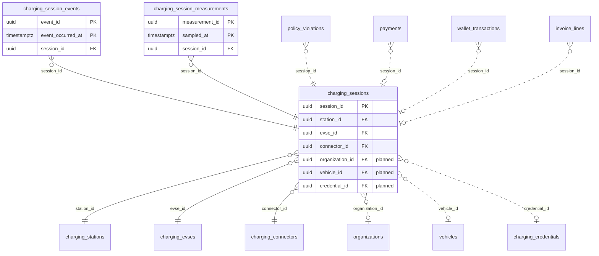

<!-- GENERATED from domain-model.dbml by .claude/skills/domain-model/scripts/domain_model.py - do not edit by hand; edit the .dbml and regenerate. -->

# Charging sessions

[← Overview](../overview.md)

✅ built: 3

What happened during each charge: events, meter readings, energy delivered.

- A **session** takes place on one connector of one G3 station.
- **Gap today:** a session is not linked to any vehicle, driver, or customer, only a raw `id_tag`. The planned `credential_id` → `organization_id` link closes this (QR start now: the session records who started it and which organization pays), and is what billing (F-H1/F-H3) and reconciliation (NF-10) need.
- A session has many **events** and many **measurements**.

## Diagram

Only key columns are shown. Solid line = built link, dashed = planned. Tables from other domains (no columns): [charging_connectors](charging_stations.md#charging_connectors), [charging_credentials](drivers.md#charging_credentials), [charging_evses](charging_stations.md#charging_evses), [charging_stations](charging_stations.md#charging_stations), [invoice_lines](billing.md#invoice_lines), [organizations](identity.md#organizations), [payments](billing.md#payments), [policy_violations](policy.md#policy_violations), [vehicles](vehicles.md#vehicles), [wallet_transactions](billing.md#wallet_transactions).

## Tables

### charging_sessions

**No. 35** · ✅ built · owner: **two-party** · features: F-B2, F-C5

One charge on one connector, from start to stop.

| Column | Type | Null | Key | References | Meaning | Example |
|---|---|---|---|---|---|---|
| `session_id` | uuid | no | PK |  | Internal ID of the charging session. | `e5a2d8f1-4b7c-4e9a-b3d6-2c1f0e9a8dbb` |
| `station_id` | uuid | no | FK | [charging_stations](charging_stations.md#charging_stations).station_id (on delete restrict) | Station where the session happens. | `4b9d6f3a-2e8c-4a1b-9d5e-7f0c3a8b2d88` |
| `evse_id` | uuid | no | FK | [charging_evses](charging_stations.md#charging_evses).evse_id (on delete restrict) | EVSE used. | `1e7a4c9f-6b3d-4e2a-8c5f-9d0b2e7a4c99` |
| `connector_id` | uuid | no | FK | [charging_connectors](charging_stations.md#charging_connectors).connector_id (on delete restrict) | Connector (gun) used. | `0f3c8e5b-7d1a-4b9c-a2e6-4f8d1c0b3eaa` |
| `organization_id` | uuid | yes | FK | [organizations](identity.md#organizations).organization_id (on delete restrict) | **📋 planned (D5)**: Customer organization charged for the session. | `3f6c2a1e-8b4d-4e2a-9c1f-0a7d5b2e4c11` |
| `vehicle_id` | uuid | yes | FK | [vehicles](vehicles.md#vehicles).vehicle_id (on delete restrict) | **📋 planned**: Vehicle that was charged. | `7a4c1e9b-3d2f-4b8a-a6c5-1e0d9f8b7a44` |
| `credential_id` | uuid | yes | FK | [charging_credentials](drivers.md#charging_credentials).credential_id (on delete restrict) | **📋 planned**: Credential that started the session, resolved from id_tag. | `d4f1b7e2-8c5a-4d3f-9e1b-6a0c7d2f5ecc` |
| `ocpp_transaction_id` | varchar(255) | no |  |  | Transaction ID used with the charger, unique per station. | `1042` |
| `status` | chargingsessionstatus | no |  |  | Whether the session is still running. | `completed` |
| `started_at` | timestamptz | no |  |  | When charging started. | `2026-09-15T08:30:00Z` |
| `ended_at` | timestamptz | yes |  |  | When charging ended; NULL while active. | `2026-09-15T09:45:00Z` |
| `meter_start_wh` | numeric(24,3) | yes |  |  | Charger energy meter at the start, in Wh. | `1520340.000` |
| `meter_end_wh` | numeric(24,3) | yes |  |  | Latest accepted meter reading, in Wh (never moves backwards in time). | `1712840.000` |
| `meter_end_sampled_at` | timestamptz | yes |  |  | When meter_end_wh was measured. | `2026-09-15T09:44:30Z` |
| `energy_delivered_wh` | numeric(24,3) | yes |  |  | Energy delivered: end reading minus start reading, in Wh. | `192500.000` |
| `id_tag` | varchar(20) | yes |  |  | Raw identifier (RFID/token) that started the session, as sent; not validated yet. | `04A1B2C3D4E5F6` |
| `stop_reason` | varchar(30) | yes |  |  | Why the session stopped, as the charger reported it. | `EVDisconnected` |
| `meter_stop_wh` | numeric(24,3) | yes |  |  | The charger's own closing meter reading, in Wh. | `1712860.000` |
| `created_at` | timestamptz | no |  |  | When the row was created (UTC). | `2026-09-15T08:30:00Z` |
| `updated_at` | timestamptz | no |  |  | When the row was last changed (UTC). | `2026-09-15T09:45:00Z` |

**Enum values**

- `chargingsessionstatus`: active, completed

**Indexes**

- `ix_charging_sessions_ended_at` (ended_at)
- `ix_charging_sessions_status_updated` (status, updated_at)
- `ix_charging_sessions_station_status` (station_id, status)
- `ix_charging_sessions_evse_status` (evse_id, status)
- `ix_charging_sessions_connector_status` (connector_id, status)
- `ix_charging_sessions_started_at` (started_at)
- `uq_charging_sessions_station_transaction` (station_id, ocpp_transaction_id) unique

**Referenced by**

- [charging_session_events](#charging_session_events).session_id
- [charging_session_measurements](#charging_session_measurements).session_id
- [policy_violations](policy.md#policy_violations).session_id (planned)
- [payments](billing.md#payments).session_id (planned)
- [wallet_transactions](billing.md#wallet_transactions).session_id (planned)
- [invoice_lines](billing.md#invoice_lines).session_id (planned)

### charging_session_events

**No. 36** · ✅ built · owner: **two-party** · features: F-B2 · hypertable on `event_occurred_at`

Each Started / Updated / Ended event of a session.

| Column | Type | Null | Key | References | Meaning | Example |
|---|---|---|---|---|---|---|
| `event_id` | uuid | no | PK |  | Internal ID of the event. | `0000000a-5a6b-4c7d-8e9f-0a1b2c3d4e5f` |
| `event_occurred_at` | timestamptz | no | PK |  | When the event happened; hypertable time column. | `2026-09-15T08:30:00Z` |
| `session_id` | uuid | no | FK | [charging_sessions](#charging_sessions).session_id (on delete restrict) | Session the event belongs to. | `e5a2d8f1-4b7c-4e9a-b3d6-2c1f0e9a8dbb` |
| `event_type` | chargingsessioneventtype | no |  |  | Lifecycle step the event represents. | `Started` |
| `seq_no` | integer | yes |  |  | OCPP's per-transaction sequence number; NULL if not sent. | `0` |

**Enum values**

- `chargingsessioneventtype`: Started, Updated, Ended

**Indexes**

- `ix_charging_session_events_session_time` (session_id, event_occurred_at, event_id)

### charging_session_measurements

**No. 37** · ✅ built · owner: **two-party** · features: F-B2 · hypertable on `sampled_at`

Every meter value a charger reports during a session (energy, power, SoC ...).

| Column | Type | Null | Key | References | Meaning | Example |
|---|---|---|---|---|---|---|
| `measurement_id` | uuid | no | PK |  | Internal ID of the measurement. | `0000000b-5a6b-4c7d-8e9f-0a1b2c3d4e5f` |
| `sampled_at` | timestamptz | no | PK |  | When the value was measured; hypertable time column. | `2026-09-15T08:45:00Z` |
| `session_id` | uuid | no | FK | [charging_sessions](#charging_sessions).session_id (on delete restrict) | Session the measurement belongs to. | `e5a2d8f1-4b7c-4e9a-b3d6-2c1f0e9a8dbb` |
| `measurand` | varchar(60) | no |  |  | What was measured, as the OCPP measurand name. | `Energy.Active.Import.Register` |
| `value` | numeric(24,6) | no |  |  | Measured value; energy is always stored in Wh, other measurands in unit. | `1568340.000000` |
| `unit` | varchar(20) | yes |  |  | Unit of value. | `Wh` |
| `context` | varchar(30) | yes |  |  | Why the charger sent the reading. | `Sample.Periodic` |
| `phase` | varchar(10) | yes |  |  | Electrical phase the value refers to; NULL for DC. | `NULL` |
| `location` | varchar(20) | yes |  |  | Where it was measured. | `Outlet` |

**Indexes**

- `ix_charging_measurements_session_measurand_time` (session_id, measurand, sampled_at)
