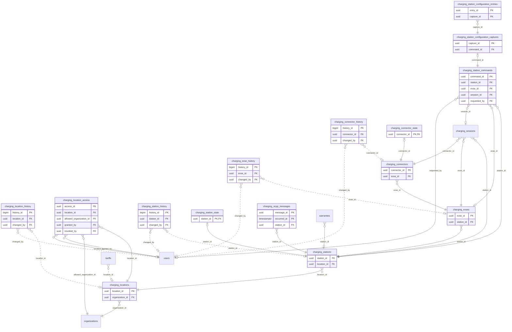

<!-- GENERATED from domain-model.dbml by .claude/skills/domain-model/scripts/domain_model.py - do not edit by hand; edit the .dbml and regenerate. -->

# Charging stations

[← Overview](../overview.md)

✅ built: 15

The charging network and the OCPP link to each charger (terms: CS-09).

- A **location** (trạm) is one place drivers go, owned by one organization; it is public or private, and a private one lists the other organizations allowed to charge there (CS-10).
- A location has one or more **charging stations** (trụ: one charger, one OCPP connection); each has one or more **EVSEs**, and each EVSE one or more **connectors** (súng).
- Every OCPP frame and every configuration snapshot is kept against its charger.
- Every **command** we send to a charger is kept with its answer; a remote start or stop points to its session (CS-20).

## Diagram

Only key columns are shown. Solid line = built link, dashed = planned. Tables from other domains (no columns): [charging_sessions](charging_sessions.md#charging_sessions), [organizations](identity.md#organizations), [tariffs](billing.md#tariffs), [users](identity.md#users), [warranties](warranties.md#warranties).

## Tables

### charging_locations

**No. 28** · ✅ built · owner: **customer** · features: F-C1, F-D1

One place drivers go to charge: several chargers in a row (CS-09; OCPI
Location; "trạm sạc" in the app). Owned by one organization (CS-10). Always
open 24/7: no opening hours are stored, and a closed location is INACTIVE
with a reason (CS-11). A larger area of one organization holding several
locations (a site) has no table yet (deferred.md 91).
Check constraint: deleted_at IS NULL OR status = 'INACTIVE' (DM-25).

🔍 = tracked column: a change to it copies the whole old row into [charging_location_history](#charging_location_history).

| Column | Type | Null | Key | References | Meaning | Example |
|---|---|---|---|---|---|---|
| `location_id` | uuid | no | PK |  | Internal ID of the location. | `2c7e5a90-6d1b-4f3a-8e2c-9b0d4a6f1c55` |
| `organization_id` | uuid | no | FK 🔍 | [organizations](identity.md#organizations).organization_id (on delete restrict) | Organization that owns the location (CS-10): G3's internal organization for its own network, a customer for its own chargers. Its chargers run on our gateway either way, so everything there goes through our system. Charger fault and offline alerts go to the users holding the OPERATIONS role in this organization (CS-11). | `3f6c2a1e-8b4d-4e2a-9c1f-0a7d5b2e4c11` |
| `display_name` | varchar(200) | no | 🔍 |  | Name shown to drivers and in the portal. Not unique: the portal warns when the same owner already has a location with this name (CS-12). | `Trạm sạc G3 Bình Dương` |
| `address` | varchar(500) | no | 🔍 |  | Address as one free-text line (number, road or km marker, ward, province), shown in the app. The province, when a filter or report needs it, is derived by a tool from the coordinates or this text, not stored (CS-11). | `Km 1872+500 QL1A, xã Tân Lập, tỉnh Đồng Nai` |
| `coordinates` | geography(POINT,4326) | no | 🔍 |  | GPS position of the map pin (WGS84 point, longitude first); required, so a location is entered only once its position is known (CS-12). Named after OCPI's Location.coordinates. | `POINT(106.6519 10.9804)` |
| `is_public` | boolean | no | 🔍 |  | TRUE: anyone may charge here and it is on the public map. FALSE (private): only members of the owner and of the organizations allowed in charging_location_access may charge, and it is shown only to them (CS-10, STN-12; OCPI publish). | `true` |
| `status` | varchar(20) | no | 🔍 |  | Set by a person (DM-25). ACTIVE: open; locations are always open 24/7, so there are no opening hours (CS-11). INACTIVE: closed, e.g. repairs, flooding or a holiday; the reason says which. A location that leaves the system is INACTIVE and soft-deleted. Values: ACTIVE \| INACTIVE. | `ACTIVE` |
| `status_reason` | varchar(200) | yes | 🔍 |  | Why the location has its current status, or why it left the system; NULL when ACTIVE. | `Ngập nước sau bão, tạm đóng` |
| `created_at` | timestamptz | no | 🔍 |  | When the row was created (UTC). | `2026-09-01T02:00:00Z` |
| `updated_at` | timestamptz | no | 🔍 |  | When the row was last changed (UTC). | `2026-09-10T07:15:00Z` |
| `deleted_at` | timestamptz | yes | 🔍 |  | Soft-delete time: the location is no longer part of the system, because it left or was entered by mistake (DM-25); all its data is kept, and the reason is in status_reason. NULL while it is part of the system. | `NULL` |

**Indexes**

- `ix_charging_locations_coordinates` (coordinates) - GIST; radius search (STN-06). Replaces ix_charging_stations_location
- `ix_charging_locations_organization_id` (organization_id)

**Referenced by**

- [charging_location_access](#charging_location_access).location_id
- [charging_stations](#charging_stations).location_id
- [tariffs](billing.md#tariffs).location_id (planned)
- [charging_location_history](#charging_location_history).location_id (planned)

### charging_location_history

**No. 28.h** · ✅ built · owner: **customer** · features: F-C1, F-D1 · change history of [charging_locations](#charging_locations)

Every earlier version of a row of `charging_locations`: a copy of the whole row, taken just before a change and written by a database trigger in the same transaction. Generated by the domain-model tool from `@tracked *`; never written by hand.

| Column | Type | Null | Key | References | Meaning | Example |
|---|---|---|---|---|---|---|
| `history_id` | bigint | no | PK |  | Auto-increasing ID of the history row. | `1024` |
| `location_id` | uuid | yes | FK | [charging_locations](#charging_locations).location_id (on delete restrict) | Value before the change (charging_locations.location_id). | `2c7e5a90-6d1b-4f3a-8e2c-9b0d4a6f1c55` |
| `organization_id` | uuid | yes |  |  | Value before the change (charging_locations.organization_id). | `3f6c2a1e-8b4d-4e2a-9c1f-0a7d5b2e4c11` |
| `display_name` | varchar(200) | yes |  |  | Value before the change (charging_locations.display_name). | `Trạm sạc G3 Bình Dương` |
| `address` | varchar(500) | yes |  |  | Value before the change (charging_locations.address). | `Km 1872+500 QL1A, xã Tân Lập, tỉnh Đồng Nai` |
| `coordinates` | geography(POINT,4326) | yes |  |  | Value before the change (charging_locations.coordinates). | `POINT(106.6519 10.9804)` |
| `is_public` | boolean | yes |  |  | Value before the change (charging_locations.is_public). | `true` |
| `status` | varchar(20) | yes |  |  | Value before the change (charging_locations.status). | `ACTIVE` |
| `status_reason` | varchar(200) | yes |  |  | Value before the change (charging_locations.status_reason). | `Ngập nước sau bão, tạm đóng` |
| `created_at` | timestamptz | yes |  |  | Value before the change (charging_locations.created_at). | `2026-09-01T02:00:00Z` |
| `updated_at` | timestamptz | yes |  |  | Value before the change (charging_locations.updated_at). | `2026-09-10T07:15:00Z` |
| `deleted_at` | timestamptz | yes |  |  | Value before the change (charging_locations.deleted_at). | `NULL` |
| `changed_at` | timestamptz | no |  |  | When this version of the row was replaced. | `2026-09-10T07:15:00Z` |
| `changed_by` | uuid | yes | FK | [users](identity.md#users).user_id (on delete restrict) | User who made the change; NULL when the system made it. | `9b2e7d4a-1c3f-4a8e-b6d2-5e0f1a9c3d22` |
| `change_reason` | varchar(200) | no |  |  | Why the row was changed, set by the application for the transaction: typed by the person for an administrative decision, a fixed text for a routine action. When the application sets none, the trigger records 'Unspecified change' (DM-29). | `Customer moved to a new office` |

**Indexes**

- `ix_charging_location_history_location_id_time` (location_id, changed_at)

### charging_location_access

**No. 29** · ✅ built · owner: **customer** · features: F-C1

Which other organizations may charge at a private location (CS-10, STN-12):
every member of an allowed organization may charge there; per-driver lists
are not modelled for now. Granted and revoked by the location's owner. Rows
are only ever closed, so there is no change history (DM-20). Who may charge
at a private location: members of its owner plus members of every
organization with a live row here whose valid_until has not passed. A grant
to the owner itself is refused by the service. Grants stay when the location
turns public (they have no effect then) and apply again if it turns private
(CS-13).

| Column | Type | Null | Key | References | Meaning | Example |
|---|---|---|---|---|---|---|
| `access_id` | uuid | no | PK |  | Internal ID of the grant. | `0000002a-5a6b-4c7d-8e9f-0a1b2c3d4e5f` |
| `location_id` | uuid | no | FK | [charging_locations](#charging_locations).location_id (on delete restrict) | The private location. | `2c7e5a90-6d1b-4f3a-8e2c-9b0d4a6f1c55` |
| `allowed_organization_id` | uuid | no | FK | [organizations](identity.md#organizations).organization_id (on delete restrict) | Organization whose members may charge at the location (organization level, not per driver, for now). Named apart from organization_id: it is the grantee, not the owner. | `7c1d9e4b-2a6f-4b8c-9d3e-5f0a1b2c3d44` |
| `granted_at` | timestamptz | no |  |  | When the access was granted. | `2026-10-06T02:00:00Z` |
| `granted_by` | uuid | no | FK | [users](identity.md#users).user_id (on delete restrict) | User of the owning organization (or G3 staff) who granted it. | `9b2e7d4a-1c3f-4a8e-b6d2-5e0f1a9c3d22` |
| `valid_until` | date | yes |  |  | Last day the access is valid, inclusive, in Vietnam time, when a partner contract fixes it in advance (DM-23); NULL for no end date. After that day the system closes the row (revoked_at set, revoked_by NULL, revoke_reason "expired"), so a new grant to the same organization is possible (CS-13). | `2026-12-31` |
| `revoked_at` | timestamptz | yes |  |  | When the access ended (revoked by a person, or closed by the system after valid_until or when the location left the system); NULL while in force. | `NULL` |
| `revoked_by` | uuid | yes | FK | [users](identity.md#users).user_id (on delete restrict) | Who revoked it; NULL while in force, or when the system ended it. | `NULL` |
| `revoke_reason` | varchar(200) | yes |  |  | Why the access ended; NULL while in force. Named after how the row ends, because the table has no status column (DM-28). | `Hết hợp đồng hợp tác` |

**Indexes**

- `uq_charging_location_access_live` (location_id, allowed_organization_id) unique - WHERE revoked_at IS NULL: one live grant per location and organization
- `ix_charging_location_access_allowed_organization_id` (allowed_organization_id) - Where may this organization charge?

### charging_stations

**No. 30** · ✅ built · owner: **customer** · features: F-C1, F-C2, F-D1, F-G2 · live state in [charging_station_state](#charging_station_state)

One charger (trụ sạc): one OCPP connection, OCPP 2.0.1's "Charging Station"
and 1.6J's "Charge Point" (CS-09). It stands at one location and reads its
owner through it (CS-10). Profile only: what the charger reports (boot
information, liveness, whole-charger status) moves to charging_station_state
(DM-16, DM-17), which also ends the interim "SET updated_at = updated_at"
writes (CS-06).
Check constraint: deleted_at IS NULL OR status = 'INACTIVE' (DM-25).

🔍 = tracked column: a change to it copies the whole old row into [charging_station_history](#charging_station_history).

| Column | Type | Null | Key | References | Meaning | Example |
|---|---|---|---|---|---|---|
| `station_id` | uuid | no | PK |  | Internal ID of the charging station: one charger (trụ sạc), one OCPP connection (CS-09). | `4b9d6f3a-2e8c-4a1b-9d5e-7f0c3a8b2d88` |
| `location_id` | uuid | no | FK 🔍 | [charging_locations](#charging_locations).location_id (on delete restrict) | The location (trạm) the charger stands at; the charger reads its owner through it (DM-24). | `2c7e5a90-6d1b-4f3a-8e2c-9b0d4a6f1c55` |
| `ocpp_identity` | varchar(255) | no | UQ 🔍 |  | Name the charger uses in its OCPP WebSocket URL ("Charger ID" on the Willdigits screen), unique and never reused. | `WD-HCM-001` |
| `registered_serial_number` | varchar(100) | no | 🔍 |  | Serial number read from the charger's nameplate and entered at installation: the asset's identity for warranty (WAR-01), insurance and vendor support. Unique among chargers not deleted. The serial the charger reports at boot is kept apart in charging_station_state.serial_number; a mismatch is logged as a warning (a swapped controller board or a misconfigured charger). | `WD2409001234` |
| `physical_reference` | varchar(16) | yes | 🔍 |  | Short label printed on the unit and shown to drivers, e.g. "Trụ 1"; NULL until labelled (OCPI physical_reference). | `Trụ 1` |
| `max_power_kw` | numeric(6,2) | yes | 🔍 |  | Total output of the charger in kW, shared by its guns (a 240 kW dual-gun unit gives about 120 kW per gun when both are in use); NULL if unknown. Per-gun power and the connector standard go on the connectors (deferred.md 80). | `240.00` |
| `status` | varchar(20) | no | 🔍 |  | Set by a person (DM-25). ACTIVE: in service. INACTIVE: out of service, e.g. under repair; the reason says which. A charger that leaves the system is INACTIVE and soft-deleted. Whether it is online is computed from charging_station_state.last_seen_at. Values: ACTIVE \| INACTIVE. | `ACTIVE` |
| `status_reason` | varchar(200) | yes | 🔍 |  | Why the charger has its current status; NULL when ACTIVE. | `Hỏng mô-đun công suất, chờ linh kiện` |
| `created_at` | timestamptz | no | 🔍 |  | When the row was created (UTC). | `2026-09-01T02:00:00Z` |
| `updated_at` | timestamptz | no | 🔍 |  | When a person last edited the row (UTC); device reports go to charging_station_state and never change it. | `2026-09-10T07:15:00Z` |
| `deleted_at` | timestamptz | yes | 🔍 |  | Soft-delete time: the charger is no longer part of the system, because it was removed or entered by mistake (DM-25); all its data is kept, and the reason is in status_reason. NULL while it is part of the system. | `NULL` |

**Indexes**

- `ix_charging_stations_deleted_at` (deleted_at)
- `ix_charging_stations_location_id` (location_id)
- `uq_charging_stations_live_registered_serial_number` (registered_serial_number) unique - WHERE deleted_at IS NULL

**Referenced by**

- [warranties](warranties.md#warranties).station_id
- [charging_station_state](#charging_station_state).station_id
- [charging_evses](#charging_evses).station_id
- [charging_ocpp_messages](#charging_ocpp_messages).station_id
- [charging_station_commands](#charging_station_commands).station_id
- [charging_sessions](charging_sessions.md#charging_sessions).station_id
- [charging_station_history](#charging_station_history).station_id (planned)

### charging_station_history

**No. 30.h** · ✅ built · owner: **customer** · features: F-C1, F-C2, F-D1, F-G2 · change history of [charging_stations](#charging_stations)

Every earlier version of a row of `charging_stations`: a copy of the whole row, taken just before a change and written by a database trigger in the same transaction. Generated by the domain-model tool from `@tracked *`; never written by hand.

| Column | Type | Null | Key | References | Meaning | Example |
|---|---|---|---|---|---|---|
| `history_id` | bigint | no | PK |  | Auto-increasing ID of the history row. | `1024` |
| `station_id` | uuid | yes | FK | [charging_stations](#charging_stations).station_id (on delete restrict) | Value before the change (charging_stations.station_id). | `4b9d6f3a-2e8c-4a1b-9d5e-7f0c3a8b2d88` |
| `location_id` | uuid | yes |  |  | Value before the change (charging_stations.location_id). | `2c7e5a90-6d1b-4f3a-8e2c-9b0d4a6f1c55` |
| `ocpp_identity` | varchar(255) | yes |  |  | Value before the change (charging_stations.ocpp_identity). | `WD-HCM-001` |
| `registered_serial_number` | varchar(100) | yes |  |  | Value before the change (charging_stations.registered_serial_number). | `WD2409001234` |
| `physical_reference` | varchar(16) | yes |  |  | Value before the change (charging_stations.physical_reference). | `Trụ 1` |
| `max_power_kw` | numeric(6,2) | yes |  |  | Value before the change (charging_stations.max_power_kw). | `240.00` |
| `status` | varchar(20) | yes |  |  | Value before the change (charging_stations.status). | `ACTIVE` |
| `status_reason` | varchar(200) | yes |  |  | Value before the change (charging_stations.status_reason). | `Hỏng mô-đun công suất, chờ linh kiện` |
| `created_at` | timestamptz | yes |  |  | Value before the change (charging_stations.created_at). | `2026-09-01T02:00:00Z` |
| `updated_at` | timestamptz | yes |  |  | Value before the change (charging_stations.updated_at). | `2026-09-10T07:15:00Z` |
| `deleted_at` | timestamptz | yes |  |  | Value before the change (charging_stations.deleted_at). | `NULL` |
| `changed_at` | timestamptz | no |  |  | When this version of the row was replaced. | `2026-09-10T07:15:00Z` |
| `changed_by` | uuid | yes | FK | [users](identity.md#users).user_id (on delete restrict) | User who made the change; NULL when the system made it. | `9b2e7d4a-1c3f-4a8e-b6d2-5e0f1a9c3d22` |
| `change_reason` | varchar(200) | no |  |  | Why the row was changed, set by the application for the transaction: typed by the person for an administrative decision, a fixed text for a routine action. When the application sets none, the trigger records 'Unspecified change' (DM-29). | `Customer moved to a new office` |

**Indexes**

- `ix_charging_station_history_station_id_time` (station_id, changed_at)

### charging_station_state

**No. 31** · ✅ built · owner: **customer** · features: F-C2, F-G2 · live state of [charging_stations](#charging_stations)

What the charger reports about itself, written by the OCPP gateway, often and
with no explanation needed: boot information, liveness and the whole-charger
status (DM-16). Latest values only: the history of boots, firmware and status
is the raw log in charging_ocpp_messages, and an interpreted history table is
added only when a feature reads it often (CS-15).

| Column | Type | Null | Key | References | Meaning | Example |
|---|---|---|---|---|---|---|
| `station_id` | uuid | no | PK FK | [charging_stations](#charging_stations).station_id (on delete restrict) | The charger this state belongs to (1:1 with charging_stations), created with it. | `4b9d6f3a-2e8c-4a1b-9d5e-7f0c3a8b2d88` |
| `last_seen_at` | timestamptz | yes |  |  | Latest message of any kind; whether the charger is online is computed from it at read time (CS-06). NULL before the first connection. | `2026-09-15T08:29:58Z` |
| `last_boot_at` | timestamptz | yes |  |  | Latest accepted BootNotification. | `2026-09-14T22:00:05Z` |
| `ocpp_protocol_version` | varchar(20) | yes |  |  | OCPP version of the latest connection. | `ocpp1.6` |
| `vendor` | varchar(100) | yes |  |  | Vendor as reported at boot. | `Willdigits` |
| `model` | varchar(100) | yes |  |  | Model as reported at boot. | `WD-DC480` |
| `serial_number` | varchar(100) | yes |  |  | Serial number as reported at boot; compared with charging_stations.registered_serial_number (CS-14). | `WD2409001234` |
| `firmware_version` | varchar(100) | yes |  |  | Firmware as reported at the latest boot; a change is logged. | `V2.3.7` |
| `charger_status` | varchar(20) | yes |  |  | Status of the whole charger as reported, same values as the connector status; NULL before the first report. 1.6J: StatusNotification for connector 0 (CS-03). 2.0.1 has no connector 0: its adapter in the gateway fills this from its own messages (the charging station's availability in NotifyEvent, StatusNotification for EVSE 0) (CS-15). | `Available` |
| `charger_status_updated_at` | timestamptz | yes |  |  | When that status was last reported. | `2026-09-15T08:10:00Z` |
| `charger_error_code` | varchar(50) | yes |  |  | Error code reported for the whole charger, as sent. | `NoError` |
| `charger_vendor_error_code` | varchar(100) | yes |  |  | Vendor-specific error code for the whole charger. | `E0000` |

### charging_evses

**No. 32** · ✅ built · owner: **customer** · features: F-C1, F-G2

One EVSE: an outlet that charges one truck at a time, with one or more
connectors of which only one is used at a time (CS-09). For our OCPP 1.6J
charger each gun is one EVSE with one connector (CS-03). Owned through its
charger and location (CS-10). Plug standard and power are per connector;
a label for the driver, if ever needed, goes on the connector (CS-16).
Check constraint: deleted_at IS NULL OR status = 'INACTIVE' (DM-25).

🔍 = tracked column: a change to it copies the whole old row into [charging_evse_history](#charging_evse_history).

| Column | Type | Null | Key | References | Meaning | Example |
|---|---|---|---|---|---|---|
| `evse_id` | uuid | no | PK |  | Internal ID of the EVSE. | `1e7a4c9f-6b3d-4e2a-8c5f-9d0b2e7a4c99` |
| `station_id` | uuid | no | FK 🔍 | [charging_stations](#charging_stations).station_id (on delete restrict) | The charger (charging station) the EVSE belongs to. | `4b9d6f3a-2e8c-4a1b-9d5e-7f0c3a8b2d88` |
| `ocpp_evse_id` | integer | no | 🔍 |  | EVSE number used in OCPP, unique within the charger, positive. For OCPP 1.6J gun n is EVSE n (CS-03). | `1` |
| `emi3_evse_id` | varchar(48) | no | 🔍 |  | Public industry ID of the outlet in eMI3 format VN*<operator ID>*E<code> (OCPI EVSE.evse_id, up to 48 characters), assigned when the EVSE is set up. Unique among EVSEs not deleted: when the hardware is replaced, the new EVSE row takes over the same ID, so the public ID outlives the hardware. Named with its source as a prefix because evse_id is our primary key. The operator ID G3N is provisional until roaming. | `VN*G3N*E0001A` |
| `status` | varchar(20) | no | 🔍 |  | Set by a person (DM-25). ACTIVE: in service. INACTIVE: taken out of service on its own, e.g. a damaged cable, while the rest of the charger keeps working; the reason says why. Sent to the charger as OCPP ChangeAvailability for this EVSE. An EVSE that leaves the system is INACTIVE and soft-deleted. Values: ACTIVE \| INACTIVE. | `ACTIVE` |
| `status_reason` | varchar(200) | yes | 🔍 |  | Why the EVSE is out of service; NULL when ACTIVE. | `Cáp súng 2 bị dập, chờ thay` |
| `created_at` | timestamptz | no | 🔍 |  | When the row was created (UTC). | `2026-09-01T02:00:00Z` |
| `updated_at` | timestamptz | no | 🔍 |  | When the row was last changed (UTC). | `2026-09-10T07:15:00Z` |
| `deleted_at` | timestamptz | yes | 🔍 |  | Soft-delete time: the EVSE is no longer part of the system, because it was removed or entered by mistake (DM-25); all its data is kept, and the reason is in status_reason. NULL while it is part of the system. | `NULL` |

**Indexes**

- `ix_charging_evses_station_deleted` (station_id, deleted_at)
- `uq_charging_evses_station_ocpp_id` (station_id, ocpp_evse_id) unique
- `uq_charging_evses_live_emi3_evse_id` (emi3_evse_id) unique - WHERE deleted_at IS NULL

**Referenced by**

- [charging_connectors](#charging_connectors).evse_id
- [charging_station_commands](#charging_station_commands).evse_id
- [charging_sessions](charging_sessions.md#charging_sessions).evse_id
- [charging_evse_history](#charging_evse_history).evse_id (planned)

### charging_evse_history

**No. 32.h** · ✅ built · owner: **customer** · features: F-C1, F-G2 · change history of [charging_evses](#charging_evses)

Every earlier version of a row of `charging_evses`: a copy of the whole row, taken just before a change and written by a database trigger in the same transaction. Generated by the domain-model tool from `@tracked *`; never written by hand.

| Column | Type | Null | Key | References | Meaning | Example |
|---|---|---|---|---|---|---|
| `history_id` | bigint | no | PK |  | Auto-increasing ID of the history row. | `1024` |
| `evse_id` | uuid | yes | FK | [charging_evses](#charging_evses).evse_id (on delete restrict) | Value before the change (charging_evses.evse_id). | `1e7a4c9f-6b3d-4e2a-8c5f-9d0b2e7a4c99` |
| `station_id` | uuid | yes |  |  | Value before the change (charging_evses.station_id). | `4b9d6f3a-2e8c-4a1b-9d5e-7f0c3a8b2d88` |
| `ocpp_evse_id` | integer | yes |  |  | Value before the change (charging_evses.ocpp_evse_id). | `1` |
| `emi3_evse_id` | varchar(48) | yes |  |  | Value before the change (charging_evses.emi3_evse_id). | `VN*G3N*E0001A` |
| `status` | varchar(20) | yes |  |  | Value before the change (charging_evses.status). | `ACTIVE` |
| `status_reason` | varchar(200) | yes |  |  | Value before the change (charging_evses.status_reason). | `Cáp súng 2 bị dập, chờ thay` |
| `created_at` | timestamptz | yes |  |  | Value before the change (charging_evses.created_at). | `2026-09-01T02:00:00Z` |
| `updated_at` | timestamptz | yes |  |  | Value before the change (charging_evses.updated_at). | `2026-09-10T07:15:00Z` |
| `deleted_at` | timestamptz | yes |  |  | Value before the change (charging_evses.deleted_at). | `NULL` |
| `changed_at` | timestamptz | no |  |  | When this version of the row was replaced. | `2026-09-10T07:15:00Z` |
| `changed_by` | uuid | yes | FK | [users](identity.md#users).user_id (on delete restrict) | User who made the change; NULL when the system made it. | `9b2e7d4a-1c3f-4a8e-b6d2-5e0f1a9c3d22` |
| `change_reason` | varchar(200) | no |  |  | Why the row was changed, set by the application for the transaction: typed by the person for an administrative decision, a fixed text for a routine action. When the application sets none, the trigger records 'Unspecified change' (DM-29). | `Customer moved to a new office` |

**Indexes**

- `ix_charging_evse_history_evse_id_time` (evse_id, changed_at)

### charging_connectors

**No. 33** · ✅ built · owner: **customer** · features: F-C1, F-C2 · live state in [charging_connector_state](#charging_connector_state)

One physical gun (plug): its standard and its power (CS-17), owned through its
EVSE, charger and location. Profile only: the live status the charger reports
moves to charging_connector_state (DM-16, DM-17). No status of its own: a gun
is taken out of service through its EVSE (CS-16). A driver-facing label, if
ever needed, goes here (physical_reference); AC/DC and cable/socket are not
stored while every G3 charger is DC with a fixed cable.

🔍 = tracked column: a change to it copies the whole old row into [charging_connector_history](#charging_connector_history).

| Column | Type | Null | Key | References | Meaning | Example |
|---|---|---|---|---|---|---|
| `connector_id` | uuid | no | PK |  | Internal ID of the connector (one physical gun). | `0f3c8e5b-7d1a-4b9c-a2e6-4f8d1c0b3eaa` |
| `evse_id` | uuid | no | FK 🔍 | [charging_evses](#charging_evses).evse_id (on delete restrict) | EVSE the connector belongs to. | `1e7a4c9f-6b3d-4e2a-8c5f-9d0b2e7a4c99` |
| `ocpp_connector_id` | integer | no | 🔍 |  | Connector number used in OCPP, unique within the EVSE, positive (1 for each gun of our 1.6J charger). | `1` |
| `standard` | varchar(30) | no | 🔍 |  | Plug standard, with OCPI ConnectorType names; entered by a person at setup from the gun's nameplate or the purchase order, because OCPP 1.6J never reports it and OCPP 2.0.1's ConnectorType has no GB/T value (a 2.0.1 report is only a cross-check). The app shows the short name (CCS2, GB/T). Values: IEC_62196_T2_COMBO (CCS2) \| GBT_DC \| CHADEMO \| CHAOJI \| IEC_62196_T1_COMBO (CCS1); MCS added when megawatt chargers come. | `IEC_62196_T2_COMBO` |
| `max_power_kw` | numeric(6,2) | no | 🔍 |  | Highest power this gun can deliver, in kW, from its nameplate; the charger's max_power_kw is shared between its guns, so the real power is the lower of the two and of what the truck asks for (deferred.md 80). | `240.00` |
| `max_voltage_v` | integer | no | 🔍 |  | Highest output voltage in volts, from the nameplate; tells whether the gun suits an 800 V truck (OCPI max_voltage). | `1000` |
| `max_current_a` | integer | no | 🔍 |  | Highest output current in amperes, from the nameplate (OCPI max_amperage). | `250` |
| `created_at` | timestamptz | no | 🔍 |  | When the row was created (UTC). | `2026-09-01T02:00:00Z` |
| `updated_at` | timestamptz | no | 🔍 |  | When a person last edited the row (UTC); status reports go to charging_connector_state. | `2026-09-10T07:15:00Z` |
| `deleted_at` | timestamptz | yes | 🔍 |  | Soft-delete time: the gun is no longer part of the system, because it was removed or entered by mistake (DM-25); all its data is kept. NULL while it is part of the system. A gun is taken out of service through its EVSE's status. | `NULL` |

**Indexes**

- `ix_charging_connectors_evse_deleted` (evse_id, deleted_at)
- `uq_charging_connectors_evse_ocpp_id` (evse_id, ocpp_connector_id) unique

**Referenced by**

- [charging_connector_state](#charging_connector_state).connector_id
- [charging_sessions](charging_sessions.md#charging_sessions).connector_id
- [charging_connector_history](#charging_connector_history).connector_id (planned)

### charging_connector_history

**No. 33.h** · ✅ built · owner: **customer** · features: F-C1, F-C2 · change history of [charging_connectors](#charging_connectors)

Every earlier version of a row of `charging_connectors`: a copy of the whole row, taken just before a change and written by a database trigger in the same transaction. Generated by the domain-model tool from `@tracked *`; never written by hand.

| Column | Type | Null | Key | References | Meaning | Example |
|---|---|---|---|---|---|---|
| `history_id` | bigint | no | PK |  | Auto-increasing ID of the history row. | `1024` |
| `connector_id` | uuid | yes | FK | [charging_connectors](#charging_connectors).connector_id (on delete restrict) | Value before the change (charging_connectors.connector_id). | `0f3c8e5b-7d1a-4b9c-a2e6-4f8d1c0b3eaa` |
| `evse_id` | uuid | yes |  |  | Value before the change (charging_connectors.evse_id). | `1e7a4c9f-6b3d-4e2a-8c5f-9d0b2e7a4c99` |
| `ocpp_connector_id` | integer | yes |  |  | Value before the change (charging_connectors.ocpp_connector_id). | `1` |
| `standard` | varchar(30) | yes |  |  | Value before the change (charging_connectors.standard). | `IEC_62196_T2_COMBO` |
| `max_power_kw` | numeric(6,2) | yes |  |  | Value before the change (charging_connectors.max_power_kw). | `240.00` |
| `max_voltage_v` | integer | yes |  |  | Value before the change (charging_connectors.max_voltage_v). | `1000` |
| `max_current_a` | integer | yes |  |  | Value before the change (charging_connectors.max_current_a). | `250` |
| `created_at` | timestamptz | yes |  |  | Value before the change (charging_connectors.created_at). | `2026-09-01T02:00:00Z` |
| `updated_at` | timestamptz | yes |  |  | Value before the change (charging_connectors.updated_at). | `2026-09-10T07:15:00Z` |
| `deleted_at` | timestamptz | yes |  |  | Value before the change (charging_connectors.deleted_at). | `NULL` |
| `changed_at` | timestamptz | no |  |  | When this version of the row was replaced. | `2026-09-10T07:15:00Z` |
| `changed_by` | uuid | yes | FK | [users](identity.md#users).user_id (on delete restrict) | User who made the change; NULL when the system made it. | `9b2e7d4a-1c3f-4a8e-b6d2-5e0f1a9c3d22` |
| `change_reason` | varchar(200) | no |  |  | Why the row was changed, set by the application for the transaction: typed by the person for an administrative decision, a fixed text for a routine action. When the application sets none, the trigger records 'Unspecified change' (DM-29). | `Customer moved to a new office` |

**Indexes**

- `ix_charging_connector_history_connector_id_time` (connector_id, changed_at)

### charging_connector_state

**No. 34** · ✅ built · owner: **customer** · features: F-C2 · live state of [charging_connectors](#charging_connectors)

The live status of one gun as the charger reports it, written by the OCPP
gateway (DM-16). Latest values only: the history is the raw log in
charging_ocpp_messages (CS-15).

| Column | Type | Null | Key | References | Meaning | Example |
|---|---|---|---|---|---|---|
| `connector_id` | uuid | no | PK FK | [charging_connectors](#charging_connectors).connector_id (on delete restrict) | The gun this state belongs to (1:1 with charging_connectors), created with it. | `0f3c8e5b-7d1a-4b9c-a2e6-4f8d1c0b3eaa` |
| `status` | varchar(20) | yes |  |  | Live status from the latest StatusNotification, as reported; NULL before the first report. Same values as today (CS-04): OCPP 2.0.1's Available, Occupied, Reserved, Unavailable, Faulted plus 1.6J's Preparing, Charging, SuspendedEV, SuspendedEVSE, Finishing. A gun is free only when Available. | `Charging` |
| `status_updated_at` | timestamptz | yes |  |  | When that status was last reported. | `2026-09-15T08:31:00Z` |
| `error_code` | varchar(50) | yes |  |  | Error code from the latest report, as sent; replaced by every report. | `NoError` |
| `vendor_error_code` | varchar(100) | yes |  |  | Vendor-specific error code from the latest report. | `E0000` |
| `status_info` | varchar(50) | yes |  |  | Free-text info from the latest report. | `Cable locked` |

### charging_ocpp_messages

**No. 35** · ✅ built · owner: **internal** · features: F-G2 · hypertable on `occurred_at`

Every OCPP frame in both directions, verbatim and append-only.

| Column | Type | Null | Key | References | Meaning | Example |
|---|---|---|---|---|---|---|
| `message_id` | uuid | no | PK |  | Internal ID of the log row. | `00000006-5a6b-4c7d-8e9f-0a1b2c3d4e5f` |
| `occurred_at` | timestamptz | no | PK |  | Our server's clock: when the gateway received the frame (CP_TO_CSMS) or sent it (CSMS_TO_CP); hypertable time column. The charger's own times are inside some payloads and go to the interpreted tables (status time, meter sample time, session start and end), so a frame replayed after an offline period shows its arrival here and its real time there (CS-18). | `2026-09-15T08:30:00Z` |
| `station_id` | uuid | no | FK | [charging_stations](#charging_stations).station_id (on delete restrict) | Station the frame was exchanged with. | `4b9d6f3a-2e8c-4a1b-9d5e-7f0c3a8b2d88` |
| `ocpp_subprotocol` | varchar(20) | no |  |  | OCPP version negotiated for the connection. | `ocpp1.6` |
| `direction` | chargingocppmessagedirection | no |  |  | From the charger (CP_TO_CSMS) or to it (CSMS_TO_CP). | `CP_TO_CSMS` |
| `raw_frame` | text | no |  |  | The exact frame text, never re-serialised. Contains RFID idTags: never copy into application logs. | `[2,"19223201","Heartbeat",{}]` |
| `action` | varchar(50) | yes |  |  | Message type copied from the envelope of a request ([2, message ID, action, payload]), e.g. StatusNotification, RemoteStartTransaction; NULL for answers and errors (they carry no action) and for a frame that cannot be read. raw_frame stays the record. | `StatusNotification` |
| `ocpp_message_id` | varchar(36) | yes |  |  | The frame's own message ID from the envelope, on every frame; a request and its answer share it, so (station_id, ocpp_message_id) pairs them, e.g. our RemoteStartTransaction with the charger's Accepted. NULL for a frame that cannot be read. Not unique: the charger and the gateway number their requests separately. | `19223201` |

**Enum values**

- `chargingocppmessagedirection`: CP_TO_CSMS, CSMS_TO_CP

**Indexes**

- `ix_charging_ocpp_messages_station_time` (station_id, occurred_at)
- `ix_charging_ocpp_messages_station_action_time` (station_id, action, occurred_at) - the message viewer filtering by type (STN-15)
- `ix_charging_ocpp_messages_station_message_id` (station_id, ocpp_message_id) - pairing a request with its answer

### charging_station_configuration_captures

**No. 36** · ✅ built · owner: **internal** · features: F-G2

One snapshot of a charger's settings: one GetConfiguration answer (1.6J) or
one GetBaseReport answered in several NotifyReport parts (2.0.1). The settings
themselves are rows of charging_station_configuration_entries. Append-only:
comparing two snapshots shows what changed between them (CS-19). Every snapshot comes
from one GET_CONFIGURATION command, so the charger, the request time and
who asked are read from it (CS-21); the current settings of a charger are
its newest COMPLETE snapshot through the command's charger. Changing a
setting is a command too (CHANGE_CONFIGURATION, CS-20); an AFTER_CHANGE
snapshot checks that it was applied.

| Column | Type | Null | Key | References | Meaning | Example |
|---|---|---|---|---|---|---|
| `capture_id` | uuid | no | PK |  | Internal ID of one snapshot (photo) of a charger's settings. | `00000008-5a6b-4c7d-8e9f-0a1b2c3d4e5f` |
| `command_id` | uuid | no | FK UQ | [charging_station_commands](#charging_station_commands).command_id (on delete restrict) | The GET_CONFIGURATION command that asked for this snapshot (CS-21), including the automatic one after boot; one command gives one snapshot. The charger, the request time and who asked are read from it. | `0000000c-5a6b-4c7d-8e9f-0a1b2c3d4e5f` |
| `reason` | varchar(20) | no |  |  | Why the snapshot was taken. BOOT: automatically after each boot (CO-05). ON_DEMAND: a person asked for it. AFTER_CHANGE: right after we changed a setting, to confirm the charger applied it (a push itself returns only a verdict, no values). Values: BOOT \| ON_DEMAND \| AFTER_CHANGE. | `BOOT` |
| `ocpp_protocol_version` | varchar(20) | no |  |  | Protocol of the connection the snapshot came over; tells how its entries are named (1.6J: a key only; 2.0.1: component and variable). | `ocpp1.6` |
| `ocpp_request_id` | integer | yes |  |  | OCPP 2.0.1 only (CO-15): the requestId of GetBaseReport, which joins the several NotifyReport parts into this one snapshot; NULL for 1.6J (one answer). | `NULL` |
| `captured_at` | timestamptz | yes |  |  | When the answer (2.0.1: its last part) arrived; NULL while waiting or when it failed. | `2026-09-14T22:00:10Z` |
| `outcome` | varchar(20) | no |  |  | Observed result, as the charger behaved (no reason column: observed, not decided). PENDING: asked, not complete yet. COMPLETE: every part received. FAILED: no answer in time, an error answer, or parts missing. Values: PENDING \| COMPLETE \| FAILED. | `COMPLETE` |

**Indexes**

- `ix_charging_config_captures_ocpp_request_id` (ocpp_request_id) - Finds the snapshot when a 2.0.1 NotifyReport part arrives, together with the command's charger

**Referenced by**

- [charging_station_configuration_entries](#charging_station_configuration_entries).capture_id

### charging_station_configuration_entries

**No. 37** · ✅ built · owner: **internal** · features: F-G2

One value of one setting in one snapshot (CS-19). Named the OCPP 2.0.1 way
(component + variable + attribute type), which also holds 1.6J: a 1.6J key
is a variable with no component, attribute Actual, and readonly mapped to
mutability. Settings are stored as the charger sent them; 1.6J keys are not
translated to 2.0.1 names. Append-only, through its capture.

| Column | Type | Null | Key | References | Meaning | Example |
|---|---|---|---|---|---|---|
| `entry_id` | uuid | no | PK |  | Internal ID of the row: one value of one setting in one snapshot. | `00000007-5a6b-4c7d-8e9f-0a1b2c3d4e5f` |
| `capture_id` | uuid | no | FK | [charging_station_configuration_captures](#charging_station_configuration_captures).capture_id (on delete restrict) | The snapshot this value belongs to. | `00000008-5a6b-4c7d-8e9f-0a1b2c3d4e5f` |
| `component_name` | varchar(50) | yes |  |  | OCPP 2.0.1 only (CO-15): the component, e.g. OCPPCommCtrlr, EVSE, Connector; NULL for 1.6J, which has keys only. | `NULL` |
| `component_instance` | varchar(50) | yes |  |  | OCPP 2.0.1 only (CO-15): instance of the component when it has several (2.0.1); NULL otherwise. | `NULL` |
| `ocpp_evse_id` | integer | yes |  |  | OCPP 2.0.1 only (CO-15): EVSE the component sits on (2.0.1); NULL for the whole charger and for 1.6J. | `NULL` |
| `ocpp_connector_id` | integer | yes |  |  | OCPP 2.0.1 only (CO-15): connector the component sits on (2.0.1); NULL otherwise. | `NULL` |
| `variable_name` | varchar(100) | no |  |  | The setting: the 1.6J configuration key (e.g. HeartbeatInterval, AuthorizeRemoteTxRequests) or the 2.0.1 variable within its component. | `HeartbeatInterval` |
| `variable_instance` | varchar(50) | yes |  |  | OCPP 2.0.1 only (CO-15): instance of the variable (2.0.1); NULL otherwise. | `NULL` |
| `attribute_type` | varchar(10) | no |  |  | Which value of the setting: Actual (the current value; always for 1.6J), Target, MinSet or MaxSet (2.0.1). | `Actual` |
| `value` | text | yes |  |  | The value as text, as the charger sent it; NULL if it sent none (e.g. a write-only setting). | `60` |
| `mutability` | varchar(10) | no |  |  | Whether the setting can be changed: READ_ONLY (a change is refused, e.g. NumberOfConnectors), READ_WRITE, WRITE_ONLY (2.0.1, e.g. a password: no value is shown). 1.6J readonly=true maps to READ_ONLY, false to READ_WRITE. | `READ_WRITE` |

**Indexes**

- `uq_charging_config_entries_capture_setting` (capture_id, component_name, component_instance, ocpp_evse_id, ocpp_connector_id, variable_name, variable_instance, attribute_type) unique - NULLS NOT DISTINCT; one value per setting and attribute in a snapshot

### charging_station_commands

**No. 38** · ✅ built · owner: **internal** · features: F-G2, F-H1

Every command we send to a charger and its answer (STN-10, CS-20): who asked,
why, which session it is about, and outcomes that leave no frame in the raw
log (not sent, timed out). Commands are a capability of the OCPP gateway, so
the table lives in charging_stations, never in charging_sessions (which
never calls back into this domain). Written when the command is created and
updated once with the answer; no change history, no soft delete. It is also
the channel to the OCPP gateway process (PR-16, CS-24): a row queued with no
ocpp_message_id is picked up by the gateway holding the charger's connection. Most
answers are a verdict only; the result arrives later as its own message (a
remote start's start message, a configuration read's snapshot). A T-Box
command table (telematic_commands, deferred.md 55) would take the same shape.
Check constraints (CS-20): outcome <> 'NOT_SENT' OR ocpp_message_id IS NULL;
outcome IN ('PENDING', 'NOT_SENT') OR answered_at IS NOT NULL.

| Column | Type | Null | Key | References | Meaning | Example |
|---|---|---|---|---|---|---|
| `command_id` | uuid | no | PK |  | Internal ID of the command. | `0000000c-5a6b-4c7d-8e9f-0a1b2c3d4e5f` |
| `station_id` | uuid | no | FK | [charging_stations](#charging_stations).station_id (on delete restrict) | The charger the command goes to. | `4b9d6f3a-2e8c-4a1b-9d5e-7f0c3a8b2d88` |
| `evse_id` | uuid | yes | FK | [charging_evses](#charging_evses).evse_id (on delete restrict) | The gun the command targets (an unlock, taking one gun out of service); NULL for the whole charger. | `1e7a4c9f-6b3d-4e2a-8c5f-9d0b2e7a4c99` |
| `session_id` | uuid | yes | FK | [charging_sessions](charging_sessions.md#charging_sessions).session_id (on delete restrict) | The session the command is about: the PENDING session a remote start begins (CE-10), or the session a remote stop ends; NULL for every other command. | `e5a2d8f1-4b7c-4e9a-b3d6-2c1f0e9a8dbb` |
| `command_type` | varchar(30) | no |  |  | What we asked, in one shape for both OCPP versions (CO-15); each version's adapter turns it into that version's message. Values: REMOTE_START \| REMOTE_STOP \| UNLOCK_CONNECTOR \| RESET \| CHANGE_AVAILABILITY \| CHANGE_CONFIGURATION \| GET_CONFIGURATION \| TRIGGER_MESSAGE. One CHANGE_CONFIGURATION sets one setting, also in 2.0.1, so a row has one answer (CS-20). | `REMOTE_START` |
| `parameters` | jsonb | yes |  |  | What we sent besides the links: reset type, the availability asked for, the setting's key and value, the message to trigger, the 2.0.1 remoteStartId. The remote start's token is not copied: it is on the session. NULL when the command has none. | `{"remote_start_id": 1042}` |
| `requested_by` | uuid | yes | FK | [users](identity.md#users).user_id (on delete restrict) | User who asked for it: the scanning driver for a remote start, an operator for a manual command; NULL when the system sent it on its own (e.g. the configuration request after boot, CO-05). | `9b2e7d4a-1c3f-4a8e-b6d2-5e0f1a9c3d22` |
| `reason` | varchar(200) | yes |  |  | Why, typed by the operator for a manual command; NULL for routine ones (a QR start, the configuration request after boot). | `Súng 2 kẹt, mở khóa cho tài xế` |
| `requested_at` | timestamptz | no |  |  | When we created the command, by our server's clock. | `2026-09-15T08:29:11Z` |
| `ocpp_message_id` | varchar(36) | yes |  |  | Message ID of the frame we sent; finds that frame and the charger's answer in charging_ocpp_messages (CS-18). NULL while the command is queued and when nothing was sent. | `7f3a9c1e-2b4d-4e8a-9c6f-1d0e2b7a5c33` |
| `outcome` | varchar(20) | no |  |  | Observed result, in one shape (no reason column: observed, not decided). PENDING: queued by the API (no ocpp_message_id yet) or sent and waiting for the answer (CS-24). ACCEPTED / REJECTED: the charger's verdict. ERROR: the charger answered with an OCPP error. TIMEOUT: no answer within the configured time. NOT_SENT: the charger was not connected to any gateway in time (CS-24). Values: PENDING \| ACCEPTED \| REJECTED \| ERROR \| TIMEOUT \| NOT_SENT. | `ACCEPTED` |
| `response_status` | varchar(30) | yes |  |  | The charger's answer as sent, which may say more than accepted or rejected: Scheduled, RebootRequired, UnlockFailed, NotSupported, or an error code such as NotImplemented. NULL when there was no answer. | `Accepted` |
| `answered_at` | timestamptz | yes |  |  | When the answer or the timeout was recorded; NULL while PENDING or when NOT_SENT. | `2026-09-15T08:29:12Z` |

**Indexes**

- `ix_charging_station_commands_station_requested` (station_id, requested_at) - A charger's commands, newest first (STN-10)
- `ix_charging_station_commands_session_id` (session_id) - A session's remote start and stop

**Referenced by**

- [charging_station_configuration_captures](#charging_station_configuration_captures).command_id
