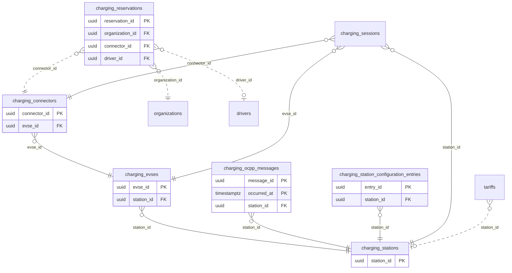

<!-- GENERATED from domain-model.dbml by .claude/skills/domain-model/scripts/domain_model.py - do not edit by hand; edit the .dbml and regenerate. -->

# Charging stations

[← Overview](../overview.md)

✅ built: 5 · 📋 planned: 1

G3's charging network and the OCPP link to each charger.

- A **station** has one or more **EVSEs**; each EVSE has one or more **connectors**.
- Every OCPP frame and every configuration snapshot is kept against its station.
- A customer can **reserve** a connector for a time window (F-C4).

## Diagram

Only key columns are shown. Solid line = built link, dashed = planned. Tables from other domains (no columns): [charging_sessions](charging_sessions.md#charging_sessions), [drivers](drivers.md#drivers), [organizations](identity.md#organizations), [tariffs](billing.md#tariffs).

## Tables

### charging_stations

**No. 26** · ✅ built · owner: **internal** · features: F-C1, F-C2, F-D1, F-G2

One charging station in G3's network.

| Column | Type | Null | Key | References | Meaning | Example |
|---|---|---|---|---|---|---|
| `station_id` | uuid | no | PK |  | Internal ID of the station. | `4b9d6f3a-2e8c-4a1b-9d5e-7f0c3a8b2d88` |
| `ocpp_identity` | varchar(255) | no | UQ |  | Name the charger uses in its OCPP WebSocket URL, unique and never reused. | `WD-HCM-001` |
| `display_name` | varchar(200) | no |  |  | Station name shown to drivers. | `Trạm sạc G3 Bình Dương` |
| `location` | geography(POINT,4326) | yes |  |  | GPS position (WGS84 point, longitude first); NULL if not yet surveyed. | `POINT(106.6519 10.9804)` |
| `power_rating_kw` | numeric(6,2) | yes |  |  | Nominal station power in kW. | `480.00` |
| `connector_standard` | varchar(20) | yes |  |  | Plug standard served. | `CCS2` |
| `operating_hours` | varchar(100) | yes |  |  | Opening hours as free text. | `24/7` |
| `maintenance_status` | chargingstationmaintenancestatus | no |  |  | Maintenance state set by an admin. | `OPERATIONAL` |
| `ocpp_protocol_version` | varchar(20) | yes |  |  | OCPP version of the latest connection; NULL until the charger first connects. | `ocpp1.6` |
| `vendor` | varchar(100) | yes |  |  | Charger vendor from its BootNotification. | `Willdigits` |
| `model` | varchar(100) | yes |  |  | Charger model from its BootNotification. | `WD-DC480` |
| `serial_number` | varchar(100) | yes |  |  | Charger serial number from its BootNotification. | `WD2409001234` |
| `firmware_version` | varchar(100) | yes |  |  | Firmware from the latest BootNotification. | `V2.3.7` |
| `last_boot_at` | timestamptz | yes |  |  | Time of the latest accepted BootNotification. | `2026-09-14T22:00:05Z` |
| `last_seen_at` | timestamptz | yes |  |  | Time of the latest message of any kind; online/offline is derived from it. | `2026-09-15T08:29:58Z` |
| `charger_status` | chargingconnectorstatus | yes |  |  | Status of the whole charger (OCPP 1.6J connector 0); NULL for OCPP 2.0.1. | `Available` |
| `charger_status_updated_at` | timestamptz | yes |  |  | When that status was last reported. | `2026-09-15T08:10:00Z` |
| `charger_error_code` | varchar(50) | yes |  |  | Error code reported for the whole charger, as sent. | `NoError` |
| `charger_vendor_error_code` | varchar(100) | yes |  |  | Vendor-specific error code for the whole charger. | `E0000` |
| `created_at` | timestamptz | no |  |  | When the row was created (UTC). | `2026-09-01T02:00:00Z` |
| `updated_at` | timestamptz | no |  |  | When an admin last edited the row (device reports do not change it). | `2026-09-10T07:15:00Z` |
| `deleted_at` | timestamptz | yes |  |  | Soft-delete time; NULL while the row is live. Rows are never hard-deleted. | `NULL` |

**Enum values**

- `chargingstationmaintenancestatus`: OPERATIONAL, UNDER_MAINTENANCE, OUT_OF_SERVICE
- `chargingconnectorstatus`: Available, Occupied, Reserved, Unavailable, Faulted, Preparing, Charging, SuspendedEV, SuspendedEVSE, Finishing

**Indexes**

- `ix_charging_stations_location` (location) - GIST; radius search (F-D1)
- `ix_charging_stations_deleted_at` (deleted_at)

**Referenced by**

- [charging_evses](#charging_evses).station_id
- [charging_ocpp_messages](#charging_ocpp_messages).station_id
- [charging_station_configuration_entries](#charging_station_configuration_entries).station_id
- [charging_sessions](charging_sessions.md#charging_sessions).station_id
- [tariffs](billing.md#tariffs).station_id (planned)

### charging_evses

**No. 27** · ✅ built · owner: **internal** · features: F-C1, F-G2

One EVSE (power outlet unit) of a station.

| Column | Type | Null | Key | References | Meaning | Example |
|---|---|---|---|---|---|---|
| `evse_id` | uuid | no | PK |  | Internal ID of the EVSE. | `1e7a4c9f-6b3d-4e2a-8c5f-9d0b2e7a4c99` |
| `station_id` | uuid | no | FK | [charging_stations](#charging_stations).station_id (on delete restrict) | Station the EVSE belongs to. | `4b9d6f3a-2e8c-4a1b-9d5e-7f0c3a8b2d88` |
| `ocpp_evse_id` | integer | no |  |  | EVSE number used in OCPP, unique within the station, positive. | `1` |
| `created_at` | timestamptz | no |  |  | When the row was created (UTC). | `2026-09-01T02:00:00Z` |
| `updated_at` | timestamptz | no |  |  | When the row was last changed (UTC). | `2026-09-10T07:15:00Z` |
| `deleted_at` | timestamptz | yes |  |  | Soft-delete time; NULL while the row is live. Rows are never hard-deleted. | `NULL` |

**Indexes**

- `ix_charging_evses_station_deleted` (station_id, deleted_at)
- `uq_charging_evses_station_ocpp_id` (station_id, ocpp_evse_id) unique

**Referenced by**

- [charging_connectors](#charging_connectors).evse_id
- [charging_sessions](charging_sessions.md#charging_sessions).evse_id

### charging_connectors

**No. 28** · ✅ built · owner: **internal** · features: F-C1, F-C2

One physical gun/plug, with its live status.

| Column | Type | Null | Key | References | Meaning | Example |
|---|---|---|---|---|---|---|
| `connector_id` | uuid | no | PK |  | Internal ID of the connector (one physical gun). | `0f3c8e5b-7d1a-4b9c-a2e6-4f8d1c0b3eaa` |
| `evse_id` | uuid | no | FK | [charging_evses](#charging_evses).evse_id (on delete restrict) | EVSE the connector belongs to. | `1e7a4c9f-6b3d-4e2a-8c5f-9d0b2e7a4c99` |
| `ocpp_connector_id` | integer | no |  |  | Connector number used in OCPP, unique within the EVSE, positive. | `1` |
| `status` | chargingconnectorstatus | yes |  |  | Live status from the latest StatusNotification; NULL before the first report. | `Charging` |
| `status_updated_at` | timestamptz | yes |  |  | When that status was last reported. | `2026-09-15T08:31:00Z` |
| `error_code` | varchar(50) | yes |  |  | Error code from the latest report, as sent; replaced by every report. | `NoError` |
| `vendor_error_code` | varchar(100) | yes |  |  | Vendor-specific error code from the latest report. | `E0000` |
| `status_info` | varchar(50) | yes |  |  | Free-text info from the latest report. | `Cable locked` |
| `created_at` | timestamptz | no |  |  | When the row was created (UTC). | `2026-09-01T02:00:00Z` |
| `updated_at` | timestamptz | no |  |  | When the row was last changed (UTC). | `2026-09-10T07:15:00Z` |
| `deleted_at` | timestamptz | yes |  |  | Soft-delete time; NULL while the row is live. Rows are never hard-deleted. | `NULL` |

**Enum values**

- `chargingconnectorstatus`: Available, Occupied, Reserved, Unavailable, Faulted, Preparing, Charging, SuspendedEV, SuspendedEVSE, Finishing

**Indexes**

- `ix_charging_connectors_evse_deleted` (evse_id, deleted_at)
- `uq_charging_connectors_evse_ocpp_id` (evse_id, ocpp_connector_id) unique

**Referenced by**

- [charging_reservations](#charging_reservations).connector_id (planned)
- [charging_sessions](charging_sessions.md#charging_sessions).connector_id

### charging_ocpp_messages

**No. 29** · ✅ built · owner: **internal** · features: F-G2 · hypertable on `occurred_at`

Every OCPP frame in both directions, verbatim and append-only.

| Column | Type | Null | Key | References | Meaning | Example |
|---|---|---|---|---|---|---|
| `message_id` | uuid | no | PK |  | Internal ID of the log row. | `00000006-5a6b-4c7d-8e9f-0a1b2c3d4e5f` |
| `occurred_at` | timestamptz | no | PK |  | When the frame was received or sent; hypertable time column. | `2026-09-15T08:30:00Z` |
| `station_id` | uuid | no | FK | [charging_stations](#charging_stations).station_id (on delete restrict) | Station the frame was exchanged with. | `4b9d6f3a-2e8c-4a1b-9d5e-7f0c3a8b2d88` |
| `ocpp_subprotocol` | varchar(20) | no |  |  | OCPP version negotiated for the connection. | `ocpp1.6` |
| `direction` | chargingocppmessagedirection | no |  |  | From the charger (CP_TO_CSMS) or to it (CSMS_TO_CP). | `CP_TO_CSMS` |
| `raw_frame` | text | no |  |  | The exact frame text, never re-serialised. Contains RFID idTags: never copy into application logs. | `[2,"19223201","Heartbeat",{}]` |

**Enum values**

- `chargingocppmessagedirection`: CP_TO_CSMS, CSMS_TO_CP

**Indexes**

- `ix_charging_ocpp_messages_station_time` (station_id, occurred_at)

### charging_station_configuration_entries

**No. 30** · ✅ built · owner: **internal** · features: F-G2

One configuration key from a charger's GetConfiguration answer (append-only snapshots).

| Column | Type | Null | Key | References | Meaning | Example |
|---|---|---|---|---|---|---|
| `entry_id` | uuid | no | PK |  | Internal ID of the row. | `00000007-5a6b-4c7d-8e9f-0a1b2c3d4e5f` |
| `station_id` | uuid | no | FK | [charging_stations](#charging_stations).station_id (on delete restrict) | Station the configuration belongs to. | `4b9d6f3a-2e8c-4a1b-9d5e-7f0c3a8b2d88` |
| `capture_id` | uuid | no |  |  | Groups all keys from one GetConfiguration answer. | `00000008-5a6b-4c7d-8e9f-0a1b2c3d4e5f` |
| `captured_at` | timestamptz | no |  |  | When the charger's answer was received. | `2026-09-14T22:00:10Z` |
| `config_key` | varchar(100) | no |  |  | Configuration key name. | `HeartbeatInterval` |
| `value` | text | yes |  |  | Key value as text; NULL if the charger sent none. | `60` |
| `is_readonly` | boolean | no |  |  | Whether the charger reports the key as read-only. | `false` |

**Indexes**

- `ix_charging_config_entries_station_captured` (station_id, captured_at)

### charging_reservations

**No. 31** · 📋 planned · owner: **two-party** · features: F-C4

A customer's hold on a G3 connector for a time window.

| Column | Type | Null | Key | References | Meaning | Example |
|---|---|---|---|---|---|---|
| `reservation_id` | uuid | no | PK |  | Internal ID of the reservation. | `00000009-5a6b-4c7d-8e9f-0a1b2c3d4e5f` |
| `organization_id` | uuid | no | FK | [organizations](identity.md#organizations).organization_id (on delete restrict) | Customer organization holding the reservation. | `3f6c2a1e-8b4d-4e2a-9c1f-0a7d5b2e4c11` |
| `connector_id` | uuid | no | FK | [charging_connectors](#charging_connectors).connector_id (on delete restrict) | Connector reserved. | `0f3c8e5b-7d1a-4b9c-a2e6-4f8d1c0b3eaa` |
| `driver_id` | uuid | yes | FK | [drivers](drivers.md#drivers).driver_id (on delete restrict) | Driver expected to arrive; NULL if not named. | `6e3b9d2a-4c1f-4e8b-9a7d-0c2e5f1b8d66` |
| `reserved_from` | timestamptz | no |  |  | Start of the reserved window. | `2026-09-15T13:00:00Z` |
| `expires_at` | timestamptz | no |  |  | When the hold lapses if nobody plugs in. | `2026-09-15T13:15:00Z` |
| `status` | varchar(20) | no |  |  | Reservation outcome. Values: ACTIVE \| USED \| EXPIRED \| CANCELLED \| NO_SHOW. | `ACTIVE` |
