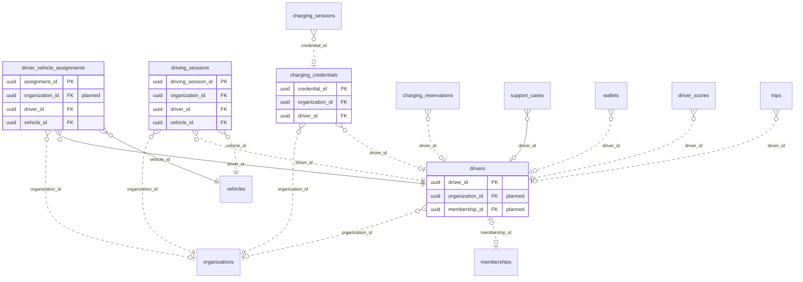

<!-- GENERATED from domain-model.dbml by .claude/skills/domain-model/scripts/domain_model.py - do not edit by hand; edit the .dbml and regenerate. -->

# Drivers

[← Overview](../overview.md)

✅ built: 2 · 📋 planned: 1 · 🆕 proposed: 1

The people who drive the trucks, and how they identify themselves at a charger.

- A **driver** belongs to one customer organization.
- A **driving session** records who is at the wheel of which truck: the driver checks in by QR, in the app or through a manager in the portal; any active driver may drive any organization's truck. It replaces the built **assignments**, which are dropped in the refactor.
- A **charging credential** (RFID card, app QR, VIN autocharge) belongs to an organization and optionally to one driver: app QR now, RFID and VIN autocharge later (prepaid VIP).

## Diagram

Only key columns are shown. Solid line = built link, dashed = planned. Tables from other domains (no columns): [charging_reservations](charging_stations.md#charging_reservations), [charging_sessions](charging_sessions.md#charging_sessions), [driver_scores](scoring.md#driver_scores), [memberships](identity.md#memberships), [organizations](identity.md#organizations), [support_cases](support.md#support_cases), [trips](unassigned.md#trips), [vehicles](vehicles.md#vehicles), [wallets](billing.md#wallets).

## Tables

### drivers

**No. 17** · ✅ built · owner: **customer** · features: F-E4

A driver employed by (or being) a customer.

| Column | Type | Null | Key | References | Meaning | Example |
|---|---|---|---|---|---|---|
| `driver_id` | uuid | no | PK |  | Internal ID of the driver. | `6e3b9d2a-4c1f-4e8b-9a7d-0c2e5f1b8d66` |
| `organization_id` | uuid | yes | FK | [organizations](identity.md#organizations).organization_id (on delete restrict) | **📋 planned**: Customer organization that employs the driver. | `3f6c2a1e-8b4d-4e2a-9c1f-0a7d5b2e4c11` |
| `membership_id` | uuid | yes | FK UQ | [memberships](identity.md#memberships).membership_id (on delete restrict) | **📋 planned**: The membership (person in this organization) this driver profile belongs to; a person driving for two companies has one driver profile in each. A DRIVER role requires an active profile. | `00000022-5a6b-4c7d-8e9f-0a1b2c3d4e5f` |
| `full_name` | varchar(100) | no |  |  | Driver's full name. | `Nguyễn Văn An` |
| `phone_number` | varchar(20) | no | UQ |  | Contact phone number, unique. | `+84912345678` |
| `license_number` | varchar(50) | no | UQ |  | Driving licence number, unique; the driver's business key. | `790123456789` |
| `status` | driverstatus | no |  |  | Driver lifecycle status. | `ACTIVE` |
| `created_at` | timestamptz | no |  |  | When the row was created (UTC). | `2026-09-01T02:00:00Z` |
| `updated_at` | timestamptz | no |  |  | When the row was last changed (UTC). | `2026-09-10T07:15:00Z` |
| `deleted_at` | timestamptz | yes |  |  | Soft-delete time; NULL while the row is live. Rows are never hard-deleted. | `NULL` |

**Enum values**

- `driverstatus`: ACTIVE, INACTIVE

**Indexes**

- `ix_drivers_status` (status)
- `ix_drivers_license_number` (license_number) unique
- `ix_drivers_phone_number` (phone_number) unique

**Referenced by**

- [driver_vehicle_assignments](#driver_vehicle_assignments).driver_id
- [driving_sessions](#driving_sessions).driver_id (planned)
- [charging_credentials](#charging_credentials).driver_id (planned)
- [charging_reservations](charging_stations.md#charging_reservations).driver_id (planned)
- [support_cases](support.md#support_cases).driver_id
- [wallets](billing.md#wallets).driver_id (planned)
- [driver_scores](scoring.md#driver_scores).driver_id (planned)
- [trips](unassigned.md#trips).driver_id (planned)

### driver_vehicle_assignments

**No. 18** · ✅ built · owner: **customer** · features: F-E4

Which driver drove which vehicle, and when (open/close history).
To be removed: replaced by driving_sessions (DR-07) and dropped in the bulk
refactor; there is no real data to carry over.

| Column | Type | Null | Key | References | Meaning | Example |
|---|---|---|---|---|---|---|
| `assignment_id` | uuid | no | PK |  | Internal ID of the assignment. | `00000004-5a6b-4c7d-8e9f-0a1b2c3d4e5f` |
| `organization_id` | uuid | yes | FK | [organizations](identity.md#organizations).organization_id (on delete restrict) | **📋 planned**: Customer organization the assignment belongs to. | `3f6c2a1e-8b4d-4e2a-9c1f-0a7d5b2e4c11` |
| `driver_id` | uuid | no | FK | [drivers](#drivers).driver_id (on delete restrict) | Driver assigned. | `6e3b9d2a-4c1f-4e8b-9a7d-0c2e5f1b8d66` |
| `vehicle_id` | uuid | no | FK | [vehicles](vehicles.md#vehicles).vehicle_id (on delete restrict) | Vehicle assigned. | `7a4c1e9b-3d2f-4b8a-a6c5-1e0d9f8b7a44` |
| `assigned_at` | timestamptz | no |  |  | When the assignment began. | `2026-09-01T00:00:00Z` |
| `unassigned_at` | timestamptz | yes |  |  | When it ended; NULL while the driver still has the vehicle. | `NULL` |
| `created_at` | timestamptz | no |  |  | When the row was created (UTC). | `2026-09-01T02:00:00Z` |
| `updated_at` | timestamptz | no |  |  | When the row was last changed (moves when the assignment is closed). | `2026-09-10T07:15:00Z` |

**Indexes**

- `uq_driver_vehicle_assignments_active_vehicle` (vehicle_id) unique - WHERE unassigned_at IS NULL
- `uq_driver_vehicle_assignments_active_driver` (driver_id) unique - WHERE unassigned_at IS NULL
- `ix_driver_vehicle_assignments_driver_time` (driver_id, assigned_at)
- `ix_driver_vehicle_assignments_driver_id` (driver_id)
- `ix_driver_vehicle_assignments_vehicle_id` (vehicle_id)

### driving_sessions

**No. 19** · 📋 planned · owner: **customer** · features: F-E4

Who was at the wheel of which truck, and when (DR-07): the driver checks in by
scanning the QR code on the truck or picking a nearby truck in the app, or a
manager checks them in from the portal. Replaces driver_vehicle_assignments.
A session ends when the driver checks out, another driver checks in to the
truck, the driver checks in to another truck, or the truck has not moved for
the organization's auto-end time (organization_settings). Events that need a
driver (scores, trips, charging sessions) take it from here. Assigned-driver
alerts go to the driver checked in and to the portal; a truck moving with
nobody checked in alerts the portal. Seen by the truck's organization and by
the driver in the app; a driver's own employer does not see sessions on
another organization's truck (DR-08). Closed rows are never edited, so no
change history.

| Column | Type | Null | Key | References | Meaning | Example |
|---|---|---|---|---|---|---|
| `driving_session_id` | uuid | no | PK |  | Internal ID of the driving session. | `0000001d-5a6b-4c7d-8e9f-0a1b2c3d4e5f` |
| `organization_id` | uuid | no | FK | [organizations](identity.md#organizations).organization_id (on delete restrict) | Organization that owns the truck; the session belongs to it. The driver may belong to another organization (DR-07). | `3f6c2a1e-8b4d-4e2a-9c1f-0a7d5b2e4c11` |
| `driver_id` | uuid | no | FK | [drivers](#drivers).driver_id (on delete restrict) | Driver at the wheel: any active driver in the system, from any organization. | `6e3b9d2a-4c1f-4e8b-9a7d-0c2e5f1b8d66` |
| `vehicle_id` | uuid | no | FK | [vehicles](vehicles.md#vehicles).vehicle_id (on delete restrict) | Truck being driven. | `7a4c1e9b-3d2f-4b8a-a6c5-1e0d9f8b7a44` |
| `check_in_method` | varchar(10) | no |  |  | How the driver checked in. QR: scanned the code on the truck. APP: picked the truck from the nearby trucks listed in the app. PORTAL: a manager checked the driver in from the portal (e.g. a driver without a phone). Values: QR \| APP \| PORTAL. | `QR` |
| `check_in_location` | geography(POINT,4326) | yes |  |  | Where the phone was at check-in, compared with the truck's last T-Box position to refuse a check-in far from the truck; NULL for PORTAL. | `POINT(106.66 10.76)` |
| `started_at` | timestamptz | no |  |  | Check-in time; the truck may be started before or after it. | `2026-09-14T00:30:00Z` |
| `ended_at` | timestamptz | yes |  |  | When the session ended; NULL while the driver is at the wheel. | `NULL` |
| `end_cause` | varchar(20) | yes |  |  | Why the session ended. CHECKED_OUT: the driver checked out. TAKEN_OVER: another driver checked in to the truck. OTHER_TRUCK: the driver checked in to another truck. AUTO_ENDED: the truck did not move for the organization's auto-end time. DRIVER_REMOVED: the driver profile was deleted. NULL while open. Values: CHECKED_OUT \| TAKEN_OVER \| OTHER_TRUCK \| AUTO_ENDED \| DRIVER_REMOVED. | `TAKEN_OVER` |
| `created_at` | timestamptz | no |  |  | When the row was created (UTC). | `2026-09-14T00:30:00Z` |
| `updated_at` | timestamptz | no |  |  | When the row was last changed (moves when the session ends). | `2026-09-14T09:10:00Z` |

**Indexes**

- `uq_driving_sessions_open_vehicle` (vehicle_id) unique - WHERE ended_at IS NULL: one driver at the wheel per truck
- `uq_driving_sessions_open_driver` (driver_id) unique - WHERE ended_at IS NULL: one truck per driver at a time
- `ix_driving_sessions_vehicle_time` (vehicle_id, started_at)
- `ix_driving_sessions_driver_time` (driver_id, started_at)

### charging_credentials

**No. 20** · 🆕 proposed · owner: **customer** · features: F-B2, F-C6, F-H1

How a charger identifies who is charging. Links a session's raw idTag to a
driver and organization. Placement in `drivers` is provisional.

| Column | Type | Null | Key | References | Meaning | Example |
|---|---|---|---|---|---|---|
| `credential_id` | uuid | no | PK |  | Internal ID of the credential. | `d4f1b7e2-8c5a-4d3f-9e1b-6a0c7d2f5ecc` |
| `organization_id` | uuid | no | FK | [organizations](identity.md#organizations).organization_id (on delete restrict) | Customer organization billed when this credential charges. | `3f6c2a1e-8b4d-4e2a-9c1f-0a7d5b2e4c11` |
| `driver_id` | uuid | yes | FK | [drivers](#drivers).driver_id (on delete restrict) | Driver it belongs to; NULL for a shared fleet card. | `6e3b9d2a-4c1f-4e8b-9a7d-0c2e5f1b8d66` |
| `credential_type` | varchar(20) | no |  |  | How the charger identifies the customer. APP_QR now: the user scans the QR on the charger and the backend starts the charge remotely. RFID and VIN_AUTOCHARGE later, for prepaid enterprise (VIP) automatic charging. Values: APP_QR \| RFID \| VIN_AUTOCHARGE. | `RFID` |
| `id_tag` | varchar(20) | yes | UQ |  | Identifier the charger reports (OCPP idTag), unique. | `04A1B2C3D4E5F6` |
| `status` | varchar(20) | no |  |  | Whether the credential may start a charge. Values: ACTIVE \| BLOCKED \| EXPIRED. | `ACTIVE` |
| `issued_at` | timestamptz | no |  |  | When the credential was issued. | `2026-09-01T02:00:00Z` |
| `revoked_at` | timestamptz | yes |  |  | When it was revoked; NULL while valid. | `NULL` |

**Referenced by**

- [charging_sessions](charging_sessions.md#charging_sessions).credential_id (planned)
