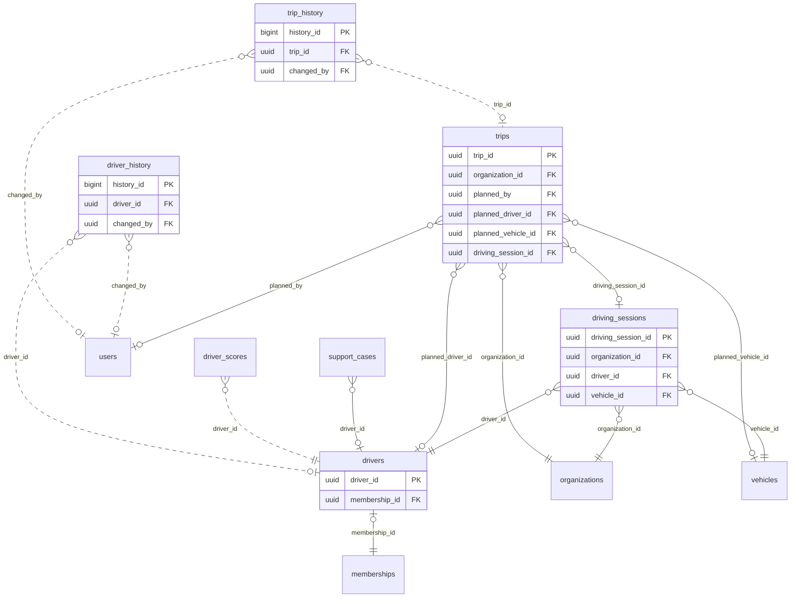

<!-- GENERATED from domain-model.dbml by .claude/skills/domain-model/scripts/domain_model.py - do not edit by hand; edit the .dbml and regenerate. -->

# Drivers

[← Overview](../overview.md)

✅ built: 5

The people who drive the trucks, who is at the wheel of which truck, and the trips they make.

- A **driver profile** belongs to one membership: one person in one organization.
- A **driving session** records who is at the wheel of which truck: the driver checks in by QR, in the app or through a manager in the portal; any active driver may drive any organization's truck. It replaced the old driver-to-vehicle assignments, which are dropped.
- A **trip** is one job inside a driving session: optionally planned by a fleet manager (A to B, planned times, driver, truck), then started and finished by the driver in the app; a session may hold several trips (DR-12).
- No charging credential is stored: every charge at launch starts with a QR scan (CO-13). RFID cards and VIN Autocharge may be implemented later (deferred.md 90).

## Diagram

Only key columns are shown. Solid line = built link, dashed = planned. Tables from other domains (no columns): [driver_scores](scoring.md#driver_scores), [memberships](identity.md#memberships), [organizations](identity.md#organizations), [support_cases](support.md#support_cases), [users](identity.md#users), [vehicles](vehicles.md#vehicles).

## Tables

### drivers

**No. 21** · ✅ built · owner: **customer** · features: F-E4

Driver profile: the facts the system acts on about one person's job as a
driver in one organization (ID-13). Who the person is (name, phone) lives on
users; the organization is read through the membership. A person driving
for two organizations has two profiles, and each organization is responsible
for its own (DR-09). A driver may check in to a truck when the profile is
ACTIVE and not deleted, its licence has not expired, and the membership and
the user are ACTIVE (DR-10).
Check constraint: deleted_at IS NULL OR status = 'INACTIVE' (DM-25).

🔍 = tracked column: a change to it copies the whole old row into [driver_history](#driver_history).

| Column | Type | Null | Key | References | Meaning | Example |
|---|---|---|---|---|---|---|
| `driver_id` | uuid | no | PK |  | Internal ID of the driver profile. | `6e3b9d2a-4c1f-4e8b-9a7d-0c2e5f1b8d66` |
| `membership_id` | uuid | no | FK UQ 🔍 | [memberships](identity.md#memberships).membership_id (on delete restrict) | The membership (one person in one organization) this profile belongs to; the organization is read through it (DM-24). A person who drives for two organizations has one profile in each, and each organization keeps its own copy of the facts. A new membership after leaving gets a new profile. | `00000022-5a6b-4c7d-8e9f-0a1b2c3d4e5f` |
| `license_number` | varchar(50) | no | 🔍 |  | Driving licence number as recorded by this organization. Not unique: a person who drives for two organizations has it on both profiles. When the number is already on another person's live profile, the app warns instead of refusing, so one organization learns nothing about another's driver (DR-09). | `790123456789` |
| `license_class` | varchar(5) | no | 🔍 |  | Licence class under Law 36/2024/QH15 (the highest one held for trucks). A tractor head needs CE; any other class only gives a warning at check-in until vehicle models have a body type (DR-10). Values: B \| C1 \| C \| D1 \| D2 \| D \| BE \| C1E \| CE \| D1E \| D2E \| DE. | `CE` |
| `license_expires_on` | date | no | 🔍 |  | Expiry date printed on the licence (DM-26); every truck class expires. "Expired" is computed from it, never stored as a status; an expired licence blocks check-in and drives the expiry reminder (DRV-01). | `2029-03-01` |
| `status` | driverstatus | no | 🔍 |  | Decided by the organization. ACTIVE: may check in to a truck (with the other conditions of DR-10). INACTIVE: may not, e.g. suspended, or the person left (then also soft-deleted). Values: ACTIVE \| INACTIVE. | `ACTIVE` |
| `status_reason` | varchar(200) | yes | 🔍 |  | Why the profile has its current status, or why it left the system; NULL when there is nothing to explain. Earlier reasons are in driver_history. | `Tạm đình chỉ sau va chạm ngày 12/09` |
| `created_at` | timestamptz | no | 🔍 |  | When the row was created (UTC). | `2026-09-01T02:00:00Z` |
| `updated_at` | timestamptz | no | 🔍 |  | When the row was last changed (UTC). | `2026-09-10T07:15:00Z` |
| `deleted_at` | timestamptz | yes | 🔍 |  | Soft-delete time: the profile is no longer part of the system, because the person left the organization (the membership ended) or it was entered by mistake (DM-25); all its data is kept, and the reason is in status_reason. Ending a membership sets the profile INACTIVE and fills this in the same transaction (DR-10). NULL while it is part of the system. | `NULL` |

**Enum values**

- `driverstatus`: ACTIVE, INACTIVE

**Indexes**

- `ix_drivers_license_number` (license_number) - Not unique (DR-09); for search and the duplicate-number warning

**Referenced by**

- [driving_sessions](#driving_sessions).driver_id
- [trips](#trips).planned_driver_id
- [support_cases](support.md#support_cases).driver_id
- [driver_scores](scoring.md#driver_scores).driver_id (planned)
- [driver_history](#driver_history).driver_id (planned)

### driver_history

**No. 21.h** · ✅ built · owner: **customer** · features: F-E4 · change history of [drivers](#drivers)

Every earlier version of a row of `drivers`: a copy of the whole row, taken just before a change and written by a database trigger in the same transaction. Generated by the domain-model tool from `@tracked *`; never written by hand.

| Column | Type | Null | Key | References | Meaning | Example |
|---|---|---|---|---|---|---|
| `history_id` | bigint | no | PK |  | Auto-increasing ID of the history row. | `1024` |
| `driver_id` | uuid | yes | FK | [drivers](#drivers).driver_id (on delete restrict) | Value before the change (drivers.driver_id). | `6e3b9d2a-4c1f-4e8b-9a7d-0c2e5f1b8d66` |
| `membership_id` | uuid | yes |  |  | Value before the change (drivers.membership_id). | `00000022-5a6b-4c7d-8e9f-0a1b2c3d4e5f` |
| `license_number` | varchar(50) | yes |  |  | Value before the change (drivers.license_number). | `790123456789` |
| `license_class` | varchar(5) | yes |  |  | Value before the change (drivers.license_class). | `CE` |
| `license_expires_on` | date | yes |  |  | Value before the change (drivers.license_expires_on). | `2029-03-01` |
| `status` | driverstatus | yes |  |  | Value before the change (drivers.status). | `ACTIVE` |
| `status_reason` | varchar(200) | yes |  |  | Value before the change (drivers.status_reason). | `Tạm đình chỉ sau va chạm ngày 12/09` |
| `created_at` | timestamptz | yes |  |  | Value before the change (drivers.created_at). | `2026-09-01T02:00:00Z` |
| `updated_at` | timestamptz | yes |  |  | Value before the change (drivers.updated_at). | `2026-09-10T07:15:00Z` |
| `deleted_at` | timestamptz | yes |  |  | Value before the change (drivers.deleted_at). | `NULL` |
| `changed_at` | timestamptz | no |  |  | When this version of the row was replaced. | `2026-09-10T07:15:00Z` |
| `changed_by` | uuid | yes | FK | [users](identity.md#users).user_id (on delete restrict) | User who made the change; NULL when the system made it. | `9b2e7d4a-1c3f-4a8e-b6d2-5e0f1a9c3d22` |
| `change_reason` | varchar(200) | no |  |  | Why the row was changed, set by the application for the transaction: typed by the person for an administrative decision, a fixed text for a routine action. When the application sets none, the trigger records 'Unspecified change' (DM-29). | `Customer moved to a new office` |

**Enum values**

- `driverstatus`: ACTIVE, INACTIVE

**Indexes**

- `ix_driver_history_driver_id_time` (driver_id, changed_at)

### driving_sessions

**No. 22** · ✅ built · owner: **customer** · features: F-E4

Who was at the wheel of which truck, and when (DR-07): the driver checks in by
scanning the QR code on the truck or picking a nearby truck in the app, or a
manager checks them in from the portal. Replaces the dropped driver_vehicle_assignments (DR-07).
A session ends when the driver checks out, another driver checks in to the
truck, the driver checks in to another truck, or the truck has not moved for
the organization's auto-end time (organization_settings). Events that need a
driver (scores, trips, charging sessions) take it from here. Assigned-driver
alerts go to the driver checked in and to the portal; a truck moving with
nobody checked in alerts the portal. Seen in full by the truck's
organization; the driver sees only a summary of their own sessions in the app
(times, truck, duration, distance; no route or places, no export), and a
driver's own employer does not see sessions on another organization's truck
(DR-08, DR-11). Closed rows are never edited, so no change history.

| Column | Type | Null | Key | References | Meaning | Example |
|---|---|---|---|---|---|---|
| `driving_session_id` | uuid | no | PK |  | Internal ID of the driving session. | `0000001d-5a6b-4c7d-8e9f-0a1b2c3d4e5f` |
| `organization_id` | uuid | no | FK | [organizations](identity.md#organizations).organization_id (on delete restrict) | Organization that owns the truck; the session belongs to it. The driver may belong to another organization (DR-07). | `3f6c2a1e-8b4d-4e2a-9c1f-0a7d5b2e4c11` |
| `driver_id` | uuid | no | FK | [drivers](#drivers).driver_id (on delete restrict) | Driver profile at the wheel: any active driver in the system, from any organization; a driver from another organization is a normal case (e.g. a truck owner hiring drivers from another company) and only gives a warning. The profile is the person's profile in the truck's organization when they have one, otherwise their profile in the organization they act for in the app; a manager checking someone in from the portal picks one of their own organization's profiles (DR-10). | `6e3b9d2a-4c1f-4e8b-9a7d-0c2e5f1b8d66` |
| `vehicle_id` | uuid | no | FK | [vehicles](vehicles.md#vehicles).vehicle_id (on delete restrict) | Truck being driven. | `7a4c1e9b-3d2f-4b8a-a6c5-1e0d9f8b7a44` |
| `check_in_method` | varchar(10) | no |  |  | How the driver checked in. QR: scanned the code on the truck. APP: picked the truck from the nearby trucks listed in the app. PORTAL: a manager checked the driver in from the portal (e.g. a driver without a phone). Values: QR \| APP \| PORTAL. | `QR` |
| `check_in_location` | geography(POINT,4326) | yes |  |  | Where the phone was at check-in, compared with the truck's last T-Box position to refuse a check-in far from the truck; NULL for PORTAL. | `POINT(106.66 10.76)` |
| `started_at` | timestamptz | no |  |  | Check-in time; the truck may be started before or after it. | `2026-09-14T00:30:00Z` |
| `ended_at` | timestamptz | yes |  |  | When the session ended; NULL while the driver is at the wheel. | `NULL` |
| `end_cause` | varchar(20) | yes |  |  | Why the session ended. CHECKED_OUT: the driver checked out. TAKEN_OVER: another driver checked in to the truck. OTHER_TRUCK: the driver checked in to another truck. AUTO_ENDED: the truck did not move for the organization's auto-end time. DRIVER_REMOVED: the driver profile was deleted. OWNER_CHANGED: the truck was transferred to another organization (VH-12). NULL while open. Values: CHECKED_OUT \| TAKEN_OVER \| OTHER_TRUCK \| AUTO_ENDED \| DRIVER_REMOVED \| OWNER_CHANGED. | `TAKEN_OVER` |
| `created_at` | timestamptz | no |  |  | When the row was created (UTC). | `2026-09-14T00:30:00Z` |
| `updated_at` | timestamptz | no |  |  | When the row was last changed (moves when the session ends). | `2026-09-14T09:10:00Z` |

**Indexes**

- `uq_driving_sessions_open_vehicle` (vehicle_id) unique - WHERE ended_at IS NULL: one driver at the wheel per truck
- `uq_driving_sessions_open_driver` (driver_id) unique - WHERE ended_at IS NULL: one truck per driver at a time
- `ix_driving_sessions_vehicle_time` (vehicle_id, started_at)
- `ix_driving_sessions_driver_time` (driver_id, started_at)

**Referenced by**

- [trips](#trips).driving_session_id

### trips

**No. 23** · ✅ built · owner: **customer** · features: F-A9

One trip: a job planned by a fleet manager and its actual execution by the
driver (DR-12). Plan (optional; NULL for a personal driver with no fleet):
from A to B as place names, within a planned departure and arrival, for a
driver and a truck. Actual: the driver checks in to the truck by QR (a
driving session, DR-07), presses Start, and presses Finish; the system
records the times and the truck's T-Box position, odometer and battery % at
both ends. A session (a shift) may hold several trips. Safety nets: a truck
moving during a session with no trip started reminds the driver and shows in
the portal; a trip still in progress when the session ends is closed
automatically (COMPLETED, with the reason). Distance, energy, kWh/km and cost
are differences of the stored readings, computed when read. Change history
on: rerouting or reassigning a planned trip is the manager's decision.
Check constraints (DR-12): status <> 'PLANNED' OR (driving_session_id,
started_at, ended_at all NULL); status NOT IN ('IN_PROGRESS', 'COMPLETED') OR
(driving_session_id IS NOT NULL AND started_at IS NOT NULL);
status <> 'COMPLETED' OR ended_at IS NOT NULL.

🔍 = tracked column: a change to it copies the whole old row into [trip_history](#trip_history).

| Column | Type | Null | Key | References | Meaning | Example |
|---|---|---|---|---|---|---|
| `trip_id` | uuid | no | PK |  | Internal ID of the trip; stable, for the later shipment link. | `2e1c8a5f-0b7d-4e9c-b4a3-6d5f1e8c2b76` |
| `organization_id` | uuid | no | FK 🔍 | [organizations](identity.md#organizations).organization_id (on delete restrict) | Organization the trip belongs to, written once (DM-24 case C): the planner's organization, or the truck's owner for a personal trip. | `3f6c2a1e-8b4d-4e2a-9c1f-0a7d5b2e4c11` |
| `status` | varchar(20) | no | 🔍 |  | PLANNED: assigned by a manager, not started. IN_PROGRESS: the driver pressed Start. COMPLETED: the driver pressed Finish, or the system closed it when the driving session ended. CANCELLED: cancelled by the manager. Values: PLANNED \| IN_PROGRESS \| COMPLETED \| CANCELLED. | `COMPLETED` |
| `status_reason` | varchar(200) | yes | 🔍 |  | Why the trip has its status: why it was cancelled, or that it was closed automatically when the driving session ended (DM-19); NULL when there is nothing to explain. | `NULL` |
| `planned_by` | uuid | yes | FK 🔍 | [users](identity.md#users).user_id (on delete restrict) | Plan: the manager who planned it; NULL for a personal trip. | `9b2e7d4a-1c3f-4a8e-b6d2-5e0f1a9c3d22` |
| `planned_driver_id` | uuid | yes | FK 🔍 | [drivers](#drivers).driver_id (on delete restrict) | Plan: the driver profile assigned; may be left empty and assigned later. | `6e3b9d2a-4c1f-4e8b-9a7d-0c2e5f1b8d66` |
| `planned_vehicle_id` | uuid | yes | FK 🔍 | [vehicles](vehicles.md#vehicles).vehicle_id (on delete restrict) | Plan: the truck assigned. | `7a4c1e9b-3d2f-4b8a-a6c5-1e0d9f8b7a44` |
| `origin_name` | varchar(200) | yes | 🔍 |  | Plan: where the trip starts, as text. | `Kho M, bãi Q, phường G` |
| `destination_name` | varchar(200) | yes | 🔍 |  | Plan: where the trip ends, as text. | `Cảng Cát Lái, cổng B` |
| `planned_start_at` | timestamptz | yes | 🔍 |  | Plan: planned departure. | `2026-10-12T00:00:00Z` |
| `planned_end_at` | timestamptz | yes | 🔍 |  | Plan: planned arrival. | `2026-10-12T04:00:00Z` |
| `driving_session_id` | uuid | yes | FK 🔍 | [driving_sessions](#driving_sessions).driving_session_id (on delete restrict) | Actual: the driving session the trip was started in; it gives the actual driver and truck. A driver or truck other than the planned one is allowed and flagged in the portal. | `0000001d-5a6b-4c7d-8e9f-0a1b2c3d4e5f` |
| `started_at` | timestamptz | yes | 🔍 |  | Actual: when Start was pressed, by our server's clock (the app's press time when it was offline, checked against the server). | `2026-10-12T00:12:00Z` |
| `ended_at` | timestamptz | yes | 🔍 |  | Actual: when Finish was pressed, or when the session ended for an automatically closed trip. | `2026-10-12T03:48:00Z` |
| `start_location` | geography(POINT,4326) | yes | 🔍 |  | Actual: the truck's latest T-Box position when Start was pressed; NULL when the T-Box had no recent position. | `POINT(106.70 11.05)` |
| `end_location` | geography(POINT,4326) | yes | 🔍 |  | Actual: the truck's latest T-Box position when the trip ended; NULL when none. | `POINT(106.79 10.76)` |
| `start_odometer_km` | numeric(10,1) | yes | 🔍 |  | Actual: the truck's odometer at Start, from the T-Box. | `48213.7` |
| `end_odometer_km` | numeric(10,1) | yes | 🔍 |  | Actual: the odometer at the end; the distance is end minus start, computed when read. | `48261.2` |
| `start_soc_percent` | numeric(5,2) | yes | 🔍 |  | Actual: battery % at Start, from the T-Box. | `86.50` |
| `end_soc_percent` | numeric(5,2) | yes | 🔍 |  | Actual: battery % at the end; the energy used comes from the drop and the battery capacity, computed when read. | `61.00` |
| `declared_load_status` | varchar(20) | yes | 🔍 |  | Load the driver declared at Start (MON-13). Values: LOADED \| EMPTY. | `LOADED` |
| `created_at` | timestamptz | no | 🔍 |  | When the row was created (UTC): when it was planned, or at Start for a personal trip. | `2026-10-11T08:00:00Z` |
| `updated_at` | timestamptz | no | 🔍 |  | When the row was last changed (UTC). | `2026-10-12T03:48:00Z` |

**Indexes**

- `ix_trips_organization_planned_start` (organization_id, planned_start_at) - The dispatch board
- `ix_trips_planned_driver_status` (planned_driver_id, status) - A driver's assigned trips
- `uq_trips_session_in_progress` (driving_session_id) unique - WHERE status = IN_PROGRESS: one trip at a time per driving session
- `ix_trips_session_started` (driving_session_id, started_at)

**Referenced by**

- [trip_history](#trip_history).trip_id (planned)

### trip_history

**No. 23.h** · ✅ built · owner: **customer** · features: F-A9 · change history of [trips](#trips)

Every earlier version of a row of `trips`: a copy of the whole row, taken just before a change and written by a database trigger in the same transaction. Generated by the domain-model tool from `@tracked *`; never written by hand.

| Column | Type | Null | Key | References | Meaning | Example |
|---|---|---|---|---|---|---|
| `history_id` | bigint | no | PK |  | Auto-increasing ID of the history row. | `1024` |
| `trip_id` | uuid | yes | FK | [trips](#trips).trip_id (on delete restrict) | Value before the change (trips.trip_id). | `2e1c8a5f-0b7d-4e9c-b4a3-6d5f1e8c2b76` |
| `organization_id` | uuid | yes |  |  | Value before the change (trips.organization_id). | `3f6c2a1e-8b4d-4e2a-9c1f-0a7d5b2e4c11` |
| `status` | varchar(20) | yes |  |  | Value before the change (trips.status). | `COMPLETED` |
| `status_reason` | varchar(200) | yes |  |  | Value before the change (trips.status_reason). | `NULL` |
| `planned_by` | uuid | yes |  |  | Value before the change (trips.planned_by). | `9b2e7d4a-1c3f-4a8e-b6d2-5e0f1a9c3d22` |
| `planned_driver_id` | uuid | yes |  |  | Value before the change (trips.planned_driver_id). | `6e3b9d2a-4c1f-4e8b-9a7d-0c2e5f1b8d66` |
| `planned_vehicle_id` | uuid | yes |  |  | Value before the change (trips.planned_vehicle_id). | `7a4c1e9b-3d2f-4b8a-a6c5-1e0d9f8b7a44` |
| `origin_name` | varchar(200) | yes |  |  | Value before the change (trips.origin_name). | `Kho M, bãi Q, phường G` |
| `destination_name` | varchar(200) | yes |  |  | Value before the change (trips.destination_name). | `Cảng Cát Lái, cổng B` |
| `planned_start_at` | timestamptz | yes |  |  | Value before the change (trips.planned_start_at). | `2026-10-12T00:00:00Z` |
| `planned_end_at` | timestamptz | yes |  |  | Value before the change (trips.planned_end_at). | `2026-10-12T04:00:00Z` |
| `driving_session_id` | uuid | yes |  |  | Value before the change (trips.driving_session_id). | `0000001d-5a6b-4c7d-8e9f-0a1b2c3d4e5f` |
| `started_at` | timestamptz | yes |  |  | Value before the change (trips.started_at). | `2026-10-12T00:12:00Z` |
| `ended_at` | timestamptz | yes |  |  | Value before the change (trips.ended_at). | `2026-10-12T03:48:00Z` |
| `start_location` | geography(POINT,4326) | yes |  |  | Value before the change (trips.start_location). | `POINT(106.70 11.05)` |
| `end_location` | geography(POINT,4326) | yes |  |  | Value before the change (trips.end_location). | `POINT(106.79 10.76)` |
| `start_odometer_km` | numeric(10,1) | yes |  |  | Value before the change (trips.start_odometer_km). | `48213.7` |
| `end_odometer_km` | numeric(10,1) | yes |  |  | Value before the change (trips.end_odometer_km). | `48261.2` |
| `start_soc_percent` | numeric(5,2) | yes |  |  | Value before the change (trips.start_soc_percent). | `86.50` |
| `end_soc_percent` | numeric(5,2) | yes |  |  | Value before the change (trips.end_soc_percent). | `61.00` |
| `declared_load_status` | varchar(20) | yes |  |  | Value before the change (trips.declared_load_status). | `LOADED` |
| `created_at` | timestamptz | yes |  |  | Value before the change (trips.created_at). | `2026-10-11T08:00:00Z` |
| `updated_at` | timestamptz | yes |  |  | Value before the change (trips.updated_at). | `2026-10-12T03:48:00Z` |
| `changed_at` | timestamptz | no |  |  | When this version of the row was replaced. | `2026-09-10T07:15:00Z` |
| `changed_by` | uuid | yes | FK | [users](identity.md#users).user_id (on delete restrict) | User who made the change; NULL when the system made it. | `9b2e7d4a-1c3f-4a8e-b6d2-5e0f1a9c3d22` |
| `change_reason` | varchar(200) | no |  |  | Why the row was changed, set by the application for the transaction: typed by the person for an administrative decision, a fixed text for a routine action. When the application sets none, the trigger records 'Unspecified change' (DM-29). | `Customer moved to a new office` |

**Indexes**

- `ix_trip_history_trip_id_time` (trip_id, changed_at)
