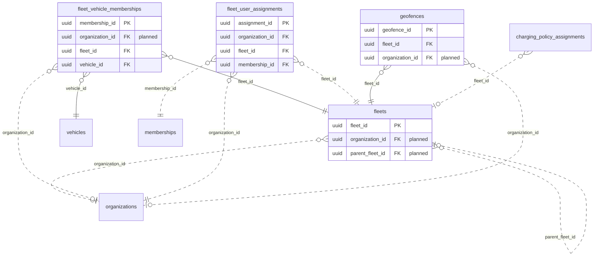

<!-- GENERATED from domain-model.dbml by .claude/skills/domain-model/scripts/domain_model.py - do not edit by hand; edit the .dbml and regenerate. -->

# Fleet

[← Overview](../overview.md)

✅ built: 3 · 📋 planned: 1

Groups of vehicles managed together by a fleet manager.

- A **fleet** is a group inside one organization, and can sit under another fleet, so each customer models its own structure (region > branch > depot...) as data.
- A vehicle is in at most one fleet at a time; a fleet holds many vehicles. **Memberships** keep the history.
- A fleet's **geofences** raise an alert when a member vehicle enters or leaves them (F-A5).
- A large organization can limit a fleet manager or dispatcher to some fleets (**user assignments**); an assignment covers that fleet and every fleet below it, and without any they cover the whole organization.

## Diagram

Only key columns are shown. Solid line = built link, dashed = planned. Tables from other domains (no columns): [charging_policy_assignments](policy.md#charging_policy_assignments), [memberships](identity.md#memberships), [organizations](identity.md#organizations), [vehicles](vehicles.md#vehicles).

## Tables

### fleets

**No. 25** · ✅ built · owner: **customer** · features: F-E1

A named group of vehicles inside an organization: a node of the customer's
own structure (region, branch, depot, team - any name, any depth, through
parent_fleet_id). Reorganising is editing data, never the schema.

| Column | Type | Null | Key | References | Meaning | Example |
|---|---|---|---|---|---|---|
| `fleet_id` | uuid | no | PK |  | Internal ID of the fleet. | `8d5f2b7e-1a9c-4f3d-b8e2-6c0a4d9f1e77` |
| `organization_id` | uuid | yes | FK | [organizations](identity.md#organizations).organization_id (on delete restrict) | **📋 planned**: Organization the fleet belongs to. | `3f6c2a1e-8b4d-4e2a-9c1f-0a7d5b2e4c11` |
| `parent_fleet_id` | uuid | yes | FK | [fleets](#fleets).fleet_id (on delete restrict) | **📋 planned**: The fleet this one sits under, so a customer can build its own structure (region > branch > depot, any depth); NULL for a top-level fleet. Must belong to the same organization and must not create a loop. A user assigned to a fleet also covers every fleet below it. | `NULL` |
| `fleet_code` | varchar(50) | no | UQ |  | Short unique code; the fleet's business key. | `MP-HCM-01` |
| `name` | varchar(100) | no |  |  | Fleet name shown in the portal. | `Đội xe Hồ Chí Minh` |
| `status` | fleetstatus | no |  |  | Fleet lifecycle status. | `ACTIVE` |
| `created_at` | timestamptz | no |  |  | When the row was created (UTC). | `2026-09-01T02:00:00Z` |
| `updated_at` | timestamptz | no |  |  | When the row was last changed (UTC). | `2026-09-10T07:15:00Z` |
| `deleted_at` | timestamptz | yes |  |  | Soft-delete time; NULL while the row is live. Rows are never hard-deleted. | `NULL` |

**Enum values**

- `fleetstatus`: ACTIVE, INACTIVE

**Indexes**

- `ix_fleets_status` (status)
- `ix_fleets_fleet_code` (fleet_code) unique

**Referenced by**

- [fleets](#fleets).parent_fleet_id (planned)
- [fleet_vehicle_memberships](#fleet_vehicle_memberships).fleet_id
- [fleet_user_assignments](#fleet_user_assignments).fleet_id (planned)
- [geofences](#geofences).fleet_id
- [charging_policy_assignments](policy.md#charging_policy_assignments).fleet_id (planned)

### fleet_vehicle_memberships

**No. 26** · ✅ built · owner: **customer** · features: F-E1

Which vehicle was in which fleet, and when (open/close history).

| Column | Type | Null | Key | References | Meaning | Example |
|---|---|---|---|---|---|---|
| `membership_id` | uuid | no | PK |  | Internal ID of the membership period. | `00000005-5a6b-4c7d-8e9f-0a1b2c3d4e5f` |
| `organization_id` | uuid | yes | FK | [organizations](identity.md#organizations).organization_id (on delete restrict) | **📋 planned**: Customer organization the membership belongs to. | `3f6c2a1e-8b4d-4e2a-9c1f-0a7d5b2e4c11` |
| `fleet_id` | uuid | no | FK | [fleets](#fleets).fleet_id (on delete restrict) | Fleet the vehicle is in. | `8d5f2b7e-1a9c-4f3d-b8e2-6c0a4d9f1e77` |
| `vehicle_id` | uuid | no | FK | [vehicles](vehicles.md#vehicles).vehicle_id (on delete restrict) | Vehicle in the fleet. | `7a4c1e9b-3d2f-4b8a-a6c5-1e0d9f8b7a44` |
| `joined_at` | timestamptz | no |  |  | When the vehicle joined the fleet. | `2026-09-01T00:00:00Z` |
| `left_at` | timestamptz | yes |  |  | When it left; NULL while still a member. | `NULL` |
| `created_at` | timestamptz | no |  |  | When the row was created (UTC). | `2026-09-01T02:00:00Z` |
| `updated_at` | timestamptz | no |  |  | When the row was last changed (moves when the membership is closed). | `2026-09-10T07:15:00Z` |

**Indexes**

- `ix_fleet_vehicle_memberships_fleet_id` (fleet_id)
- `ix_fleet_vehicle_memberships_fleet_time` (fleet_id, joined_at)
- `ix_fleet_vehicle_memberships_vehicle_id` (vehicle_id)
- `uq_fleet_vehicle_memberships_active_vehicle` (vehicle_id) unique - WHERE left_at IS NULL

### geofences

**No. 27** · ✅ built · owner: **customer** · features: F-A5

An area whose entry or exit by a member vehicle of its fleet raises an alert.
Scoped to a fleet until customer organizations exist (then it moves to the organization).

| Column | Type | Null | Key | References | Meaning | Example |
|---|---|---|---|---|---|---|
| `geofence_id` | uuid | no | PK |  | Internal ID of the geofence. | `00000003-5a6b-4c7d-8e9f-0a1b2c3d4e5f` |
| `fleet_id` | uuid | no | FK | [fleets](#fleets).fleet_id (on delete restrict) | Fleet whose current member vehicles the area applies to. | `8d5f2b7e-1a9c-4f3d-b8e2-6c0a4d9f1e77` |
| `organization_id` | uuid | yes | FK | [organizations](identity.md#organizations).organization_id (on delete restrict) | **📋 planned**: Customer organization that defined it, once organizations exist; until then a geofence is scoped to a fleet. | `3f6c2a1e-8b4d-4e2a-9c1f-0a7d5b2e4c11` |
| `name` | varchar(100) | no |  |  | Name shown in alerts. | `Kho Tân Uyên` |
| `boundary` | geography(POLYGON,4326) | no |  |  | Area as a WGS84 polygon (longitude first). No spatial index: checks always filter by fleet first. | `POLYGON((106.70 11.05, 106.72 11.05, 106.72 11.07, 106.70 11.07, 106.70 11.05))` |
| `created_at` | timestamptz | no |  |  | When the row was created (UTC). | `2026-09-01T02:00:00Z` |
| `updated_at` | timestamptz | no |  |  | When the row was last changed (UTC). | `2026-09-10T07:15:00Z` |
| `deleted_at` | timestamptz | yes |  |  | Soft-delete time; NULL while the row is live. Rows are never hard-deleted. | `NULL` |

**Indexes**

- `ix_geofences_fleet_id` (fleet_id)

### fleet_user_assignments

**No. 28** · 📋 planned · owner: **customer** · features: F-F1, F-E1

Limits a user's fleet-level roles to some fleets of a large organization
(e.g. one fleet manager for the Hanoi fleet, another for HCMC). A user with
no open row here covers every fleet of their organization. Lives in the
fleet domain, not identity, so identity keeps depending on no other domain.

| Column | Type | Null | Key | References | Meaning | Example |
|---|---|---|---|---|---|---|
| `assignment_id` | uuid | no | PK |  | Internal ID of the assignment. | `0000001c-5a6b-4c7d-8e9f-0a1b2c3d4e5f` |
| `organization_id` | uuid | no | FK | [organizations](identity.md#organizations).organization_id (on delete restrict) | Organization of the fleet and the user. | `3f6c2a1e-8b4d-4e2a-9c1f-0a7d5b2e4c11` |
| `fleet_id` | uuid | no | FK | [fleets](#fleets).fleet_id (on delete restrict) | Fleet the user is limited to, together with every fleet below it. | `8d5f2b7e-1a9c-4f3d-b8e2-6c0a4d9f1e77` |
| `membership_id` | uuid | no | FK | [memberships](identity.md#memberships).membership_id (on delete restrict) | Membership (person in this organization) whose fleet-level roles (FLEET_MANAGER, DISPATCHER) apply only to the fleets listed for it. | `00000022-5a6b-4c7d-8e9f-0a1b2c3d4e5f` |
| `assigned_at` | timestamptz | no |  |  | When the user was given this fleet. | `2026-09-01T02:00:00Z` |
| `unassigned_at` | timestamptz | yes |  |  | When it was taken away; NULL while in force. | `NULL` |

**Indexes**

- `uq_fleet_user_assignments_active` (fleet_id, membership_id) unique - WHERE unassigned_at IS NULL
