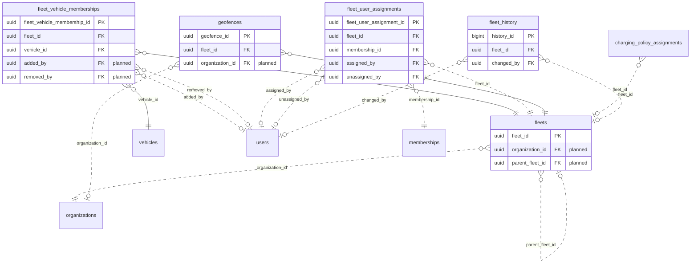

<!-- GENERATED from domain-model.dbml by .claude/skills/domain-model/scripts/domain_model.py - do not edit by hand; edit the .dbml and regenerate. -->

# Fleet

[← Overview](../overview.md)

✅ built: 3 · 📋 planned: 2

Groups of vehicles managed together by a fleet manager.

- A **fleet** is a group inside one organization, and can sit under another fleet, so each customer models its own structure (region > branch > depot...) as data.
- A vehicle is in at most one fleet at a time; a fleet holds many vehicles. **Memberships** keep the history.
- A fleet's **geofences** raise an alert when a member vehicle enters or leaves them (F-A5).
- A large organization can limit a fleet manager or dispatcher to some fleets (**user assignments**); an assignment covers that fleet and every fleet below it, and without any they cover the whole organization.

## Diagram

Only key columns are shown. Solid line = built link, dashed = planned. Tables from other domains (no columns): [charging_policy_assignments](policy.md#charging_policy_assignments), [memberships](identity.md#memberships), [organizations](identity.md#organizations), [users](identity.md#users), [vehicles](vehicles.md#vehicles).

## Tables

### fleets

**No. 24** · ✅ built · owner: **customer** · features: F-E1

A named group of vehicles inside an organization: a node of the customer's
own structure (region, branch, depot, team - any name, any depth, through
parent_fleet_id). Reorganising is editing data, never the schema.
Change history on (FL-08): renaming, moving or deleting a fleet is a
decision, and a move changes what a manager assigned to a parent fleet can
see (FL-03). Deleting a fleet that still has live sub-fleets is refused.
Check constraint (FL-08): num_nonnulls(name, fleet_code) >= 1.

🔍 = tracked column: a change to it copies the whole old row into [fleet_history](#fleet_history).

| Column | Type | Null | Key | References | Meaning | Example |
|---|---|---|---|---|---|---|
| `fleet_id` | uuid | no | PK |  | Internal ID of the fleet. | `8d5f2b7e-1a9c-4f3d-b8e2-6c0a4d9f1e77` |
| `organization_id` | uuid | no | FK 🔍 | [organizations](identity.md#organizations).organization_id (on delete restrict) | **📋 planned (FL-08)**: Organization the fleet belongs to, its own owner (DM-24 case A). | `3f6c2a1e-8b4d-4e2a-9c1f-0a7d5b2e4c11` |
| `parent_fleet_id` | uuid | yes | FK 🔍 | [fleets](#fleets).fleet_id (on delete restrict) | **📋 planned**: The fleet this one sits under, so a customer can build its own structure (region > branch > depot, any depth); NULL for a top-level fleet. Must belong to the same organization and must not create a loop. A user assigned to a fleet also covers every fleet below it. | `NULL` |
| `fleet_code` | varchar(50) | no | UQ 🔍 |  | Short code chosen by the customer, for imports and reports. Planned (FL-08): optional, and unique only within its organization among fleets not deleted. | `HCM-01` |
| `name` | varchar(100) | no | 🔍 |  | Name chosen by the customer, shown in the portal. Planned (FL-08): optional; a fleet has at least a name or a code (check constraint). | `Đội xe Hồ Chí Minh` |
| `status` | fleetstatus | no |  |  | **🗑️ to be removed (FL-08)**: Fleet lifecycle status; a fleet is a grouping, so it either exists or is deleted. | `ACTIVE` |
| `created_at` | timestamptz | no | 🔍 |  | When the row was created (UTC). | `2026-09-01T02:00:00Z` |
| `updated_at` | timestamptz | no | 🔍 |  | When the row was last changed (UTC). | `2026-09-10T07:15:00Z` |
| `deleted_at` | timestamptz | yes | 🔍 |  | Soft-delete time: the fleet no longer exists (DM-25); its member trucks leave it (FL-06) and its history is kept. Why it was deleted is the change reason in its history. NULL while it exists. | `NULL` |

**Enum values**

- `fleetstatus`: ~~ACTIVE~~ (to be removed), ~~INACTIVE~~ (to be removed)

**Indexes**

- `ix_fleets_status` (status) - Dropped with status (FL-08)
- `ix_fleets_fleet_code` (fleet_code) unique - Replaced by uq_fleets_live_organization_code (FL-08)
- `uq_fleets_live_organization_code` (organization_id, fleet_code) unique - Planned (FL-08): WHERE deleted_at IS NULL AND fleet_code IS NOT NULL
- `ix_fleets_organization_id` (organization_id) - Planned (FL-08)
- `ix_fleets_parent_fleet_id` (parent_fleet_id) - Planned (FL-08): walking the tree

**Referenced by**

- [fleets](#fleets).parent_fleet_id (planned)
- [fleet_vehicle_memberships](#fleet_vehicle_memberships).fleet_id
- [fleet_user_assignments](#fleet_user_assignments).fleet_id (planned)
- [geofences](#geofences).fleet_id
- [charging_policy_assignments](policy.md#charging_policy_assignments).fleet_id (planned)
- [fleet_history](#fleet_history).fleet_id (planned)

### fleet_history

**No. 24.h** · 📋 planned · owner: **customer** · features: F-E1 · change history of [fleets](#fleets)

Every earlier version of a row of `fleets`: a copy of the whole row, taken just before a change and written by a database trigger in the same transaction. Generated by the domain-model tool from `@tracked *`; never written by hand.

| Column | Type | Null | Key | References | Meaning | Example |
|---|---|---|---|---|---|---|
| `history_id` | bigint | no | PK |  | Auto-increasing ID of the history row. | `1024` |
| `fleet_id` | uuid | yes | FK | [fleets](#fleets).fleet_id (on delete restrict) | Value before the change (fleets.fleet_id). | `8d5f2b7e-1a9c-4f3d-b8e2-6c0a4d9f1e77` |
| `organization_id` | uuid | yes |  |  | Value before the change (fleets.organization_id). | `3f6c2a1e-8b4d-4e2a-9c1f-0a7d5b2e4c11` |
| `parent_fleet_id` | uuid | yes |  |  | Value before the change (fleets.parent_fleet_id). | `NULL` |
| `fleet_code` | varchar(50) | yes |  |  | Value before the change (fleets.fleet_code). | `HCM-01` |
| `name` | varchar(100) | yes |  |  | Value before the change (fleets.name). | `Đội xe Hồ Chí Minh` |
| `created_at` | timestamptz | yes |  |  | Value before the change (fleets.created_at). | `2026-09-01T02:00:00Z` |
| `updated_at` | timestamptz | yes |  |  | Value before the change (fleets.updated_at). | `2026-09-10T07:15:00Z` |
| `deleted_at` | timestamptz | yes |  |  | Value before the change (fleets.deleted_at). | `NULL` |
| `changed_at` | timestamptz | no |  |  | When this version of the row was replaced. | `2026-09-10T07:15:00Z` |
| `changed_by` | uuid | yes | FK | [users](identity.md#users).user_id (on delete restrict) | User who made the change; NULL when the system made it. | `9b2e7d4a-1c3f-4a8e-b6d2-5e0f1a9c3d22` |
| `change_reason` | varchar(200) | no |  |  | Why the row was changed, set by the application for the transaction: typed by the person for an administrative decision, a fixed text for a routine action. A change without a reason fails. | `Customer moved to a new office` |

**Indexes**

- `ix_fleet_history_fleet_id_time` (fleet_id, changed_at)

### fleet_vehicle_memberships

**No. 25** · ✅ built · owner: **customer** · features: F-E1

Which vehicle was in which fleet, and when (open/close history). A truck is
in at most one fleet at a time and the period holds no data of its own, so
DM-22 would put fleet_id on vehicles; the table stays because vehicles must
not depend on fleet (FL-01, FL-09). No change history: a row is only ever
closed (DM-20); added_by / removed_by say who. No reason column: why a truck
left is clear from what happened (moved, sold, fleet deleted).

| Column | Type | Null | Key | References | Meaning | Example |
|---|---|---|---|---|---|---|
| `fleet_vehicle_membership_id` | uuid | no | PK |  | **✏️ built today as `membership_id`, to be renamed**: Internal ID of one membership period. Renamed because memberships.membership_id (identity) means a person in an organization, a different thing (FL-09). | `00000005-5a6b-4c7d-8e9f-0a1b2c3d4e5f` |
| `fleet_id` | uuid | no | FK | [fleets](#fleets).fleet_id (on delete restrict) | Fleet the vehicle is in; the row reads its organization through it (DM-24), since a fleet never moves to another organization. | `8d5f2b7e-1a9c-4f3d-b8e2-6c0a4d9f1e77` |
| `vehicle_id` | uuid | no | FK | [vehicles](vehicles.md#vehicles).vehicle_id (on delete restrict) | Vehicle in the fleet; it must belong to the fleet's organization when added. | `7a4c1e9b-3d2f-4b8a-a6c5-1e0d9f8b7a44` |
| `added_at` | timestamptz | no |  |  | **✏️ built today as `joined_at`, to be renamed**: When the vehicle was added to the fleet (FL-09). | `2026-09-01T00:00:00Z` |
| `removed_at` | timestamptz | yes |  |  | **✏️ built today as `left_at`, to be renamed**: When it was removed; NULL while still a member (FL-09). | `NULL` |
| `added_by` | uuid | yes | FK | [users](identity.md#users).user_id (on delete restrict) | **📋 planned (FL-09)**: User who added the vehicle. | `9b2e7d4a-1c3f-4a8e-b6d2-5e0f1a9c3d22` |
| `removed_by` | uuid | yes | FK | [users](identity.md#users).user_id (on delete restrict) | **📋 planned (FL-09)**: User who removed it; NULL while a member, or when the system closed the period (the truck was sold, VH-12, or the fleet deleted, FL-06). | `NULL` |
| `created_at` | timestamptz | no |  |  | When the row was created (UTC). | `2026-09-01T02:00:00Z` |
| `updated_at` | timestamptz | no |  |  | When the row was last changed (moves when the membership is closed). | `2026-09-10T07:15:00Z` |

**Indexes**

- `ix_fleet_vehicle_memberships_fleet_id` (fleet_id) - Dropped: covered by ix_fleet_vehicle_memberships_fleet_time (FL-09)
- `ix_fleet_vehicle_memberships_fleet_time` (fleet_id, added_at)
- `ix_fleet_vehicle_memberships_vehicle_id` (vehicle_id)
- `uq_fleet_vehicle_memberships_active_vehicle` (vehicle_id) unique - WHERE removed_at IS NULL (built as left_at)

### geofences

**No. 26** · ✅ built · owner: **customer** · features: F-A5

An area whose entry or exit by a member vehicle of its fleet raises an alert.
Scoped to a fleet until customer organizations exist (then it moves to the organization).

| Column | Type | Null | Key | References | Meaning | Example |
|---|---|---|---|---|---|---|
| `geofence_id` | uuid | no | PK |  | Internal ID of the geofence. | `00000003-5a6b-4c7d-8e9f-0a1b2c3d4e5f` |
| `fleet_id` | uuid | no | FK | [fleets](#fleets).fleet_id (on delete restrict) | Fleet whose current member vehicles the area applies to. | `8d5f2b7e-1a9c-4f3d-b8e2-6c0a4d9f1e77` |
| `organization_id` | uuid | yes | FK | [organizations](identity.md#organizations).organization_id (on delete restrict) | **📋 planned**: Customer organization that defined it, once organizations exist; until then a geofence is scoped to a fleet. | `3f6c2a1e-8b4d-4e2a-9c1f-0a7d5b2e4c11` |
| `name` | varchar(100) | no |  |  | Name shown in alerts. | `Kho Tân Uyên` |
| `boundary` | geography(POLYGON,4326) | no |  |  | Area as a WGS84 polygon (longitude first). No spatial index: checks always filter by fleet first. | `POLYGON((106.70 11.05, 106.72 11.05, 106.72 11.07, 106.70 11.07, 106.70 11.05))` |
| `created_at` | timestamptz | no |  |  | When the row was created (UTC). | `2026-09-01T02:00:00Z` |
| `updated_at` | timestamptz | no |  |  | When the row was last changed (UTC). | `2026-09-10T07:15:00Z` |
| `deleted_at` | timestamptz | yes |  |  | Soft-delete time; NULL while the row is live. Rows are never hard-deleted. | `NULL` |

**Indexes**

- `ix_geofences_fleet_id` (fleet_id)

### fleet_user_assignments

**No. 27** · 📋 planned · owner: **customer** · features: F-F1, F-E1

Limits a user's fleet-level roles to some fleets of a large organization
(e.g. one fleet manager for the Hanoi fleet, another for HCMC). A user with
no open row here covers every fleet of their organization. The visible set
is the union of the assigned fleets and every fleet below them, each truck
once, and covers the trucks currently in those fleets (FL-10). A row for a
fleet already covered by an assigned parent is allowed (it keeps access if
the tree changes); the portal warns about it. Lives in the fleet domain, not
identity, so identity keeps depending on no other domain. No change history:
a row is only ever closed (DM-20); assigned_by / unassigned_by say who.

| Column | Type | Null | Key | References | Meaning | Example |
|---|---|---|---|---|---|---|
| `fleet_user_assignment_id` | uuid | no | PK |  | Internal ID of the assignment. | `0000001c-5a6b-4c7d-8e9f-0a1b2c3d4e5f` |
| `fleet_id` | uuid | no | FK | [fleets](#fleets).fleet_id (on delete restrict) | Fleet the user is limited to, together with every fleet below it. Must belong to the membership's organization (checked by the service; the row reads its organization through either, DM-24). | `8d5f2b7e-1a9c-4f3d-b8e2-6c0a4d9f1e77` |
| `membership_id` | uuid | no | FK | [memberships](identity.md#memberships).membership_id (on delete restrict) | Membership (person in this organization) whose fleet-level roles (FLEET_MANAGER, DISPATCHER) apply only to the fleets listed for it. | `00000022-5a6b-4c7d-8e9f-0a1b2c3d4e5f` |
| `assigned_at` | timestamptz | no |  |  | When the user was given this fleet. | `2026-09-01T02:00:00Z` |
| `assigned_by` | uuid | yes | FK | [users](identity.md#users).user_id (on delete restrict) | Who gave it (usually the ORG_ADMIN); NULL when the system did. | `9b2e7d4a-1c3f-4a8e-b6d2-5e0f1a9c3d22` |
| `unassigned_at` | timestamptz | yes |  |  | When it was taken away; NULL while in force. | `NULL` |
| `unassigned_by` | uuid | yes | FK | [users](identity.md#users).user_id (on delete restrict) | Who took it away; NULL while in force, or when the system ended it (the membership ended or the fleet was deleted). | `NULL` |

**Indexes**

- `uq_fleet_user_assignments_active` (fleet_id, membership_id) unique - WHERE unassigned_at IS NULL
