<!-- GENERATED from domain-model.dbml by .claude/skills/domain-model/scripts/domain_model.py - do not edit by hand; edit the .dbml and regenerate. -->

# Identity

[← Overview](../overview.md)

✅ built: 16

Who takes part in the platform, who can log in, and what each person may do.
This is the foundational domain: every other domain may depend on it, and it
depends on none of them. Not built yet.

- An **organization** is a customer (a transport company or an individual owner-driver), our own internal organization (`is_internal`), or a repair/rescue partner (has a `repair_partners` profile). Any of them can own vehicles and drivers; only `is_internal` changes access: internal users see across organizations, everyone else only their own.
- A **user** is one person with one account. Through **memberships** a person can belong to several organizations at once (e.g. their personal organization and the company that hired them); after login they pick the organization to act for. Our own staff are members of an internal organization. Job profiles (e.g. the driver profile) point to a membership, never the other way, so identity depends on no other domain.
- A user holds one or more **roles** (job titles) from a fixed list, kept as history. Roles are permissions only; facts about a job live in a **profile** (e.g. the driver profile), and a role that needs one (DRIVER) requires it to be active.
- **Everyone who uses or receives anything from the system is a user.** A message type belongs to a service (a feature): a user receives it when the service is in one of their roles and in their organization's plan (e.g. e-invoices for ACCOUNTANT, operational alerts for FLEET_MANAGER/DISPATCHER). It then goes to every channel - the app, the fleet portal and e-mail (when an address is on file); otherwise nothing is sent. Marketing messages come later; their consent is designed with them.
- Every access to personal or location data writes an **audit log** entry.

## Diagram

```mermaid
erDiagram
  organizations {
    uuid organization_id PK
    uuid account_manager_id FK
  }
  organization_history {
    bigint history_id PK
    uuid organization_id FK
    uuid changed_by FK
  }
  users {
    uuid user_id PK
    uuid created_by FK
  }
  user_history {
    bigint history_id PK
    uuid user_id FK
    uuid changed_by FK
  }
  user_state {
    uuid user_id PK, FK
    uuid last_organization_id FK
  }
  memberships {
    uuid membership_id PK
    uuid organization_id FK
    uuid user_id FK
    uuid created_by FK
  }
  membership_history {
    bigint history_id PK
    uuid membership_id FK
    uuid changed_by FK
  }
  user_credentials {
    uuid user_credential_id PK
    uuid user_id FK
  }
  user_sessions {
    uuid user_session_id PK
    uuid user_id FK
    uuid organization_id FK
  }
  one_time_codes {
    uuid one_time_code_id PK
    uuid user_id FK
    uuid issued_by FK
  }
  user_consents {
    uuid user_consent_id PK
    uuid user_id FK
    uuid organization_id FK
    uuid legal_document_id FK
  }
  legal_documents {
    uuid legal_document_id PK
    uuid created_by FK
  }
  user_role_assignments {
    uuid user_role_assignment_id PK
    uuid organization_id FK
    uuid membership_id FK
    uuid granted_by FK
    uuid revoked_by FK
  }
  access_audit_logs {
    bigint access_audit_log_id PK
    timestamptz occurred_at PK
    uuid user_id FK
    uuid organization_id FK
  }
  organization_settings {
    uuid organization_id PK, FK
  }
  organization_setting_history {
    bigint history_id PK
    uuid organization_id FK
    uuid changed_by FK
  }
  user_state |o--|| users : "user_id"
  user_credentials }o--|| users : "user_id"
  user_sessions }o--|| users : "user_id"
  user_sessions }o--o| organizations : "organization_id"
  organizations }o--o| users : "account_manager_id"
  users }o--o| users : "created_by"
  memberships }o--|| organizations : "organization_id"
  memberships }o--|| users : "user_id"
  memberships }o--o| users : "created_by"
  user_state }o--o| organizations : "last_organization_id"
  one_time_codes }o--o| users : "user_id"
  one_time_codes }o--o| users : "issued_by"
  user_consents }o--|| users : "user_id"
  user_consents }o--o| organizations : "organization_id"
  user_consents }o--|| legal_documents : "legal_document_id"
  legal_documents }o--|| users : "created_by"
  user_role_assignments }o--|| organizations : "organization_id"
  user_role_assignments }o--|| memberships : "membership_id"
  user_role_assignments }o--o| users : "granted_by"
  user_role_assignments }o--o| users : "revoked_by"
  access_audit_logs }o--o| users : "user_id"
  access_audit_logs }o--o| organizations : "organization_id"
  organization_settings |o--|| organizations : "organization_id"
  vehicles }o--|| organizations : "organization_id"
  batteries }o--|| organizations : "organization_id"
  telematics }o--|| organizations : "organization_id"
  telemetry }o--|| organizations : "organization_id"
  drivers |o..|| memberships : "membership_id"
  driver_vehicle_assignments }o..o| organizations : "organization_id"
  driving_sessions }o..|| organizations : "organization_id"
  trips }o..|| organizations : "organization_id"
  trips }o..o| users : "planned_by"
  fleets }o--|| organizations : "organization_id"
  fleet_vehicle_memberships }o--o| users : "added_by"
  fleet_vehicle_memberships }o--o| users : "removed_by"
  fleet_user_assignments }o..|| memberships : "membership_id"
  fleet_user_assignments }o..o| users : "assigned_by"
  fleet_user_assignments }o..o| users : "unassigned_by"
  geofences }o..o| organizations : "organization_id"
  charging_locations }o..|| organizations : "organization_id"
  charging_location_access }o..|| organizations : "allowed_organization_id"
  charging_location_access }o..|| users : "granted_by"
  charging_location_access }o..o| users : "revoked_by"
  charging_station_commands }o..o| users : "requested_by"
  charging_sessions }o..|| organizations : "organization_id"
  charging_sessions }o..|| users : "started_by"
  notifications }o..|| organizations : "organization_id"
  notification_recipients }o..|| users : "user_id"
  organization_notification_settings }o..|| organizations : "organization_id"
  support_cases }o..o| organizations : "organization_id"
  repair_partners |o..|| organizations : "organization_id"
  maintenance_bookings }o..|| organizations : "organization_id"
  charging_policy_versions }o..|| users : "created_by"
  charging_policy_assignments }o..|| organizations : "organization_id"
  policy_violations }o..|| organizations : "organization_id"
  tariff_versions }o..|| users : "created_by"
  tariffs }o..|| organizations : "organization_id"
  invoices }o..|| organizations : "organization_id"
  invoice_lines }o..|| organizations : "organization_id"
  subscriptions }o..|| organizations : "organization_id"
  payments }o..|| users : "user_id"
  wallets }o..|| users : "user_id"
  wallet_transactions }o..o| users : "created_by"
  driver_scores }o..|| organizations : "organization_id"
  organization_history }o..o| organizations : "organization_id"
  organization_history }o..o| users : "changed_by"
  user_history }o..o| users : "user_id"
  user_history }o..o| users : "changed_by"
  membership_history }o..o| memberships : "membership_id"
  membership_history }o..o| users : "changed_by"
  organization_setting_history }o..o| organization_settings : "organization_id"
  organization_setting_history }o..o| users : "changed_by"
  vehicle_history }o..o| users : "changed_by"
  vehicle_model_history }o..o| users : "changed_by"
  battery_model_history }o..o| users : "changed_by"
  battery_history }o..o| users : "changed_by"
  warranty_history }o..o| users : "changed_by"
  telematic_history }o..o| users : "changed_by"
  driver_history }o..o| users : "changed_by"
  trip_history }o..o| users : "changed_by"
  fleet_history }o..o| users : "changed_by"
  charging_location_history }o..o| users : "changed_by"
  charging_station_history }o..o| users : "changed_by"
  charging_evse_history }o..o| users : "changed_by"
  charging_connector_history }o..o| users : "changed_by"
  organization_notification_setting_history }o..o| users : "changed_by"
  tariff_history }o..o| users : "changed_by"
  charging_session_bill_history }o..o| users : "changed_by"
  wallet_history }o..o| users : "changed_by"
```

Only key columns are shown. Solid line = built link, dashed = planned. Tables from other domains (no columns): [batteries](batteries.md#batteries), [battery_history](batteries.md#battery_history), [battery_model_history](batteries.md#battery_model_history), [charging_connector_history](charging_stations.md#charging_connector_history), [charging_evse_history](charging_stations.md#charging_evse_history), [charging_location_access](charging_stations.md#charging_location_access), [charging_location_history](charging_stations.md#charging_location_history), [charging_locations](charging_stations.md#charging_locations), [charging_policy_assignments](policy.md#charging_policy_assignments), [charging_policy_versions](policy.md#charging_policy_versions), [charging_session_bill_history](billing.md#charging_session_bill_history), [charging_sessions](charging_sessions.md#charging_sessions), [charging_station_commands](charging_stations.md#charging_station_commands), [charging_station_history](charging_stations.md#charging_station_history), [driver_history](drivers.md#driver_history), [driver_scores](scoring.md#driver_scores), [driver_vehicle_assignments](drivers.md#driver_vehicle_assignments), [drivers](drivers.md#drivers), [driving_sessions](drivers.md#driving_sessions), [fleet_history](fleet.md#fleet_history), [fleet_user_assignments](fleet.md#fleet_user_assignments), [fleet_vehicle_memberships](fleet.md#fleet_vehicle_memberships), [fleets](fleet.md#fleets), [geofences](fleet.md#geofences), [invoice_lines](billing.md#invoice_lines), [invoices](billing.md#invoices), [maintenance_bookings](support.md#maintenance_bookings), [notification_recipients](notifications.md#notification_recipients), [notifications](notifications.md#notifications), [organization_notification_setting_history](notifications.md#organization_notification_setting_history), [organization_notification_settings](notifications.md#organization_notification_settings), [payments](billing.md#payments), [policy_violations](policy.md#policy_violations), [repair_partners](support.md#repair_partners), [subscriptions](billing.md#subscriptions), [support_cases](support.md#support_cases), [tariff_history](billing.md#tariff_history), [tariff_versions](billing.md#tariff_versions), [tariffs](billing.md#tariffs), [telematic_history](telematics.md#telematic_history), [telematics](telematics.md#telematics), [telemetry](telemetry.md#telemetry), [trip_history](drivers.md#trip_history), [trips](drivers.md#trips), [vehicle_history](vehicles.md#vehicle_history), [vehicle_model_history](vehicles.md#vehicle_model_history), [vehicles](vehicles.md#vehicles), [wallet_history](billing.md#wallet_history), [wallet_transactions](billing.md#wallet_transactions), [wallets](billing.md#wallets), [warranty_history](warranties.md#warranty_history).

## Tables

### organizations

**No. 1** · ✅ built · owner: **internal** · features: F-F1, F-H3

Every party that people act for: customers (transport companies and
individual owner-drivers), our own internal organization(s), and
repair/rescue partners - all stored the same way. Every organization-owned
row points here through `organization_id`; our own trucks are owned exactly
like a customer's. Only `is_internal` sets organizations apart, for access:
internal users see across organizations, everyone else only their own.
There is no separate contact list: whoever must receive something (invoices,
reminders, alerts) is a user holding the matching role. Contracts and
service packages live in their own tables.
Check constraint: (status = 'CLOSED') = (deleted_at IS NOT NULL) (DM-25).

🔍 = tracked column: a change to it copies the whole old row into [organization_history](#organization_history).

| Column | Type | Null | Key | References | Meaning | Example |
|---|---|---|---|---|---|---|
| `organization_id` | uuid | no | PK |  | Internal ID of the organization. | `3f6c2a1e-8b4d-4e2a-9c1f-0a7d5b2e4c11` |
| `is_internal` | boolean | no | 🔍 |  | TRUE for our own organization(s), the ones running this platform (outsourced staff acting for us, e.g. a hired sales company, are members of it too). Its users see data across every organization and get every feature (no plan limit), still limited to their role (decision ID-44); only an internal organization may hold HEAD_ADMIN and CO_ADMIN. FALSE for every other organization (customers, partners), whose users only see data related to their own organization, with features limited by its plan. A partner is recognised by having a repair_partners profile, not by this flag. The most security-sensitive column of the table: setting it grants cross-organization access. | `false` |
| `legal_form` | varchar(20) | no | 🔍 |  | What kind of legal person the organization is, because the law treats them differently. COMPANY: a registered company (tax code of 10 digits, or 13 for a branch; invoices to the company). INDIVIDUAL: a private person, e.g. an owner-driver with one truck (the 12-digit citizen ID serves as tax code and is personal data: masked, consent required, every view audit-logged). Used to validate tax_code, apply the privacy rules and fill e-invoices. Internal organizations are always COMPANY; a partner may be either (a small workshop is often a household business, whose tax code is the owner's citizen ID). Values: COMPANY \| INDIVIDUAL. | `COMPANY` |
| `display_name` | varchar(200) | no | 🔍 |  | Short name shown in the app and the portal. | `Minh Phát Logistics` |
| `legal_name` | varchar(255) | no | 🔍 |  | Full registered name of the company, or the full name of the person for an INDIVIDUAL; printed on invoices. | `Công ty Cổ phần Vận tải Minh Phát` |
| `tax_code` | varchar(20) | yes | 🔍 |  | Tax code required for e-invoices. COMPANY: the company tax code (10 digits, or 13 for a branch). INDIVIDUAL: for now (since 1 Jul 2025, Circular 86/2024), the 12-digit citizen ID (CCCD) number serves as the personal tax code; it is personal data under Decree 13/2023. Unique among organizations not deleted. | `0312345678` |
| `address` | varchar(500) | yes | 🔍 |  | Registered address, printed on invoices. | `12 Nguyễn Văn Linh, Phường Tân Thuận Tây, Quận 7, TP.HCM` |
| `status` | varchar(20) | no | 🔍 |  | Organization lifecycle. ACTIVE: in service. SUSPENDED: temporarily stopped (e.g. unpaid debt), logins blocked, vehicle data still collected, reversible. CLOSED: has left (no active contract), logins blocked, no new data, data kept for the legal retention period; always together with deleted_at (DM-25); reopened only when a new contract is signed. Values: ACTIVE \| SUSPENDED \| CLOSED. | `ACTIVE` |
| `status_reason` | varchar(200) | yes | 🔍 |  | Why the organization is in its current status; NULL when ACTIVE. | `NULL` |
| `account_manager_id` | uuid | yes | FK 🔍 | [users](#users).user_id (on delete restrict) | Our SALES user responsible for this customer (one at a time); NULL when none is assigned. Reassignments are kept in organization_history. | `0000001f-5a6b-4c7d-8e9f-0a1b2c3d4e5f` |
| `created_at` | timestamptz | no | 🔍 |  | When the row was created (UTC). | `2026-09-01T02:00:00Z` |
| `updated_at` | timestamptz | no | 🔍 |  | When the row was last changed (UTC). | `2026-09-10T07:15:00Z` |
| `deleted_at` | timestamptz | yes | 🔍 |  | Soft-delete time: the row is no longer part of the system, because it left or was entered by mistake (DM-25); all its data is kept, and the reason is in status_reason. NULL while it is part of the system. An organization that leaves is CLOSED and soft-deleted; signing a new contract makes it ACTIVE again and clears this. | `NULL` |

**Indexes**

- `uq_organizations_active_tax_code` (tax_code) unique - WHERE deleted_at IS NULL

**Referenced by**

- [user_sessions](#user_sessions).organization_id
- [memberships](#memberships).organization_id
- [user_state](#user_state).last_organization_id
- [user_consents](#user_consents).organization_id
- [user_role_assignments](#user_role_assignments).organization_id
- [access_audit_logs](#access_audit_logs).organization_id
- [organization_settings](#organization_settings).organization_id
- [vehicles](vehicles.md#vehicles).organization_id
- [batteries](batteries.md#batteries).organization_id
- [telematics](telematics.md#telematics).organization_id
- [telemetry](telemetry.md#telemetry).organization_id
- [driver_vehicle_assignments](drivers.md#driver_vehicle_assignments).organization_id (planned)
- [driving_sessions](drivers.md#driving_sessions).organization_id (planned)
- [trips](drivers.md#trips).organization_id (planned)
- [fleets](fleet.md#fleets).organization_id
- [geofences](fleet.md#geofences).organization_id (planned)
- [charging_locations](charging_stations.md#charging_locations).organization_id (planned)
- [charging_location_access](charging_stations.md#charging_location_access).allowed_organization_id (planned)
- [charging_sessions](charging_sessions.md#charging_sessions).organization_id (planned)
- [notifications](notifications.md#notifications).organization_id (planned)
- [organization_notification_settings](notifications.md#organization_notification_settings).organization_id (planned)
- [support_cases](support.md#support_cases).organization_id (planned)
- [repair_partners](support.md#repair_partners).organization_id (planned)
- [maintenance_bookings](support.md#maintenance_bookings).organization_id (planned)
- [charging_policy_assignments](policy.md#charging_policy_assignments).organization_id (planned)
- [policy_violations](policy.md#policy_violations).organization_id (planned)
- [tariffs](billing.md#tariffs).organization_id (planned)
- [invoices](billing.md#invoices).organization_id (planned)
- [invoice_lines](billing.md#invoice_lines).organization_id (planned)
- [subscriptions](billing.md#subscriptions).organization_id (planned)
- [driver_scores](scoring.md#driver_scores).organization_id (planned)
- [organization_history](#organization_history).organization_id (planned)

### organization_history

**No. 1.h** · ✅ built · owner: **internal** · features: F-F1, F-H3 · change history of [organizations](#organizations)

Every earlier version of a row of `organizations`: a copy of the whole row, taken just before a change and written by a database trigger in the same transaction. Generated by the domain-model tool from `@tracked *`; never written by hand.

| Column | Type | Null | Key | References | Meaning | Example |
|---|---|---|---|---|---|---|
| `history_id` | bigint | no | PK |  | Auto-increasing ID of the history row. | `1024` |
| `organization_id` | uuid | yes | FK | [organizations](#organizations).organization_id (on delete restrict) | Value before the change (organizations.organization_id). | `3f6c2a1e-8b4d-4e2a-9c1f-0a7d5b2e4c11` |
| `is_internal` | boolean | yes |  |  | Value before the change (organizations.is_internal). | `false` |
| `legal_form` | varchar(20) | yes |  |  | Value before the change (organizations.legal_form). | `COMPANY` |
| `display_name` | varchar(200) | yes |  |  | Value before the change (organizations.display_name). | `Minh Phát Logistics` |
| `legal_name` | varchar(255) | yes |  |  | Value before the change (organizations.legal_name). | `Công ty Cổ phần Vận tải Minh Phát` |
| `tax_code` | varchar(20) | yes |  |  | Value before the change (organizations.tax_code). | `0312345678` |
| `address` | varchar(500) | yes |  |  | Value before the change (organizations.address). | `12 Nguyễn Văn Linh, Phường Tân Thuận Tây, Quận 7, TP.HCM` |
| `status` | varchar(20) | yes |  |  | Value before the change (organizations.status). | `ACTIVE` |
| `status_reason` | varchar(200) | yes |  |  | Value before the change (organizations.status_reason). | `NULL` |
| `account_manager_id` | uuid | yes |  |  | Value before the change (organizations.account_manager_id). | `0000001f-5a6b-4c7d-8e9f-0a1b2c3d4e5f` |
| `created_at` | timestamptz | yes |  |  | Value before the change (organizations.created_at). | `2026-09-01T02:00:00Z` |
| `updated_at` | timestamptz | yes |  |  | Value before the change (organizations.updated_at). | `2026-09-10T07:15:00Z` |
| `deleted_at` | timestamptz | yes |  |  | Value before the change (organizations.deleted_at). | `NULL` |
| `changed_at` | timestamptz | no |  |  | When this version of the row was replaced. | `2026-09-10T07:15:00Z` |
| `changed_by` | uuid | yes | FK | [users](#users).user_id (on delete restrict) | User who made the change; NULL when the system made it. | `9b2e7d4a-1c3f-4a8e-b6d2-5e0f1a9c3d22` |
| `change_reason` | varchar(200) | no |  |  | Why the row was changed, set by the application for the transaction: typed by the person for an administrative decision, a fixed text for a routine action. When the application sets none, the trigger records 'Unspecified change' (DM-29). | `Customer moved to a new office` |

**Indexes**

- `ix_organization_history_organization_id_time` (organization_id, changed_at)

### users

**No. 2** · ✅ built · owner: **internal** · features: F-F1 · live state in [user_state](#user_state)

A person - one account per human, across every organization they work for
(a person may belong to several, through memberships): customer staff, a
driver, our own staff or a partner technician. What they may do comes from their roles (job titles);
facts about a job (e.g. a driver's licence) live in a profile, and a DRIVER
role requires an active driver profile.
Check constraint: deleted_at IS NULL OR status = 'LOCKED' (DM-25).

🔍 = tracked column: a change to it copies the whole old row into [user_history](#user_history).

| Column | Type | Null | Key | References | Meaning | Example |
|---|---|---|---|---|---|---|
| `user_id` | uuid | no | PK |  | Internal ID of the login. | `9b2e7d4a-1c3f-4a8e-b6d2-5e0f1a9c3d22` |
| `email` | varchar(255) | yes | 🔍 |  | E-mail, optional; unique when present among accounts not deleted, ignoring upper/lower case. A message the user is entitled to (its service is in one of their roles and in their organization's plan) goes to the app, the fleet portal and, when an address is on file, this e-mail; with no address, nothing is e-mailed. There is no per-user channel choice. | `dieuvan@minhphat.vn` |
| `phone_number` | varchar(20) | no | 🔍 |  | Phone number in E.164 format, required and unique among accounts not deleted: the login ID (login is phone + password; other methods come later). Carriers recycle numbers, so a password reset by OTP on an account inactive for a long time (e.g. 90 days without activity) needs an extra check by customer care or the organization admin before it succeeds. | `+84901234567` |
| `full_name` | varchar(100) | no | 🔍 |  | The person's full name, shown in the app, the portal and audit logs. | `Trần Thị Bình` |
| `status` | varchar(20) | no | 🔍 |  | State of the whole account, across every organization: INVITED (no password set yet), ACTIVE, or LOCKED (only our HEAD_ADMIN/CO_ADMIN lock a whole account; an organization locks a person only in its own membership). Values: INVITED \| ACTIVE \| LOCKED. | `ACTIVE` |
| `status_reason` | varchar(200) | yes | 🔍 |  | Why the account has its current status (e.g. why it was locked or unlocked); NULL when there is nothing to explain. Earlier reasons are kept in user_history. | `Báo mất điện thoại, khóa tạm chờ xác minh` |
| `created_by` | uuid | yes | FK 🔍 | [users](#users).user_id (on delete restrict) | User who created this account (our sales/admin, an ORG_ADMIN, a fleet manager registering a driver); NULL when the person signed up themselves. | `0000001f-5a6b-4c7d-8e9f-0a1b2c3d4e5f` |
| `created_at` | timestamptz | no | 🔍 |  | When the row was created (UTC). | `2026-09-01T02:00:00Z` |
| `updated_at` | timestamptz | no | 🔍 |  | When the row was last changed (UTC). | `2026-09-10T07:15:00Z` |
| `deleted_at` | timestamptz | yes | 🔍 |  | Soft-delete time: the row is no longer part of the system, because it left or was entered by mistake (DM-25); all its data is kept, and the reason is in status_reason. NULL while it is part of the system. A deleted account is also LOCKED, and its phone number and e-mail are free for a new account (ID-28). | `NULL` |

**Indexes**

- `uq_users_active_phone_number` (phone_number) unique - WHERE deleted_at IS NULL
- `uq_users_active_email` (lower(email)) unique - WHERE deleted_at IS NULL AND email IS NOT NULL: case-insensitive

**Referenced by**

- [user_state](#user_state).user_id
- [user_credentials](#user_credentials).user_id
- [user_sessions](#user_sessions).user_id
- [organizations](#organizations).account_manager_id
- [users](#users).created_by
- [memberships](#memberships).user_id
- [memberships](#memberships).created_by
- [one_time_codes](#one_time_codes).user_id
- [one_time_codes](#one_time_codes).issued_by
- [user_consents](#user_consents).user_id
- [legal_documents](#legal_documents).created_by
- [user_role_assignments](#user_role_assignments).granted_by
- [user_role_assignments](#user_role_assignments).revoked_by
- [access_audit_logs](#access_audit_logs).user_id
- [trips](drivers.md#trips).planned_by (planned)
- [fleet_vehicle_memberships](fleet.md#fleet_vehicle_memberships).added_by
- [fleet_vehicle_memberships](fleet.md#fleet_vehicle_memberships).removed_by
- [fleet_user_assignments](fleet.md#fleet_user_assignments).assigned_by (planned)
- [fleet_user_assignments](fleet.md#fleet_user_assignments).unassigned_by (planned)
- [charging_location_access](charging_stations.md#charging_location_access).granted_by (planned)
- [charging_location_access](charging_stations.md#charging_location_access).revoked_by (planned)
- [charging_station_commands](charging_stations.md#charging_station_commands).requested_by (planned)
- [charging_sessions](charging_sessions.md#charging_sessions).started_by (planned)
- [notification_recipients](notifications.md#notification_recipients).user_id (planned)
- [charging_policy_versions](policy.md#charging_policy_versions).created_by (planned)
- [tariff_versions](billing.md#tariff_versions).created_by (planned)
- [payments](billing.md#payments).user_id (planned)
- [wallets](billing.md#wallets).user_id (planned)
- [wallet_transactions](billing.md#wallet_transactions).created_by (planned)
- [organization_history](#organization_history).changed_by (planned)
- [user_history](#user_history).user_id (planned)
- [user_history](#user_history).changed_by (planned)
- [membership_history](#membership_history).changed_by (planned)
- [organization_setting_history](#organization_setting_history).changed_by (planned)
- [vehicle_history](vehicles.md#vehicle_history).changed_by (planned)
- [vehicle_model_history](vehicles.md#vehicle_model_history).changed_by (planned)
- [battery_model_history](batteries.md#battery_model_history).changed_by (planned)
- [battery_history](batteries.md#battery_history).changed_by (planned)
- [warranty_history](warranties.md#warranty_history).changed_by (planned)
- [telematic_history](telematics.md#telematic_history).changed_by (planned)
- [driver_history](drivers.md#driver_history).changed_by (planned)
- [trip_history](drivers.md#trip_history).changed_by (planned)
- [fleet_history](fleet.md#fleet_history).changed_by (planned)
- [charging_location_history](charging_stations.md#charging_location_history).changed_by (planned)
- [charging_station_history](charging_stations.md#charging_station_history).changed_by (planned)
- [charging_evse_history](charging_stations.md#charging_evse_history).changed_by (planned)
- [charging_connector_history](charging_stations.md#charging_connector_history).changed_by (planned)
- [organization_notification_setting_history](notifications.md#organization_notification_setting_history).changed_by (planned)
- [tariff_history](billing.md#tariff_history).changed_by (planned)
- [charging_session_bill_history](billing.md#charging_session_bill_history).changed_by (planned)
- [wallet_history](billing.md#wallet_history).changed_by (planned)

### user_history

**No. 2.h** · ✅ built · owner: **internal** · features: F-F1 · change history of [users](#users)

Every earlier version of a row of `users`: a copy of the whole row, taken just before a change and written by a database trigger in the same transaction. Generated by the domain-model tool from `@tracked *`; never written by hand.

| Column | Type | Null | Key | References | Meaning | Example |
|---|---|---|---|---|---|---|
| `history_id` | bigint | no | PK |  | Auto-increasing ID of the history row. | `1024` |
| `user_id` | uuid | yes | FK | [users](#users).user_id (on delete restrict) | Value before the change (users.user_id). | `9b2e7d4a-1c3f-4a8e-b6d2-5e0f1a9c3d22` |
| `email` | varchar(255) | yes |  |  | Value before the change (users.email). | `dieuvan@minhphat.vn` |
| `phone_number` | varchar(20) | yes |  |  | Value before the change (users.phone_number). | `+84901234567` |
| `full_name` | varchar(100) | yes |  |  | Value before the change (users.full_name). | `Trần Thị Bình` |
| `status` | varchar(20) | yes |  |  | Value before the change (users.status). | `ACTIVE` |
| `status_reason` | varchar(200) | yes |  |  | Value before the change (users.status_reason). | `Báo mất điện thoại, khóa tạm chờ xác minh` |
| `created_by` | uuid | yes |  |  | Value before the change (users.created_by). | `0000001f-5a6b-4c7d-8e9f-0a1b2c3d4e5f` |
| `created_at` | timestamptz | yes |  |  | Value before the change (users.created_at). | `2026-09-01T02:00:00Z` |
| `updated_at` | timestamptz | yes |  |  | Value before the change (users.updated_at). | `2026-09-10T07:15:00Z` |
| `deleted_at` | timestamptz | yes |  |  | Value before the change (users.deleted_at). | `NULL` |
| `changed_at` | timestamptz | no |  |  | When this version of the row was replaced. | `2026-09-10T07:15:00Z` |
| `changed_by` | uuid | yes | FK | [users](#users).user_id (on delete restrict) | User who made the change; NULL when the system made it. | `9b2e7d4a-1c3f-4a8e-b6d2-5e0f1a9c3d22` |
| `change_reason` | varchar(200) | no |  |  | Why the row was changed, set by the application for the transaction: typed by the person for an administrative decision, a fixed text for a routine action. When the application sets none, the trigger records 'Unspecified change' (DM-29). | `Customer moved to a new office` |

**Indexes**

- `ix_user_history_user_id_time` (user_id, changed_at)

### user_state

**No. 3** · ✅ built · owner: **internal** · features: F-F1 · live state of [users](#users)

Live activity of a user, recorded by the system (observations, not decisions):
updated on every login and request, so kept apart from the users profile and
never history-tracked. Created with default values together with the user, so
every user always has exactly one state row. Only the latest values live here;
the history of logins and other account security events is in
access_audit_logs.

| Column | Type | Null | Key | References | Meaning | Example |
|---|---|---|---|---|---|---|
| `user_id` | uuid | no | PK FK | [users](#users).user_id (on delete restrict) | The user this live state belongs to (1:1 with users). | `9b2e7d4a-1c3f-4a8e-b6d2-5e0f1a9c3d22` |
| `last_login_at` | timestamptz | yes |  |  | Latest successful login; NULL if never logged in. | `2026-09-14T23:10:00Z` |
| `last_organization_id` | uuid | yes | FK | [organizations](#organizations).organization_id (on delete restrict) | Organization the user last acted for, opened directly at the next login (for a person who belongs to several organizations). If the person no longer has an active membership there, the login shows the organization picker instead. | `3f6c2a1e-8b4d-4e2a-9c1f-0a7d5b2e4c11` |
| `failed_login_count` | integer | no |  |  | Consecutive failed password attempts since the last successful login; reset to 0 on a successful login and on a successful password reset. Protects against password guessing. | `0` |
| `login_locked_until` | timestamptz | yes |  |  | Logins are refused until this time after too many failures (e.g. 15 minutes after 5 failed attempts); NULL when not locked. Different from a LOCKED account, which an admin decides. Because anyone who knows the phone number could trigger it, the lock is short, a password reset by OTP still works during it and clears it (set back to NULL), and the API also rate-limits attempts per device/IP. | `NULL` |
| `last_active_at` | timestamptz | yes |  |  | Latest request or action in the app or portal; NULL if never active. Written at most once every 5 minutes per user (not on every request), which is precise enough for an inactive-users report. | `2026-09-15T08:42:10Z` |

### memberships

**No. 4** · ✅ built · owner: **customer** · features: F-F1

One person in one organization (owner decision, 2026-10-03: a person may belong to several,
e.g. their personal organization and the company that hired them as a
driver). Roles, fleet limits and job profiles hang off the membership. After
login, a person with several organizations picks one (the last one is
remembered in user_state); every query then filters by that organization.

🔍 = tracked column: a change to it copies the whole old row into [membership_history](#membership_history).

| Column | Type | Null | Key | References | Meaning | Example |
|---|---|---|---|---|---|---|
| `membership_id` | uuid | no | PK |  | Internal ID of the membership: one person in one organization. | `00000022-5a6b-4c7d-8e9f-0a1b2c3d4e5f` |
| `organization_id` | uuid | no | FK 🔍 | [organizations](#organizations).organization_id (on delete restrict) | Organization the person works for or acts for. | `3f6c2a1e-8b4d-4e2a-9c1f-0a7d5b2e4c11` |
| `user_id` | uuid | no | FK 🔍 | [users](#users).user_id (on delete restrict) | The person. | `9b2e7d4a-1c3f-4a8e-b6d2-5e0f1a9c3d22` |
| `status` | varchar(20) | no | 🔍 |  | Standing of the person in this organization only. INVITED: added but not yet accepted (a person already registered elsewhere accepts the invitation in the app). ACTIVE. LOCKED: blocked here by the organization, without affecting their other organizations. Values: INVITED \| ACTIVE \| LOCKED. The organization's ORG_ADMIN cannot be locked or removed: the role is handed over first. If the organization itself is SUSPENDED or CLOSED, its members cannot log in to it, but their memberships are left as they are, so everyone continues if a new contract is signed. | `ACTIVE` |
| `status_reason` | varchar(200) | yes | 🔍 |  | Why the membership has its current status, or why it ended: e.g. why the organization locked the person, or whether they left, were removed or never accepted the invitation. NULL when there is nothing to explain. Earlier reasons are kept in membership_history. | `NULL` |
| `joined_at` | timestamptz | yes | 🔍 |  | When the person accepted and became an active member; NULL while INVITED. When they were added or invited is created_at. | `2026-09-01T02:00:00Z` |
| `left_at` | timestamptz | yes | 🔍 |  | When the person left (or was removed, or the invitation was cancelled); NULL while a member. Why is in status_reason. Their roles end with it, but their history stays. | `NULL` |
| `created_by` | uuid | yes | FK 🔍 | [users](#users).user_id (on delete restrict) | User who added the person (an ORG_ADMIN, our sales/admin, a fleet manager registering a driver); NULL when the person created their own personal organization. | `9b2e7d4a-1c3f-4a8e-b6d2-5e0f1a9c3d22` |
| `created_at` | timestamptz | no | 🔍 |  | When the person was added or invited (UTC). | `2026-08-31T09:00:00Z` |
| `updated_at` | timestamptz | no | 🔍 |  | When the row was last changed (UTC). | `2026-09-10T07:15:00Z` |

**Indexes**

- `uq_memberships_active` (organization_id, user_id) unique - WHERE left_at IS NULL
- `ix_memberships_user_id` (user_id)
- `uq_memberships_id_organization` (membership_id, organization_id) unique - Target of the two-column foreign key from user_role_assignments, so a role can only name its membership's own organization

**Referenced by**

- [user_role_assignments](#user_role_assignments).membership_id
- [drivers](drivers.md#drivers).membership_id (planned)
- [fleet_user_assignments](fleet.md#fleet_user_assignments).membership_id (planned)
- [membership_history](#membership_history).membership_id (planned)

### membership_history

**No. 4.h** · ✅ built · owner: **customer** · features: F-F1 · change history of [memberships](#memberships)

Every earlier version of a row of `memberships`: a copy of the whole row, taken just before a change and written by a database trigger in the same transaction. Generated by the domain-model tool from `@tracked *`; never written by hand.

| Column | Type | Null | Key | References | Meaning | Example |
|---|---|---|---|---|---|---|
| `history_id` | bigint | no | PK |  | Auto-increasing ID of the history row. | `1024` |
| `membership_id` | uuid | yes | FK | [memberships](#memberships).membership_id (on delete restrict) | Value before the change (memberships.membership_id). | `00000022-5a6b-4c7d-8e9f-0a1b2c3d4e5f` |
| `organization_id` | uuid | yes |  |  | Value before the change (memberships.organization_id). | `3f6c2a1e-8b4d-4e2a-9c1f-0a7d5b2e4c11` |
| `user_id` | uuid | yes |  |  | Value before the change (memberships.user_id). | `9b2e7d4a-1c3f-4a8e-b6d2-5e0f1a9c3d22` |
| `status` | varchar(20) | yes |  |  | Value before the change (memberships.status). | `ACTIVE` |
| `status_reason` | varchar(200) | yes |  |  | Value before the change (memberships.status_reason). | `NULL` |
| `joined_at` | timestamptz | yes |  |  | Value before the change (memberships.joined_at). | `2026-09-01T02:00:00Z` |
| `left_at` | timestamptz | yes |  |  | Value before the change (memberships.left_at). | `NULL` |
| `created_by` | uuid | yes |  |  | Value before the change (memberships.created_by). | `9b2e7d4a-1c3f-4a8e-b6d2-5e0f1a9c3d22` |
| `created_at` | timestamptz | yes |  |  | Value before the change (memberships.created_at). | `2026-08-31T09:00:00Z` |
| `updated_at` | timestamptz | yes |  |  | Value before the change (memberships.updated_at). | `2026-09-10T07:15:00Z` |
| `changed_at` | timestamptz | no |  |  | When this version of the row was replaced. | `2026-09-10T07:15:00Z` |
| `changed_by` | uuid | yes | FK | [users](#users).user_id (on delete restrict) | User who made the change; NULL when the system made it. | `9b2e7d4a-1c3f-4a8e-b6d2-5e0f1a9c3d22` |
| `change_reason` | varchar(200) | no |  |  | Why the row was changed, set by the application for the transaction: typed by the person for an administrative decision, a fixed text for a routine action. When the application sets none, the trigger records 'Unspecified change' (DM-29). | `Customer moved to a new office` |

**Indexes**

- `ix_membership_history_membership_id_time` (membership_id, changed_at)

### user_credentials

**No. 5** · ✅ built · owner: **internal** · features: F-F1

How each user logs in. Kept out of the users table so a password hash is
never copied into user history, and so new login methods are new rows, not
new columns. A password change revokes the old row and adds a new one; only
the last 5 revoked passwords per user are kept (for the "don't reuse a recent
password" check), older ones are deleted. Login sessions are not here: each
logged-in device is a row of user_sessions.

| Column | Type | Null | Key | References | Meaning | Example |
|---|---|---|---|---|---|---|
| `user_credential_id` | uuid | no | PK |  | Internal ID of the credential. | `0000001e-5a6b-4c7d-8e9f-0a1b2c3d4e5f` |
| `user_id` | uuid | no | FK | [users](#users).user_id (on delete restrict) | User the credential belongs to. | `9b2e7d4a-1c3f-4a8e-b6d2-5e0f1a9c3d22` |
| `credential_type` | varchar(20) | no |  |  | How the user proves who they are. Only PASSWORD today (with phone_number as the login ID); other methods (OTP, single sign-on) are added later as new values. Values: PASSWORD. | `PASSWORD` |
| `secret_hash` | varchar(255) | no |  |  | One-way hash of the secret (e.g. Argon2id of the password), never the secret itself. Never copied to any history table or log. | `$argon2id$v=19$m=65536,t=3,p=4$...` |
| `created_at` | timestamptz | no |  |  | When the credential was set (e.g. the password chosen). | `2026-09-01T02:00:00Z` |
| `revoked_at` | timestamptz | yes |  |  | When it stopped being valid (replaced by a new password, or revoked); NULL while valid. | `NULL` |

**Indexes**

- `uq_user_credentials_active_type` (user_id, credential_type) unique - WHERE revoked_at IS NULL

### user_sessions

**No. 6** · ✅ built · owner: **internal** · features: F-F1, F-F3

One login of one person on one device or browser, holding both the session
(refresh token) and that device's push token. Ending a session deletes its
row: logout, "log out this device / all devices", a password change, an
account lock, expiry, or Firebase reporting the app uninstalled. The login
and logout history is in access_audit_logs, so nothing is lost. Not
history-tracked.

| Column | Type | Null | Key | References | Meaning | Example |
|---|---|---|---|---|---|---|
| `user_session_id` | uuid | no | PK |  | Internal ID of the session: one login of one person on one device or browser. | `00000023-5a6b-4c7d-8e9f-0a1b2c3d4e5f` |
| `user_id` | uuid | no | FK | [users](#users).user_id (on delete restrict) | The person logged in. A person can have several sessions (phone, tablet, browsers); one app install holds one login at a time. | `9b2e7d4a-1c3f-4a8e-b6d2-5e0f1a9c3d22` |
| `organization_id` | uuid | yes | FK | [organizations](#organizations).organization_id (on delete restrict) | Organization the app is showing on this device right now (a person in several organizations switches without logging in again; every request is still checked against their membership). Not a filter for push: notifications from all the person's organizations reach every session, and opening one switches to its organization. NULL until an organization is picked. | `3f6c2a1e-8b4d-4e2a-9c1f-0a7d5b2e4c11` |
| `platform` | varchar(10) | no |  |  | Where the app runs; also decides the session lifetime. Values: ANDROID \| IOS \| WEB. | `ANDROID` |
| `app_version` | varchar(20) | yes |  |  | App version on the device, for support and forced upgrades; NULL for a browser. | `1.4.2` |
| `device_label` | varchar(100) | yes |  |  | Readable name of the device or browser, shown in the user's "my devices" list. | `Samsung SM-A546E · Android 13` |
| `refresh_token_hash` | varchar(255) | no | UQ |  | One-way hash of the refresh token that keeps the session alive; replaced by a new token each time it is used. Never the token itself. | `9f2c4e…(sha-256)` |
| `push_token` | varchar(512) | yes | UQ |  | Firebase Cloud Messaging token of this device (APNs behind it on iOS), re-sent by the app at login and when it changes; NULL when the user refused notifications or the browser has none. Removed with the session, so a shared phone never gets the previous user's messages. | `fGx1…:APA91b…` |
| `created_at` | timestamptz | no |  |  | When the person logged in. | `2026-09-01T02:00:00Z` |
| `last_used_at` | timestamptz | no |  |  | Last time the session was used (token refresh or request); written at most once every 5 minutes. | `2026-09-15T08:40:00Z` |
| `expires_at` | timestamptz | no |  |  | Future time when the session ends if not used: set at login to now + the lifetime, and pushed forward to last use + the lifetime each time it is used. Lifetimes are settings: 90 days for the driver app, 7 days for the customer portal, 1 day for our internal staff. A request after this time is refused; a cleanup job deletes expired rows. | `2026-12-14T08:40:00Z` |

**Indexes**

- `ix_user_sessions_user_id` (user_id)
- `ix_user_sessions_expires_at` (expires_at) - Cleanup of expired sessions

### one_time_codes

**No. 7** · ✅ built · owner: **internal** · features: F-F1

One-time codes sent by SMS to prove a person holds a phone number: invites,
guest sign-up, password reset and phone changes. Codes are stored only as
hashes, expire quickly, work once, and die after 5 wrong attempts; when
several were sent, only the newest unexpired code for that phone and purpose
is checked. Sending is rate-limited per phone (cooldown and limits are
application rules) to stop SMS-pumping fraud. A short-lived working table: a
row is deleted 1 day after it expires (the send limit looks back at most 24
hours); the permanent record of what happened is in access_audit_logs.

| Column | Type | Null | Key | References | Meaning | Example |
|---|---|---|---|---|---|---|
| `one_time_code_id` | uuid | no | PK |  | Internal ID of the code. | `00000020-5a6b-4c7d-8e9f-0a1b2c3d4e5f` |
| `purpose` | varchar(20) | no |  |  | What the code is for. INVITE: an invited user sets their password. SIGN_UP: a guest proves their phone before the account is created. PASSWORD_RESET: a forgotten password. PHONE_CHANGE: proving a new phone number. Values: INVITE \| SIGN_UP \| PASSWORD_RESET \| PHONE_CHANGE. | `INVITE` |
| `user_id` | uuid | yes | FK | [users](#users).user_id (on delete restrict) | User the code is for; NULL for SIGN_UP, when the account does not exist yet. | `9b2e7d4a-1c3f-4a8e-b6d2-5e0f1a9c3d22` |
| `phone_number` | varchar(20) | no |  |  | Phone number the code was sent to by SMS (E.164). | `+84901234567` |
| `code_hash` | varchar(255) | no |  |  | One-way hash of the code or link token, never the code itself. | `$argon2id$v=19$...` |
| `issued_by` | uuid | yes | FK | [users](#users).user_id (on delete restrict) | User who triggered the code (the admin who sent an invite); NULL when the person asked for it themselves. | `9b2e7d4a-1c3f-4a8e-b6d2-5e0f1a9c3d22` |
| `created_at` | timestamptz | no |  |  | When the code was sent; used for the resend cooldown and per-phone limits. | `2026-09-01T02:00:00Z` |
| `expires_at` | timestamptz | no |  |  | When the code stops working (e.g. 10 minutes for an OTP, 72 hours for an invite link). | `2026-09-04T02:00:00Z` |
| `failed_attempt_count` | integer | no |  |  | Wrong codes typed against this code; starts at 0. At 5 the code is dead and the person must ask for a new one (which counts against the send limit again), so a 6-digit code cannot be guessed. | `0` |
| `used_at` | timestamptz | yes |  |  | When the code was used; NULL while unused. A code works only once. | `NULL` |

**Indexes**

- `ix_one_time_codes_phone_time` (phone_number, created_at) - Resend cooldown and per-phone rate limit

### user_consents

**No. 8** · ✅ built · owner: **internal** · features: F-F1

Proof of who accepted which version of which legal text, when and from where
(Decree 13/2023, Law 91/2025/QH15). Three levels: a company accepts the data
processing agreement on its own behalf (it is responsible for its drivers'
data, we process it for them); an employed driver acknowledges the privacy
notice (no consent, so nothing to withdraw: an objection goes to the
employer); an individual customer accepts the terms, the privacy policy and
location tracking themselves. Accepting the required texts is a condition of
use: withdrawing them means leaving the service, recorded on the account
(status, status_reason), not here. Append-only: a row is written once and
never changed or deleted. Marketing consent is added when marketing exists.

| Column | Type | Null | Key | References | Meaning | Example |
|---|---|---|---|---|---|---|
| `user_consent_id` | uuid | no | PK |  | Internal ID of the acceptance record. | `00000021-5a6b-4c7d-8e9f-0a1b2c3d4e5f` |
| `user_id` | uuid | no | FK | [users](#users).user_id (on delete restrict) | Person who accepted (for a company agreement: the person who accepted on its behalf, normally the ORG_ADMIN). | `9b2e7d4a-1c3f-4a8e-b6d2-5e0f1a9c3d22` |
| `organization_id` | uuid | yes | FK | [organizations](#organizations).organization_id (on delete restrict) | Organization on whose behalf the document was accepted (a DATA_PROCESSING_AGREEMENT); NULL for a person's own acceptance or acknowledgement. | `3f6c2a1e-8b4d-4e2a-9c1f-0a7d5b2e4c11` |
| `legal_document_id` | uuid | no | FK | [legal_documents](#legal_documents).legal_document_id (on delete restrict) | The exact version of the legal text that was accepted; its purpose and version come from legal_documents. | `00000025-5a6b-4c7d-8e9f-0a1b2c3d4e5f` |
| `ip_address` | inet | yes |  |  | IP address the acceptance came from, as proof. | `113.161.42.17` |
| `device_label` | varchar(100) | yes |  |  | Device and app or browser used, copied as text, as proof (app vs portal is visible here). | `Samsung SM-A546E · Android 13 · G3Driver 1.4.2` |
| `accepted_at` | timestamptz | no |  |  | When it was accepted. | `2026-09-01T02:00:00Z` |

**Indexes**

- `uq_user_consents_person_legal_document` (user_id, legal_document_id) unique - WHERE organization_id IS NULL: a person accepts a version once
- `uq_user_consents_organization_legal_document` (organization_id, legal_document_id) unique - WHERE organization_id IS NOT NULL: an organization accepts a version once

### legal_documents

**No. 9** · ✅ built · owner: **internal** · features: F-F1

Every version of every legal text a person or a company accepts, so we can
always show exactly what was accepted, and know which version is current.
Only final texts are stored: adding a row publishes it, and a row is never
edited or deleted. Vietnamese only for now (a language column comes with the
first other language).

| Column | Type | Null | Key | References | Meaning | Example |
|---|---|---|---|---|---|---|
| `legal_document_id` | uuid | no | PK |  | Internal ID of one version of a legal text. | `00000025-5a6b-4c7d-8e9f-0a1b2c3d4e5f` |
| `purpose` | varchar(30) | no |  |  | Which text it is and who accepts it. TERMS_OF_SERVICE, PRIVACY_POLICY: every user. DATA_PROCESSING_AGREEMENT: a company, on its own behalf. PRIVACY_NOTICE: an employed driver acknowledges it. LOCATION_TRACKING: an individual customer consents to it. Values: TERMS_OF_SERVICE \| PRIVACY_POLICY \| DATA_PROCESSING_AGREEMENT \| PRIVACY_NOTICE \| LOCATION_TRACKING. | `PRIVACY_POLICY` |
| `version` | varchar(20) | no |  |  | Version label, unique per purpose. | `2026.10` |
| `title` | varchar(200) | no |  |  | Title shown to the person. | `Chính sách quyền riêng tư G3 Network` |
| `content` | text | no |  |  | The full text exactly as shown, in Vietnamese, final as approved by the legal adviser (drafting happens outside the system). Never changed: a change is a new version. | `(toàn văn)` |
| `created_by` | uuid | no | FK | [users](#users).user_id (on delete restrict) | Our HEAD_ADMIN or CO_ADMIN who published this version (only they may). | `0000001f-5a6b-4c7d-8e9f-0a1b2c3d4e5f` |
| `created_at` | timestamptz | no |  |  | When this version was published and took effect: adding the row is publishing it. The newest version of a purpose is the current one; publishing asks everyone concerned to accept again before they continue. | `2026-10-01T00:00:00Z` |

**Indexes**

- `uq_legal_documents_purpose_version` (purpose, version) unique

**Referenced by**

- [user_consents](#user_consents).legal_document_id

### user_role_assignments

**No. 10** · ✅ built · owner: **customer** · features: F-F1

Which roles a person holds in one organization (through their membership); they can hold several at once (e.g. a director
who is also the fleet manager). Each organization has exactly one active ORG_ADMIN
(owner decision, 2026-10-04): it is handed over, never shared; when the admin
is gone, our CO_ADMIN appoints the next one. Enforced by the database (unique
index); a handover grants the new one and revokes the old one in one
transaction. Other rules: ending a membership
revokes all its roles in the same transaction; HEAD_ADMIN and CO_ADMIN only
in an internal organization; DRIVER requires an active driver profile with a
valid licence; TECHNICIAN is for partner organizations. A role is a bundle of
feature permissions only. Kept as history: a revoked role keeps its
row with revoked_at set.

| Column | Type | Null | Key | References | Meaning | Example |
|---|---|---|---|---|---|---|
| `user_role_assignment_id` | uuid | no | PK |  | Internal ID of the assignment. | `00000001-5a6b-4c7d-8e9f-0a1b2c3d4e5f` |
| `organization_id` | uuid | no | FK | [organizations](#organizations).organization_id (on delete restrict) | Organization of the membership, copied here only because the one-ORG_ADMIN unique index needs it on the same row (the one exception to DM-24). The database guarantees it is the membership's own organization: a two-column foreign key (membership_id, organization_id) → memberships (membership_id, organization_id) refuses any mismatch. | `3f6c2a1e-8b4d-4e2a-9c1f-0a7d5b2e4c11` |
| `membership_id` | uuid | no | FK | [memberships](#memberships).membership_id (on delete restrict) | The membership (person in this organization) that holds the role. | `00000022-5a6b-4c7d-8e9f-0a1b2c3d4e5f` |
| `role` | varchar(30) | no |  |  | The job title the role grants: a bundle of features, the same list for every organization. Data reach comes from the organization (is_internal), not from the role; for a customer the features are the role bundle limited by its plan, for an internal user the whole role bundle (internal-only features such as issuing invoices are never put in any plan). Titles: HEAD_ADMIN (full permissions on everything, internal only), CO_ADMIN (daily administration, internal only, cannot manage admins or is_internal), ORG_ADMIN (manages its own organization users and roles), SALES, ACCOUNTANT, CUSTOMER_CARE, OPERATIONS, MAINTENANCE, WARRANTY, FLEET_MANAGER, DISPATCHER, DRIVER (requires an active driver profile in the organization), TECHNICIAN. A fixed list in code (an enum), not a table. | `FLEET_MANAGER` |
| `granted_at` | timestamptz | no |  |  | When the role was granted. | `2026-09-01T02:00:00Z` |
| `granted_by` | uuid | yes | FK | [users](#users).user_id (on delete restrict) | Who granted the role (an ORG_ADMIN, our sales/admin); NULL when granted by the system (e.g. ORG_ADMIN and DRIVER of a guest's own personal organization at sign-up). | `0000001f-5a6b-4c7d-8e9f-0a1b2c3d4e5f` |
| `revoked_at` | timestamptz | yes |  |  | When the role was revoked; NULL while still held. | `NULL` |
| `revoked_by` | uuid | yes | FK | [users](#users).user_id (on delete restrict) | Who revoked the role; NULL while held, or when the system revoked it (e.g. because the membership ended). | `NULL` |

**Indexes**

- `uq_user_role_assignments_active_role` (membership_id, role) unique - WHERE revoked_at IS NULL
- `uq_user_role_assignments_one_org_admin` (organization_id) unique - WHERE role = ORG_ADMIN AND revoked_at IS NULL: exactly one organization administrator; a handover grants the new one and revokes the old one in one transaction

### access_audit_logs

**No. 11** · ✅ built · owner: **internal** · features: F-F1 · hypertable on `occurred_at`

Append-only record of every access to personal/location data (NF-08) and of
account security events (logins, failed logins, lockouts, logouts, password
and phone changes): who, what, when, from which IP and device, and action-specific
facts in details (e.g. why for an export). A data view is logged once per screen opened, not per refresh.
Changes to personal data are not logged here: the history tables already
record them with who changed them. Kept forever (never deleted); older months
are compressed.

| Column | Type | Null | Key | References | Meaning | Example |
|---|---|---|---|---|---|---|
| `access_audit_log_id` | bigint | no | PK |  | Auto-increasing ID of the audit entry. | `1048576` |
| `occurred_at` | timestamptz | no | PK |  | When the access happened; hypertable time column. | `2026-09-15T08:30:00Z` |
| `user_id` | uuid | yes | FK | [users](#users).user_id (on delete restrict) | Who accessed the data, or whose account the security event is about. NULL only for a failed login with a phone number that matches no account. | `9b2e7d4a-1c3f-4a8e-b6d2-5e0f1a9c3d22` |
| `organization_id` | uuid | yes | FK | [organizations](#organizations).organization_id (on delete restrict) | Organization whose data was accessed. | `3f6c2a1e-8b4d-4e2a-9c1f-0a7d5b2e4c11` |
| `action` | varchar(30) | no |  |  | What happened. Two families. Actions on data: VIEW (one entry when a screen showing personal or location data is opened, not one per refresh) \| EXPORT. Events on a user account (resource_type USER_ACCOUNT): LOGIN_SUCCESS \| LOGIN_FAILED \| LOGIN_LOCKED \| LOGOUT \| PASSWORD_CHANGED \| PHONE_CHANGED. | `VIEW` |
| `resource_type` | varchar(50) | no |  |  | Kind of data accessed; USER_ACCOUNT for account security events. | `VEHICLE_LOCATION_HISTORY` |
| `resource_id` | varchar(100) | yes |  |  | ID of the record accessed, as text. | `7a4c1e9b-3d2f-4b8a-a6c5-1e0d9f8b7a44` |
| `details` | jsonb | yes |  |  | Facts specific to the action, as JSON; NULL when there are none. Keys per action: EXPORT {"reason": text, required}; LOGIN_FAILED {"failure": "WRONG_PASSWORD" \| "UNKNOWN_PHONE" \| "ACCOUNT_LOCKED"}; LOGIN_LOCKED {"locked_minutes": number}. A new key is added here when an action needs one, never as a new column. | `{"reason": "Ticket #1234 – hồ sơ bồi thường tai nạn"}` |
| `ip_address` | inet | yes |  |  | IP address the request came from; NULL for actions run by the system. | `113.161.42.17` |
| `user_agent` | varchar(255) | yes |  |  | Device and app as reported by the client at that moment, copied as text (not a link to user_sessions, whose rows are removed at logout, because an audit row never changes). Used for login history and new-device alerts. | `G3Driver/1.4.2 (Android 13; SM-A546E)` |

### organization_settings

**No. 12** · ✅ built · owner: **customer** · features: F-F1, F-E4

Settings an organization chooses for itself (ID-45): one row per
organization, created with default values together with it, one typed column
per setting. A new setting is a new column with a default. Change history on,
since a setting is a decision. There is no user or fleet settings table until
a real setting needs one.

🔍 = tracked column: a change to it copies the whole old row into [organization_setting_history](#organization_setting_history).

| Column | Type | Null | Key | References | Meaning | Example |
|---|---|---|---|---|---|---|
| `organization_id` | uuid | no | PK FK | [organizations](#organizations).organization_id (on delete restrict) | The organization these settings belong to (1:1 with organizations). | `3f6c2a1e-8b4d-4e2a-9c1f-0a7d5b2e4c11` |
| `telemetry_interval_seconds` | integer | no | 🔍 |  | How often the T-Boxes on this organization's trucks send telemetry, in seconds (TX-09); default 10, within the backend's allowed bounds. Pushed to every device on its trucks when changed, and to a device when it is mounted. | `10` |
| `driving_session_auto_end_minutes` | integer | no | 🔍 |  | A driving session ends on its own once the truck has not moved for this long (DR-07); default 120. | `120` |
| `created_at` | timestamptz | no | 🔍 |  | When the row was created (UTC). | `2026-09-01T02:00:00Z` |
| `updated_at` | timestamptz | no | 🔍 |  | When a setting was last changed (UTC). | `2026-09-10T07:15:00Z` |

**Referenced by**

- [organization_setting_history](#organization_setting_history).organization_id (planned)

### organization_setting_history

**No. 12.h** · ✅ built · owner: **customer** · features: F-F1, F-E4 · change history of [organization_settings](#organization_settings)

Every earlier version of a row of `organization_settings`: a copy of the whole row, taken just before a change and written by a database trigger in the same transaction. Generated by the domain-model tool from `@tracked *`; never written by hand.

| Column | Type | Null | Key | References | Meaning | Example |
|---|---|---|---|---|---|---|
| `history_id` | bigint | no | PK |  | Auto-increasing ID of the history row. | `1024` |
| `organization_id` | uuid | yes | FK | [organization_settings](#organization_settings).organization_id (on delete restrict) | Value before the change (organization_settings.organization_id). | `3f6c2a1e-8b4d-4e2a-9c1f-0a7d5b2e4c11` |
| `telemetry_interval_seconds` | integer | yes |  |  | Value before the change (organization_settings.telemetry_interval_seconds). | `10` |
| `driving_session_auto_end_minutes` | integer | yes |  |  | Value before the change (organization_settings.driving_session_auto_end_minutes). | `120` |
| `created_at` | timestamptz | yes |  |  | Value before the change (organization_settings.created_at). | `2026-09-01T02:00:00Z` |
| `updated_at` | timestamptz | yes |  |  | Value before the change (organization_settings.updated_at). | `2026-09-10T07:15:00Z` |
| `changed_at` | timestamptz | no |  |  | When this version of the row was replaced. | `2026-09-10T07:15:00Z` |
| `changed_by` | uuid | yes | FK | [users](#users).user_id (on delete restrict) | User who made the change; NULL when the system made it. | `9b2e7d4a-1c3f-4a8e-b6d2-5e0f1a9c3d22` |
| `change_reason` | varchar(200) | no |  |  | Why the row was changed, set by the application for the transaction: typed by the person for an administrative decision, a fixed text for a routine action. When the application sets none, the trigger records 'Unspecified change' (DM-29). | `Customer moved to a new office` |

**Indexes**

- `ix_organization_setting_history_organization_id_time` (organization_id, changed_at)
