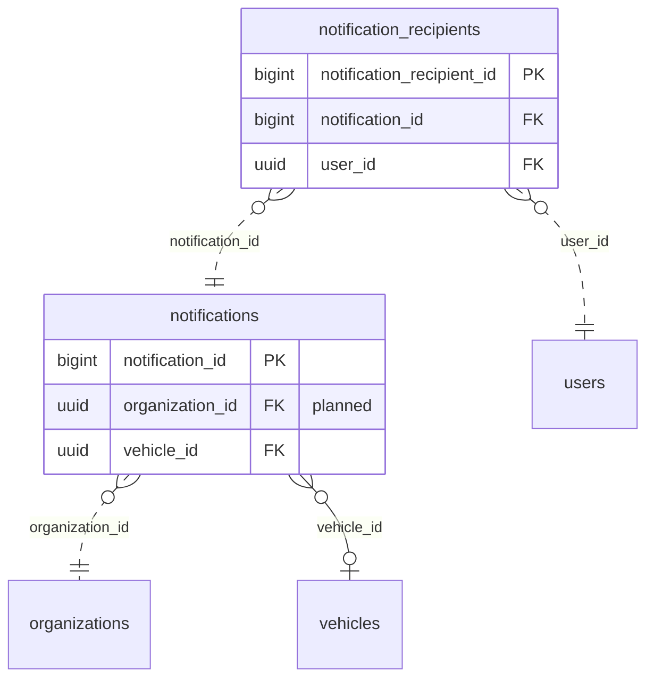

<!-- GENERATED from domain-model.dbml by .claude/skills/domain-model/scripts/domain_model.py - do not edit by hand; edit the .dbml and regenerate. -->

# Notifications

[← Overview](../overview.md)

✅ built: 1 · 📋 planned: 1

Alerts raised by other domains, stored for operators to poll.

- A **notification** is usually about one vehicle.
- It belongs to the organization owning the truck at that moment, and reaches each **recipient** (a person) once, with that person's seen and read state (NT-09, NT-10). Channels at launch: the app and portal inbox, push and e-mail; SMS later (NT-11).

## Diagram

Only key columns are shown. Solid line = built link, dashed = planned. Tables from other domains (no columns): [organizations](identity.md#organizations), [users](identity.md#users), [vehicles](vehicles.md#vehicles).

## Tables

### notifications

**No. 43** · ✅ built · owner: **customer** · features: F-A2, F-A3, F-A4, F-J1, F-J3

One alert (battery, anomaly, SOH, device offline ...). One generic table;
each alert type is an enum value plus a payload shape.
Reviewed last (NT-08) and settled in NT-09: required organization, a generic
subject link that opens the right screen, read state per person in the
recipients table. Append-only; no change history, no soft delete.
Check constraint (NT-09): (subject_type IS NULL) = (subject_id IS NULL).

| Column | Type | Null | Key | References | Meaning | Example |
|---|---|---|---|---|---|---|
| `notification_id` | bigint | no | PK |  | Auto-increasing ID; also the polling cursor (after_id). | `5821` |
| `organization_id` | uuid | no | FK | [organizations](identity.md#organizations).organization_id (on delete restrict) | **📋 planned (NT-09)**: Organization the alert belongs to, written once: the truck's owner at that moment (DM-24 case C). | `3f6c2a1e-8b4d-4e2a-9c1f-0a7d5b2e4c11` |
| `notification_type` | notificationtype | no |  |  | Kind of event that raised it. | `BATTERY_ALERT` |
| `severity` | notificationseverity | no |  |  | How urgent it is, independent of type. | `WARNING` |
| `vehicle_id` | uuid | yes | FK | [vehicles](vehicles.md#vehicles).vehicle_id (on delete cascade) | The truck it concerns, for filtering by truck (NTF-01); NULL when no truck is concerned. Planned (NT-09): its foreign key becomes ON DELETE RESTRICT, like every other link (today CASCADE would delete alerts with their truck). | `7a4c1e9b-3d2f-4b8a-a6c5-1e0d9f8b7a44` |
| `subject_type` | varchar(30) | yes |  |  | **📋 planned (NT-09)**: What the alert is about, and so which screen the app opens (NTF-02): VEHICLE, TELEMATIC, CHARGING_SESSION, SUPPORT_CASE, TRIP, GEOFENCE, WALLET... A new kind adds a value, not a column. No foreign key (it points to different tables); the target always exists since rows are never hard-deleted (DM-25). Opening it applies that screen's own access check. | `TRIP` |
| `subject_id` | uuid | yes |  |  | **📋 planned (NT-09)**: ID of that object; set exactly when subject_type is set. | `2e1c8a5f-0b7d-4e9c-b4a3-6d5f1e8c2b76` |
| `title` | varchar(200) | no |  |  | Short summary. | `Pin còn 20%` |
| `body` | varchar(500) | no |  |  | Longer description. | `Xe 51D-123.45 còn 20% pin. Trạm gần nhất: Trạm sạc G3 Bình Dương (8.4 km).` |
| `payload` | jsonb | no |  |  | Type-specific details as JSON. | `{"threshold": 20, "soc": 19.8, "nearest_station_id": "4b9d6f3a-2e8c-4a1b-9d5e-7f0c3a8b2d88", "distance_m": 8400}` |
| `created_at` | timestamptz | no |  |  | When the notification was raised. | `2026-09-15T08:30:00Z` |
| `read_at` | timestamptz | yes |  |  | **🗑️ to be removed (NT-09)**: When an operator marked it read; moves to the recipients table, because one alert reaches several people. | `NULL` |

**Enum values**

- `notificationtype`: BATTERY_ALERT, ANOMALY_ALERT, SOH_ALERT, DEVICE_OFFLINE_ALERT, SOS_ALERT, GEOFENCE_ALERT, NO_DRIVER_CHECK_IN_ALERT (📋 planned), OUTSIDE_DRIVER_CHECK_IN (📋 planned), NO_TRIP_STARTED (📋 planned), LOW_WALLET_BALANCE (📋 planned), TOP_UP_RECEIVED (📋 planned), CHARGING_RECEIPT (📋 planned)
- `notificationseverity`: INFO, WARNING, CRITICAL

**Indexes**

- `ix_notifications_vehicle_id` (vehicle_id)
- `ix_notifications_organization_cursor` (organization_id, notification_id) - Planned (NT-09): an organization's alerts after a cursor

**Referenced by**

- [notification_recipients](#notification_recipients).notification_id (planned)

### notification_recipients

**No. 44** · 📋 planned · owner: **customer** · features: F-A2, F-F3

Who received an alert, and whether they saw and read it (NT-10). The inbox is
per person across all their organizations (opening an alert switches to its
organization), so the row reads its organization through the alert. Seen
clears the badge count; read is the tap that opens the alert's screen. Mark
all as read sets both on every unread row and is idempotent (NT-04). No
change history, no soft delete.

| Column | Type | Null | Key | References | Meaning | Example |
|---|---|---|---|---|---|---|
| `notification_recipient_id` | bigint | no | PK |  | Auto-increasing internal ID; alerts x people is a large number, so bigint. | `918273` |
| `notification_id` | bigint | no | FK | [notifications](#notifications).notification_id (on delete restrict) | The alert. | `5821` |
| `user_id` | uuid | no | FK | [users](identity.md#users).user_id (on delete restrict) | The person who receives it: someone whose role and data scope include the alert (NTF-06, roles only until plans exist, BL-16), plus the driver checked in to the truck, even from another organization (NT-07). | `9b2e7d4a-1c3f-4a8e-b6d2-5e0f1a9c3d22` |
| `seen_at` | timestamptz | yes |  |  | When the person opened their notification list after it arrived; clears the badge count. | `2026-10-12T00:20:00Z` |
| `read_at` | timestamptz | yes |  |  | When the person tapped it and opened its screen (NT-04: unread is read_at IS NULL). | `NULL` |
| `created_at` | timestamptz | no |  |  | When it reached their inbox (UTC). | `2026-10-12T00:15:00Z` |

**Indexes**

- `uq_notification_recipients_notification_user` (notification_id, user_id) unique
- `ix_notification_recipients_inbox` (user_id, notification_id) - A person's inbox, polled with the cursor (NT-02)
- `ix_notification_recipients_unseen` (user_id) - WHERE seen_at IS NULL: the badge count
