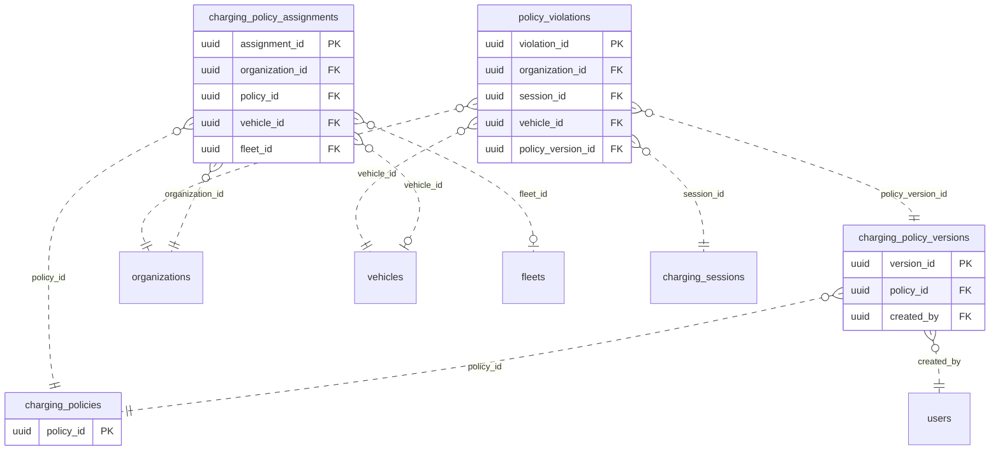

<!-- GENERATED from domain-model.dbml by .claude/skills/domain-model/scripts/domain_model.py - do not edit by hand; edit the .dbml and regenerate. -->

# Policy

[← Overview](../overview.md)

📋 planned: 4

Warranty-linked charging rules and the violations detected against them.

- A **policy** has many immutable **versions**; the values are G3 Mobility's decision.
- A policy is **assigned** to a vehicle, a fleet, or a vehicle model.
- A **violation** links one charging session to the policy version it broke. This needs the session → vehicle link.

## Diagram

Only key columns are shown. Solid line = built link, dashed = planned. Tables from other domains (no columns): [charging_sessions](charging_sessions.md#charging_sessions), [fleets](fleet.md#fleets), [organizations](identity.md#organizations), [users](identity.md#users), [vehicles](vehicles.md#vehicles).

## Tables

### charging_policies

**No. 38** · 📋 planned · owner: **internal** · features: F-B1

A named warranty charging policy defined by G3 Mobility.

| Column | Type | Null | Key | References | Meaning | Example |
|---|---|---|---|---|---|---|
| `policy_id` | uuid | no | PK |  | Internal ID of the policy. | `b8e5a2d9-3c6f-4b1e-a9d7-5f2c0e8b1aee` |
| `policy_code` | varchar(50) | no | UQ |  | Stable code, unique. | `WARRANTY-STD-2026` |
| `name` | varchar(100) | no |  |  | Policy name. | `Chính sách sạc bảo hành tiêu chuẩn` |
| `status` | varchar(20) | no |  |  | Whether the policy is in use. | `ACTIVE` |
| `created_at` | timestamptz | no |  |  | When the row was created (UTC). | `2026-09-01T02:00:00Z` |

**Referenced by**

- [charging_policy_versions](#charging_policy_versions).policy_id (planned)
- [charging_policy_assignments](#charging_policy_assignments).policy_id (planned)

### charging_policy_versions

**No. 39** · 📋 planned · owner: **internal** · features: F-B1

One immutable version of a policy's rules. Every version is kept for audit.

| Column | Type | Null | Key | References | Meaning | Example |
|---|---|---|---|---|---|---|
| `version_id` | uuid | no | PK |  | Internal ID of this version. | `c7d4f1a8-2b5e-4c9d-8f6a-1e3b0d7c4aff` |
| `policy_id` | uuid | no | FK | [charging_policies](#charging_policies).policy_id (on delete restrict) | Policy this version belongs to. | `b8e5a2d9-3c6f-4b1e-a9d7-5f2c0e8b1aee` |
| `version_no` | integer | no |  |  | Version number within the policy, starting at 1. | `3` |
| `soc_min_percent` | numeric(5,2) | yes |  |  | Lowest SOC allowed before charging, in %. | `20.00` |
| `soc_max_percent` | numeric(5,2) | yes |  |  | Highest SOC to charge to, in %. | `90.00` |
| `allowed_window_start` | time | yes |  |  | Start of the allowed daily charging window (local time). | `22:00` |
| `allowed_window_end` | time | yes |  |  | End of the allowed daily charging window (local time). | `06:00` |
| `max_power_kw` | numeric(6,2) | yes |  |  | Maximum charging power allowed, in kW. | `240.00` |
| `effective_from` | timestamptz | no |  |  | When this version takes effect. | `2026-10-01T00:00:00Z` |
| `created_by` | uuid | no | FK | [users](identity.md#users).user_id (on delete restrict) | G3 user who published the version. | `9b2e7d4a-1c3f-4a8e-b6d2-5e0f1a9c3d22` |

**Indexes**

- (unnamed) (policy_id, version_no) unique

**Referenced by**

- [policy_violations](#policy_violations).policy_version_id (planned)

### charging_policy_assignments

**No. 40** · 📋 planned · owner: **customer** · features: F-B1

Which policy applies to a vehicle, a fleet, or a vehicle model.

| Column | Type | Null | Key | References | Meaning | Example |
|---|---|---|---|---|---|---|
| `assignment_id` | uuid | no | PK |  | Internal ID of the assignment. | `0000000e-5a6b-4c7d-8e9f-0a1b2c3d4e5f` |
| `organization_id` | uuid | no | FK | [organizations](identity.md#organizations).organization_id (on delete restrict) | Customer organization the assignment belongs to. | `3f6c2a1e-8b4d-4e2a-9c1f-0a7d5b2e4c11` |
| `policy_id` | uuid | no | FK | [charging_policies](#charging_policies).policy_id (on delete restrict) | Policy applied. | `b8e5a2d9-3c6f-4b1e-a9d7-5f2c0e8b1aee` |
| `vehicle_id` | uuid | yes | FK | [vehicles](vehicles.md#vehicles).vehicle_id (on delete restrict) | Vehicle it applies to, if scoped to one vehicle. Exactly one of vehicle_id / fleet_id / vehicle_model is set. | `NULL` |
| `fleet_id` | uuid | yes | FK | [fleets](fleet.md#fleets).fleet_id (on delete restrict) | Fleet it applies to, if scoped to a fleet. | `8d5f2b7e-1a9c-4f3d-b8e2-6c0a4d9f1e77` |
| `vehicle_model` | varchar(50) | yes |  |  | Model line it applies to, if scoped to a model. | `NULL` |
| `assigned_at` | timestamptz | no |  |  | When the assignment began. | `2026-10-01T00:00:00Z` |
| `unassigned_at` | timestamptz | yes |  |  | When it ended; NULL while in force. | `NULL` |

### policy_violations

**No. 41** · 📋 planned · owner: **customer** · features: F-B3, F-B6

A charging session that broke a policy, with evidence. Consequences are
still an open business question (feature-list item 3).

| Column | Type | Null | Key | References | Meaning | Example |
|---|---|---|---|---|---|---|
| `violation_id` | uuid | no | PK |  | Internal ID of the violation. | `0000000f-5a6b-4c7d-8e9f-0a1b2c3d4e5f` |
| `organization_id` | uuid | no | FK | [organizations](identity.md#organizations).organization_id (on delete restrict) | Customer organization of the vehicle. | `3f6c2a1e-8b4d-4e2a-9c1f-0a7d5b2e4c11` |
| `session_id` | uuid | no | FK | [charging_sessions](charging_sessions.md#charging_sessions).session_id (on delete restrict) | Charging session that broke the policy. | `e5a2d8f1-4b7c-4e9a-b3d6-2c1f0e9a8dbb` |
| `vehicle_id` | uuid | no | FK | [vehicles](vehicles.md#vehicles).vehicle_id (on delete restrict) | Vehicle concerned. | `7a4c1e9b-3d2f-4b8a-a6c5-1e0d9f8b7a44` |
| `policy_version_id` | uuid | no | FK | [charging_policy_versions](#charging_policy_versions).version_id (on delete restrict) | Exact policy version that was broken. | `c7d4f1a8-2b5e-4c9d-8f6a-1e3b0d7c4aff` |
| `violation_type` | varchar(30) | no |  |  | Which rule was broken. | `SOC_ABOVE_MAX` |
| `detected_at` | timestamptz | no |  |  | When the violation was detected. | `2026-09-15T09:45:00Z` |
| `evidence` | jsonb | no |  |  | Snapshot of the data that proves it, as JSON. | `{"soc_end": 98.5, "soc_max": 90, "meter_stop_wh": 1712860}` |
