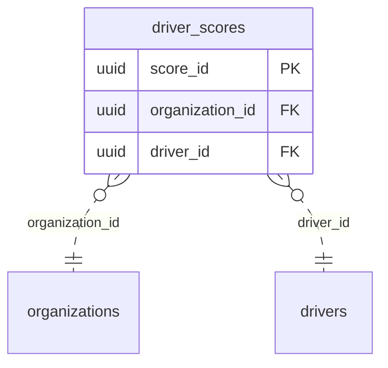

<!-- GENERATED from domain-model.dbml by .claude/skills/domain-model/scripts/domain_model.py - do not edit by hand; edit the .dbml and regenerate. -->

# Scoring

[← Overview](../overview.md)

📋 planned: 1

Driver safety scoring from driving behaviour.

- A driver has one **score** per week, computed from telemetry by the vehicle they drove.

## Diagram

Only key columns are shown. Solid line = built link, dashed = planned. Tables from other domains (no columns): [drivers](drivers.md#drivers), [organizations](identity.md#organizations).

## Tables

### driver_scores

**No. 57** · 📋 planned · owner: **customer** · features: F-K1

A driver's weekly safety score, computed from telemetry.

| Column | Type | Null | Key | References | Meaning | Example |
|---|---|---|---|---|---|---|
| `score_id` | uuid | no | PK |  | Internal ID of the score. | `00000012-5a6b-4c7d-8e9f-0a1b2c3d4e5f` |
| `organization_id` | uuid | no | FK | [organizations](identity.md#organizations).organization_id (on delete restrict) | Customer organization of the driver. | `3f6c2a1e-8b4d-4e2a-9c1f-0a7d5b2e4c11` |
| `driver_id` | uuid | no | FK | [drivers](drivers.md#drivers).driver_id (on delete restrict) | Driver scored. | `6e3b9d2a-4c1f-4e8b-9a7d-0c2e5f1b8d66` |
| `week_start` | date | no |  |  | Monday of the scored week. | `2026-09-14` |
| `score` | numeric(5,2) | no |  |  | Safety score from 0 to 100. | `86.50` |
| `breakdown` | jsonb | yes |  |  | Contribution of each factor, as JSON. | `{"harsh_braking": -6.0, "speeding": -4.5, "continuous_driving": -3.0}` |
| `computed_at` | timestamptz | no |  |  | When the score was calculated. | `2026-09-21T17:00:00Z` |

**Indexes**

- (unnamed) (driver_id, week_start) unique
