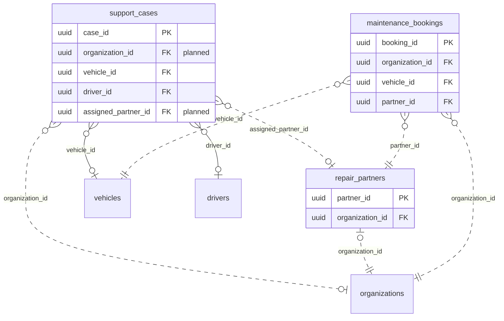

<!-- GENERATED from domain-model.dbml by .claude/skills/domain-model/scripts/domain_model.py - do not edit by hand; edit the .dbml and regenerate. -->

# Support

[← Overview](../overview.md)

✅ built: 1 · 📋 planned: 2

Customer support: tickets, SOS, rescue dispatch, and maintenance bookings.

- A **support case** (ticket or SOS) is about a vehicle and/or a driver of one organization.
- Support can dispatch a case to a **repair partner** (F-I4).
- A customer books **maintenance** for a vehicle at a partner (F-I3).

## Diagram

Only key columns are shown. Solid line = built link, dashed = planned. Tables from other domains (no columns): [drivers](drivers.md#drivers), [organizations](identity.md#organizations), [vehicles](vehicles.md#vehicles).

## Tables

### support_cases

**No. 39** · ✅ built · owner: **customer** · features: F-I1, F-I2

One support request: a ticket or an SOS, with its SLA timeline.

| Column | Type | Null | Key | References | Meaning | Example |
|---|---|---|---|---|---|---|
| `case_id` | uuid | no | PK |  | Internal ID of the case. | `0000000c-5a6b-4c7d-8e9f-0a1b2c3d4e5f` |
| `organization_id` | uuid | yes | FK | [organizations](identity.md#organizations).organization_id (on delete restrict) | **📋 planned**: Customer organization the case belongs to. | `3f6c2a1e-8b4d-4e2a-9c1f-0a7d5b2e4c11` |
| `case_type` | supportcasetype | no |  |  | Ordinary ticket or SOS. | `SOS` |
| `category` | supportcasecategory | no |  |  | Business category of the problem. | `BREAKDOWN` |
| `channel` | supportcasechannel | no |  |  | Where the case came in. | `IN_APP` |
| `status` | supportcasestatus | no |  |  | Current lifecycle status. | `ACKNOWLEDGED` |
| `vehicle_id` | uuid | yes | FK | [vehicles](vehicles.md#vehicles).vehicle_id (on delete restrict) | Vehicle concerned, resolved from the VIN; NULL if not resolved. | `7a4c1e9b-3d2f-4b8a-a6c5-1e0d9f8b7a44` |
| `driver_id` | uuid | yes | FK | [drivers](drivers.md#drivers).driver_id (on delete restrict) | Driver who raised the case; NULL if not supplied. | `6e3b9d2a-4c1f-4e8b-9a7d-0c2e5f1b8d66` |
| `assigned_partner_id` | uuid | yes | FK | [repair_partners](#repair_partners).partner_id (on delete restrict) | **📋 planned**: Repair/rescue partner the case was dispatched to. | `a9c6e3b1-5f2d-4a8c-b7e4-3d1f0a6c9bdd` |
| `vin` | varchar(17) | yes |  |  | VIN as sent with the case, kept even if the vehicle changes later. | `LZGJLGR4XNX000123` |
| `error_code` | varchar(50) | yes |  |  | Vehicle fault code active when the case was created, as sent. | `P0A80` |
| `location` | geography(POINT,4326) | yes |  |  | GPS position when the case was created. Snapshot only; no spatial index. | `POINT(106.7009 10.7769)` |
| `subject` | varchar(200) | yes |  |  | Short subject; auto-filled for SOS. | `SOS: xe dừng giữa đường` |
| `description` | text | yes |  |  | Free-text details. | `Xe báo lỗi pin và không khởi động được.` |
| `sla_response_minutes` | integer | no |  |  | Response SLA in force when the case was created, in minutes. | `5` |
| `response_due_at` | timestamptz | no |  |  | Deadline for the first response: creation time + SLA. | `2026-09-15T08:35:00Z` |
| `first_responded_at` | timestamptz | yes |  |  | When the case first left OPEN; NULL while waiting. | `2026-09-15T08:33:10Z` |
| `resolved_at` | timestamptz | yes |  |  | When the case was resolved; NULL until then. | `NULL` |
| `closed_at` | timestamptz | yes |  |  | When the case was closed; NULL until then. | `NULL` |
| `created_at` | timestamptz | no |  |  | When the row was created (UTC). | `2026-09-15T08:30:00Z` |
| `updated_at` | timestamptz | no |  |  | When the row was last changed (UTC). | `2026-09-15T08:33:10Z` |
| `deleted_at` | timestamptz | yes |  |  | Soft-delete time; NULL while the row is live. Rows are never hard-deleted. | `NULL` |

**Enum values**

- `supportcasetype`: TICKET, SOS
- `supportcasecategory`: TECHNICAL, BATTERY, CHARGING, BREAKDOWN, ACCIDENT, BILLING, OTHER
- `supportcasechannel`: IN_APP, ZALO, HOTLINE
- `supportcasestatus`: OPEN, ACKNOWLEDGED, RESOLVED, CLOSED, CANCELLED

**Indexes**

- `ix_support_cases_vehicle_created_at` (vehicle_id, created_at)
- `ix_support_cases_driver_id` (driver_id)
- `ix_support_cases_response_due_pending` (response_due_at) - WHERE first_responded_at IS NULL
- `ix_support_cases_deleted_at` (deleted_at)
- `ix_support_cases_status` (status)
- `ix_support_cases_vehicle_id` (vehicle_id)
- `ix_support_cases_status_created_at` (status, created_at)

### repair_partners

**No. 40** · 📋 planned · owner: **internal** · features: F-I4, F-I3

A workshop or rescue partner that support can dispatch to.

| Column | Type | Null | Key | References | Meaning | Example |
|---|---|---|---|---|---|---|
| `partner_id` | uuid | no | PK |  | Internal ID of the partner. | `a9c6e3b1-5f2d-4a8c-b7e4-3d1f0a6c9bdd` |
| `organization_id` | uuid | no | FK | [organizations](identity.md#organizations).organization_id (on delete restrict) | The partner's row in organizations (type PARTNER); its technicians are users of that organization. | `0000001b-5a6b-4c7d-8e9f-0a1b2c3d4e5f` |
| `name` | varchar(200) | no |  |  | Partner name. | `Garage Tín Phát - Thủ Đức` |
| `partner_type` | varchar(30) | no |  |  | Kind of partner. Values: G3_WORKSHOP \| DEALER \| THIRD_PARTY (feature-list item 9). | `THIRD_PARTY` |
| `location` | geography(POINT,4326) | yes |  |  | Base location (WGS84 point, longitude first). | `POINT(106.7700 10.8500)` |
| `phone_number` | varchar(20) | yes |  |  | Contact number for dispatch. | `+842838123456` |
| `status` | varchar(20) | no |  |  | Whether the partner accepts dispatches. | `ACTIVE` |

**Referenced by**

- [support_cases](#support_cases).assigned_partner_id (planned)
- [maintenance_bookings](#maintenance_bookings).partner_id (planned)

### maintenance_bookings

**No. 41** · 📋 planned · owner: **customer** · features: F-I3

A maintenance appointment for a vehicle at a partner workshop.

| Column | Type | Null | Key | References | Meaning | Example |
|---|---|---|---|---|---|---|
| `booking_id` | uuid | no | PK |  | Internal ID of the booking. | `0000000d-5a6b-4c7d-8e9f-0a1b2c3d4e5f` |
| `organization_id` | uuid | no | FK | [organizations](identity.md#organizations).organization_id (on delete restrict) | Customer organization that booked. | `3f6c2a1e-8b4d-4e2a-9c1f-0a7d5b2e4c11` |
| `vehicle_id` | uuid | no | FK | [vehicles](vehicles.md#vehicles).vehicle_id (on delete restrict) | Vehicle to be serviced. | `7a4c1e9b-3d2f-4b8a-a6c5-1e0d9f8b7a44` |
| `partner_id` | uuid | no | FK | [repair_partners](#repair_partners).partner_id (on delete restrict) | Workshop booked. | `a9c6e3b1-5f2d-4a8c-b7e4-3d1f0a6c9bdd` |
| `scheduled_at` | timestamptz | no |  |  | Appointment time. | `2026-09-20T01:00:00Z` |
| `status` | varchar(20) | no |  |  | Booking status. Values: REQUESTED \| CONFIRMED \| DONE \| CANCELLED. | `CONFIRMED` |
| `created_at` | timestamptz | no |  |  | When the row was created (UTC). | `2026-09-10T07:15:00Z` |
