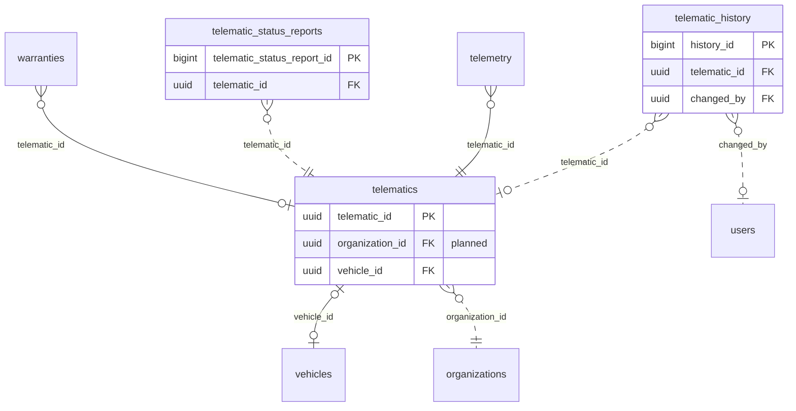

<!-- GENERATED from domain-model.dbml by .claude/skills/domain-model/scripts/domain_model.py - do not edit by hand; edit the .dbml and regenerate. -->

# Telematics

[← Overview](../overview.md)

✅ built: 1 · 📋 planned: 2

The telematic devices that send vehicle data over MQTT.

- A **device** is an asset with its own owner; it is mounted on at most one vehicle, and a vehicle has at most one device.
- What it reports about itself (firmware, SIM, power, signal) is kept as **status reports**, one row per report; its current health is the newest report (TX-11). The send interval is an organization setting (TX-09).

## Diagram

Only key columns are shown. Solid line = built link, dashed = planned. Tables from other domains (no columns): [organizations](identity.md#organizations), [telemetry](telemetry.md#telemetry), [users](identity.md#users), [vehicles](vehicles.md#vehicles), [warranties](warranties.md#warranties).

## Tables

### telematics

**No. 18** · ✅ built · owner: **customer** · features: F-G1, F-J1, F-J2, F-J3

Profile of one telematic device (T-Box): what it is and the decisions about it
(TX-08). The device is an asset with its own owner, the truck's owner or G3
(TX-07); a device the seller owns moves with the truck at a sale. Its owner
and truck are columns with a start time (DM-22); their periods get views when
a feature first needs them (DM-27).
What the device reports about itself is kept in telematic_status_reports;
its current health is the newest report (TX-11).
Check constraint: deleted_at IS NULL OR (status = 'INACTIVE' AND vehicle_id IS NULL) (DM-25).

🔍 = tracked column: a change to it copies the whole old row into [telematic_history](#telematic_history).

| Column | Type | Null | Key | References | Meaning | Example |
|---|---|---|---|---|---|---|
| `telematic_id` | uuid | no | PK |  | Internal ID of the telematic device. | `2c8e5a1d-9f3b-4d7c-b2e6-8a1f0c5d9e55` |
| `imei` | varchar(15) | yes | 🔍 |  | **📋 planned (TX-09)**: The device modem's IMEI, entered at provisioning; fixed hardware identity, unique among devices not deleted. NULL until entered. | `356938035643809` |
| `telematic_serial` | varchar(50) | no | 🔍 |  | Serial printed on the device; also its MQTT identity. Unique among devices not deleted. | `TBX-2409-000123` |
| `organization_id` | uuid | no | FK 🔍 | [organizations](identity.md#organizations).organization_id (on delete restrict) | **📋 planned (TX-07)**: Organization that owns the device now: the truck's owner, or G3 when it supplies the device (e.g. with the subscription). | `3f6c2a1e-8b4d-4e2a-9c1f-0a7d5b2e4c11` |
| `acquired_at` | timestamptz | no | 🔍 |  | **📋 planned (TX-07)**: When the current owner took the device (DM-22). | `2026-06-01T00:00:00Z` |
| `vehicle_id` | uuid | yes | FK 🔍 | [vehicles](vehicles.md#vehicles).vehicle_id (on delete set null) | Truck the device is mounted on now; NULL when in stock or removed. A truck holds at most one device. Earlier trucks are in telematic_history; a view is added when a feature first needs them (DM-27). Planned: its foreign key becomes ON DELETE RESTRICT, like every other link (today SET NULL). | `7a4c1e9b-3d2f-4b8a-a6c5-1e0d9f8b7a44` |
| `installed_at` | timestamptz | yes | 🔍 |  | **📋 planned (TX-08)**: When the device was mounted on its current truck; NULL when not mounted (DM-22). | `2026-06-01T00:00:00Z` |
| `status` | telematicstatus | no | 🔍 |  | Status set by a person (DM-25). ACTIVE: usable. INACTIVE: not usable now, e.g. being repaired; the reason says why. A device that leaves the system (scrapped, returned) is INACTIVE, unmounted and soft-deleted. Mounted or in stock is read from vehicle_id; sending data or silent is computed from telemetry (TX-06). Only a mounted, ACTIVE device receives configuration. | `ACTIVE` |
| `status_reason` | varchar(200) | yes | 🔍 |  | **📋 planned (DM-19)**: Why the device is in its current status; NULL when ACTIVE. | `Antenna replaced at the Hanoi workshop` |
| `firmware_version` | varchar(50) | yes |  |  | **🗑️ to be removed (TX-08)**: Firmware typed in through the API; the device reports it in its status reports (telematic_status_reports). | `1.4.2` |
| `telemetry_interval_seconds` | integer | yes |  |  | **🗑️ to be removed (TX-09)**: Publish interval last pushed to this device; the interval is now an organization setting (organization_settings), and what the device actually uses is in its status reports (telematic_status_reports). | `10` |
| `config_pushed_at` | timestamptz | yes |  |  | **🗑️ to be removed (TX-08)**: When the interval was last pushed; the push happens when the change is saved, so the history's changed_at gives it (DM-23). | `2026-09-12T03:00:00Z` |
| `created_at` | timestamptz | no | 🔍 |  | When the row was created (UTC). | `2026-09-01T02:00:00Z` |
| `updated_at` | timestamptz | no | 🔍 |  | When the row was last changed (UTC). | `2026-09-10T07:15:00Z` |
| `deleted_at` | timestamptz | yes | 🔍 |  | Soft-delete time: the row is no longer part of the system, because it left or was entered by mistake (DM-25); all its data is kept, and the reason is in status_reason. NULL while it is part of the system. Its past trucks stay in the history. | `NULL` |

**Enum values**

- `telematicstatus`: ACTIVE, INACTIVE, ~~MAINTENANCE~~ (to be removed)

**Indexes**

- `ix_telematics_status` (status)
- `ix_telematics_telematic_serial` (telematic_serial) unique - Planned (TX-08): unique only among devices not deleted (WHERE deleted_at IS NULL)
- `ix_telematics_vehicle_id` (vehicle_id) - To be removed (TX-08): the unique index below serves it
- `uq_telematics_active_vehicle` (vehicle_id) unique - WHERE deleted_at IS NULL; planned (TX-08): WHERE vehicle_id IS NOT NULL AND deleted_at IS NULL, one device per truck

**Referenced by**

- [warranties](warranties.md#warranties).telematic_id
- [telematic_status_reports](#telematic_status_reports).telematic_id (planned)
- [telemetry](telemetry.md#telemetry).telematic_id
- [telematic_history](#telematic_history).telematic_id (planned)

### telematic_history

**No. 18.h** · 📋 planned · owner: **customer** · features: F-G1, F-J1, F-J2, F-J3 · change history of [telematics](#telematics)

Every earlier version of a row of `telematics`: a copy of the whole row, taken just before a change and written by a database trigger in the same transaction. Generated by the domain-model tool from `@tracked *`; never written by hand.

| Column | Type | Null | Key | References | Meaning | Example |
|---|---|---|---|---|---|---|
| `history_id` | bigint | no | PK |  | Auto-increasing ID of the history row. | `1024` |
| `telematic_id` | uuid | yes | FK | [telematics](#telematics).telematic_id (on delete restrict) | Value before the change (telematics.telematic_id). | `2c8e5a1d-9f3b-4d7c-b2e6-8a1f0c5d9e55` |
| `imei` | varchar(15) | yes |  |  | Value before the change (telematics.imei). | `356938035643809` |
| `telematic_serial` | varchar(50) | yes |  |  | Value before the change (telematics.telematic_serial). | `TBX-2409-000123` |
| `organization_id` | uuid | yes |  |  | Value before the change (telematics.organization_id). | `3f6c2a1e-8b4d-4e2a-9c1f-0a7d5b2e4c11` |
| `acquired_at` | timestamptz | yes |  |  | Value before the change (telematics.acquired_at). | `2026-06-01T00:00:00Z` |
| `vehicle_id` | uuid | yes |  |  | Value before the change (telematics.vehicle_id). | `7a4c1e9b-3d2f-4b8a-a6c5-1e0d9f8b7a44` |
| `installed_at` | timestamptz | yes |  |  | Value before the change (telematics.installed_at). | `2026-06-01T00:00:00Z` |
| `status` | telematicstatus | yes |  |  | Value before the change (telematics.status). | `ACTIVE` |
| `status_reason` | varchar(200) | yes |  |  | Value before the change (telematics.status_reason). | `Antenna replaced at the Hanoi workshop` |
| `created_at` | timestamptz | yes |  |  | Value before the change (telematics.created_at). | `2026-09-01T02:00:00Z` |
| `updated_at` | timestamptz | yes |  |  | Value before the change (telematics.updated_at). | `2026-09-10T07:15:00Z` |
| `deleted_at` | timestamptz | yes |  |  | Value before the change (telematics.deleted_at). | `NULL` |
| `changed_at` | timestamptz | no |  |  | When this version of the row was replaced. | `2026-09-10T07:15:00Z` |
| `changed_by` | uuid | yes | FK | [users](identity.md#users).user_id (on delete restrict) | User who made the change; NULL when the system made it. | `9b2e7d4a-1c3f-4a8e-b6d2-5e0f1a9c3d22` |
| `change_reason` | varchar(200) | no |  |  | Why the row was changed, set by the application for the transaction: typed by the person for an administrative decision, a fixed text for a routine action. When the application sets none, the trigger records 'Unspecified change' (DM-29). | `Customer moved to a new office` |

**Enum values**

- `telematicstatus`: ACTIVE, INACTIVE

**Indexes**

- `ix_telematic_history_telematic_id_time` (telematic_id, changed_at)

### telematic_status_reports

**No. 19** · 📋 planned · owner: **customer** · features: F-J1, F-J3

Every health report a T-Box sends about itself, about once a day (TX-10), so
trends can be seen (signal getting weaker, voltage dropping before it went
silent). Append-only: rows are never edited, so no change history. An
ordinary table, not a hypertable: about 365 rows per device per year. No
organization_id (DM-24): like other condition data it follows the device to
its next owner (VH-11). Fields are provisional until the vendor confirms the
message (mqtt-spec.md section 2.2).

| Column | Type | Null | Key | References | Meaning | Example |
|---|---|---|---|---|---|---|
| `telematic_status_report_id` | bigint | no | PK |  | Auto-increasing ID of the report. | `51234` |
| `telematic_id` | uuid | no | FK | [telematics](#telematics).telematic_id (on delete restrict) | Device that sent the report. | `2c8e5a1d-9f3b-4d7c-b2e6-8a1f0c5d9e55` |
| `firmware_version` | varchar(50) | yes |  |  | Firmware version reported. | `1.4.2` |
| `telemetry_interval_seconds` | integer | yes |  |  | Publish interval the device said it used. | `10` |
| `sim_iccid` | varchar(22) | yes |  |  | ICCID of the SIM in the device. | `8984049000001234567` |
| `is_esim` | boolean | yes |  |  | TRUE when the SIM is an eSIM. | `false` |
| `sim_data_status` | varchar(20) | yes |  |  | Mobile data status (provisional values: ACTIVE \| NO_DATA \| SUSPENDED \| NO_SIM). | `ACTIVE` |
| `supply_voltage_v` | numeric(5,2) | yes |  |  | Power supply voltage at the device, in volts. | `24.30` |
| `signal_dbm` | smallint | yes |  |  | Mobile signal strength in dBm. | `-78` |
| `storage_used_percent` | numeric(5,2) | yes |  |  | Share of the device's storage in use, 0-100. | `41.50` |
| `gnss_status` | varchar(20) | yes |  |  | Satellite positioning status (provisional values: FIX \| NO_FIX \| ANTENNA_FAULT). | `FIX` |
| `reported_at` | timestamptz | no |  |  | When the device produced the report (its own timestamp, normalized to UTC). | `2026-09-14T00:30:00Z` |
| `received_at` | timestamptz | no |  |  | When the backend received it. | `2026-09-14T00:30:02Z` |

**Indexes**

- `ix_telematic_status_reports_device_time` (telematic_id, reported_at) - A device's reports over time, newest first
