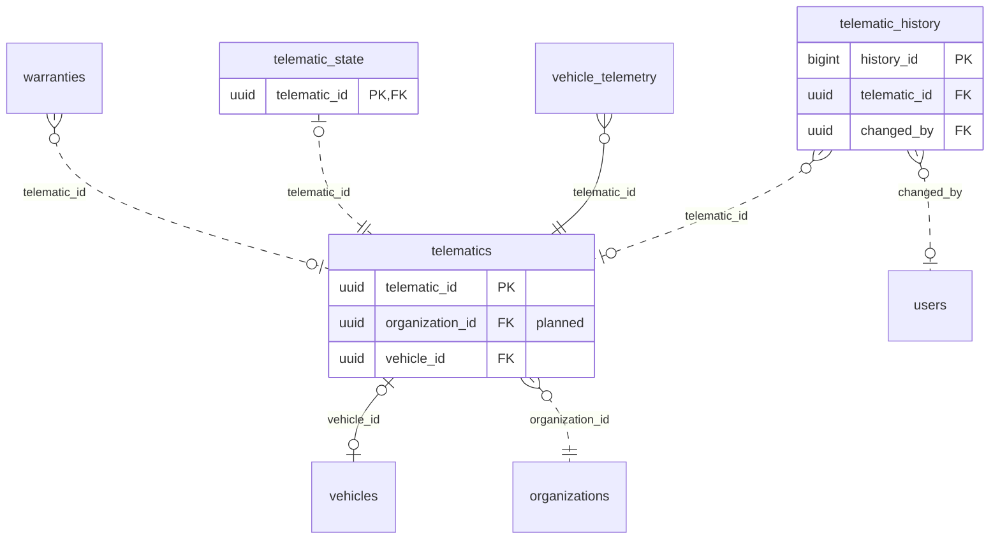

<!-- GENERATED from domain-model.dbml by .claude/skills/domain-model/scripts/domain_model.py - do not edit by hand; edit the .dbml and regenerate. -->

# Telematics

[← Overview](../overview.md)

✅ built: 1 · 📋 planned: 2

The telematic devices that send vehicle data over MQTT.

- A **device** is an asset with its own owner; it is mounted on at most one vehicle, and a vehicle has at most one device.
- Its **state** holds what it reports about itself (firmware); config pushes (F-J2) are decisions on the device profile.

## Diagram

Only key columns are shown. Solid line = built link, dashed = planned. Tables from other domains (no columns): [organizations](identity.md#organizations), [users](identity.md#users), [vehicle_telemetry](telemetry.md#vehicle_telemetry), [vehicles](vehicles.md#vehicles), [warranties](warranties.md#warranties).

## Tables

### telematics

**No. 18** · ✅ built · owner: **customer** · features: F-G1, F-J1, F-J2, F-J3 · live state in [telematic_state](#telematic_state)

Profile of one telematic device (T-Box): what it is and the decisions about it
(TX-08). The device is an asset with its own owner, the truck's owner or G3
(TX-07); a device the seller owns moves with the truck at a sale. Its owner
and truck are columns with a start time (DM-22), their periods read through
the views telematic_ownership_periods and telematic_installation_periods.
What the device reports about itself lives in telematic_state.

🔍 = tracked column: a change to it copies the whole old row into [telematic_history](#telematic_history).

| Column | Type | Null | Key | References | Meaning | Example |
|---|---|---|---|---|---|---|
| `telematic_id` | uuid | no | PK |  | Internal ID of the telematic device. | `2c8e5a1d-9f3b-4d7c-b2e6-8a1f0c5d9e55` |
| `imei` | varchar(15) | yes | 🔍 |  | **📋 planned (TX-09)**: The device modem's IMEI, entered at provisioning; fixed hardware identity, unique among devices not deleted. NULL until entered. | `356938035643809` |
| `telematic_serial` | varchar(50) | no | 🔍 |  | Serial printed on the device; also its MQTT identity. Unique among devices not deleted. | `TBX-2409-000123` |
| `organization_id` | uuid | no | FK 🔍 | [organizations](identity.md#organizations).organization_id (on delete restrict) | **📋 planned (TX-07)**: Organization that owns the device now: the truck's owner, or G3 when it supplies the device (e.g. with the subscription). | `3f6c2a1e-8b4d-4e2a-9c1f-0a7d5b2e4c11` |
| `acquired_at` | timestamptz | no | 🔍 |  | **📋 planned (TX-07)**: When the current owner took the device (DM-22). | `2026-06-01T00:00:00Z` |
| `vehicle_id` | uuid | yes | FK 🔍 | [vehicles](vehicles.md#vehicles).vehicle_id (on delete set null) | Truck the device is mounted on now; NULL when in stock or removed. A truck holds at most one device. Earlier trucks come from the view telematic_installation_periods (DM-22). | `7a4c1e9b-3d2f-4b8a-a6c5-1e0d9f8b7a44` |
| `installed_at` | timestamptz | yes | 🔍 |  | **📋 planned (TX-08)**: When the device was mounted on its current truck; NULL when not mounted (DM-22). | `2026-06-01T00:00:00Z` |
| `status` | telematicstatus | no | 🔍 |  | Status set by a person (TX-08). ACTIVE: usable. MAINTENANCE: being repaired or checked. DECOMMISSIONED: has left the system (scrapped, returned). Mounted or in stock is read from vehicle_id; sending data or silent is computed from telemetry (TX-06). Only a mounted, ACTIVE device receives configuration. | `ACTIVE` |
| `status_reason` | varchar(200) | yes | 🔍 |  | **📋 planned (DM-19)**: Why the device is in its current status; NULL when ACTIVE. | `Antenna replaced at the Hanoi workshop` |
| `firmware_version` | varchar(50) | yes |  |  | **🗑️ to be removed (TX-08)**: Firmware typed in through the API; the device reports it, so it moves to telematic_state. | `1.4.2` |
| `telemetry_interval_seconds` | integer | yes |  |  | **🗑️ to be removed (TX-09)**: Publish interval last pushed to this device; the interval is now an organization setting (organization_settings), and what the device actually uses is reported in telematic_state. | `10` |
| `config_pushed_at` | timestamptz | yes |  |  | **🗑️ to be removed (TX-08)**: When the interval was last pushed; the push happens when the change is saved, so the history's changed_at gives it (DM-23). | `2026-09-12T03:00:00Z` |
| `created_at` | timestamptz | no | 🔍 |  | When the row was created (UTC). | `2026-09-01T02:00:00Z` |
| `updated_at` | timestamptz | no | 🔍 |  | When the row was last changed (UTC). | `2026-09-10T07:15:00Z` |
| `deleted_at` | timestamptz | yes | 🔍 |  | Soft-delete time, only for a device entered by mistake; a real device that leaves is DECOMMISSIONED and unmounted, its past trucks kept in the history (TX-08). NULL while the row is live. | `NULL` |

**Enum values**

- `telematicstatus`: ACTIVE, ~~INACTIVE~~ (to be removed), MAINTENANCE, DECOMMISSIONED (📋 planned)

**Indexes**

- `ix_telematics_status` (status)
- `ix_telematics_telematic_serial` (telematic_serial) unique - Planned (TX-08): unique only among devices not deleted (WHERE deleted_at IS NULL)
- `ix_telematics_vehicle_id` (vehicle_id) - To be removed (TX-08): the unique index below serves it
- `uq_telematics_active_vehicle` (vehicle_id) unique - WHERE deleted_at IS NULL; planned (TX-08): WHERE vehicle_id IS NOT NULL AND deleted_at IS NULL, one device per truck

**Referenced by**

- [warranties](warranties.md#warranties).telematic_id (planned)
- [telematic_state](#telematic_state).telematic_id (planned)
- [vehicle_telemetry](telemetry.md#vehicle_telemetry).telematic_id
- [telematic_history](#telematic_history).telematic_id (planned)

### telematic_history

**No. 18.h** · 📋 planned · owner: **customer** · features: F-G1, F-J1, F-J2, F-J3 · change history of [telematics](#telematics)

Every earlier version of a row of `telematics`: a copy of the whole row, taken just before a change and written by a database trigger in the same transaction. Generated by the domain-model tool from `@tracked *`; never written by hand.

| Column | Type | Null | Key | References | Meaning | Example |
|---|---|---|---|---|---|---|
| `history_id` | bigint | no | PK |  | Auto-increasing ID of the history row. | `1024` |
| `telematic_id` | uuid | yes | FK | [telematics](#telematics).telematic_id (on delete restrict) | Value before the change (telematics.telematic_id). | `2c8e5a1d-9f3b-4d7c-b2e6-8a1f0c5d9e55` |
| `imei` | varchar(15) | yes |  |  | Value before the change (telematics.imei). | `356938035643809` |
| `telematic_serial` | varchar(50) | yes |  |  | Value before the change (telematics.telematic_serial). | `TBX-2409-000123` |
| `organization_id` | uuid | yes |  |  | Value before the change (telematics.organization_id). | `3f6c2a1e-8b4d-4e2a-9c1f-0a7d5b2e4c11` |
| `acquired_at` | timestamptz | yes |  |  | Value before the change (telematics.acquired_at). | `2026-06-01T00:00:00Z` |
| `vehicle_id` | uuid | yes |  |  | Value before the change (telematics.vehicle_id). | `7a4c1e9b-3d2f-4b8a-a6c5-1e0d9f8b7a44` |
| `installed_at` | timestamptz | yes |  |  | Value before the change (telematics.installed_at). | `2026-06-01T00:00:00Z` |
| `status` | telematicstatus | yes |  |  | Value before the change (telematics.status). | `ACTIVE` |
| `status_reason` | varchar(200) | yes |  |  | Value before the change (telematics.status_reason). | `Antenna replaced at the Hanoi workshop` |
| `created_at` | timestamptz | yes |  |  | Value before the change (telematics.created_at). | `2026-09-01T02:00:00Z` |
| `updated_at` | timestamptz | yes |  |  | Value before the change (telematics.updated_at). | `2026-09-10T07:15:00Z` |
| `deleted_at` | timestamptz | yes |  |  | Value before the change (telematics.deleted_at). | `NULL` |
| `changed_at` | timestamptz | no |  |  | When this version of the row was replaced. | `2026-09-10T07:15:00Z` |
| `changed_by` | uuid | yes | FK | [users](identity.md#users).user_id (on delete restrict) | User who made the change; NULL when the system made it. | `9b2e7d4a-1c3f-4a8e-b6d2-5e0f1a9c3d22` |
| `change_reason` | varchar(200) | no |  |  | Why the row was changed, set by the application for the transaction: typed by the person for an administrative decision, a fixed text for a routine action. A change without a reason fails. | `Customer moved to a new office` |

**Enum values**

- `telematicstatus`: ACTIVE, MAINTENANCE, DECOMMISSIONED

**Indexes**

- `ix_telematic_history_telematic_id_time` (telematic_id, changed_at)

### telematic_state

**No. 19** · 📋 planned · owner: **customer** · features: F-G1, F-J1 · live state of [telematics](#telematics)

What the device reports about itself on its MQTT status topic, about once a
day (observations, not decisions): firmware, interval in use, SIM, power,
signal, storage, GNSS (TX-08, TX-09; message fields provisional until the
vendor confirms them). Only the latest values, no change history. Created
together with the device, so every device has exactly one state row. Whether
it is online is computed from telemetry (TX-06), not stored.

| Column | Type | Null | Key | References | Meaning | Example |
|---|---|---|---|---|---|---|
| `telematic_id` | uuid | no | PK FK | [telematics](#telematics).telematic_id (on delete restrict) | The device this state belongs to (1:1 with telematics). | `2c8e5a1d-9f3b-4d7c-b2e6-8a1f0c5d9e55` |
| `firmware_version` | varchar(50) | yes |  |  | Firmware version the device last reported. | `1.4.2` |
| `reported_telemetry_interval_seconds` | integer | yes |  |  | Publish interval the device says it uses; differing from its truck owner's setting means the last push was not applied (TX-09). | `10` |
| `sim_iccid` | varchar(22) | yes |  |  | ICCID of the SIM in the device; changes when the SIM is swapped. | `8984049000001234567` |
| `is_esim` | boolean | yes |  |  | TRUE when the SIM is an eSIM. | `false` |
| `sim_data_status` | varchar(20) | yes |  |  | Mobile data status of the SIM as reported (provisional values: ACTIVE \| NO_DATA \| SUSPENDED \| NO_SIM). | `ACTIVE` |
| `supply_voltage_v` | numeric(5,2) | yes |  |  | Power supply voltage at the device, in volts. | `24.30` |
| `signal_dbm` | smallint | yes |  |  | Mobile signal strength in dBm (closer to 0 is stronger). | `-78` |
| `storage_used_percent` | numeric(5,2) | yes |  |  | Share of the device's storage in use, 0-100. | `41.50` |
| `gnss_status` | varchar(20) | yes |  |  | Satellite positioning status as reported (provisional values: FIX \| NO_FIX \| ANTENNA_FAULT). | `FIX` |
| `reported_at` | timestamptz | yes |  |  | When the latest status report was received; every column above comes from that report. NULL until the first report. | `2026-09-14T00:30:00Z` |
