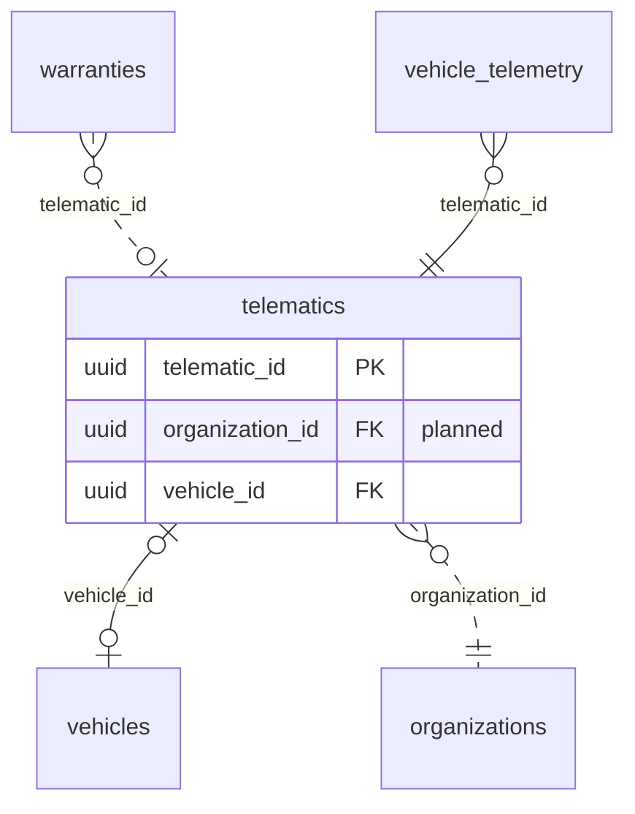

<!-- GENERATED from domain-model.dbml by .claude/skills/domain-model/scripts/domain_model.py - do not edit by hand; edit the .dbml and regenerate. -->

# Telematics

[← Overview](../overview.md)

✅ built: 1

The telematic devices that send vehicle data over MQTT.

- A **device** is mounted on at most one vehicle, and a vehicle has at most one device.
- Device health and config pushes (F-J1/F-J2/F-J3) live on the same row.

## Diagram

Only key columns are shown. Solid line = built link, dashed = planned. Tables from other domains (no columns): [organizations](identity.md#organizations), [vehicle_telemetry](telemetry.md#vehicle_telemetry), [vehicles](vehicles.md#vehicles), [warranties](warranties.md#warranties).

## Tables

### telematics

**No. 18** · ✅ built · owner: **customer** · features: F-G1, F-J1, F-J2, F-J3

One telematic device (T-Box) and the vehicle it is mounted on. The device is an
asset with its own owner, the truck's owner or G3 (TX-07); a device the seller
owns moves with the truck at a sale.

| Column | Type | Null | Key | References | Meaning | Example |
|---|---|---|---|---|---|---|
| `telematic_id` | uuid | no | PK |  | Internal ID of the telematic device. | `2c8e5a1d-9f3b-4d7c-b2e6-8a1f0c5d9e55` |
| `telematic_serial` | varchar(50) | no | UQ |  | Serial printed on the device; also its MQTT identity, unique. | `TBX-2409-000123` |
| `organization_id` | uuid | no | FK | [organizations](identity.md#organizations).organization_id (on delete restrict) | **📋 planned (TX-07)**: Organization that owns the device now: the truck's owner, or G3 when it supplies the device (e.g. with the subscription). | `3f6c2a1e-8b4d-4e2a-9c1f-0a7d5b2e4c11` |
| `acquired_at` | timestamptz | no |  |  | **📋 planned (TX-07)**: When the current owner took the device (DM-22). | `2026-06-01T00:00:00Z` |
| `vehicle_id` | uuid | yes | FK | [vehicles](vehicles.md#vehicles).vehicle_id (on delete set null) | Vehicle the device is mounted on now; NULL when unmounted. At most one live (not soft-deleted) device per vehicle. | `7a4c1e9b-3d2f-4b8a-a6c5-1e0d9f8b7a44` |
| `status` | telematicstatus | no |  |  | Operating status of the device. | `ACTIVE` |
| `firmware_version` | varchar(50) | yes |  |  | Firmware currently running on the device. | `1.4.2` |
| `telemetry_interval_seconds` | integer | yes |  |  | Publish interval last pushed to the device over MQTT (F-J2); NULL until the first push. | `10` |
| `config_pushed_at` | timestamptz | yes |  |  | When that interval was last pushed; NULL until the first push. | `2026-09-12T03:00:00Z` |
| `created_at` | timestamptz | no |  |  | When the row was created (UTC). | `2026-09-01T02:00:00Z` |
| `updated_at` | timestamptz | no |  |  | When the row was last changed (UTC). | `2026-09-10T07:15:00Z` |
| `deleted_at` | timestamptz | yes |  |  | Soft-delete time; NULL while the row is live. Rows are never hard-deleted. | `NULL` |

**Enum values**

- `telematicstatus`: ACTIVE, INACTIVE, MAINTENANCE

**Indexes**

- `ix_telematics_status` (status)
- `ix_telematics_telematic_serial` (telematic_serial) unique
- `ix_telematics_vehicle_id` (vehicle_id)
- `uq_telematics_active_vehicle` (vehicle_id) unique - WHERE deleted_at IS NULL

**Referenced by**

- [warranties](warranties.md#warranties).telematic_id (planned)
- [vehicle_telemetry](telemetry.md#vehicle_telemetry).telematic_id
