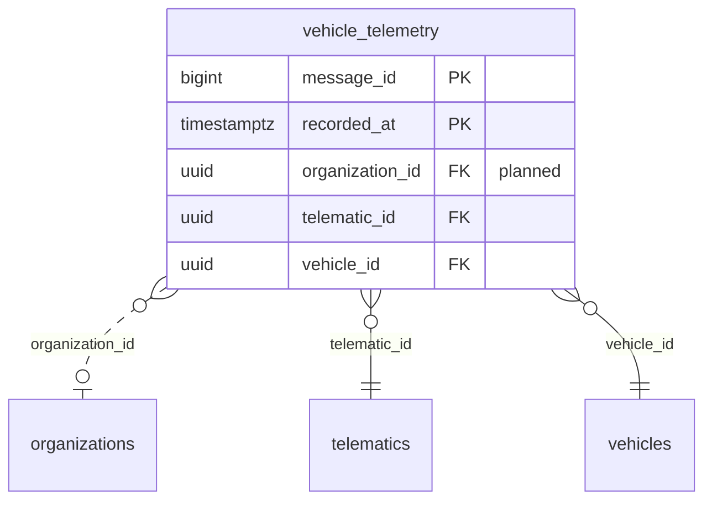

<!-- GENERATED from domain-model.dbml by .claude/skills/domain-model/scripts/domain_model.py - do not edit by hand; edit the .dbml and regenerate. -->

# Telemetry

[← Overview](../overview.md)

✅ built: 1

Everything the vehicle reports: position, battery, motor, errors. Alerts and
energy reports are computed from it.

- Each **sample** comes from one device and is stored against one vehicle.
- Each sample also records the organization that owned the vehicle *at that moment*, so it stays with that owner after a sale (VH-11).

## Diagram

Only key columns are shown. Solid line = built link, dashed = planned. Tables from other domains (no columns): [organizations](identity.md#organizations), [telematics](telematics.md#telematics), [vehicles](vehicles.md#vehicles).

## Tables

### vehicle_telemetry

**No. 17** · ✅ built · owner: **customer** · features: F-A1, F-A2, F-A3, F-A4, F-A6, F-C6 · hypertable on `recorded_at`

One telemetry sample from a vehicle, every 5-10 s per vehicle: the largest table.

| Column | Type | Null | Key | References | Meaning | Example |
|---|---|---|---|---|---|---|
| `message_id` | bigint | no | PK |  | Auto-increasing ID assigned by the backend. | `90213377` |
| `recorded_at` | timestamptz | no | PK |  | When the device recorded the sample; hypertable time column. | `2026-09-15T08:30:00Z` |
| `organization_id` | uuid | yes | FK | [organizations](identity.md#organizations).organization_id (on delete restrict) | **📋 planned (VH-11)**: Customer that owned the vehicle at recorded_at (not today's owner). | `3f6c2a1e-8b4d-4e2a-9c1f-0a7d5b2e4c11` |
| `message_uuid` | uuid | no |  |  | ID the device gives each message, used to spot duplicates. | `5b0e3c7a-9d21-4f6e-8a4b-c3d2e1f0a9b8` |
| `telematic_id` | uuid | no | FK | [telematics](telematics.md#telematics).telematic_id (on delete cascade) | Device that sent the sample. | `2c8e5a1d-9f3b-4d7c-b2e6-8a1f0c5d9e55` |
| `telematic_serial` | varchar(50) | no |  |  | Device serial copied onto the row for audit and debugging. | `TBX-2409-000123` |
| `vehicle_id` | uuid | no | FK | [vehicles](vehicles.md#vehicles).vehicle_id (on delete cascade) | Vehicle the sample describes. | `7a4c1e9b-3d2f-4b8a-a6c5-1e0d9f8b7a44` |
| `received_at` | timestamptz | no |  |  | When the backend received the message. | `2026-09-15T08:30:02Z` |
| `location` | geography(POINT,4326) | no |  |  | GPS position (WGS84 point, longitude first). No spatial index (write-heavy path). | `POINT(106.6297 10.8231)` |
| `speed` | float8 | yes |  |  | Speed in km/h. | `62.5` |
| `heading` | float8 | yes |  |  | Direction of travel in degrees (0-360, 0 = north); NULL if unknown. | `135.0` |
| `soc` | float8 | no |  |  | State of charge: battery left, in % (0-100). | `64.2` |
| `battery_voltage` | float8 | yes |  |  | Pack voltage in volts. | `612.4` |
| `battery_current` | float8 | yes |  |  | Pack current in amperes. | `-85.3` |
| `battery_temperature` | float8 | yes |  |  | Battery temperature in °C. | `34.5` |
| `soh_percent` | float8 | yes |  |  | State of health: capacity left compared with new, in % (F-A3). | `97.8` |
| `cycle_count` | integer | yes |  |  | Cumulative charge/discharge cycles of the pack (F-A3). | `213` |
| `motor_temperature` | float8 | yes |  |  | Motor temperature in °C. | `58.0` |
| `odometer` | float8 | yes |  |  | Total distance driven, in km. | `48213.7` |
| `signal_strength` | bigint | yes |  |  | Cellular signal strength in dBm. | `-71` |
| `error_codes` | jsonb | yes |  |  | Fault codes active at the time, as a JSON array; NULL if none. | `["P0A80", "U0100"]` |
| `raw_payload` | jsonb | no |  |  | Original message exactly as received, for debugging and reprocessing. | `{"serial": "TBX-2409-000123", "soc": 64.2, ...}` |
| `schema_version` | integer | no |  |  | Version of the MQTT message contract the device used (F-A1). | `1` |

**Indexes**

- `ix_vehicle_telemetry_vehicle_time` (vehicle_id, recorded_at DESC)
- `ix_vehicle_telemetry_vehicle_received` (vehicle_id, received_at DESC) - Last time the backend heard from a vehicle (F-J1/F-J3 device-health monitor); uses the receive clock, which a skewed device clock cannot move. @vi Lần cuối backend nhận dữ liệu từ xe (giám sát thiết bị F-J1/F-J3); dùng đồng hồ nhận của backend, không bị lệch giờ thiết bị làm sai.
- `ix_vehicle_telemetry_message_uuid` (message_uuid)
- `uq_telematic_recorded_at` (telematic_id, recorded_at) unique
