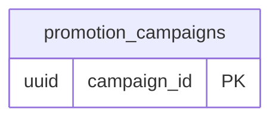

<!-- GENERATED from domain-model.dbml by .claude/skills/domain-model/scripts/domain_model.py - do not edit by hand; edit the .dbml and regenerate. -->

# Unassigned

[← Overview](../overview.md)

📋 planned: 1

Features whose backend domain is not decided yet (see feature-list.md).

## Diagram

Only key columns are shown. Solid line = built link, dashed = planned. 

## Tables

### promotion_campaigns

**No. 64** · 📋 planned · owner: **internal** · features: F-F4

Review parked until PAY-12 starts (BL-17).
A maintenance reminder or promotion campaign.

| Column | Type | Null | Key | References | Meaning | Example |
|---|---|---|---|---|---|---|
| `campaign_id` | uuid | no | PK |  | Internal ID of the campaign. | `00000013-5a6b-4c7d-8e9f-0a1b2c3d4e5f` |
| `name` | varchar(200) | no |  |  | Campaign name. | `Giảm 10% sạc đêm tháng 10` |
| `starts_at` | timestamptz | no |  |  | When the campaign starts. | `2026-10-01T00:00:00Z` |
| `ends_at` | timestamptz | yes |  |  | When it ends; NULL if open-ended. | `2026-10-31T16:59:59Z` |
| `target` | jsonb | yes |  |  | Who receives it, as JSON criteria. | `{"vehicle_models": ["EVT-400"], "organizations": "all"}` |
| `status` | varchar(20) | no |  |  | Campaign status. | `SCHEDULED` |
