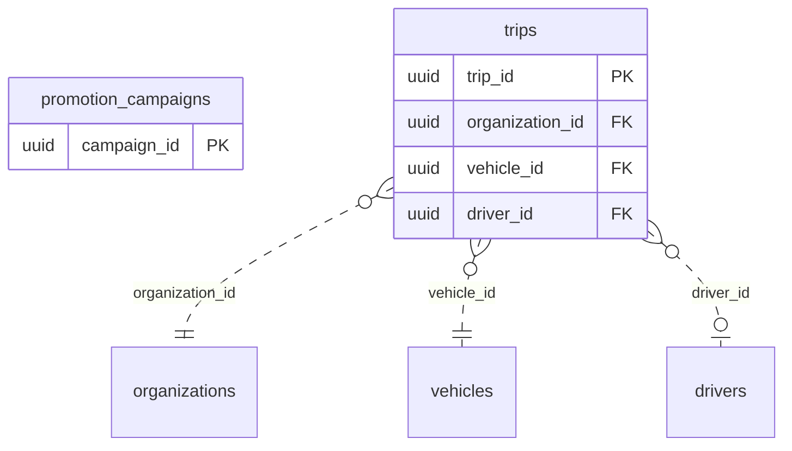

<!-- GENERATED from domain-model.dbml by .claude/skills/domain-model/scripts/domain_model.py - do not edit by hand; edit the .dbml and regenerate. -->

# Unassigned

[← Overview](../overview.md)

📋 planned: 2

Features whose backend domain is not decided yet (see feature-list.md).

## Diagram

Only key columns are shown. Solid line = built link, dashed = planned. Tables from other domains (no columns): [drivers](drivers.md#drivers), [organizations](identity.md#organizations), [vehicles](vehicles.md#vehicles).

## Tables

### promotion_campaigns

**No. 61** · 📋 planned · owner: **internal** · features: F-F4

A maintenance reminder or promotion campaign.

| Column | Type | Null | Key | References | Meaning | Example |
|---|---|---|---|---|---|---|
| `campaign_id` | uuid | no | PK |  | Internal ID of the campaign. | `00000013-5a6b-4c7d-8e9f-0a1b2c3d4e5f` |
| `name` | varchar(200) | no |  |  | Campaign name. | `Giảm 10% sạc đêm tháng 10` |
| `starts_at` | timestamptz | no |  |  | When the campaign starts. | `2026-10-01T00:00:00Z` |
| `ends_at` | timestamptz | yes |  |  | When it ends; NULL if open-ended. | `2026-10-31T16:59:59Z` |
| `target` | jsonb | yes |  |  | Who receives it, as JSON criteria. | `{"vehicle_models": ["EVT-400"], "organizations": "all"}` |
| `status` | varchar(20) | no |  |  | Campaign status. | `SCHEDULED` |

### trips

**No. 62** · 📋 planned · owner: **customer** · features: F-A9

One trip of a vehicle. F-A9 is suspended: no trip concept exists yet.

| Column | Type | Null | Key | References | Meaning | Example |
|---|---|---|---|---|---|---|
| `trip_id` | uuid | no | PK |  | Internal ID of the trip. | `2e1c8a5f-0b7d-4e9c-b4a3-6d5f1e8c2b76` |
| `organization_id` | uuid | no | FK | [organizations](identity.md#organizations).organization_id (on delete restrict) | Customer organization of the vehicle. | `3f6c2a1e-8b4d-4e2a-9c1f-0a7d5b2e4c11` |
| `vehicle_id` | uuid | no | FK | [vehicles](vehicles.md#vehicles).vehicle_id (on delete restrict) | Vehicle that made the trip. | `7a4c1e9b-3d2f-4b8a-a6c5-1e0d9f8b7a44` |
| `driver_id` | uuid | yes | FK | [drivers](drivers.md#drivers).driver_id (on delete restrict) | Driver on the trip, if known. | `6e3b9d2a-4c1f-4e8b-9a7d-0c2e5f1b8d66` |
| `started_at` | timestamptz | no |  |  | When the trip started. | `2026-09-15T00:30:00Z` |
| `ended_at` | timestamptz | yes |  |  | When it ended; NULL while under way. | `2026-09-15T06:10:00Z` |
| `declared_load_status` | varchar(20) | yes |  |  | Load status the driver declared. Values: LOADED \| EMPTY. | `LOADED` |
| `inferred_load_status` | varchar(20) | yes |  |  | Load status inferred from telemetry. Values: LOADED \| EMPTY. | `LOADED` |
