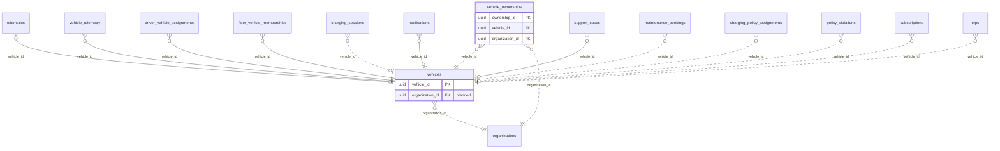

<!-- GENERATED from domain-model.dbml by .claude/skills/domain-model/scripts/domain_model.py - do not edit by hand; edit the .dbml and regenerate. -->

# Vehicles

[← Overview](../overview.md)

✅ built: 1 · 🆕 proposed: 1

The truck itself: identity (VIN, plate), specs, and provisioning state.

- A **vehicle** belongs to one customer organization at a time (D3).
- **Ownership history** records every change of owner, so past data keeps its original owner.
- **One owner only (owner decision, 2026-10-03):** a truck (and a driver profile) belongs to exactly one organization in the system. When parties cooperate (e.g. an owner-driver operating under a transport company's licence), they agree between themselves and declare the owner to us; their cooperation terms are outside our responsibility and are not modelled.

## Diagram

Only key columns are shown. Solid line = built link, dashed = planned. Tables from other domains (no columns): [charging_policy_assignments](policy.md#charging_policy_assignments), [charging_sessions](charging_sessions.md#charging_sessions), [driver_vehicle_assignments](drivers.md#driver_vehicle_assignments), [fleet_vehicle_memberships](fleet.md#fleet_vehicle_memberships), [maintenance_bookings](support.md#maintenance_bookings), [notifications](notifications.md#notifications), [organizations](identity.md#organizations), [policy_violations](policy.md#policy_violations), [subscriptions](billing.md#subscriptions), [support_cases](support.md#support_cases), [telematics](telematics.md#telematics), [trips](unassigned.md#trips), [vehicle_telemetry](telemetry.md#vehicle_telemetry).

## Tables

### vehicles

**No. 12** · ✅ built · owner: **customer** · features: F-F2, F-A6

Static profile of one electric truck.

| Column | Type | Null | Key | References | Meaning | Example |
|---|---|---|---|---|---|---|
| `vehicle_id` | uuid | no | PK |  | Internal ID of the vehicle. | `7a4c1e9b-3d2f-4b8a-a6c5-1e0d9f8b7a44` |
| `organization_id` | uuid | yes | FK | [organizations](identity.md#organizations).organization_id (on delete restrict) | **📋 planned (D3)**: Customer organization that owns the vehicle now. | `3f6c2a1e-8b4d-4e2a-9c1f-0a7d5b2e4c11` |
| `license_plate` | varchar(20) | no | UQ |  | Registration plate, unique. | `51D-123.45` |
| `vin` | varchar(17) | no | UQ |  | 17-character chassis number (VIN), unique; the vehicle's business key. | `LZGJLGR4XNX000123` |
| `make` | varchar(50) | no |  |  | Manufacturer. | `Tri-Ring` |
| `model` | varchar(50) | no |  |  | Model line. | `EVT-400` |
| `year` | integer | no |  |  | Manufacturing year. | `2025` |
| `status` | vehiclestatus | no |  |  | Operating status of the vehicle. | `ACTIVE` |
| `activation_status` | vehicleactivationstatus | no |  |  | Progress through device provisioning (F-F2), independent of status. | `ACTIVATED` |
| `battery_capacity_kwh` | float8 | yes |  |  | Nominal usable pack capacity in kWh, not adjusted for SOH; NULL if unknown (reports fall back to a default). | `282.0` |
| `created_at` | timestamptz | no |  |  | When the row was created (UTC). | `2026-09-01T02:00:00Z` |
| `updated_at` | timestamptz | no |  |  | When the row was last changed (UTC). | `2026-09-10T07:15:00Z` |
| `deleted_at` | timestamptz | yes |  |  | Soft-delete time; NULL while the row is live. Rows are never hard-deleted. | `NULL` |

**Enum values**

- `vehiclestatus`: ACTIVE, INACTIVE, MAINTENANCE, DECOMMISSIONED
- `vehicleactivationstatus`: PENDING, DEVICE_ASSIGNED, ACTIVATED

**Referenced by**

- [vehicle_ownerships](#vehicle_ownerships).vehicle_id (planned)
- [telematics](telematics.md#telematics).vehicle_id
- [vehicle_telemetry](telemetry.md#vehicle_telemetry).vehicle_id
- [driver_vehicle_assignments](drivers.md#driver_vehicle_assignments).vehicle_id
- [fleet_vehicle_memberships](fleet.md#fleet_vehicle_memberships).vehicle_id
- [charging_sessions](charging_sessions.md#charging_sessions).vehicle_id (planned)
- [notifications](notifications.md#notifications).vehicle_id
- [support_cases](support.md#support_cases).vehicle_id
- [maintenance_bookings](support.md#maintenance_bookings).vehicle_id (planned)
- [charging_policy_assignments](policy.md#charging_policy_assignments).vehicle_id (planned)
- [policy_violations](policy.md#policy_violations).vehicle_id (planned)
- [subscriptions](billing.md#subscriptions).vehicle_id (planned)
- [trips](unassigned.md#trips).vehicle_id (planned)

### vehicle_ownerships

**No. 13** · 🆕 proposed · owner: **customer** · features: F-F2

Which organization owned a vehicle, and when. Lets a sold truck's old data stay
with its previous owner (decision D3). Same open/close shape as
fleet_vehicle_memberships.

| Column | Type | Null | Key | References | Meaning | Example |
|---|---|---|---|---|---|---|
| `ownership_id` | uuid | no | PK |  | Internal ID of the ownership period. | `00000002-5a6b-4c7d-8e9f-0a1b2c3d4e5f` |
| `vehicle_id` | uuid | no | FK | [vehicles](#vehicles).vehicle_id (on delete restrict) | Vehicle owned. | `7a4c1e9b-3d2f-4b8a-a6c5-1e0d9f8b7a44` |
| `organization_id` | uuid | no | FK | [organizations](identity.md#organizations).organization_id (on delete restrict) | Customer organization that owned it during this period. | `3f6c2a1e-8b4d-4e2a-9c1f-0a7d5b2e4c11` |
| `started_at` | timestamptz | no |  |  | When this owner took the vehicle (handover). | `2026-06-01T00:00:00Z` |
| `ended_at` | timestamptz | yes |  |  | When ownership ended; NULL for the current owner. | `NULL` |

**Indexes**

- `uq_vehicle_ownerships_active_vehicle` (vehicle_id) unique - WHERE ended_at IS NULL
