<!-- GENERATED from domain-model.dbml by .claude/skills/domain-model/scripts/domain_model.py - do not edit by hand; edit the .dbml and regenerate. -->

# Vehicles

[← Overview](../overview.md)

✅ built: 1 · 📋 planned: 3

The truck itself: identity (VIN, plate), specs, and provisioning state.

- A **vehicle** belongs to one organization at a time (`organization_id`, `acquired_at`); earlier owners are in its change history, and the view `vehicle_ownership_periods` lists every period (VH-10).
- **After a sale (VH-11):** rows recorded under the previous owner (telemetry and what is built from it) stay theirs; the truck's condition (health, faults, maintenance, warranties) and lifetime totals (distance, energy, charge cycles) follow the truck.
- **One owner only (owner decision, 2026-10-03):** a truck (and a driver profile) belongs to exactly one organization in the system. When parties cooperate (e.g. an owner-driver operating under a transport company's licence), they agree between themselves and declare the owner to us; their cooperation terms are outside our responsibility and are not modelled.

## Diagram

```mermaid
erDiagram
  vehicles {
    uuid vehicle_id PK
    uuid organization_id FK "planned"
    uuid vehicle_model_id FK "planned"
  }
  vehicle_history {
    bigint history_id PK
    uuid vehicle_id FK
    uuid changed_by FK
  }
  vehicle_models {
    uuid vehicle_model_id PK
  }
  vehicle_model_history {
    bigint history_id PK
    uuid vehicle_model_id FK
    uuid changed_by FK
  }
  vehicles }o..|| organizations : "organization_id"
  vehicles }o..|| vehicle_models : "vehicle_model_id"
  batteries }o..o| vehicles : "vehicle_id"
  warranties }o..o| vehicles : "vehicle_id"
  telematics |o--o| vehicles : "vehicle_id"
  vehicle_telemetry }o--|| vehicles : "vehicle_id"
  driver_vehicle_assignments }o--|| vehicles : "vehicle_id"
  driving_sessions }o..|| vehicles : "vehicle_id"
  fleet_vehicle_memberships }o--|| vehicles : "vehicle_id"
  charging_sessions }o..o| vehicles : "vehicle_id"
  notifications }o--o| vehicles : "vehicle_id"
  support_cases }o--o| vehicles : "vehicle_id"
  maintenance_bookings }o..|| vehicles : "vehicle_id"
  charging_policy_assignments }o..o| vehicles : "vehicle_id"
  policy_violations }o..|| vehicles : "vehicle_id"
  subscriptions }o..|| vehicles : "vehicle_id"
  trips }o..|| vehicles : "vehicle_id"
  vehicle_history }o..o| vehicles : "vehicle_id"
  vehicle_history }o..o| users : "changed_by"
  vehicle_model_history }o..o| vehicle_models : "vehicle_model_id"
  vehicle_model_history }o..o| users : "changed_by"
```

Only key columns are shown. Solid line = built link, dashed = planned. Tables from other domains (no columns): [batteries](batteries.md#batteries), [charging_policy_assignments](policy.md#charging_policy_assignments), [charging_sessions](charging_sessions.md#charging_sessions), [driver_vehicle_assignments](drivers.md#driver_vehicle_assignments), [driving_sessions](drivers.md#driving_sessions), [fleet_vehicle_memberships](fleet.md#fleet_vehicle_memberships), [maintenance_bookings](support.md#maintenance_bookings), [notifications](notifications.md#notifications), [organizations](identity.md#organizations), [policy_violations](policy.md#policy_violations), [subscriptions](billing.md#subscriptions), [support_cases](support.md#support_cases), [telematics](telematics.md#telematics), [trips](unassigned.md#trips), [users](identity.md#users), [vehicle_telemetry](telemetry.md#vehicle_telemetry), [warranties](warranties.md#warranties).

## Tables

### vehicles

**No. 13** · ✅ built · owner: **customer** · features: F-F2, F-A6

Profile of one electric truck: what it is and the decisions about it. It has
no state table: everything the truck reports comes through its T-Box and is
kept message by message in vehicle_telemetry.

🔍 = tracked column: a change to it copies the whole old row into [vehicle_history](#vehicle_history).

| Column | Type | Null | Key | References | Meaning | Example |
|---|---|---|---|---|---|---|
| `vehicle_id` | uuid | no | PK |  | Internal ID of the vehicle. | `7a4c1e9b-3d2f-4b8a-a6c5-1e0d9f8b7a44` |
| `organization_id` | uuid | no | FK 🔍 | [organizations](identity.md#organizations).organization_id (on delete restrict) | **📋 planned (VH-07)**: Organization that owns the vehicle now; changes when ownership is transferred. Earlier owners are in vehicle_history; the ownership periods come from the view vehicle_ownership_periods (VH-10). | `3f6c2a1e-8b4d-4e2a-9c1f-0a7d5b2e4c11` |
| `acquired_at` | timestamptz | no | 🔍 |  | **📋 planned (VH-10)**: When the current owner took the truck (handover date, effective date of a transfer). A period ends at the next owner's acquired_at. The first owner's value is the truck's handover date. | `2026-06-01T00:00:00Z` |
| `license_plate` | varchar(20) | no | 🔍 |  | Registration plate. A truck is registered in the system only once it has a plate. Editable: Vietnamese plates follow the owner (Circular 24/2023/TT-BCA), so a transferred truck gets a new plate and an old plate can reappear on another truck; the change history keeps earlier plates. Unique among vehicles not deleted, so the plate of a truck that left can move to another truck. | `51D-123.45` |
| `vin` | varchar(17) | no | 🔍 |  | 17-character chassis number (VIN); the vehicle's business key. Editable so a typing mistake can be corrected (the app warns the user to check it before saving); the change history keeps earlier values. Other tables point to vehicle_id, never to the VIN. Unique among vehicles not deleted. | `LZGJLGR4XNX000123` |
| `vehicle_model_id` | uuid | no | FK 🔍 | [vehicle_models](#vehicle_models).vehicle_model_id (on delete restrict) | **📋 planned (VH-15)**: The truck's model, with its specifications. | `5d1e8a3c-2b4f-4c6d-9e7a-1f0b3c5d7e99` |
| `make` | varchar(50) | no |  |  | **🗑️ to be removed (VH-15)**: Manufacturer; now vehicle_models.make. | `Tri-Ring` |
| `model` | varchar(50) | no |  |  | **🗑️ to be removed (VH-15)**: Model line; now vehicle_models.model_name. | `EVT-400` |
| `year` | integer | no | 🔍 |  | Manufacturing year. | `2025` |
| `status` | vehiclestatus | no | 🔍 |  | Service status, set by a person or by a business rule acting for the company (DM-25). ACTIVE: in service. INACTIVE: not in service, e.g. in the workshop or not used by its owner; the reason says which (once repair records exist, being in maintenance is read from an open repair record). A truck that leaves the system is INACTIVE and soft-deleted. Whether it is moving or sending data is computed from telemetry, not stored. | `ACTIVE` |
| `status_reason` | varchar(200) | yes | 🔍 |  | **📋 planned (DM-19)**: Why the vehicle is in its current status, or why it left the system; NULL when ACTIVE. | `Brake system repair at the Binh Duong workshop` |
| `activation_status` | vehicleactivationstatus | no |  |  | **🗑️ to be removed (VH-06)**: Progress through device provisioning, a one-way ladder that never noticed a removed T-Box. Activation is computed instead: device fitted now from telematics, data received from vehicle_telemetry. | `ACTIVATED` |
| `battery_capacity_kwh` | float8 | yes |  |  | **🗑️ to be removed (VH-16)**: Nominal usable pack capacity in kWh, not adjusted for SOH; NULL if unknown (reports fall back to a default). Replaced by the installed battery's design capacity, or the model's nominal capacity when no battery is recorded. | `282.0` |
| `created_at` | timestamptz | no | 🔍 |  | When the row was created (UTC). | `2026-09-01T02:00:00Z` |
| `updated_at` | timestamptz | no | 🔍 |  | When the row was last changed (UTC). | `2026-09-10T07:15:00Z` |
| `deleted_at` | timestamptz | yes | 🔍 |  | Soft-delete time: the row is no longer part of the system, because it left or was entered by mistake (DM-25); all its data is kept, and the reason is in status_reason. NULL while it is part of the system. | `NULL` |

**Enum values**

- `vehiclestatus`: ACTIVE, INACTIVE, ~~MAINTENANCE~~ (to be removed), ~~DECOMMISSIONED~~ (to be removed)
- `vehicleactivationstatus`: PENDING, DEVICE_ASSIGNED, ACTIVATED

**Indexes**

- `uq_vehicles_live_vin` (vin) unique - Planned (VH-07), replaces the full unique constraint: WHERE deleted_at IS NULL
- `uq_vehicles_live_license_plate` (license_plate) unique - Planned (VH-07), replaces the full unique constraint: WHERE deleted_at IS NULL
- `ix_vehicles_status` (status)

**Referenced by**

- [batteries](batteries.md#batteries).vehicle_id (planned)
- [warranties](warranties.md#warranties).vehicle_id (planned)
- [telematics](telematics.md#telematics).vehicle_id
- [vehicle_telemetry](telemetry.md#vehicle_telemetry).vehicle_id
- [driver_vehicle_assignments](drivers.md#driver_vehicle_assignments).vehicle_id
- [driving_sessions](drivers.md#driving_sessions).vehicle_id (planned)
- [fleet_vehicle_memberships](fleet.md#fleet_vehicle_memberships).vehicle_id
- [charging_sessions](charging_sessions.md#charging_sessions).vehicle_id (planned)
- [notifications](notifications.md#notifications).vehicle_id
- [support_cases](support.md#support_cases).vehicle_id
- [maintenance_bookings](support.md#maintenance_bookings).vehicle_id (planned)
- [charging_policy_assignments](policy.md#charging_policy_assignments).vehicle_id (planned)
- [policy_violations](policy.md#policy_violations).vehicle_id (planned)
- [subscriptions](billing.md#subscriptions).vehicle_id (planned)
- [trips](unassigned.md#trips).vehicle_id (planned)
- [vehicle_history](#vehicle_history).vehicle_id (planned)

### vehicle_history

**No. 13.h** · 📋 planned · owner: **customer** · features: F-F2, F-A6 · change history of [vehicles](#vehicles)

Every earlier version of a row of `vehicles`: a copy of the whole row, taken just before a change and written by a database trigger in the same transaction. Generated by the domain-model tool from `@tracked *`; never written by hand.

| Column | Type | Null | Key | References | Meaning | Example |
|---|---|---|---|---|---|---|
| `history_id` | bigint | no | PK |  | Auto-increasing ID of the history row. | `1024` |
| `vehicle_id` | uuid | yes | FK | [vehicles](#vehicles).vehicle_id (on delete restrict) | Value before the change (vehicles.vehicle_id). | `7a4c1e9b-3d2f-4b8a-a6c5-1e0d9f8b7a44` |
| `organization_id` | uuid | yes |  |  | Value before the change (vehicles.organization_id). | `3f6c2a1e-8b4d-4e2a-9c1f-0a7d5b2e4c11` |
| `acquired_at` | timestamptz | yes |  |  | Value before the change (vehicles.acquired_at). | `2026-06-01T00:00:00Z` |
| `license_plate` | varchar(20) | yes |  |  | Value before the change (vehicles.license_plate). | `51D-123.45` |
| `vin` | varchar(17) | yes |  |  | Value before the change (vehicles.vin). | `LZGJLGR4XNX000123` |
| `vehicle_model_id` | uuid | yes |  |  | Value before the change (vehicles.vehicle_model_id). | `5d1e8a3c-2b4f-4c6d-9e7a-1f0b3c5d7e99` |
| `year` | integer | yes |  |  | Value before the change (vehicles.year). | `2025` |
| `status` | vehiclestatus | yes |  |  | Value before the change (vehicles.status). | `ACTIVE` |
| `status_reason` | varchar(200) | yes |  |  | Value before the change (vehicles.status_reason). | `Brake system repair at the Binh Duong workshop` |
| `created_at` | timestamptz | yes |  |  | Value before the change (vehicles.created_at). | `2026-09-01T02:00:00Z` |
| `updated_at` | timestamptz | yes |  |  | Value before the change (vehicles.updated_at). | `2026-09-10T07:15:00Z` |
| `deleted_at` | timestamptz | yes |  |  | Value before the change (vehicles.deleted_at). | `NULL` |
| `changed_at` | timestamptz | no |  |  | When this version of the row was replaced. | `2026-09-10T07:15:00Z` |
| `changed_by` | uuid | yes | FK | [users](identity.md#users).user_id (on delete restrict) | User who made the change; NULL when the system made it. | `9b2e7d4a-1c3f-4a8e-b6d2-5e0f1a9c3d22` |
| `change_reason` | varchar(200) | no |  |  | Why the row was changed, set by the application for the transaction: typed by the person for an administrative decision, a fixed text for a routine action. A change without a reason fails. | `Customer moved to a new office` |

**Enum values**

- `vehiclestatus`: ACTIVE, INACTIVE

**Indexes**

- `ix_vehicle_history_vehicle_id_time` (vehicle_id, changed_at)

### vehicle_models

**No. 14** · 📋 planned · owner: **internal** · features: F-F2

Catalog of truck models and their specifications (VEH-03, VH-15), shared by
every organization and maintained by our operations team. Figures are entered only once confirmed and
may be updated later (the history keeps earlier values). Electric only: no
diesel figures here (the diesel baseline for carbon reports is its own
feature). All current models are tractor heads; a body type column is added
when another type arrives. Change history on: reports depend on these
figures.

🔍 = tracked column: a change to it copies the whole old row into [vehicle_model_history](#vehicle_model_history).

| Column | Type | Null | Key | References | Meaning | Example |
|---|---|---|---|---|---|---|
| `vehicle_model_id` | uuid | no | PK |  | Internal ID of the truck model. | `5d1e8a3c-2b4f-4c6d-9e7a-1f0b3c5d7e99` |
| `make` | varchar(50) | no | 🔍 |  | Manufacturer. | `Tri-Ring` |
| `model_name` | varchar(50) | no | 🔍 |  | Model line, unique per manufacturer. | `EVT-400` |
| `gross_vehicle_weight_kg` | integer | yes | 🔍 |  | Gross vehicle weight in kg; NULL until known. | `40000` |
| `max_payload_kg` | integer | yes | 🔍 |  | Maximum payload in kg; the load of the consumption curve is a share of it. NULL until known. | `30000` |
| `nominal_battery_capacity_kwh` | numeric(7,1) | yes | 🔍 |  | Battery capacity the model is delivered with, in kWh; used when a truck's own battery is unknown. A plain number, not a link to battery_models, so vehicles never depends on batteries. NULL until known. | `282.0` |
| `consumption_curve` | jsonb | yes | 🔍 |  | Reference energy consumption by load, a list of points [{"load_percent": 0-100, "kwh_per_km": number}], used by forecasts and empty-trip detection. NULL until known. | `[{"load_percent": 0, "kwh_per_km": 0.9}, {"load_percent": 100, "kwh_per_km": 1.6}]` |
| `created_at` | timestamptz | no | 🔍 |  | When the row was created (UTC). | `2026-09-01T02:00:00Z` |
| `updated_at` | timestamptz | no | 🔍 |  | When the row was last changed (UTC). | `2026-09-10T07:15:00Z` |
| `deleted_at` | timestamptz | yes | 🔍 |  | Soft-delete time: the model is no longer offered, or was entered by mistake (DM-25); rows already pointing to it keep it. NULL while offered. | `NULL` |

**Indexes**

- `uq_vehicle_models_live_make_model` (make, model_name) unique - WHERE deleted_at IS NULL

**Referenced by**

- [vehicles](#vehicles).vehicle_model_id (planned)
- [vehicle_model_history](#vehicle_model_history).vehicle_model_id (planned)

### vehicle_model_history

**No. 14.h** · 📋 planned · owner: **internal** · features: F-F2 · change history of [vehicle_models](#vehicle_models)

Every earlier version of a row of `vehicle_models`: a copy of the whole row, taken just before a change and written by a database trigger in the same transaction. Generated by the domain-model tool from `@tracked *`; never written by hand.

| Column | Type | Null | Key | References | Meaning | Example |
|---|---|---|---|---|---|---|
| `history_id` | bigint | no | PK |  | Auto-increasing ID of the history row. | `1024` |
| `vehicle_model_id` | uuid | yes | FK | [vehicle_models](#vehicle_models).vehicle_model_id (on delete restrict) | Value before the change (vehicle_models.vehicle_model_id). | `5d1e8a3c-2b4f-4c6d-9e7a-1f0b3c5d7e99` |
| `make` | varchar(50) | yes |  |  | Value before the change (vehicle_models.make). | `Tri-Ring` |
| `model_name` | varchar(50) | yes |  |  | Value before the change (vehicle_models.model_name). | `EVT-400` |
| `gross_vehicle_weight_kg` | integer | yes |  |  | Value before the change (vehicle_models.gross_vehicle_weight_kg). | `40000` |
| `max_payload_kg` | integer | yes |  |  | Value before the change (vehicle_models.max_payload_kg). | `30000` |
| `nominal_battery_capacity_kwh` | numeric(7,1) | yes |  |  | Value before the change (vehicle_models.nominal_battery_capacity_kwh). | `282.0` |
| `consumption_curve` | jsonb | yes |  |  | Value before the change (vehicle_models.consumption_curve). | `[{"load_percent": 0, "kwh_per_km": 0.9}, {"load_percent": 100, "kwh_per_km": 1.6}]` |
| `created_at` | timestamptz | yes |  |  | Value before the change (vehicle_models.created_at). | `2026-09-01T02:00:00Z` |
| `updated_at` | timestamptz | yes |  |  | Value before the change (vehicle_models.updated_at). | `2026-09-10T07:15:00Z` |
| `deleted_at` | timestamptz | yes |  |  | Value before the change (vehicle_models.deleted_at). | `NULL` |
| `changed_at` | timestamptz | no |  |  | When this version of the row was replaced. | `2026-09-10T07:15:00Z` |
| `changed_by` | uuid | yes | FK | [users](identity.md#users).user_id (on delete restrict) | User who made the change; NULL when the system made it. | `9b2e7d4a-1c3f-4a8e-b6d2-5e0f1a9c3d22` |
| `change_reason` | varchar(200) | no |  |  | Why the row was changed, set by the application for the transaction: typed by the person for an administrative decision, a fixed text for a routine action. A change without a reason fails. | `Customer moved to a new office` |

**Indexes**

- `ix_vehicle_model_history_vehicle_model_id_time` (vehicle_model_id, changed_at)
