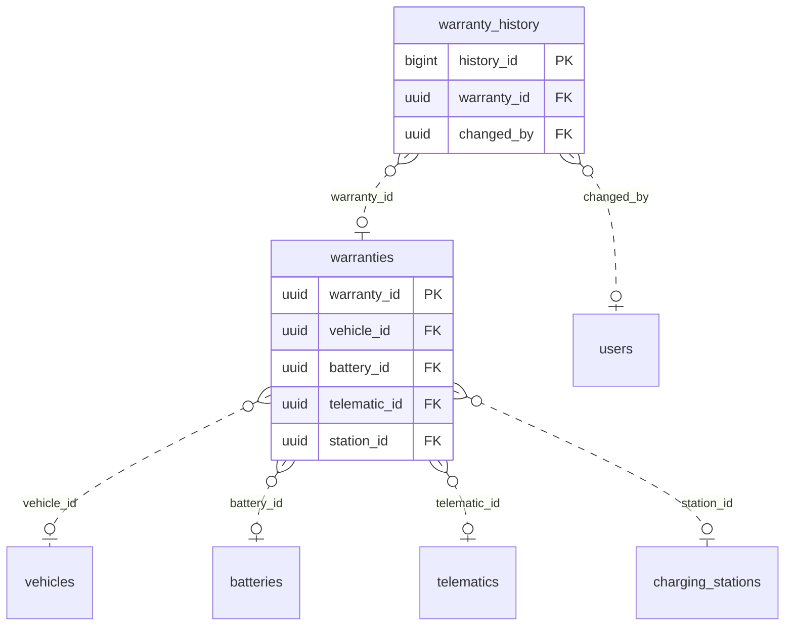

<!-- GENERATED from domain-model.dbml by .claude/skills/domain-model/scripts/domain_model.py - do not edit by hand; edit the .dbml and regenerate. -->

# Warranties

[← Overview](../overview.md)

🆕 proposed: 2

The warranties of trucks, batteries, T-Boxes and chargers: their periods and
limits, and why a warranty was voided. Depends on vehicles, batteries,
telematics and charging_stations; nothing depends on it. Not built yet.

- A **warranty** covers exactly one truck, battery, T-Box or charger and follows it to its next owner.

## Diagram

Only key columns are shown. Solid line = built link, dashed = planned. Tables from other domains (no columns): [batteries](batteries.md#batteries), [charging_stations](charging_stations.md#charging_stations), [telematics](telematics.md#telematics), [users](identity.md#users), [vehicles](vehicles.md#vehicles).

## Tables

### warranties

**No. 17** · 🆕 proposed · owner: **customer** · features: F-F2

One warranty of one truck, battery, T-Box (WAR-01, VH-18) or charger (VH-19), set per object.
Which object is covered is the one link that is set (exactly one, check
constraint); that also decides which limits keys apply. No organization_id
(DM-24): a warranty follows its object, and whoever owns the object now sees
it. A truck usually has several (vehicle, battery, an extended one). Change
history on: voiding must show who and why.
Check constraints: num_nonnulls(vehicle_id, battery_id, telematic_id, station_id) = 1 (VH-18, VH-19); deleted_at IS NULL OR status = 'VOIDED' (DM-25). The limits keys allowed for the set link are checked by the application. Possible later: one warranty table per covered object, each in its own domain (vehicle, battery, T-Box warranties), if their rules drift apart.

🔍 = tracked column: a change to it copies the whole old row into [warranty_history](#warranty_history).

| Column | Type | Null | Key | References | Meaning | Example |
|---|---|---|---|---|---|---|
| `warranty_id` | uuid | no | PK |  | Internal ID of the warranty. | `4b9d2f6e-3a1c-4e8b-a7d5-6c0e2f4a8b33` |
| `vehicle_id` | uuid | yes | FK 🔍 | [vehicles](vehicles.md#vehicles).vehicle_id (on delete restrict) | The truck covered; set only for a truck warranty. Exactly one of vehicle_id, battery_id, telematic_id and station_id is set (check constraint). | `7a4c1e9b-3d2f-4b8a-a6c5-1e0d9f8b7a44` |
| `battery_id` | uuid | yes | FK 🔍 | [batteries](batteries.md#batteries).battery_id (on delete restrict) | The battery covered; set only for a battery warranty, which therefore follows the battery to another truck. | `NULL` |
| `telematic_id` | uuid | yes | FK 🔍 | [telematics](telematics.md#telematics).telematic_id (on delete restrict) | The T-Box covered; set only for a device warranty. | `NULL` |
| `station_id` | uuid | yes | FK 🔍 | [charging_stations](charging_stations.md#charging_stations).station_id (on delete restrict) | The charger (charging station) covered; set only for a charger warranty, which follows the charger to its next owner (VH-19). | `NULL` |
| `warranty_type` | varchar(20) | no | 🔍 |  | STANDARD: delivered with the object. EXTENDED: bought later. Values: STANDARD \| EXTENDED. | `STANDARD` |
| `contract_reference` | varchar(100) | yes | 🔍 |  | Number of the warranty contract or certificate whose terms apply (rules that are not numbers, e.g. following the charging policy, live there); NULL if none. | `BH-2026-000451` |
| `starts_on` | date | no | 🔍 |  | First day of coverage. | `2026-06-01` |
| `ends_on` | date | no | 🔍 |  | Last day of coverage. | `2031-05-31` |
| `limits` | jsonb | yes | 🔍 |  | Other limits, written as the counter reading at which coverage ends (a contract saying "100,000 km from handover" is entered as the handover odometer plus 100,000). Keys by object: truck distance_km; battery energy_throughput_kwh, charge_cycles; T-Box operating_hours, message_count; charger energy_delivered_kwh, session_count (counted from the charger's sessions across every owner, VH-19). Coverage ends at whichever limit or ends_on comes first. NULL when there is no other limit. | `{"distance_km": 212000}` |
| `status` | varchar(10) | no | 🔍 |  | ACTIVE: in force unless expired. VOIDED: revoked by our warranty team (e.g. charging-policy violations), with the reason. Expired is not stored: it is computed from ends_on and the counters. Values: ACTIVE \| VOIDED. | `ACTIVE` |
| `status_reason` | varchar(200) | yes | 🔍 |  | Why the warranty was voided; NULL when ACTIVE. | `Repeated charging outside the allowed window` |
| `created_at` | timestamptz | no | 🔍 |  | When the row was created (UTC). | `2026-06-01T03:00:00Z` |
| `updated_at` | timestamptz | no | 🔍 |  | When the row was last changed (UTC). | `2026-09-10T07:15:00Z` |
| `deleted_at` | timestamptz | yes | 🔍 |  | Soft-delete time: the warranty was entered by mistake and is no longer part of the system (DM-25); it is also VOIDED, with the reason. NULL while it is part of the system. | `NULL` |

**Indexes**

- `ix_warranties_vehicle_id` (vehicle_id)
- `ix_warranties_battery_id` (battery_id)
- `ix_warranties_telematic_id` (telematic_id)
- `ix_warranties_station_id` (station_id)
- `ix_warranties_ends_on` (ends_on) - Warranties ending soon

**Referenced by**

- [warranty_history](#warranty_history).warranty_id (planned)

### warranty_history

**No. 17.h** · 🆕 proposed · owner: **customer** · features: F-F2 · change history of [warranties](#warranties)

Every earlier version of a row of `warranties`: a copy of the whole row, taken just before a change and written by a database trigger in the same transaction. Generated by the domain-model tool from `@tracked *`; never written by hand.

| Column | Type | Null | Key | References | Meaning | Example |
|---|---|---|---|---|---|---|
| `history_id` | bigint | no | PK |  | Auto-increasing ID of the history row. | `1024` |
| `warranty_id` | uuid | yes | FK | [warranties](#warranties).warranty_id (on delete restrict) | Value before the change (warranties.warranty_id). | `4b9d2f6e-3a1c-4e8b-a7d5-6c0e2f4a8b33` |
| `vehicle_id` | uuid | yes |  |  | Value before the change (warranties.vehicle_id). | `7a4c1e9b-3d2f-4b8a-a6c5-1e0d9f8b7a44` |
| `battery_id` | uuid | yes |  |  | Value before the change (warranties.battery_id). | `NULL` |
| `telematic_id` | uuid | yes |  |  | Value before the change (warranties.telematic_id). | `NULL` |
| `station_id` | uuid | yes |  |  | Value before the change (warranties.station_id). | `NULL` |
| `warranty_type` | varchar(20) | yes |  |  | Value before the change (warranties.warranty_type). | `STANDARD` |
| `contract_reference` | varchar(100) | yes |  |  | Value before the change (warranties.contract_reference). | `BH-2026-000451` |
| `starts_on` | date | yes |  |  | Value before the change (warranties.starts_on). | `2026-06-01` |
| `ends_on` | date | yes |  |  | Value before the change (warranties.ends_on). | `2031-05-31` |
| `limits` | jsonb | yes |  |  | Value before the change (warranties.limits). | `{"distance_km": 212000}` |
| `status` | varchar(10) | yes |  |  | Value before the change (warranties.status). | `ACTIVE` |
| `status_reason` | varchar(200) | yes |  |  | Value before the change (warranties.status_reason). | `Repeated charging outside the allowed window` |
| `created_at` | timestamptz | yes |  |  | Value before the change (warranties.created_at). | `2026-06-01T03:00:00Z` |
| `updated_at` | timestamptz | yes |  |  | Value before the change (warranties.updated_at). | `2026-09-10T07:15:00Z` |
| `deleted_at` | timestamptz | yes |  |  | Value before the change (warranties.deleted_at). | `NULL` |
| `changed_at` | timestamptz | no |  |  | When this version of the row was replaced. | `2026-09-10T07:15:00Z` |
| `changed_by` | uuid | yes | FK | [users](identity.md#users).user_id (on delete restrict) | User who made the change; NULL when the system made it. | `9b2e7d4a-1c3f-4a8e-b6d2-5e0f1a9c3d22` |
| `change_reason` | varchar(200) | no |  |  | Why the row was changed, set by the application for the transaction: typed by the person for an administrative decision, a fixed text for a routine action. When the application sets none, the trigger records 'Unspecified change' (DM-29). | `Customer moved to a new office` |

**Indexes**

- `ix_warranty_history_warranty_id_time` (warranty_id, changed_at)
