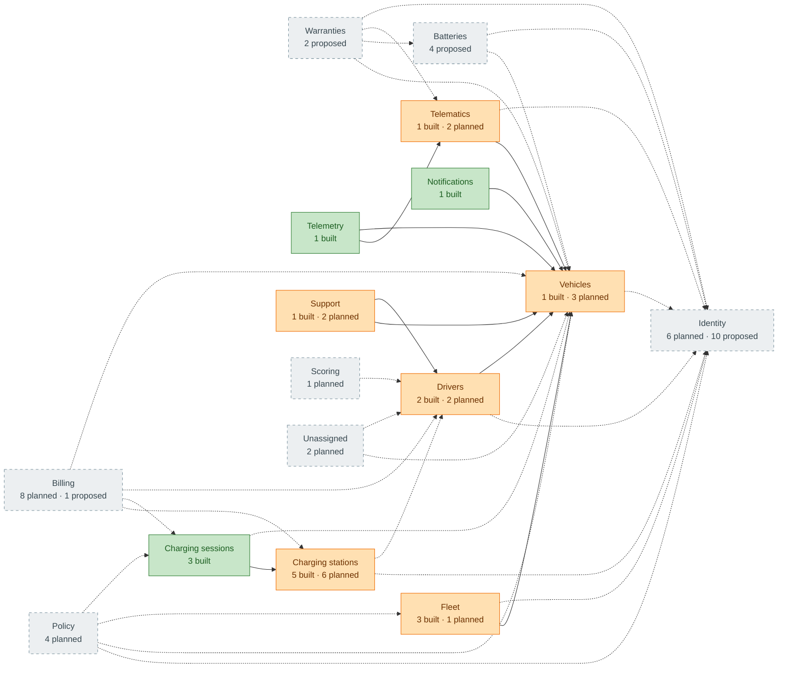

<!-- GENERATED from domain-model.dbml by .claude/skills/domain-model/scripts/domain_model.py - do not edit by hand; edit the .dbml and regenerate. -->

# Domain model: overview

This is the domain model of the G3 Network backend: every table, which
domain owns it, who owns its data, and how it links to the rest.

**Status:** ✅ built (in the code today) · 📋 planned (a feature needs it)
· 🆕 proposed (not in the feature list, but the model needs it).

**Data owner:** *customer* = belongs to one organization (normally a customer; a G3
company can own such rows too, e.g. G3 Mobility's trucks) and carries
`organization_id`; *internal* = our own data, shared across organizations;
*two-party* = a G3 asset used by a customer (e.g. a charging session);
*undecided* = waiting on an open decision.

**How to use:** edit `domain-model.dbml` only, then run
`uv run --project backend --with pydbml --with openpyxl python .claude/skills/domain-model/scripts/domain_model.py generate`
from the repository root. `... check` verifies that built tables still match
the backend models and that these views are up to date.

## At a glance

**72 tables in 16 domains:** 57 main, 13 history (N.h, generated), 2 state · 18 built, 37 planned, 17 proposed.

## Domain map

Green = fully built · orange = partly built · grey dashed = not built yet. An arrow **A → B** means A's data points to B's; solid = at least one such link is built, dashed = all planned.

Not drawn, to keep the map readable: 14 domains also point to **identity** through `organization_id` (organizations): vehicles, batteries, telematics, telemetry, drivers, fleet, charging_stations, charging_sessions, notifications, support, policy, billing, scoring, unassigned.

## Domains

| Domain | Status | ✅ | 📋 | 🆕 | Tables |
|---|---|---|---|---|---|
| [Identity](domains/identity.md) | planned | 0 | 6 | 10 | 1 organizations, 1.h organization_history, 2 users, 2.h user_history, 3 user_state, 4 memberships, 4.h membership_history, 5 user_credentials, 6 user_sessions, 7 one_time_codes, 8 user_consents, 9 legal_documents, 10 user_role_assignments, 11 access_audit_logs, 12 organization_settings, 12.h organization_setting_history |
| [Vehicles](domains/vehicles.md) | partial | 1 | 3 | 0 | 13 vehicles, 13.h vehicle_history, 14 vehicle_models, 14.h vehicle_model_history |
| [Batteries](domains/batteries.md) | planned | 0 | 0 | 4 | 15 battery_models, 15.h battery_model_history, 16 batteries, 16.h battery_history |
| [Warranties](domains/warranties.md) | planned | 0 | 0 | 2 | 17 warranties, 17.h warranty_history |
| [Telematics](domains/telematics.md) | partial | 1 | 2 | 0 | 18 telematics, 18.h telematic_history, 19 telematic_status_reports |
| [Telemetry](domains/telemetry.md) | built | 1 | 0 | 0 | 20 telemetry |
| [Drivers](domains/drivers.md) | partial | 2 | 2 | 0 | 21 drivers, 21.h driver_history, 22 ~~driver_vehicle_assignments~~, 23 driving_sessions |
| [Fleet](domains/fleet.md) | partial | 3 | 1 | 0 | 24 fleets, 25 fleet_vehicle_memberships, 26 geofences, 27 fleet_user_assignments |
| [Charging stations](domains/charging_stations.md) | partial | 5 | 6 | 0 | 28 charging_locations, 28.h charging_location_history, 29 charging_location_access, 30 charging_stations, 30.h charging_station_history, 31 charging_station_state, 32 charging_evses, 33 charging_connectors, 34 charging_ocpp_messages, 35 charging_station_configuration_entries, 36 charging_reservations |
| [Charging sessions](domains/charging_sessions.md) | built | 3 | 0 | 0 | 37 charging_sessions, 38 charging_session_events, 39 charging_session_measurements |
| [Notifications](domains/notifications.md) | built | 1 | 0 | 0 | 40 notifications |
| [Support](domains/support.md) | partial | 1 | 2 | 0 | 41 support_cases, 42 repair_partners, 43 maintenance_bookings |
| [Policy](domains/policy.md) | planned | 0 | 4 | 0 | 44 charging_policies, 45 charging_policy_versions, 46 charging_policy_assignments, 47 policy_violations |
| [Billing](domains/billing.md) | planned | 0 | 8 | 1 | 48 tariffs, 49 payments, 50 wallets, 51 wallet_transactions, 52 invoices, 53 invoice_lines, 54 subscription_plans, 55 plan_features, 56 subscriptions |
| [Scoring](domains/scoring.md) | planned | 0 | 1 | 0 | 57 driver_scores |
| [Unassigned](domains/unassigned.md) | planned | 0 | 2 | 0 | 58 promotion_campaigns, 59 trips |

## Data ownership

| Owner | Meaning | Tables |
|---|---|---|
| **customer** | Belongs to one organization (normally a customer; a G3 company can own such rows too); carries `organization_id` or reads it through its parent (DM-24). | [memberships](domains/identity.md#memberships), [membership_history](domains/identity.md#membership_history), [user_role_assignments](domains/identity.md#user_role_assignments), [organization_settings](domains/identity.md#organization_settings), [organization_setting_history](domains/identity.md#organization_setting_history), [vehicles](domains/vehicles.md#vehicles), [vehicle_history](domains/vehicles.md#vehicle_history), [batteries](domains/batteries.md#batteries), [battery_history](domains/batteries.md#battery_history), [warranties](domains/warranties.md#warranties), [warranty_history](domains/warranties.md#warranty_history), [telematics](domains/telematics.md#telematics), [telematic_history](domains/telematics.md#telematic_history), [telematic_status_reports](domains/telematics.md#telematic_status_reports), [telemetry](domains/telemetry.md#telemetry), [drivers](domains/drivers.md#drivers), [driver_history](domains/drivers.md#driver_history), [driver_vehicle_assignments](domains/drivers.md#driver_vehicle_assignments), [driving_sessions](domains/drivers.md#driving_sessions), [fleets](domains/fleet.md#fleets), [fleet_vehicle_memberships](domains/fleet.md#fleet_vehicle_memberships), [geofences](domains/fleet.md#geofences), [fleet_user_assignments](domains/fleet.md#fleet_user_assignments), [charging_locations](domains/charging_stations.md#charging_locations), [charging_location_history](domains/charging_stations.md#charging_location_history), [charging_location_access](domains/charging_stations.md#charging_location_access), [charging_stations](domains/charging_stations.md#charging_stations), [charging_station_history](domains/charging_stations.md#charging_station_history), [charging_station_state](domains/charging_stations.md#charging_station_state), [notifications](domains/notifications.md#notifications), [support_cases](domains/support.md#support_cases), [maintenance_bookings](domains/support.md#maintenance_bookings), [charging_policy_assignments](domains/policy.md#charging_policy_assignments), [policy_violations](domains/policy.md#policy_violations), [payments](domains/billing.md#payments), [wallets](domains/billing.md#wallets), [wallet_transactions](domains/billing.md#wallet_transactions), [invoices](domains/billing.md#invoices), [invoice_lines](domains/billing.md#invoice_lines), [subscriptions](domains/billing.md#subscriptions), [driver_scores](domains/scoring.md#driver_scores), [trips](domains/unassigned.md#trips) |
| **internal** | Our own data (the organization running the platform), shared across all organizations. | [organizations](domains/identity.md#organizations), [organization_history](domains/identity.md#organization_history), [users](domains/identity.md#users), [user_history](domains/identity.md#user_history), [user_state](domains/identity.md#user_state), [user_credentials](domains/identity.md#user_credentials), [user_sessions](domains/identity.md#user_sessions), [one_time_codes](domains/identity.md#one_time_codes), [user_consents](domains/identity.md#user_consents), [legal_documents](domains/identity.md#legal_documents), [access_audit_logs](domains/identity.md#access_audit_logs), [vehicle_models](domains/vehicles.md#vehicle_models), [vehicle_model_history](domains/vehicles.md#vehicle_model_history), [battery_models](domains/batteries.md#battery_models), [battery_model_history](domains/batteries.md#battery_model_history), [charging_evses](domains/charging_stations.md#charging_evses), [charging_connectors](domains/charging_stations.md#charging_connectors), [charging_ocpp_messages](domains/charging_stations.md#charging_ocpp_messages), [charging_station_configuration_entries](domains/charging_stations.md#charging_station_configuration_entries), [repair_partners](domains/support.md#repair_partners), [charging_policies](domains/policy.md#charging_policies), [charging_policy_versions](domains/policy.md#charging_policy_versions), [tariffs](domains/billing.md#tariffs), [subscription_plans](domains/billing.md#subscription_plans), [plan_features](domains/billing.md#plan_features), [promotion_campaigns](domains/unassigned.md#promotion_campaigns) |
| **two-party** | A G3 asset used by a customer (both have a stake). | [charging_reservations](domains/charging_stations.md#charging_reservations), [charging_sessions](domains/charging_sessions.md#charging_sessions), [charging_session_events](domains/charging_sessions.md#charging_session_events), [charging_session_measurements](domains/charging_sessions.md#charging_session_measurements) |

## Views

Periods of a relationship stored as a column plus a start time (DM-22). Code
reads them only through these views, never from a history table. A view is
defined here only once a feature reads it (DM-27); `battery_ownership_periods`,
`telematic_installation_periods` and `telematic_ownership_periods` will follow
the same pattern when needed.

| View | One row per | Columns | Read by |
|---|---|---|---|
| `vehicle_ownership_periods` | period a truck had one owner | `vehicle_id`, `organization_id`, `owned_from`, `owned_until` (NULL for the current owner) | ownership history and first handover date (VEH-02), "who owned it on that day" |
| `battery_installation_periods` | stay of a battery in one truck | `battery_id`, `vehicle_id`, `installed_from`, `installed_until` (NULL while still installed) | battery health history across trucks (MON-07), battery warranty counters (WAR-01) |

How each is built:
- **Versions**: the rows of the history table (each an earlier version of the source row, replaced at `changed_at`) followed by the current source row, ordered by time.
- `vehicle_ownership_periods`: a new period starts at each version whose `organization_id` differs from the previous version's; `owned_from` is that version's `acquired_at`, `owned_until` the next period's `owned_from`.
- `battery_installation_periods`: a new period starts at each version whose `vehicle_id` is set and differs from the previous version's; `installed_from` is that version's `installed_at`; `installed_until` is the next period's `installed_from` when the battery moved straight to another truck, otherwise the `changed_at` of the change that removed it (the time it was saved; removals must be recorded promptly).
- A wrong value later corrected shows as a short period; its `change_reason` in the history explains it.

## Open decisions

| ID | Question | Affects |
|---|---|---|
| D5 | Who pays for a fleet driver's charge: the **driver's wallet, the fleet's wallet**, or it depends? | `wallets`, `payments` |
